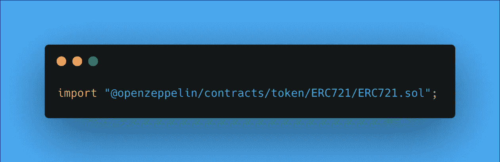

# 最流行的 ERC721 模板对比

> 原文：<https://medium.com/coinmonks/comparison-of-the-most-popular-erc721-templates-b3614353e31e?source=collection_archive---------2----------------------->

Picture by author

除了最近地缘政治和宏观经济事件导致的轻微熊市，我认为我们可以有信心，我们仍然处于 NFT 牛市的中间。

这波牛市导致每周都有数百个项目推出，大多都是类似的智能合同。因为在这个领域几乎所有的东西都是开源的，所以很容易实现经过验证的解决方案…