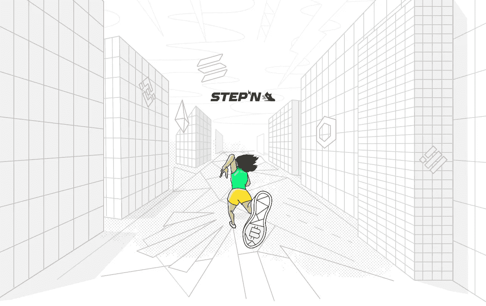

# 移动到收入项目的完整列表(第 1 部分)

> 原文：<https://medium.com/coinmonks/complete-list-of-the-move-to-earn-projects-part-1-bdbeb6af7a65?source=collection_archive---------2----------------------->

## 5/32 Move 2 Earn 项目概述。STEPN，XYO，Genopets，Dotmoovs，Step.app

这篇文章将被补充。如果你有什么要补充的，请随时给我发信息。给我发一些令人兴奋的项目来评论，我会写一些关于它们的东西(现在我有一个 32 个项目的列表来探索)。

# 什么是移动挣钱

移动赚取平台奖励玩家的活动与加密令牌和非功能性交易。通常，代币可以兑换成其他加密货币、游戏内物品或现实生活中的商品。

这些应用可以是常规生活活动的极好补充，并提供额外的被动收入。但是必须小心使用它们，因为通常对令牌的需求来自新用户和愿意“捐赠”金钱的用户。捐赠的唯一动机是增加游戏收入，但有一天，更多的玩家可能会准备退出而不是捐赠，因此 NFT 和代币的价格可能会下降，回报也会减少。

“先动后赚”是“先玩后赚”理念的合理延续。但不同的是，在玩的时候，用户对他们的生活没有任何有益的影响，但有了移动赚取，人们就有动力移动并保持更健康。

# 项目列表

## [1。Stepn](https://stepn.com)

The picture was taken from stepn.com

我的完整 [**解析 STEPN 的**](/coinmonks/is-stepn-a-good-long-term-project-f5731b823726) 。

**项目概述** : [STEPN 官方](https://medium.com/u/343ca8528a45?source=post_page-----bdbeb6af7a65--------------------------------)——是一款在 App Store 和 Google Play 上提供的移动赚取健康和健身应用。配备运动鞋 NFT 的用户可以移动到户外，以赚取代币和 NFT 奖励。STEPN 有一个内置的钱包、交换、市场和租赁系统，允许非加密用户使用 STEPN。

**网络**:索拉纳。

**Tokenomics** : STEPN 有$GMT(绿色元宇宙令牌)和$GST(绿色 Satoshi 令牌)。100 美元的商品及服务税是日常支出的标准象征，比如修理运动鞋或把它们整平。$GMT 更具体—用于特殊事件。玩家步行可以获得$GST，而$GMT 只能在球鞋的第 30 级才能获得，但是要升级到第 30 级，他们无论如何都需要在第 5、10、20、29 和 30 级获得$GMT。

$GST 没有供应上限。$GMT 有 6B 代币供应上限。10%在流通。

游戏的主要 NFT 允许用户赚取代币。另外两个人可以用$GST 和$GMT 铸造一双运动鞋。

## [2。XYO](https://xyo.network)

The picture was taken from developers.xyo.network

**项目概述**:[XYO](https://medium.com/u/f2238ada5895?source=post_page-----bdbeb6af7a65--------------------------------)——是一个在 App Store 和 Google Play 上带有应用币的起源网络证明。该应用程序允许人们赚取游戏内的代币，然后将它们兑换成其他加密货币和商品。它没有每日收入限制，所以它可能特别适合一些额外收入的司机。此外，它不需要购买 NFT 或其他访问的初始投资。用户可以购买每月 25 美元和 35 美元的订阅服务，或者购买一张特殊的卡或蓝牙标签，以更好地跟踪他们的位置，从而增加收入。

**网络**:以太坊(ERC20)。

**Tokenomics** : XYO 有一个代币——$ XYO 和游戏中的非链上货币“硬币”。用户通过保持应用程序打开并手动或自动验证他们的位置来获得硬币。他们可能会将这些代币换成加密货币，如 BTC、ETH 和 XYO。此外，他们可以将硬币兑换成现实生活中的商品，如平板电脑、手机等。

## [3。基因宠物](https://www.genopets.me)

The picture was taken from genopets.me

**项目概述** : [Genopets](https://medium.com/u/ff69412e9fa1?source=post_page-----bdbeb6af7a65--------------------------------) 是一款免费的 NFT 游戏，结合了电子鸡的培育和进化、口袋妖怪的训练和战斗、动物穿越的制作和收集，同时在玩家通过身体活动和迷你游戏时奖励他们密码。

目前它正处于封闭的测试阶段。该游戏将允许用户创建一个免费的 NFT 基因宠物，因此没有必要像其他游戏一样培育 NFT 来为新用户提供访问权限。所以进入门槛更低，因为没有开始玩的初始投资。这可能对新玩家更好，并带来更广阔的潜在市场。

有了 Genopet，用户可以在行走和战斗中获得经验和代币。

**网络**:索拉纳。

**记号组学** : Genopets 有两个记号:

1.  **$GENE** :“一个代表 Genoverse 所有权的可替换治理和标记令牌。$GENE token 持有者可以投票决定游戏的未来，也可以用他们的$ GENE token 来赢取奖励。”
2.  $KI :“一个可替换的游戏内奖励代币，由购买了栖息地的玩家获得。$KI 用于加速基因宠物进化，制造栖息地和其他物品，以及战斗。

**NFT-基因宠物** : 玩家的主要角色，可以免费生成，也可以在市场上购买，可以用 XP 和基因水晶升级。

基因水晶:赋予基因宠物力量，可以由$GENE 和$KI 制成。

**栖息地**:吉诺佩特的 NFT 之家，他可以在这里生活和进化。它们可以由$GENE 和$KI 制作，也可以在市场上购买。此外，玩家可以将栖息地出租给他人。

## [4。Dotmoovs](https://www.dotmoovs.com)

The picture was taken from dotmoovs.com

**项目概述** : [dotmoovs](https://medium.com/u/194a6cf13f65?source=post_page-----bdbeb6af7a65--------------------------------) 是一个创建体育挑战和比赛的平台，拥有 NFT 的参与者可以在这里下注，与他人竞争赢得奖池。有 1vs1 的比赛，有 Teas vs 战队甚至锦标赛。除了组织费，获胜者可以得到所有东西。获胜者是由人工智能分析上传视频中参与者的技能来确定的。

该应用程序可在 App Store 和 Google Play 上下载。目前，自由式足球和舞蹈比赛已经开始。

**网络**:以太坊(ERC-20)。与 BSC 集成。

**Tokenomics** : Dotmoovs 有 token $MOOV。使用它，玩家可以将它们作为挑战的赌注存放在平台上以获得 NFTs。此外，赢得挑战和比赛，玩家可以获得 NFT 徽章。

可收集的 NFT:NFT 需要参加特定的比赛。例如，为了参加自由式足球比赛，用户应该有一个 NFT 球。NFT 可以在市场上购买，也可以从其他玩家那里租借。

## [5。步骤应用程序](http://step.app)

The picture was taken from step.app

**报名** [**链接**](https://app.step.app?r=DJEWGHXZ) 与我的引荐。

**项目概述** : [步骤。APP](https://medium.com/u/bf285a7462e8?source=post_page-----bdbeb6af7a65--------------------------------) 目前处于封闭测试阶段。它允许穿 NFT 运动鞋的人跑步并赚取$KCAL (ingame token)。还有，平台除了平台费，还允许用户下赌注，互相争夺奖池。

这个平台应该是一个有玩家角色的元宇宙。用户可以为他们的角色和运动鞋购买皮肤。

**网络**:雪崩

令牌组学:这个游戏有三个令牌:

**$胖** : 每日赚取的代币。要增加这个代币的收入，用户要邀请新用户或者连接钱包。

**$KCAL** :在拥有球鞋的情况下，通过跑步或赢得比赛可以制作的代币。

**$FITFI** :一个治理令牌，用于对平台利润的分配进行投票，并下注以获得回报。这个代币可以在不同的交易所购买，也可以通过燃烧$KCAL 和$FAT 来购买。

**NFT 运动鞋**:这些 NFT 是用来在跑步时接收代币的。他们可能从市场上购买或从鞋盒收到，有 35%的概率。用户可以通过用鞋盒交换彩票来接收鞋盒，彩票可以每天从赌注$FITFI 获得。

# 也

阅读[第二部分](/@molodykh.konstantin.d/complete-list-of-the-move-to-earn-projects-part-2-cec1874c4679)。

我愿意讨论，欢迎在 LinkedIn 上联系我。

并在 [Twitter](https://twitter.com/CryptoMoloKo) 上订阅每日新闻。

阅读我的第二部分关于步骤， [DEFIT | Digital Fitness](https://medium.com/u/73b79c836fd4?source=post_page-----bdbeb6af7a65--------------------------------) ，剂量和 Calo。

 [## 移动到收入项目的完整列表(第 2 部分)

### 所有移动赚取加密项目。5/32 M2E 项目概述。Step，Detfi，Dose，YetiCoin，Calo

medium.com](/@molodykh.konstantin.d/complete-list-of-the-move-to-earn-projects-part-2-cec1874c4679) 

> *加入 Coinmonks* [*电报频道*](https://t.me/coincodecap) *和* [*Youtube 频道*](https://www.youtube.com/c/coinmonks/videos) *了解加密交易和投资*

# 另外，阅读

*   [3 商业评论](/coinmonks/3commas-review-an-excellent-crypto-trading-bot-2020-1313a58bec92) | [Pionex 评论](https://coincodecap.com/pionex-review-exchange-with-crypto-trading-bot) | [Coinrule 评论](/coinmonks/coinrule-review-2021-a-beginner-friendly-crypto-trading-bot-daf0504848ba)
*   [莱杰 vs n rave](/coinmonks/ledger-vs-ngrave-zero-7e40f0c1d694)|[莱杰 nano s vs x](/coinmonks/ledger-nano-s-vs-x-battery-hardware-price-storage-59a6663fe3b0) | [币安评论](/coinmonks/binance-review-ee10d3bf3b6e)
*   [Bybit 交易所评论](/coinmonks/bybit-exchange-review-dbd570019b71) | [Bityard 评论](https://coincodecap.com/bityard-reivew) | [Jet-Bot 评论](https://coincodecap.com/jet-bot-review)
*   [3 commas vs crypto hopper](/coinmonks/3commas-vs-pionex-vs-cryptohopper-best-crypto-bot-6a98d2baa203)|[赚取加密利息](/coinmonks/earn-crypto-interest-b10b810fdda3)
*   最好的比特币[硬件钱包](/coinmonks/hardware-wallets-dfa1211730c6) | [BitBox02 回顾](/coinmonks/bitbox02-review-your-swiss-bitcoin-hardware-wallet-c36c88fff29)
*   [block fi vs Celsius](/coinmonks/blockfi-vs-celsius-vs-hodlnaut-8a1cc8c26630)|[Hodlnaut 审核](/coinmonks/hodlnaut-review-best-way-to-hodl-is-to-earn-interest-on-your-bitcoin-6658a8c19edf) | [KuCoin 审核](https://coincodecap.com/kucoin-review)
*   [Bitsgap 审查](/coinmonks/bitsgap-review-a-crypto-trading-bot-that-makes-easy-money-a5d88a336df2) | [Quadency 审查](/coinmonks/quadency-review-a-crypto-trading-automation-platform-3068eaa374e1) | [Bitbns 审查](/coinmonks/bitbns-review-38256a07e161)