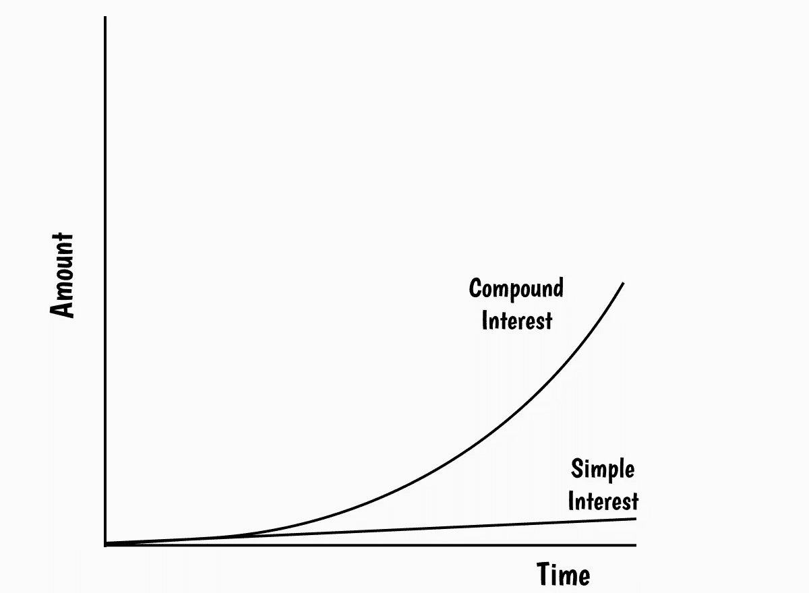

# 复利——为什么是世界第八大奇迹

> 原文：<https://medium.com/coinmonks/compound-interest-why-its-8th-wonder-of-the-world-2c741bbcecc9?source=collection_archive---------48----------------------->

复利——这要么是让你的存款翻倍甚至翻三倍的最简单方法，要么就是注定破产。

复利不同于单利。单利是一个固定的利率，基于你最初投资的金额。



Image by Author — Eighth Wonder of the World

**单利**

为了理解单利，让我们假设你将 100 美元存入一个利率为 5%的账户。将你的本金乘以利率，然后是你希望这笔钱在账户中保留的时间。

一百美元乘以百分之五，即 0.05，等于五美元。保持这个账户 50 年，你将获得 250 美元的利息，总计 350 美元。

```
P = 100, r =5% , t = 50 years
Simple Interest = (P x r x t)
100 x 5% = 5
5 x 50 = 250
```

**复利**

复利不一样。是利息之上的利息。如果你正确使用它，你可以把小的初始投资变成小财富。

让我们从第一个例子中取出同样的 100 美元，同样的 5%的利率。如果这个利率每年复合计算，50 年后你的 100 美元将变成 1146 美元。如果你每月投入 100 美元，不做任何改变，50 年后你会得到 252，364 美元。

```
P = 100, r =5% , t = 50 years1-Compound Interest =  P x (1+r/100)^t (Annual)
(1 + 5/100) = 1.05
1.05 ^ 50 = 11.467
100 x 11.467 = 1,1462-Compound Interest =  P x (1+[r/100]/n)^(t*n) (Periodic)
(1 + 0.05/12) = 1.00416
50 x 12 = 600
1.00416 ^ 600 = 12.071
100 x 12.071 = 1,200From here, it become 8th wonder of the world3-Compound Interest =  P x (1+[r/100]/n)^(t*n)(Annual + Contribution)
(1 + 5/100) = 1.05
100 x 11.467 = 1,146 10.921
100 x (11.467-1)/0.00416 = 251,610 
A + B = 252,7564-Compound Interest =  P x (1+[r/100]/n)^(t*n)(Periodic + Contribution)
(1 + 0.05/12) = 1.00416
50 x 12 = 600
1.00416 ^ 600 = 12.071
100 x 12.071 = 1,200 A
100 x (12.071-1)/0.00416 = 266,129 B   
A + B = 267,329
```

*自行验证计算 https://www . investor . gov/financial-tools-calculators/calculators/compound-interest-calculator(以上计算因四舍五入差异与此计算器不同，为手工计算)*

复利可以很好地投资你的钱，但如果你正在寻找贷款，它很容易让你的债务增长失控。同样的复利用于使你的投资随时间呈指数增长，也可以应用于你某些贷款的未付余额。

这就是为什么有这么一句名言:

***“复利是世界第八大奇迹，懂的人赚；不这样做的人会为此付出代价。”—阿尔伯特·爱因斯坦***

感谢您的阅读，在您离开之前…


> 点击“关注”加入好奇求知者的社区，获取关于金融、健康、哲学、心理学和技术的每周文章。如果您想要电子邮件更新，请单击“信封+”标志。
> 
> 在| [脸书](https://www.facebook.com/thequantumthinker) | [推特](https://twitter.com/QuantumThinker)|[insta gram](https://www.instagram.com/the_quantum_thinker/)|[LinkedIn](https://www.linkedin.com/company/quantumthinker/)|[Pinterest](https://www.pinterest.com/quantum_thinker/)|[Reddit](https://www.reddit.com/r/the_quantum_thinker/)|
> 
> 交易新手？尝试[加密交易机器人](/coinmonks/crypto-trading-bot-c2ffce8acb2a)或[复制交易](/coinmonks/top-10-crypto-copy-trading-platforms-for-beginners-d0c37c7d698c)