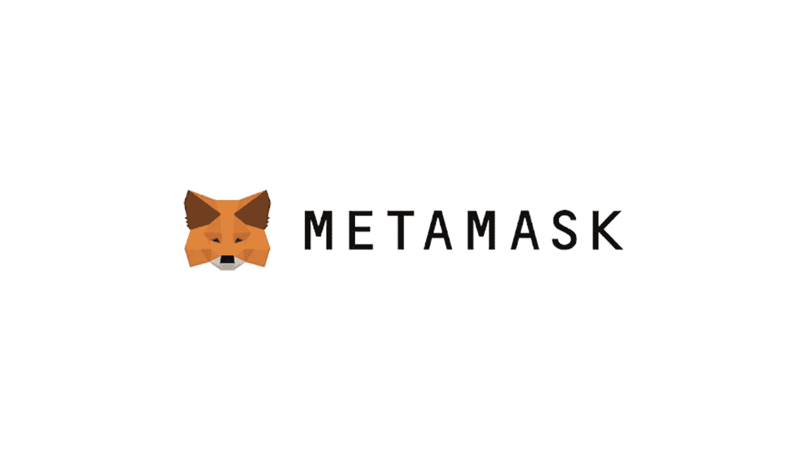

# 对合规性的担忧导致 MetaMask 拒绝以太坊交易

> 原文：<https://medium.com/coinmonks/concerns-about-compliance-cause-metamask-to-reject-ethereum-transactions-f32e264b4b51?source=collection_archive---------45----------------------->

**Visit our website:-** [**https://bitcoinsupports.com/**](https://bitcoinsupports.com/)

处于 Web3 前沿的钱包并不像它让你相信的那样分散。

MetaMask 已禁止某些司法辖区的用户访问其服务以及与以太坊的互动。

委内瑞拉和伊朗用户今天早些时候开始难以访问他们的数字钱包，数百名用户表示他们的 MetaMask 交易没有一笔完成。第一批禁令是在 OpenSea 上发现的，一些伊朗用户据称被锁定并删除。不久之后，委内瑞拉的用户开始遇到访问个人 MetaMask 钱包的困难，社交媒体上流传了数千篇关于该问题的帖子。在 MetaMask 的帮助页面上，MetaMask 简要地解决了这个问题，指出 meta mask 和 Infura 由于法律合规性将在某些地区不可用。当用户尝试在其中一个区域使用元掩码时，他们会看到一条错误消息，指出元掩码无法连接到区块链主机。

[https://twitter.com/goluis1_/status/1499236950900985864](https://twitter.com/goluis1_/status/1499236950900985864) 
虽然用户可以查看他们的元掩码余额和交易历史，但他们被阻止与以太坊网络进行交互。这表明禁令来自 Infura，ConsenSys 的以太坊 API 基础设施。加密社区对 MetaMask 的暂停表达了不满，许多人对其缺乏分权和自由使用审查感到沮丧。

[https://twitter.com/lawmaster/status/1499423160957034496](https://twitter.com/lawmaster/status/1499423160957034496) 
此外，正在发生的事件引发了一场全行业的辩论，讨论在与加密货币交互时使用安全 VPN 的重要性，以及缺乏元掩码的有效替代方案。MetaMask 和 ConsenSys 都没有就此事发表正式声明。

**访问我们的网站:-**[**https://bitcoinsupports.com/**](https://bitcoinsupports.com/)

**免责声明:以上为作者观点，不应视为投资建议。读者应该自己做研究。**

> *加入 Coinmonks* [*电报频道*](https://t.me/coincodecap) *和* [*Youtube 频道*](https://www.youtube.com/c/coinmonks/videos) *了解加密交易和投资*

# 另外，阅读

*   [Bitsgap 审查](/coinmonks/bitsgap-review-a-crypto-trading-bot-that-makes-easy-money-a5d88a336df2) | [Quadency 审查](/coinmonks/quadency-review-a-crypto-trading-automation-platform-3068eaa374e1) | [Bitbns 审查](/coinmonks/bitbns-review-38256a07e161)
*   [加密复制交易平台](/coinmonks/top-10-crypto-copy-trading-platforms-for-beginners-d0c37c7d698c) | [Coinmama 评论](/coinmonks/coinmama-review-ace5641bde6e)
*   [印度的加密交易所](/coinmonks/bitcoin-exchange-in-india-7f1fe79715c9) | [比特币储蓄账户](/coinmonks/bitcoin-savings-account-e65b13f92451)
*   [OKEx vs KuCoin](https://coincodecap.com/okex-kucoin) | [摄氏替代品](https://coincodecap.com/celsius-alternatives) | [如何购买 VeChain](https://coincodecap.com/buy-vechain)
*   [币安期货交易](https://coincodecap.com/binance-futures-trading)|[3 commas vs Mudrex vs eToro](https://coincodecap.com/mudrex-3commas-etoro)
*   [如何购买 Monero](https://coincodecap.com/buy-monero) | [IDEX 评论](https://coincodecap.com/idex-review) | [BitKan 交易机器人](https://coincodecap.com/bitkan-trading-bot)
*   [CoinDCX 评论](/coinmonks/coindcx-review-8444db3621a2) | [加密保证金交易交易所](https://coincodecap.com/crypto-margin-trading-exchanges)