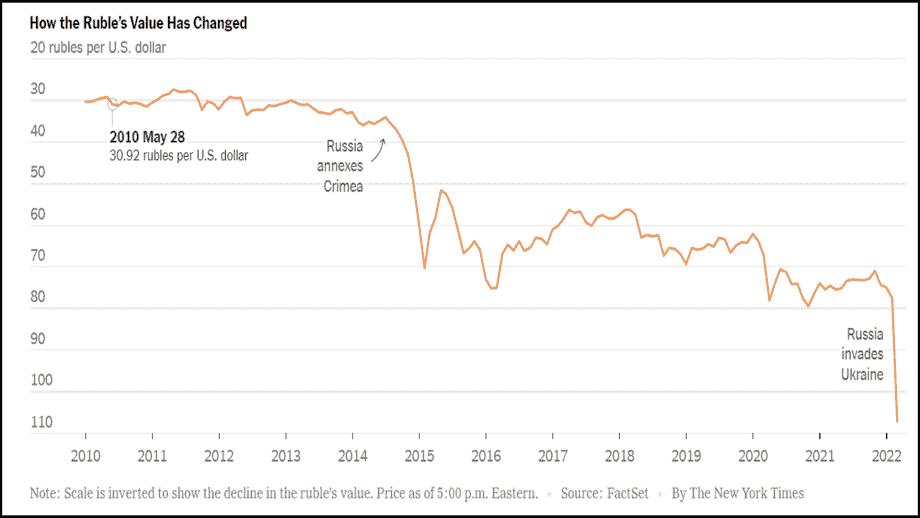
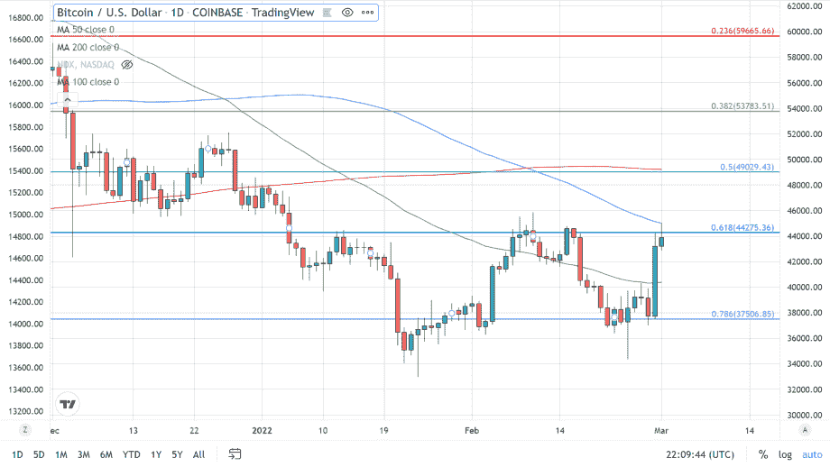
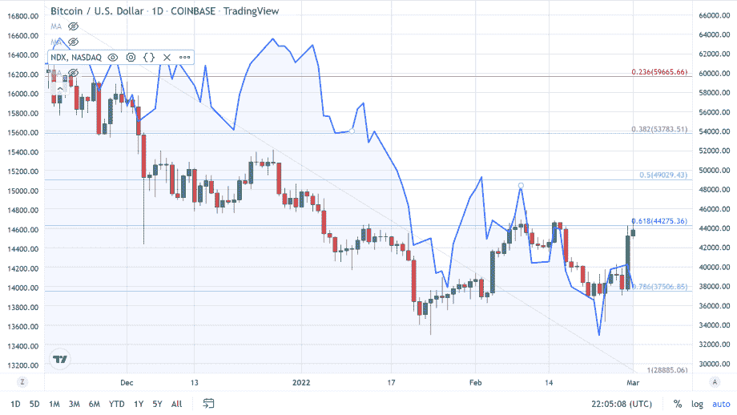

# 冲突导致许多人逃离菲亚特

> 原文：<https://medium.com/coinmonks/conflict-causes-cryptos-to-fly-as-many-flee-fiat-94a07d47d26d?source=collection_archive---------60----------------------->

拒绝乌克兰副总理要求加密货币交易所封锁所有俄罗斯用户账户的呼吁，理由是俄罗斯公民是其领导人盲目行为的无辜受害者。最大的交易所之一币安告诉《财富》杂志，“我们不会单方面冻结数百万无辜用户的账户，”该公司在一份声明中告诉《财富》加密旨在为全球人民提供更大的金融自由。币安表示，他们将封锁受到制裁的俄罗斯人的账户，但不会单方面冻结所有俄罗斯用户的账户。单方面决定禁止人们访问他们的密码将会违背密码存在的理由。“币安没有忽视这场危机，誓言要向该地区的人道主义工作捐赠至少 1000 万美元。

该指数在过去十年中一直走高，几乎没有下跌，在 11 月达到 16000 点以上的历史高点，距离比特币的历史高点只有几天时间。从那时起，纳斯达克和比特币都一直在下跌，随着抗击通胀所需的利率逐步上升，主要指数可能会继续下跌。如果比特币能够继续走与美国股票脱钩的道路，它将非常乐观，实际上类似于躲避子弹。任何有兴趣阅读我更多文章的人，只需点击这里

*最初发表于*[*【https://www.thegoldforecast.com】*](https://www.thegoldforecast.com/crypto/2022/conflict-causes-cryptos-fly-many-flee-fiat)*。*

> 加入 Coinmonks [电报频道](https://t.me/coincodecap)和 [Youtube 频道](https://www.youtube.com/c/coinmonks/videos)了解加密交易和投资

# 另外，阅读

*   [AscendEx Staking](https://coincodecap.com/ascendex-staking)|[Bot Ocean Review](https://coincodecap.com/bot-ocean-review)|[最佳比特币钱包](https://coincodecap.com/bitcoin-wallets-india)
*   [霍比评论](https://coincodecap.com/huobi-review) | [OKEx 保证金交易](https://coincodecap.com/okex-margin-trading) | [期货交易](https://coincodecap.com/futures-trading)
*   [电网交易机器人](https://coincodecap.com/grid-trading) | [Cryptohopper 审核](/coinmonks/cryptohopper-review-a388ff5bae88) | [Bexplus 审核](https://coincodecap.com/bexplus-review)
*   [7 个最佳零费用加密交易平台](https://coincodecap.com/zero-fee-crypto-exchanges)
*   [氹欞侊贸易评论](https://coincodecap.com/anny-trade-review) | [霍比融资融券交易](/coinmonks/huobi-margin-trading-b3b06cdc1519)
*   [分散交易所](https://coincodecap.com/what-are-decentralized-exchanges) | [比特 FIP](https://coincodecap.com/bitbns-fip) | [Pionex 审查](https://coincodecap.com/pionex-review-exchange-with-crypto-trading-bot)
*   [用信用卡购买密码的 10 个最佳地点](https://coincodecap.com/buy-crypto-with-credit-card)
*   [最好的卡达诺钱包](https://coincodecap.com/best-cardano-wallets) | [Bingbon 副本交易](https://coincodecap.com/bingbon-copy-trading)
*   [印度最佳 P2P 加密交易所](https://coincodecap.com/p2p-crypto-exchanges-in-india) | [柴犬钱包](https://coincodecap.com/baby-shiba-inu-wallets)
*   [八大加密附属计划](https://coincodecap.com/crypto-affiliate-programs) | [eToro vs 比特币基地](https://coincodecap.com/etoro-vs-coinbase)
*   [最佳以太坊钱包](https://coincodecap.com/best-ethereum-wallets) | [电报上的加密货币机器人](https://coincodecap.com/telegram-crypto-bots)