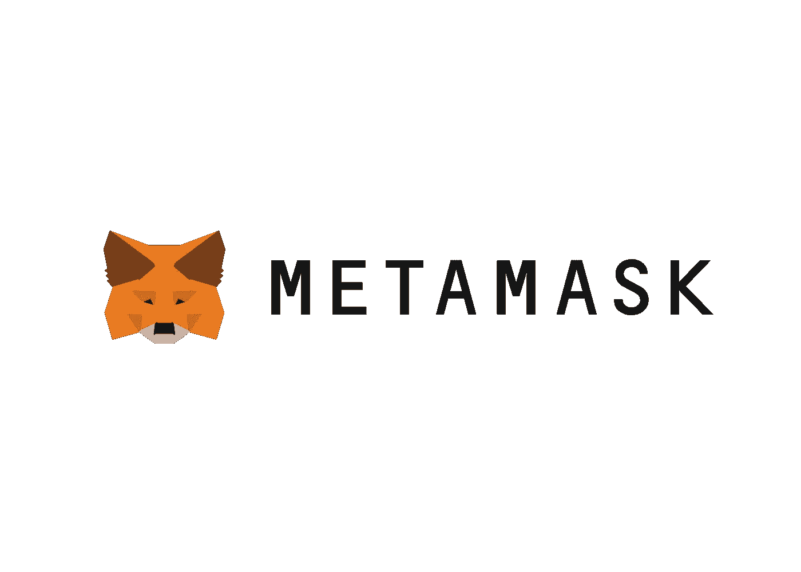
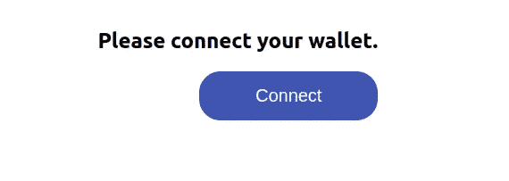
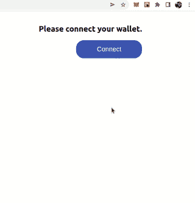
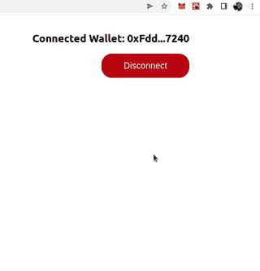
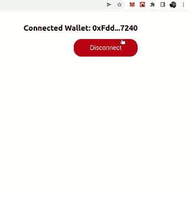

# 用 useDapp 连接浏览器钱包

> 原文：<https://medium.com/coinmonks/connect-browser-wallet-with-usedapp-f090212eb882?source=collection_archive---------7----------------------->

## 简单的 React 应用程序，展示了如何用 useDapp 和 ethers.js 连接浏览器钱包



Metamask Logo.

阅读完本文后，您将知道如何将浏览器钱包连接到您的 Web 应用程序。我会尽量简短。为了启动项目，我们将使用 Create React App。

```
$ npx create-react-app connect-wallet
$ cd connect-wallet
```

*注:如果你来这里只是为了代码，可以从我的 GitHub* *中抓取* [*。此外，您会发现文章中缺少的 CSS 文件。*](https://github.com/krisograbek/usedapp-playground)

*注 2:要跟随文章，JavaScript 的基础知识应该足够了。此外，您的计算机上需要 node.js 和 npm。否则，您将无法调用上述命令。*

## 安装 useDapp 和 ethers.js

在我们的项目中，我们将使用两个 web3 专用的库: **useDapp** 和 **Ethers.js** 。要安装它们，请在您的终端中键入:

```
$ npm install @usedapp/core ethers
```

## 将 useDapp 添加到项目中。

为了在我们的项目中启用 useDapp 库，我们必须用 **DAppProvider** 包装我们的应用程序。基本设置如下所示:

Enabling useDapp to our front-end using the DAppProvider Component.

以上片段的关键部分:

*   **配置**设置配置，
*   **DAppProvider** 在整个应用程序中启用 useDapp。

## 添加前端。

让我们把事情简单化。我们的整个前端部分将看起来像这样。

Front-end part for connecting the wallet.

让我们来分解一下:

*   我们的应用程序只有两个组件:一个标题和一个按钮，
*   我们使用**三元运算符**，这是一个带问号(？).我们需要它来定制按钮和显示的文本，
*   我们根据是否有连接的帐户呈现不同类型的按钮。

## 运行前端。

要运行该应用程序，请在您的终端中键入:

```
$ npm start
```

然后，在浏览器中打开`[http://localhost:3000](http://localhost:3000)`。您应该会看到这个基本布局:



Basic Layout of our app.

## **连接浏览器钱包。**

注意:我假设你的浏览器扩展中已经有一个钱包。

当然，我们想连接一个钱包。点击“连接”按钮调用`activateBrowserWallet()`功能。让我们看看它的实际效果。



Connecting MetaMask with our simple App.

完美！我们的连接按钮工作正常。让我来分析一下发生了什么:

*   我点击“连接”,给`activateBrowserWallet()`打电话
*   将弹出一个元掩码窗口，
*   我选择一个我想连接到我的应用程序的帐户，然后单击“下一步”，
*   我确认要连接到我的应用程序，
*   我的帐户已连接。

让我们看看断开后会发生什么。



Disconnecting and Connecting back. MetaMask doesn’t pop up anymore.

当我们点击“断开”按钮时，我们调用`deactivate()`函数。它将变量`account`设置为未定义。但是当我们再次尝试连接时，不再有 MetaMask 弹出窗口。是因为 Metamask 记得我们用 app 连接了一个账号。它节省时间。使用 Web 3 应用程序时，您不希望总是确认您允许 MetaMask 使用该应用程序。

要断开应用程序，我们应该在 MetaMask 本身中完成。让我告诉你怎么做。



Disconnecting the application through MetaMask.

通过元掩码断开连接后，我们又回到了起点。下次点击“连接”时，MetaMask 会再次弹出，要求您确认。

## 最后的想法

你有它！您学习了如何使用 useDapp 库将浏览器钱包连接到您的应用程序。虽然这个库很实用，但是它有纯文档。希望它的开发者早点管起来。

连接钱包不足以创建 Web 3 应用程序。然而，我无法想象没有这种能力的人。

> *加入 Coinmonks* [*电报频道*](https://t.me/coincodecap) *和* [*Youtube 频道*](https://www.youtube.com/c/coinmonks/videos) *了解加密交易和投资*

# 另外，阅读

*   [3 商业评论](/coinmonks/3commas-review-an-excellent-crypto-trading-bot-2020-1313a58bec92) | [Pionex 评论](https://coincodecap.com/pionex-review-exchange-with-crypto-trading-bot) | [Coinrule 评论](/coinmonks/coinrule-review-2021-a-beginner-friendly-crypto-trading-bot-daf0504848ba)
*   [莱杰 vs n rave](/coinmonks/ledger-vs-ngrave-zero-7e40f0c1d694)|[莱杰 nano s vs x](/coinmonks/ledger-nano-s-vs-x-battery-hardware-price-storage-59a6663fe3b0) | [币安评论](/coinmonks/binance-review-ee10d3bf3b6e)
*   [Bybit Exchange 审查](/coinmonks/bybit-exchange-review-dbd570019b71) | [Bityard 审查](https://coincodecap.com/bityard-reivew) | [Jet-Bot 审查](https://coincodecap.com/jet-bot-review)
*   [3 commas vs crypto hopper](/coinmonks/3commas-vs-pionex-vs-cryptohopper-best-crypto-bot-6a98d2baa203)|[赚取加密利息](/coinmonks/earn-crypto-interest-b10b810fdda3)
*   最好的比特币[硬件钱包](/coinmonks/hardware-wallets-dfa1211730c6) | [BitBox02 回顾](/coinmonks/bitbox02-review-your-swiss-bitcoin-hardware-wallet-c36c88fff29)
*   [BlockFi vs 摄氏](/coinmonks/blockfi-vs-celsius-vs-hodlnaut-8a1cc8c26630) | [Hodlnaut 点评](/coinmonks/hodlnaut-review-best-way-to-hodl-is-to-earn-interest-on-your-bitcoin-6658a8c19edf) | [KuCoin 点评](https://coincodecap.com/kucoin-review)