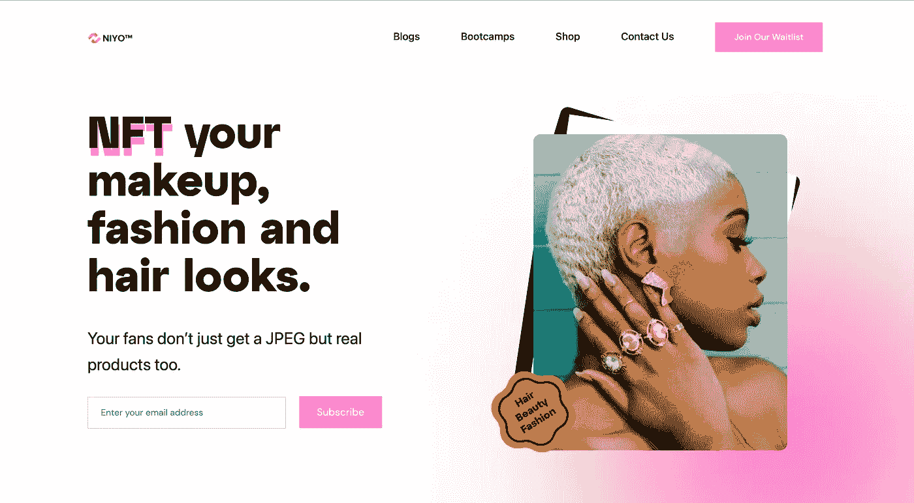

# 通过 NFTs(物理 NFTs)将物理物品连接到区块链

> 原文：<https://medium.com/coinmonks/connecting-physical-items-to-the-blockchain-through-nfts-physical-nfts-a26404af4c05?source=collection_archive---------7----------------------->

Image Credit: Pexels.com

区块链目前的用例是数字资产，“如果不是数字资产，你就不能使用区块链的技术”——我是这么听说的。

我从人们那里得到的一个重要问题是，卖食物的我们是什么？还是鞋子？或者一些显而易见的不能轻易数字化的实物，他们得出的结论是 web 3/区块链不适合他们！我不能卷进去！

如果我们能把实物和区块链联系起来会怎么样？在本文中，我将带您了解如何通过 NFTs 实现这一点。我也将分享一个我在研究的基础上找到的手动方法。

## 什么是 NFT？

NFT 被称为不可替代的令牌，这意味着它们是不可互换的，因为没有其他资产可以拥有相同的价值。不可替代性的概念是它的独特性。

如果你理解社会地位，你就会理解 NFTs——a julu

NFT 的唯一性历史存在于区块链上，该使用[密码术](https://data-flair.training/blogs/blockchain-cryptography/#:~:text=the%20blockchain%20secure.-,Cryptography%20in%20Blockchain,nodes%20in%20a%20blockchain%20network.)进行保护。NFT 可以被视为资产(物理或数字)的数字化信息，也可以被视为数字资产本身。一个例子是一个艺术家创作了一幅他的画的复制品，然后在像 opensea 这样的专门市场上出售。目前，NFTs 的最大使用案例是艺术、摄影、音乐、体育收藏品等

既然已经定义了 NFT，我们需要看看它是如何与物理项目相关联的。

## 通过 NFTs 将物理项目与区块链关联的概念

这也可以叫做**物理 NFT** 。简单地解释一下，在这里，如果买家确实想拥有他们的财产的实物版本，NFTs 可以作为对现实生活中的实物项目的所有权的保证。

目前，我们只是花了很多钱，成千上万美元来制造 NFT，但是你却什么也得不到。但是在实物 NFT 的概念中，你可以铸造一个 NFT，也可以选择获得那个确切的 NFT(我指的是被铸造的财产)作为实物。这方面的一个很好的例子是一位著名的数字艺术家如何提供与其作品相关的物理标记，通常包括高分辨率的屏幕艺术显示、签名的真品证书等。皮普尔详细解释了他的思维过程[这里](https://www.youtube.com/watch?v=nTmF26NUZTA&t=243s)

为简单起见，我们以一幅实物画为例。你必须从创作那幅画的数码版本开始，就像数码双胞胎一样，用手机或数码相机拍张照片就可以轻松完成。你也可以找一个数码艺术家，用 photoshop 之类的软件为你克隆一个一样的东西。一旦你数字化了你的作品，重要的是所有与绘画相关的信息都是精确的，并附在虚拟文件中。从这里，你选择一个市场来铸造你的画。智能合约分配所有权并管理 NFT 的转移，特别是基于以太坊的令牌，这是大多数。这就是你如何在区块链得到你的物理绘画。现在让用户得到这个 NFT 作为一个实体产品，就是完成了实体 NFTs 的过程。

最终，实体物品可以像任何其他不可替代的代币一样出售，或者兑换成与之相关的实体物品。

人们最关心的一个问题是，为什么我花了很多钱买了一件数字艺术品，却什么也没得到，它要么根据项目和社区增值，要么贬值。许多人在购买非功能性食物时也损失了钱，从长远来看，这种价值会减少到零

在我们讨论物理非功能性测试的好处之前，让我带您看一些物理非功能性测试的例子。

## 物理 NFT 的示例

目前，在 NFT 空间，物理 NFT 的能量还没有被看到，但是已经有一些项目聚焦于此，并且正在起飞。

1.  [Niyo DApp:](https://www.niyo.co/) Niyo DApp 是一个 F-NFT 视觉发现平台，由 AI/ML 和增强现实技术提供支持，允许创作者将他们的创作转化为 NFT。创作者将能够将他们的 F-NFT 转换为真实的产品和服务，他们可以在 Dapp 上购买之前尝试。NIYO 经常与创作者合作，在时尚、发型和美容领域设计一系列实物。

A screenshot from niyo.co

2. [RTFKT 工作室](https://rtfkt.com/):他们被称为虚拟运动鞋巨头 RTFKT，最近被耐克收购。他们允许 NFT 的所有者轻松赎回鞋子，称 NFT 为现实世界创作的“蓝图”。

还有更多像[美泰](https://about.mattel.com/)、[阿迪达斯原创](https://opensea.io/collection/adidasoriginals)、 [WENEW](https://wenewmoments.com/) 这样的例子

## 物理 NFT 的优势

实物商品的最大好处是能够证明真实性和出处，在一个已经花费了超过 6 亿美元的市场中，实物 NFT 对于买家和卖家来说都是一个有价值的工具。得益于区块链技术，虚拟资产及其实体资产所附带的信息永远不会被更改、伪造或篡改，从而提供了一条可信的数据轨迹。

另一个主要好处是消除了交易中的中间商，为买卖双方提供了自由。

最后，它让更多的人参与到 NFT 空间中来，不仅仅是数字迷，还有在区块链技术领域拥有职业技能的人。

## 结论

NFT 空间在现实世界和虚拟世界都变得越来越广阔(元宇宙)。虽然我们将 NFT 归因于 CryptoPunk、BoredApe、FancyBears 等大型项目，但一些人指出，将 NFT 与物理项目联系起来是使用 NFT 和区块链技术的最强有力的例子之一。

> 加入 Coinmonks [电报频道](https://t.me/coincodecap)和 [Youtube 频道](https://www.youtube.com/c/coinmonks/videos)了解加密交易和投资

# 另外，阅读

*   [最佳加密交易信号电报](/coinmonks/best-crypto-signals-telegram-5785cdbc4b2b) | [MoonXBT 评论](/coinmonks/moonxbt-review-6e4ab26d037)
*   [如何在 Bitbns 上购买柴犬(SHIB)币？](https://coincodecap.com/buy-shiba-bitbns) | [购买 Floki](https://coincodecap.com/buy-floki-inu-token)
*   [CoinFLEX 评论](https://coincodecap.com/coinflex-review) | [AEX 交易所评论](https://coincodecap.com/aex-exchange-review) | [UPbit 评论](https://coincodecap.com/upbit-review)
*   [十大最佳加密货币博客](https://coincodecap.com/best-cryptocurrency-blogs) | [YouHodler 评论](https://coincodecap.com/youhodler-review)
*   [AscendEx 保证金交易](https://coincodecap.com/ascendex-margin-trading) | [Bitfinex 赌注](https://coincodecap.com/bitfinex-staking)
*   [最好的卡达诺钱包](https://coincodecap.com/best-cardano-wallets) | [Bingbon 副本交易](https://coincodecap.com/bingbon-copy-trading)
*   [印度最佳 P2P 加密交易所](https://coincodecap.com/p2p-crypto-exchanges-in-india) | [柴犬钱包](https://coincodecap.com/baby-shiba-inu-wallets)