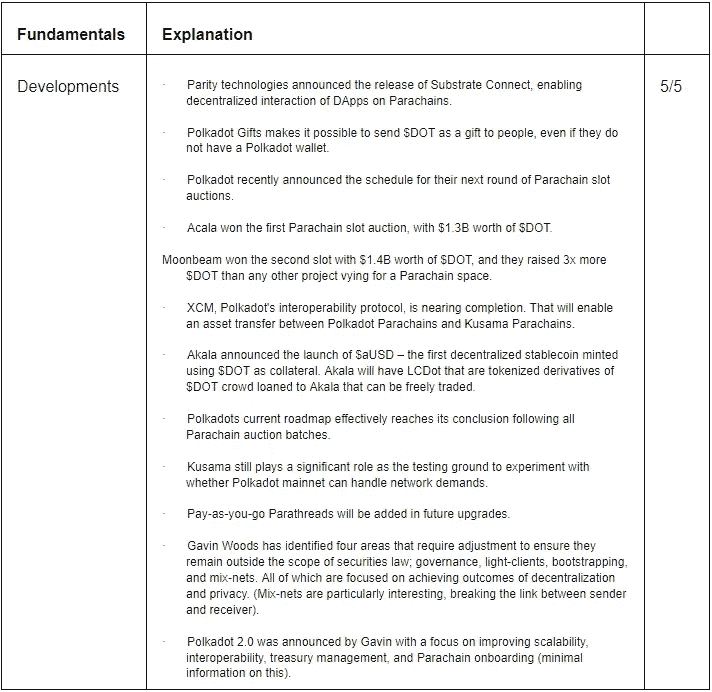
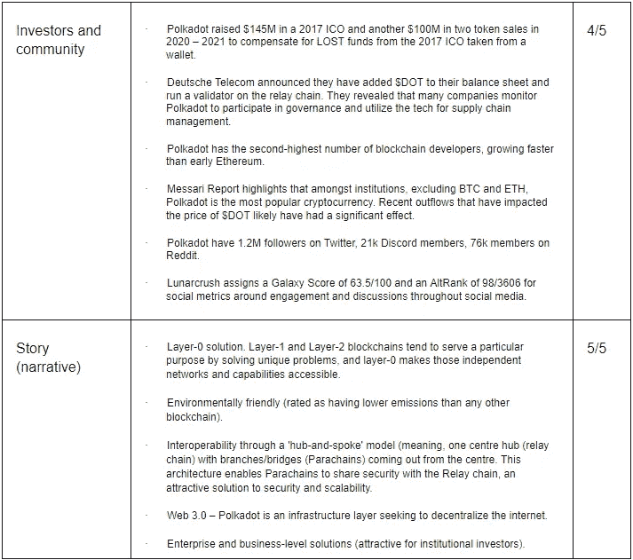
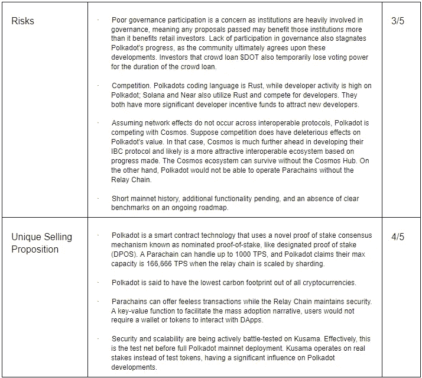
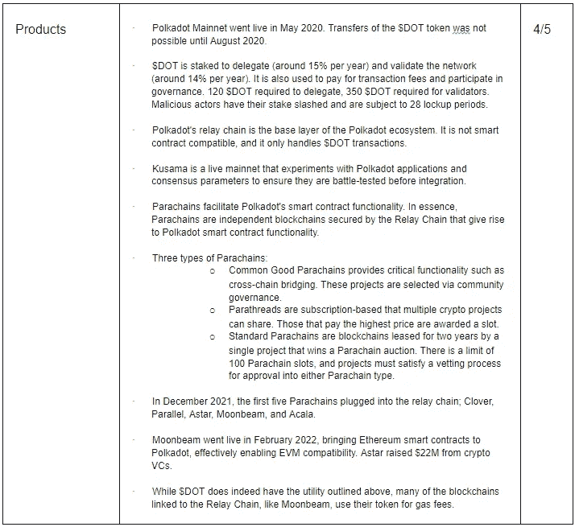
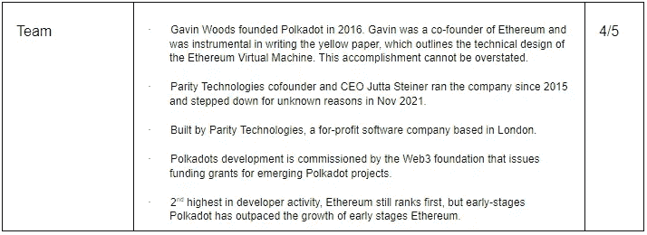
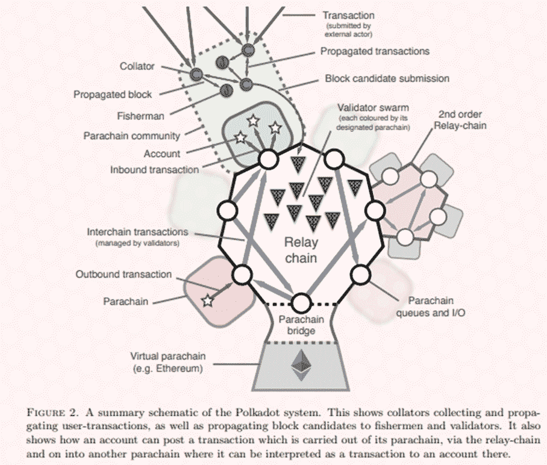
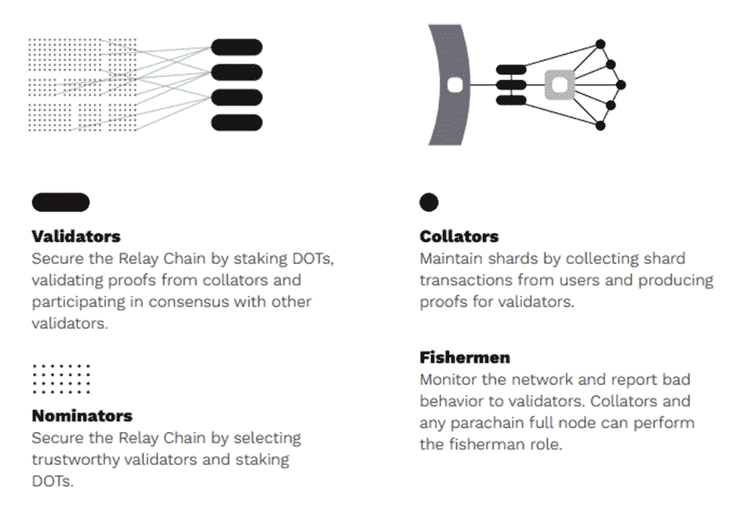
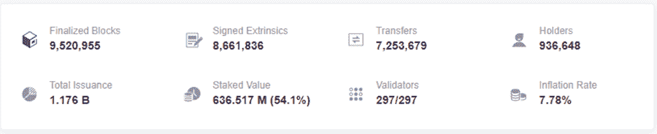

# 连接$ DOTs-Polkadot 基本分析

> 原文：<https://medium.com/coinmonks/connecting-the-dots-polkadot-fundamental-analysis-3de57af8164c?source=collection_archive---------2----------------------->

这份基本面分析是 Crypto Consulting Institute 的付费时事通讯的一部分，提供市场洞察、可行的交易信号和基本面分析。更多信息请访问:【https://www.cryptoconsultinginstitute.com/newsletter 

早上 6 点，你的闹钟响了，把你拖进新的一天。通过确保您拥有满足工作日预期需求的工具，您为自己做好了准备。

你把车开出车道，去火车站赶一趟直达市中心的快车。

出租车和公交车在路上行驶，确保那些在地面上的人可以通过他们的 9-5 有效地前往办公室。

许多人，就像你一样，正在参与各种经济活动来谋生。

但是，如果没有直达市中心的火车，这座城市会是什么样子呢？

如果每个人都决定在需要去某个地方的时候开车进城，会怎么样？

如果没有道路，或者没有公共交通工具来减少每个人同时开车穿越城市的交通流量，我们还能继续我们的日常生活吗？

如果没有基础设施或方法来控制公共交通的人员流动，那将是一片混乱。

数不清的人类生产力水平将会下降。虽然依靠“两英尺和一次心跳”对我们的健康有好处，但花在独自旅行上的时间会极大地影响我们的生产潜力。

这个普通的故事概括了区块链的现状。一些企业拥有处理大量网络活动的基础设施。然而，我们很快发现自己被困在一个有围墙的花园里，没有轨道在其他区块链生态系统之间穿行。

第 0 层(或互操作性协议)是公路、铁路和可扩展的手段，不仅可以向其他区块链传输价值单元，还可以传输数据。

加密货币和开发分布式账本技术的一个主要目标是创造条件，使最终用户几乎不知道或不需要知道他们正在区块链上操作。

这种跨网络的数据和价值的无缝传输将我们带回到围绕下一代互联网演进的考虑。总的来说，我们对区块链的理解仅限于作为一种货币的价值流动。市场尚未完全概念化如何在网络之间自由流动的数据创造一个可行的替代现有的互联网基础设施是高度集中，这必然导致网络干扰。

对于任何要扩展的新技术或新兴技术，我们称之为“三 a”:

访问、应用和采用。

波尔卡多特正在建造可以毫不费力地接入其他区块链网络的铁路，这一切都不需要离开你舒适的家或东道主区块链。

通过设计，每个副链都是特定于应用程序的，并与中继链共享安全性，中继链在它们的直接生态系统之外打开桥梁。

开发者的梦想是让人们在不知情的情况下使用区块链。这种对 rails 数据传输的关注对于采用和让用户通过新兴应用程序支持的活动和功能实现不可替代的价值至关重要。

通过这一基本分析，我们将在“三个 a”的背景下更深入地讨论 Polkadot，以及 Polkadot 将如何通过互操作性为下一代互联网奠定基础，即更广泛的术语“Web 3.0”。

你的 TLDR 总结，D.I.S.R.U.P.T .要点。29/35

# 沙漠中的绿洲羡慕管道。

沙漠中一片未受干扰的水域有可能成为救生员。

一些更令人心痛的人类贫困景象来自人们每天步行数小时从井里取回一桶水的经历。与远离淡水资源的社会相比，靠近淡水资源的社会往往更加繁荣。

但是我们开始了解的文明并不是在水源附近形成的，而是停留在原地。美索不达米亚人使用粘土管道长距离运输液体，以节省取回液体的工作量，使定居点能够在远离主要水源的地方形成。

同样，公路和火车可以方便地到达繁忙城市中经常去的目的地。

使人类繁荣的是消除了时间密集型任务的基础设施的部署。

波尔卡多特既是水也是输送水的管道。副链是水龙头或水通过管道的入口。

Polkadot 是一个由中继链保护的互操作集线器。中继链通过异步拜占庭容错(aBFT)算法实现一致性。用最简单的话来说，回想之前关于拜占庭将军问题的讨论，这种共识消息允许一些消息被丢弃和延迟，假设诚实的行动者节点将通过。在中继链上选择验证器，以基于指定的利害关系证明来保护网络，类似于指定的 PoS，除了验证器选择是确定性的和不太频繁。此外，共识层执行网络的自动硬分叉，以将分类帐的状态分解成片段，从而增加验证器的同步性。

底层技术有很多深度，但 Polkadots 中继链是弯曲辐条模型的核心。辐条由三种类型的副链组成；承载桥接和其他重要功能的公共商品副链，使一组项目能够出租生态系统的副线程，以及特定于应用程序的区块链的副链。

后者需要特别提及，因为副链是可以托管其令牌并优化其功能以满足所需输出的主权区块链。我们在最近的[宇宙基本面分析](/coinmonks/out-of-this-world-cosmos-atom-fundamental-analysis-b7aeb65583f)中讨论了一个非常相似的安排。在体系结构层次上有许多不同，但是 Polkadot 通过$DOT crowd loans 出租副链插槽的方式是将实用程序应用于令牌的一种独特方法。

这些是通过类似于真实世界拍卖的 Parachain slot 拍卖选出的。除了投标货币是$DOT，获胜的项目是随机选择的，以防止领先。那些将他们的$DOT 借给 Parachain 拍卖的人在长达 96 周的时间后可以收回他们的$DOT。在此期间，参与者将获得他们帮助保护的副链的项目令牌作为奖励。无论是波尔卡多特还是大众贷款项目都不能使用这点赌注。许多人错误地使用“免费资金”来描述各种 DeFi 收入流。尽管如此，一个项目的代币在一次链上拍卖后的分配是一个非常接近这个事实的例子，在这个意义上，一旦债券期限到期，没有任何美元点。

对波尔卡多特来说，跨越共识机制至关重要。它以自己是集中式系统的破坏者而自豪，他们的 lightpaper 频道对集中式提供商对用户数据的不当使用感到焦虑。这些意识形态使他们站在了 Web 3.0 革命的最前沿，不仅仅是在网络之间无缝交换价值单位，而是所有类型的数据。

想想今天的数据传输方式，当我们浏览一个网站时，我们通常会从一个集中式服务器网络中访问存储的数据。本质上，个人或中央实体拥有这些数据。此外，如何保持它对于辨别网络弹性至关重要。如果 AWS 托管了世界上一半的网站，如果它们突然停止运营，互联网将会瘫痪。

通过特定于应用的区块链的去中心化以及维护其操作的节点网络创建了网络中的弹性。如果一个节点发生故障，对整个网络的状态来说基本上是无关紧要的，因为一台服务器只是网络中在各种条件下运行的许多节点中的一个。

中继链奠定了通过虚拟副链与其他生态系统连接的基础。这种能力非常重要，因为不仅价值单位在这些桥梁上流动，数据也是如此。

# 许多深浅不一的圆点

波尔卡多特是一个完全分片的区块链。正如我们在讨论共识时提到的，从验证者的角度来看，划分网络有很多优点，但是实现起来非常复杂。互联网在权限和功能方面需要灵活性。本质上，分片是从整体中抽取一小部分，并独立于分类帐的状态对功能进行编程。

这具有超越价值转移的深远影响。创建许可和可定制的网络对于优化功能和企业效用至关重要。

记住，新兴技术的目标是促进采用。通常，这包括让用户加入 Dapp 的功能。当最终用户不知道他们正在区块链上操作，从而减少了有意义地参与所需的知识时，就出现了成功采用的实例。

中继链与这些主权碎片共享安全性，这些主权碎片也有办法调整其生态系统中的共识机制，以适应其预期的用例。

因此，Polkadot 受到大型机构的青睐，这些机构将底层基础设施视为增强系统和功能弹性的解决方案。通过 Polkadot 连接的企业解决方案可以访问 Polkadot 生态系统中的许多分散式应用程序，以及 EVM 和非 EVM 运行时环境。

Web 3 基金会是 Polkadot 开发的主要协调者，这并不是巧合。从 Web 2 过渡将是持续的，Polkadot 拥有一支开发人员和贡献者的大军来发展网络，仅次于以太坊。

此外，已经获得其副链插槽的项目可以将新颖的用例应用于其生态系统，而不仅限于 DeFi DApps。分散式云计算解决方案将在维持网站正常运行时间和支持访问私有云服务器方面发挥重要作用，企业可以在私有云服务器上构建其整个运营。我们已经在 [Metis 基本面分析](https://justmy2satoshis.medium.com/metis-the-future-of-decentralized-human-organizations-199a32d97ab9)中提到了去中心化自治公司(DAC)的发展，寻求部署企业解决方案的 Parachains 正在走一条非常相似的道路。

然而，如果我们要假设这将是一个共同操作的协议来统治他们所有人——这是不太可能的，因为重叠的网络效应可能会发生，我们期待宇宙。在之前的 FA 中，我们把它和波尔卡多特相提并论。因此，我们不会逗留。然而，值得注意的是，Polkadot 自己的文档中有一页讨论了它与 Cosmos 的区别。您可以在参考资料中找到链接。

以太坊 2.0 作为波尔卡多特的“对手”是值得考虑的。在某种意义上，他们通过分片的网络架构是非常相似的，尽管一些关键的差异是围绕着状态转移函数(STF)。波尔卡多特碎片有一个抽象的 STF，这给了它们适应新状态的灵活性，而在以太坊上，每个碎片都被硬编码成固定的状态。治理是另一个不同的领域，以太坊将继续执行通过硬分叉网络实现的离线提议。然而，Polkadot 完全在链上进行治理，这是自主执行的。换句话说，Polkadot 是不可信的，而 Ethereum 硬分叉仍然需要信任代码将按照批准的提议的条件运行。最后，据说 Polkadot 具有更好的可用性和验证器保证，因为每个碎片都需要更少的验证器来保护分类帐。

众所周知，赋予网络价值的是可用的用例。草间弥生，波尔卡多特的试验场，举行了他们的副链拍卖，但我们将触及到目前为止波尔卡多特副链拍卖的获胜者的实用性和相关性。

Acala 赢得了第一次拍卖——它从社区筹集了 5 亿美元的资金。他们的基本价值主张之一是流动人群贷款点。这种不可信的赌注衍生品允许人们将他们锁定的点投入到另一个群体贷款中，或者自由交易债券收据，所有者可以在以后赎回。他们也有稳定的硬币，澳元，将能够扩展到多个网络，类似于澳元 UST。

Moonbeam 赢得了第二轮拍卖——早期投资者获得了 10 倍的回报。在智能合同空间中运行，其 live mainnet 帮助为所有类型的 DApps 构建跨链开发工具。

Astar 赢得了第三次 Parachain 拍卖——一个衬底运行时库。substrate 提供了让开发人员为 Polkadot 构建 Parachains 的工具。为区块链的有机增长创造结构性激励。

Parallel Finance 赢得了第四届 Parachain 拍卖会——信贷协议和衍生品。

Clover Finance 赢得了第五次 Parachain 拍卖——他们的跨链基础设施使得将以太坊上的 DeFi DApps 移植到 Polkadot 变得更加容易。他们有一个工作产品，三叶草钱包，与 EVM 兼容。

最后，Efinity 获得了最近的第 6 次 Parachain 拍卖——这是一个由金恩开发的 Parachain，它获得了基于 Polkadot 中继链验证器的共识算法。这种共识安排让 Efinity 拥有一个独特的状态、数据和经济框架。Efinity 寻求解决 NFT 生态系统中一些最重要的问题，例如互操作性、阻碍费用、不灵活的智能合同等等。

# $点标记组学

截至 2021 年 3 月 22 日的 DOT:

价格:19.27 美元

创历史新高:54.98 美元

市值:21079978840 美元

流通供应量:1095412558

总供应量(包括归属):1，176，361，691

最大电源:无盖

通货膨胀率:7.78%，4 月份——排放量因治理和占总供应量的百分比而异。

$DOT 有三个主要功能:治理、赌注和副链结合(大众贷款和副链拍卖)。

# 一幅点的画布揭示了 1000 条路径——讨论

道路不会判断行驶的公共汽车或它的品牌，火车轨道也不会考虑它上面的车辆。波尔卡多特可以用同样的术语来理解。

主要动机不是与其他加密货币项目竞争，而是成为它们相互通信的轨道。正如我们在 FAs 系列中详细讨论的那样，互操作性对于构建未来的基础设施至关重要。

如果我们不能在不同的网络之间通信，很难想象分布式账本技术会取代 Web 2 基础设施。相关变量是谁控制网络，谁批准网络的有效性。部署在区块链的 DApps 确实有应用程序，但如果新用户不能轻松访问这些产品，我们将如何促进采用？

我们已经详细讨论了可互操作的协议，但是很少有人考虑在三个 As 的上下文中的含义。

例如，许多人对 Terra 生态系统持有保留意见，并对我们之前在 Terra 上发布的$UST 维持钉住汇率制进行了推测。但许多专家称这是一个庞氏骗局，或者认为这是不可持续的，他们没有认识到跆拳道是 Chai 应用的幕后黑手，该应用在韩国拥有逾 250 万用户。超过 50 家电子商务商店接受 UST 元作为付款方式。此外，该应用程序非常用户友好，参与者要么不知道，要么不需要知道他们正在区块链上使用一个分散的应用程序。他们有一个易于访问的应用程序，并且在电子商务中也有应用程序——当 DApps 可以向这个基准扩展时，这就是采用的方式。

Polkadot 很可能会超过这个基准。由于用例不限于价值交换或 DeFi 智能合同，未来用户可能会下载 Polkadot Parachain 支持的应用程序的原因有很多。这吸引了非加密用户加入进来。

Clover Parachain 正在设计他们的基于基板的钱包，该钱包可能具有斜坡功能，以实现一系列支付。这听起来可能是良性的；然而，阿卡拉正在发行他们的稳定币；澳元。非常类似于$UST 的设计，有可能$aUST 将在 Acala 的支付 DApps 有用。

虽然 Cosmos 确实是一个高度可行的替代方案，但两个项目都认为它不会是一个统治所有项目的项目。他们理解当功能重叠时的网络效应，因为 Cosmos 将具有基板兼容性。理论上，你可以执行一个通过波尔卡多特的宇宙函数，以在另一个区块链上或者甚至是穿过 Parachains 达到预期的结果。反之亦然。这种允许访问任何区块链的可互操作协议的重叠就是我们所说的 web 3.0。前端可以在链上部署和存储，后端允许智能合同交互。

考虑到所有的事情，我们只是真正触及了表面，但似乎波尔卡多特将保持在蓝筹加密的宠儿地位。在之前的市场调整中，Polkadot 确实经历了显著的下跌。由于不稳定的宏观经济条件导致的不确定性仍然存在，因此很难对波尔卡多的价格行为做出短期保证。

这种下降趋势可能是债券期限即将结束以及机构在不利的市场条件下解除风险敞口的副产品。

对于许多蓝筹股项目来说，同样的情况也可以说,$DOT 的当前价格是一个礼物。Polkadot 有一个我们需要注意的不断膨胀的时间表，这个风险因素需要与$DOT 在绑定中锁定和在验证器节点中下注的百分比进行权衡。

目前约为 19 美元，低于 54.98 美元的历史高点，2-3 倍的回报率并不是不现实的预期。网络效应需要时间，取决于网络上副链使用的增加。中继链保护这些副链，没有$DOT 就无法运行(与$ATOM 截然不同)。对于那些有风险偏好进入低市值头寸的人来说，密切关注即将到来的 Parachain 拍卖和首次 Dex 发售(ido)将至关重要。

对于一个将成为未来基础设施的重要组成部分的协议，从开发者活动的指数级来看，与早期的以太坊相比，假设底层网络在未来可以扩展到价值数千亿美元并不牵强。

但是让我们暂时放松一下绑在火箭上的绳子。在那之前需要发生很多事情。整个加密货币领域仍然存在高度的监管不确定性，我们唯一可以肯定的是，它们确实迫在眉睫。Polkadots 对预期法规的认可和面向未来的兼容性是朝着正确方向迈出的积极一步，而不是完全分散运营，这确实是监管机构无法阻止的事情。围绕使 hub 用户友好的进一步开发，以便用户不会被在$DOT 上操作的复杂性压垮，这对于采用是至关重要的。

这个网络在成为所有加密技术的中心之前还有一段路要走。寻求实现 Web 3.0 不是一件容易的事情。虽然我们在之前的 FAs 中已经提到了几个不同的 Web 3.0 项目和功能，但 Polkadot 似乎将在使互联网真正免费和对所有人开放方面发挥重要作用。

# 参考

Coindesk，“数字资产基金遭遇创纪录的 1.42 亿美元外流”，2021 年 12 月 21 日，[https://www . coin desk . com/markets/2021/12/20/Digital-Asset-Funds-Hit-by-Record-1.42 亿美元外流/](https://www.coindesk.com/markets/2021/12/20/digital-asset-funds-hit-by-record-142-million-of-outflows/)

Coindesk，“Jutta Steiner 离开 Polkadot Builder Parity Technologies”，2021 年 11 月 26 日，[https://www . coin desk . com/business/2021/11/26/Jutta-Steiner-Leaves-Polkadot-Builder-Parity-Technologies/](https://www.coindesk.com/business/2021/11/26/jutta-steiner-leaves-polkadot-builder-parity-technologies/)

Cyberbumb，“POLKADOT:印度语的 DOT 基本面分析和价格预测— Polkadot 加密货币解释”，2021 年 10 月 16 日[https://cyber bump . net/POLKADOT-DOT-FUNDAMENTAL-ANALYSIS-PRICE-PREDICTION-IN-HINDI-POLKADOT-Cryptocurrency-Explained/](https://cyberbump.net/polkadot-dot-fundamental-analysis-price-prediction-in-hindi-polkadot-cryptocurrency-explained/)

梅萨里，“2022 年的加密论文”，[https://messari.io/crypto-theses-for-2022](https://messari.io/crypto-theses-for-2022)

Polkadot Docs，[https://wiki . polkadot . network/Docs/getting-started](https://wiki.polkadot.network/docs/getting-started)

Polkadot Lightpaper，[https://Polkadot . network/Polkadot-light paper . pdf](https://polkadot.network/Polkadot-lightpaper.pdf)

Polkadot 白皮书，[https://polkadot . network/polkadotppaper . pdf](https://polkadot.network/PolkaDotPaper.pdf)

波尔卡多特维基，“波尔卡多特和宇宙”，[https://Wiki . Polkadot . network/docs/learn-comparisons-Cosmos](https://wiki.polkadot.network/docs/learn-comparisons-cosmos)

Polkadot Wiki，“Polkadot 和以太坊 2.0”，[https://Wiki . Polkadot . network/docs/learn-comparisons-ether eum-2](https://wiki.polkadot.network/docs/learn-comparisons-ethereum-2)

硬币共和国，“埃芬尼特是波尔卡多第六次帕拉契安拍卖的赢家？”，2021 年 12 月 31 日，[https://www . thecinrepublic . com/2021/12/31/e finity-is-the-winner-of-polkadots-sixth-para chian-auction/](https://www.thecoinrepublic.com/2021/12/31/efinity-is-the-winner-of-polkadots-sixth-parachian-auction/)

Youtube，Coinbureau，' Polkadot:DOT 怎么了？！2022 年潜力！!'2022 年 2 月 18 日，【https://www.youtube.com/watch?v=H7S5k5jWp48 

Youtube，Fin Tec，“波尔卡多特的下一步是什么？”，【https://www.youtube.com/watch?v=Xo6fhqbQEEk】T4

Youtube，InvestAnswers，' Polkadot:我该不该买？DOT 值得吗？到 2025 年的详细研究和价格预测'，2021 年 5 月 11 日，[https://www.youtube.com/watch?v=98F6h9uCi6A](https://www.youtube.com/watch?v=98F6h9uCi6A)

Youtube，白板加密，“什么是 Polkadot？《DOT 用动画解释》，2021 年 9 月 19 日，[https://www.youtube.com/watch?v=YlAdEQp6ekM](https://www.youtube.com/watch?v=YlAdEQp6ekM)

> 加入 Coinmonks [电报频道](https://t.me/coincodecap)和 [Youtube 频道](https://www.youtube.com/c/coinmonks/videos)了解加密交易和投资

# 另外，阅读

*   [3 商业评论](/coinmonks/3commas-review-an-excellent-crypto-trading-bot-2020-1313a58bec92) | [Pionex 评论](https://coincodecap.com/pionex-review-exchange-with-crypto-trading-bot) | [Coinrule 评论](/coinmonks/coinrule-review-2021-a-beginner-friendly-crypto-trading-bot-daf0504848ba)
*   [莱杰 vs n 格拉夫](/coinmonks/ledger-vs-ngrave-zero-7e40f0c1d694) | [莱杰纳诺 s vs x](/coinmonks/ledger-nano-s-vs-x-battery-hardware-price-storage-59a6663fe3b0) | [币安评论](/coinmonks/binance-review-ee10d3bf3b6e)
*   [Bybit Exchange 审查](/coinmonks/bybit-exchange-review-dbd570019b71) | [Bityard 审查](https://coincodecap.com/bityard-reivew) | [Jet-Bot 审查](https://coincodecap.com/jet-bot-review)
*   [3 commas vs Cryptohopper](/coinmonks/3commas-vs-pionex-vs-cryptohopper-best-crypto-bot-6a98d2baa203)|[赚取加密利息](/coinmonks/earn-crypto-interest-b10b810fdda3)
*   最好的比特币[硬件钱包](/coinmonks/hardware-wallets-dfa1211730c6) | [BitBox02 回顾](/coinmonks/bitbox02-review-your-swiss-bitcoin-hardware-wallet-c36c88fff29)