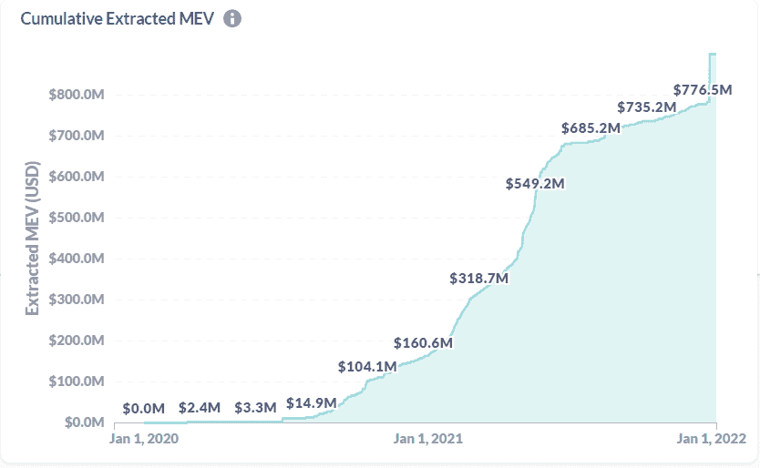
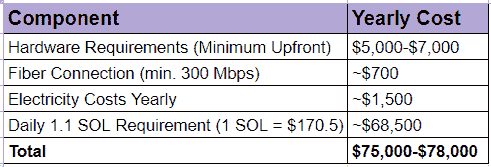
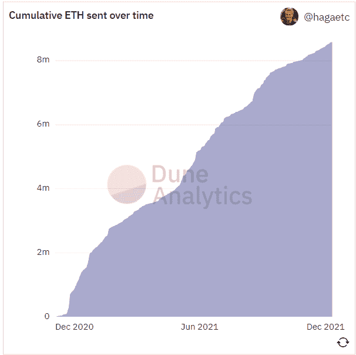
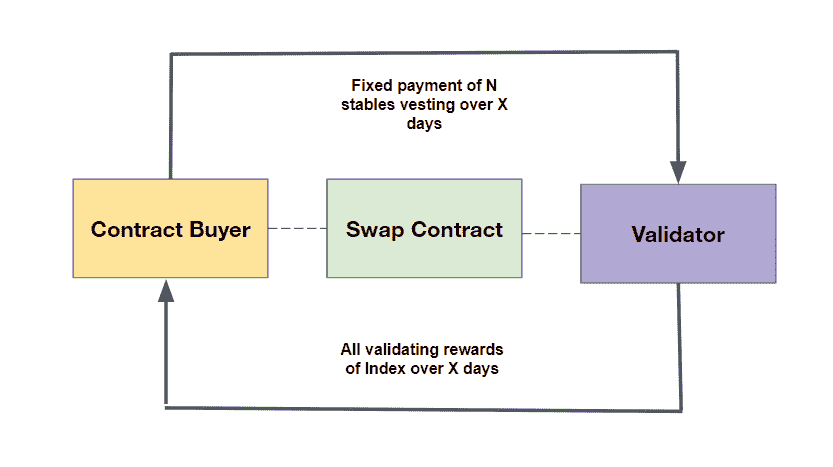

# 共识资本市场

> 原文：<https://medium.com/coinmonks/consensus-capital-markets-efe8fa2d48b3?source=collection_archive---------5----------------------->

> 谁控制了香料，谁就控制了宇宙
> 
> *——弗兰克·赫伯特，沙丘*

[萨尼尔·斯里尼](https://twitter.com/sanlsrni)

[张立嘉](https://twitter.com/Leorzhang)

## *简介:*

商品是基本的原材料，是日常商品和服务生产的基础。商品的历史是文明本身的反映。人类为了寻求对最重要资源的控制而相互发动战争；从大米，到金属，到香料，到石油。随着全球经济和日常活动的更多方面转移到加密经济，什么将成为新时代最受欢迎的商品？

**区块空间。**

公共区块链上的所有经济活动都集中在区块空间。共识生产者，如矿工和赌注验证者，提供块空间，而每个事务都需要块空间。当链上活动增加时，网络费用增加，当区块补贴和费用的值增加时，更多的人被激励去竞争将下一个区块附加到区块链。

由于区块空间是一种商品，它可以被用作金融工具的基础——要么对冲生产，要么提高回报。这种金融化最终会导致一个全面的资本市场，类似于所有重要商品在历史上的演变方式。

在本文中，我们将深入探讨商品市场的历史背景、分散共识在数字世界中的重要性、共识产生的经济学以及共识的秘密资本市场将会是什么样子。

## *商品市场:历史概述*

早在公元前 4500 年，古代苏美尔的居民就使用粘土代币和石板来命名未来货物交付的日期和结算规则，这实质上是一种期货合同。近 3000 年后，汉谟拉比法典中的一部概述了抵押财产的农民的支付规则。农民必须用他们生产的粮食来偿还债务，但保留在作物歉收时不付款的权利。这些基本规则有助于生产者管理他们的风险，反过来，允许更稳定的农业生产。

这些财务安排将继续发展和标准化。最早的正式商品交易所之一是 1697 年的多岛大米交易所。代替真正的大米，商人们会交易“米票”——对他们仓库里大米的所有权。以米票为基础，商人们开发了许多衍生合约，现在普遍交易，如卖空、远期和期权。一个多世纪后，芝加哥期货交易所成立并成长为谷物和农产品期货和期权市场的全球领导者，这些金融合约的交易量远大于实物商品的交易量。

**这些发展表明，商品市场中的金融抽象让商品生产者和消费者更好地管理他们的风险，因此允许他们有效地扩大他们的经营规模**

*Dojima Rice Exchange*

**随着商品市场的成熟和变得更加复杂，有助于管理相关风险的金融工具的种类也在增加。**如今，它们几乎涵盖了所有商品，从糖到咖啡到黄金，还有能源市场。

又因为商品生产受多种物理属性的影响，**商品的稳定消费和生产不是自然而然就来的；商品生产总是伴随着强劲的商品市场。没有这些市场，大宗商品的流动就容易出现波动。**

## *宇宙纪元*

随着越来越多的日常活动转向数字化，相关资源(如数据和计算)的价值也在飙升。虽然数字时代的基础技术仍然相对新兴，但由于摩尔定律和软件开发的抽象性质，其加速速度足以令人震惊。出于这些原因，像*“数据是新的石油”*这样的短语变得相对常见。

正如 Dijkstra 在 1972 年评论的那样，*“我不知道任何其他技术覆盖 10 ⁰或更高的比率:计算机，凭借其惊人的速度，似乎是第一个为我们提供一个环境，在这个环境中，高度分层的人工制品既是可能的，也是必要的。*“在这一点上，将数字世界视为一种物理现象不再有用。相反，软件是艾贝尔森和苏斯曼所说的“程序认识论”。它已经成为人类表达的无限媒介。

这自然让人们想知道——这条路最终会把我们引向何方？许多科幻作品描绘了各种版本的元宇宙，但似乎都停留在一个基线上:一个与物质现实平行的数字现实，充满了自己的世界、经济和数字资产。Matthew Ball 更具体地将其描述为“实时渲染的 3D 虚拟世界的**大规模**和**互操作网络，可以由**有效地无限数量的用户**同步**和**持续**体验，具有**个人存在感**和**数据连续性**，如身份、历史、权利、对象、通信和支付。”Ball 进一步提到，加密网络将跨越并推动对实现元宇宙至关重要的几个类别，主要是计算、互操作性工具和标准以及支付。

事实上，如果有足够的时间和技术进步，由加密经济计划支持的分布式网络将控制一切:元宇宙数据如何存储、呈现和访问。它也很可能会引导多元社会结构的发展；我们已经看到 DeFi 和 crypto 游戏是如何驱使用户更喜欢用户拥有的协议和分享使用的具体经济激励，而不是租金抽取。

随着范式向用户拥有他们使用的平台的股份转变，他们越来越不愿意将对数字自我的控制让给少数中央集权的机构，如脸书和微软(这已经发生了)。元宇宙很可能是不可避免的，而不是可能的，因此将依赖于加密网络来实现不仅大规模采用，而且可持续和用户一致的增长。因此，区块空间将成为元宇宙的中心商品。

## *区块空间商品*

我们在全球范围内建立了巨大的市场，以确保我们有稳定的食品和能源生产来维持我们社会的增长。那么，区块空间——元宇宙的基础商品——将会产生什么样的市场呢？

从根本上说，块空间是跨多个用户的共享计算层和状态的代表单位；区块链作为这种状态的变化和增加的记录而存在，而加密网络作为生产和使用块空间的市场。

用户发出附带费用的交易信号，表明他们需要购买块空间来改变网络的全局状态和节点操作者(挖掘者、验证者等)。)参与共识通过产生由这些状态变化组成的块空间来为网络提供安全性。虽然这听起来很简单，但 blockspace 市场动态相当复杂。

**首先，块空间有一个隐含的时间值。**在*以太坊区块空间——谁得到什么以及为什么，*我们讨论了为什么未来的区块空间天生不如现在的区块空间有价值。作为一个虚构的例子，试图在链上货币市场中存放货币的用户宁愿锁定当前利率，而不是某个可能更低或不可能更低的未来利率。类似地，试图购买 NFT 的用户宁愿在交易被其他人抢购之前完成交易。

从历史上看，这一时间价值是由网络费用量化的，区块生产商默认包括基于包含最高费用的交易。这也意味着用户被激励为更紧急的交易支付更高的费用，这可能导致类似 [Miner Extractable Value](https://ethereum.org/en/developers/docs/mev/) 的现象。

即使是试图为区块链添加全球时钟的解决方案，如 Solana 的历史证明(Proof-of-History ),它使用串行哈希来标记进入网络的交易的时间戳，仍然在它们的链中隐含着时间价值。与基于费用的模型相比，基于序列的包含模型受延迟的影响更大；那些希望自己的交易记录在时钟网络上的人将优化有利的网络拓扑，并在物理和数字上接近大型节点运营商，以确保他们的交易优先。这和传统高频交易中对接近交易所的竞争是一个原理。

同样，对于供应商(共识节点运营商)来说，现在物化的区块空间比未来更有价值。

共识生产者的利润计算为共识激励和节点运营成本之间的差额。节点运营商获得的回报很容易波动:现货价格、交易费用和发现阻塞的概率都是回报不确定性的因素。不同的网络对付费节点运营商有不同的激励机制，这进一步增加了复杂性。

运行一个节点的成本也大相径庭，因为不同的网络对于作为验证者参与进来的要求通常大相径庭。工作验证网络是由采矿硬件市场、获得廉价可靠的电力等因素推动的。相比之下，运行证据确凿的 ETH2.0 节点的考虑因素反而依赖于最小的电力消耗和赌注所需的资本。

**我们可以将供应方进一步分解为运营支出和资本支出成本。**对于在基础层需要更高计算水平的网络，资本支出往往会很高。除了比特币和以太坊采矿，其他例子包括 Arweave 和 Filecoin，其中验证器从扩展存储容量和 RAM 以实现快速处理中获得奖励，Solana 历史证明节点由于涉及串行哈希而满足高计算要求，以及任何零知识网络，其中 GPU 和其他能够快速线性操作的处理单元可以显著加快证明计算。

然而，重要的是要注意，每个网络的节点都会产生一些资本支出，这些资本支出最终可能会在本质上重复出现，因为存在状态膨胀等因素。资本支出可能会偏高，通常会随着时间的推移而收回。

至于运营支出，矿商以电力和维护成本的形式产生运营支出。堆栈验证器以堆栈需求和令牌的形式招致 OpEx。对于其他共识算法，OpEx 成本介于令牌密集型和物理资源密集型之间。

几乎所有的共识算法都将阻止生产的权利视为一个概率函数，由节点运营商的验证能力与全局验证能力的份额进行加权。这意味着，运营商要保持一定的区块生产概率，就需要相应地提高网络“验证能力”的股份。例如，一个 ATOM 验证器拥有 1000 个 ATOM，而整个网络上共有 10000 个 ATOM，如果其他验证器突然决定增加 5000 个 ATOM，以保持 10%的块生产概率，那么它就需要再购买 500 个 ATOM。其他流行的 PoS 网络也是如此，如 Terra、Avalanche 和 Near。在实际机制中可能会有细微的差异(即，雪崩对委派给节点的可能总量的上限不同于其他网络)，但基本原理从未改变。

这种波动会导致验证者奖励的额外波动，并可能导致不可预见的运营支出成本，因此一些网络激励措施倾向于加速争夺网络股份的主导份额(超出攻击多数网络的能力)[,如 Solana 的分布式膨胀系统。](https://blockdaemon.com/docs/protocol-documentation/solana/how-solana-staking-works/)

*A rough breakdown of yearly costs of running a Solana node at* [*minimum requirements.*](https://docs.solana.com/running-validator/validator-reqs)

**随着网络设施的扩大，节点运营商的健康发展增加了网络的安全预算，增强了网络抵御破坏共识的攻击的能力。理想情况下，运行一个节点的成本应该被产生共识的收入所抵消。然而，正如我们在** [**哈希力量的炼金术**](https://www.aniccaresearch.tech/blog/the-alchemy-of-hashpower-part-i) **中解释的那样，共识生产者会经历四个典型的市场阶段，其中一些会让生产者破产。**

**区块空间生产和消费的结构性本质表明了对区块空间商品市场隔离潜在风险的强烈需求。我们将这些称为*共识资本市场*。**

## *共识资本市场*

区块空间金融工具的原始形式如今已经存在；哈希拉特指数、汽油代币和赌注衍生品都是建立共识资本市场的各种尝试。然而，hashrate 指数/期货和汽油代币未能获得显著的流动性。这些市场通常不透明，对买卖双方来说都很麻烦..

在其他情况下，这种需求从未实现，因为对汽油代币等资产定价的困难使其与链上和集中交易所的流动性供应相混淆。

赌注衍生品在解放赌注者原则以参与其他活动方面取得了巨大成功，但没有为区块空间生产者的需求提供完整的解决方案。

*ETH sent to the ETH 2.0 Staking Contract*

在缺乏全面对冲解决方案的情况下，验证者面临来自网络资产的风险(由于他们的股份)和与块空间需求(费用)相关的波动性风险。通过押记衍生产品，PoS 网络上的验证者将出售他们押记资产的代币表示，以获得他们想要命名的任何资产(即，PoS 验证者将出售他们押记的 ETH 以获得稳定的 coins)，以对冲与费用相关的风险。押记资产的价值等于基础网络资产加上未来网络费用增长的预期。持有押记资产意味着暴露于未来验证现金流的波动性。以市场价出售资产为这些未来现金流“锁定”了一个固定价格(由押记资产和标的资产的价格差表示)。这使得卖方能够将他们的头寸与网络共识现金流分离。

由于验证者受制于与市场的交易来进行这种对冲，他们调用大量的价格风险，因为当他们想要再次暴露于网络活动或解锁他们的股份时，他们需要以市场价格购买赌注资产。鉴于押记资产通常与基础资产紧密平价交易，由于 delta 风险敞口，验证者最终无法通过押记衍生品完全对冲其风险。有成本意识的验证者需要额外的工具，在不需要成为活跃的交易者的情况下寻求最小化风险，特别是在波动的市场中。

理想情况下，为区块空间生产构建对冲时，应满足以下两个属性:

1.  **隔离网络活动风险(通过网络费用量化的块空间需求)。**
2.  **隔离网络资产价格风险(外部市场的功能)。**

**这两项要求在基于互换的安排中得到了满足。**

下面是 Alkimiya 建筑的高层次示意图。它反映了传统大宗商品市场中的能源互换:买方向生产商(在这种情况下，是指矿商/网络验证商)支付固定金额的稳定硬币，这些硬币在合同期间归属，而生产商则根据同一时期的某个指数(特定于共识算法)支付所有验证奖励。

在此期间，合同购买者以网络费用流加块补贴的形式获得潜在的块空间需求，而验证者将自己与网络活动和资产价格风险隔离开来。

我们广义地将指数归类为指数时间单位内的有效性单位。在工作证明挖掘的上下文中，最常讨论的索引是每秒哈希数。对于 ether eum 2.0 Stake-of-Stake，这可能类似于 ETH staked per epoch(所选验证器可以提出阻塞的时间段)。

该索引对于验证验证者是否正在交付其承诺的奖励份额尤其重要。我们的设计让验证者列出承诺任何指数的合同，直到他们的最大可用资源，即以太坊上拥有 10 TH/s 的矿工可以列出承诺奖励指数达到 10 Th/s 的合同(只要他们所有合同的指数之和等于这个数量)。举个例子，如果同一个 ETH 矿工卖出了价值 1/s 的 15 天合约奖励，而同一时期的全局哈希速率保持在 1，000 Th/s 左右，我们预计验证者在该时期交付大约 0.1%的块奖励(在考虑随机性、池费、合约交易费等因素之前)。).

**你可以在这里** **阅读更多关于 Alkimiya 的设计** [**。**](https://alkimiya.io/documentation/#oracle-and-liquidation-bot)

这些合同的另一个重要组成部分是合同的固定付款。任何潜在因素(时间、网络资产价格、全球验证能力等)的波动。)对应于块空间生产价值的波动，因此对应于在合同实例化时支付的任何互换合同的固定价值。这些掉期合约的定价是一个更加复杂的主题，因此我们将在以后的文章中更深入地探讨定价模型。

## *进一步的应用*

我们通过对冲供应商生产成本的视角，对共识资本市场的需求进行了背景分析。然而，如果不考虑购买者的需求，一个强健的市场是不存在的。虽然对原始形式的块空间的需求是显而易见的，但对上面这种基于交换的构造的需求可能不那么明显。然而，这种互换的使用带来了超越简单猜测的重大承诺。

一方面，交换提供了一个有趣的新原语，用于分解更复杂的 DeFi 结构。随着 Ribbon Finance 和 Friktion Labs 等平台的成功，显然对简单、直观的金融产品有着强烈的需求，这些产品使最终用户能够自动长期接触一系列不同的金融策略，如备兑买入期权。到目前为止，这些策略或结构化产品都没有让用户直接接触到 blockspace 的价值。作为一个具体的例子，区块空间的价值通常会在令牌空投、NFT 造币厂或市场波动和链上活动普遍较高的日子里被大幅抬高。通过 swap 集成产品投资 blockspace 允许买家对事件驱动的网络拥塞进行定向押注，并从这些预期事件中获利。一般来说，通过这些互换，结构化产品将能够获得与块空间相关的收益，而此前除了节点运营商之外，所有人都无法获得这些收益。

这种互换的另一个令人兴奋的应用是稳定费用的机会。在几个平台和服务与加密网络集成的情况下，例如比特币基地或类似的交换，当使用所述平台与区块链交互时，终端用户必须经常支付平台费用之外的网络费用。对于许多服务来说，这可能会损害 UX，有时会使平台无法使用。相反，如果此类服务知道它们平均占用多少块空间，它们可以以固定价格购买相当于该百分比验证能力的互换。

该服务仍然为相关交易支付网络费用，但因为他们有有效的掉期合同，最终将这些网络费用重定向到他们自己的固定付款，他们可以简单地向他们的最终用户报价固定费用，以弥补他们为掉期支付的费用。例如，如果比特币基地知道它一直在以太坊上平均占有 1%的区块空间，它可以购买相当于全球哈希值 1%的掉期。比特币基地仍然支付与他们的交易相关的汽油费，但预计 1%的网络奖励(包括这些费用和一些区块补贴的利润)将返回给它，这应该包括购买 1%的区块空间的成本。最终用户只需支付购买掉期的成本，这是固定的。

## *结论*

随着加密网络的使用以及对区块空间的需求变得越来越普遍，通过共识参与成为区块空间生产者的激励计划的吸引力将会增加。这意味着几乎可以肯定，对冲区块空间产品将需要一个健康而强大的市场，因此共识资本市场将变得像它们赖以建立的网络一样无处不在。

通过为区块空间生产者创造更可靠地保护其收入和对冲区块空间生产固有的波动性的途径，共识资本市场准备降低作为网络验证者的进入壁垒，并从长远来看，有助于这些网络的持续分散化。

每个网络都有不同的经济考虑。我们在这里提出的是共识互换的一般框架；Alkimiya 正致力于开发这些产品，以及基于这些产品的现金流生成产品，跨越各种各样的网络。我们以前也发表过我们的文献和研究，关于 Alkimiya 的工作证明采矿的共识互换看起来像什么。在未来的研究和发布中，我们将深入研究具体的网络构建，包括但不限于普通的利益相关证明(ETH 2.0、Cosmos)、存储、ZK 验证、Solana 等。

要了解我们的最新发现，请务必订阅 Alkimiya 的研究博客 [Anicca Research](https://www.aniccaresearch.tech/) ，关注我们的 [Twitter](https://twitter.com/alkimiya_io) ，并加入我们的社区 [Discord](https://discord.com/invite/ZFt7SNYCvn) 。

*特别感谢* [*艾米莉*](https://twitter.com/AutomataEmily?s=20)*[*哈西布*](https://twitter.com/hosseeb)*[*MapleLeafCap*](https://twitter.com/MapleLeafCap)*[*雅各布菲利普斯*](https://twitter.com/JacobPPhillips)*[*西莉亚万*](https://twitter.com/celiawan2) *以及*****

> **加入 Coinmonks [电报频道](https://t.me/coincodecap)和 [Youtube 频道](https://www.youtube.com/c/coinmonks/videos)了解加密交易和投资**

## **也阅读**

** [## 杠杆代币[多头代币]终极指南

### 杠杆化令牌是具有杠杆化风险敞口的 ERC20 令牌，不考虑保证金、要求、管理…

medium.com](/coinmonks/leveraged-token-3f5257808b22)  [## 最佳加密交易所| 2022 年十大加密货币交易所| CoinCodeCap

### 哪一个是最好的加密交换？在本文中，我们将根据多种加密货币列出 10 大加密货币交易所

coincodecap.com](https://coincodecap.com/crypto-exchange)  [## 2022 年 2 月值得关注的三大游戏代币| CoinCodeCap

### 排名前 3 位的游戏也占交易总量的 85%以上。Defi 王国、Axie Infinity 和 Pegaxy…

coincodecap.com](https://coincodecap.com/top-3-gaming-tokens-to-look-out-for-in-february-2022)  [## 2022 年最佳加密交换平台| CoinCodeCap

### 随着时间的推移，我们大多数人将转向 dex 以获得更好的安全性和隐私。因此。在这里，我们将讨论…

coincodecap.com](https://coincodecap.com/best-swap-platforms)  [## 10 大最佳在线赌场|赢得并赢取免费 BTC 2022 | CoinCodeCap

### 接收、支付和赚取加密货币| |有各种各样的最佳在线赌场可供选择，有可能…

coincodecap.com](https://coincodecap.com/best-online-casinos)  [## 2021 年最佳加密借贷平台| 6 大比特币借贷平台

### 获得比特币和其他加密货币的最佳贷款利率

medium.com](/coinmonks/top-5-crypto-lending-platforms-in-2020-that-you-need-to-know-a1b675cec3fa)  [## 2021 年 6 大最佳硬件钱包|顶级加密硬件钱包[更新]

### 最好的加密货币硬件钱包是绝对必要的。我们将在 NGRAVE、Ledger Nano X 和…

medium.com](/coinmonks/the-best-cryptocurrency-hardware-wallets-of-2020-e28b1c124069)  [## 加密交易机器人——19 款最佳免费加密交易机器人

### 2022 年币安、比特币基地、库币和其他密码交易所的最佳密码交易机器人。四进制，位间隙…

medium.com](/coinmonks/crypto-trading-bot-c2ffce8acb2a)  [## 2022 年密码交易员的三大电报渠道

### 加密信号是来自专业交易者的交易想法，以特定的价格或价格买卖特定的加密货币

medium.com](/coinmonks/top-3-telegram-channels-for-crypto-traders-in-2021-8385f4411ff4)  [## 2022 年 5 个最佳免费加密投资组合追踪器

### 在这篇文章中，我们将带你通过一些最好的免费加密投资组合追踪器，让你选择最好的…

coincodecap.com](https://coincodecap.com/free-crypto-portfolio-trackers)**