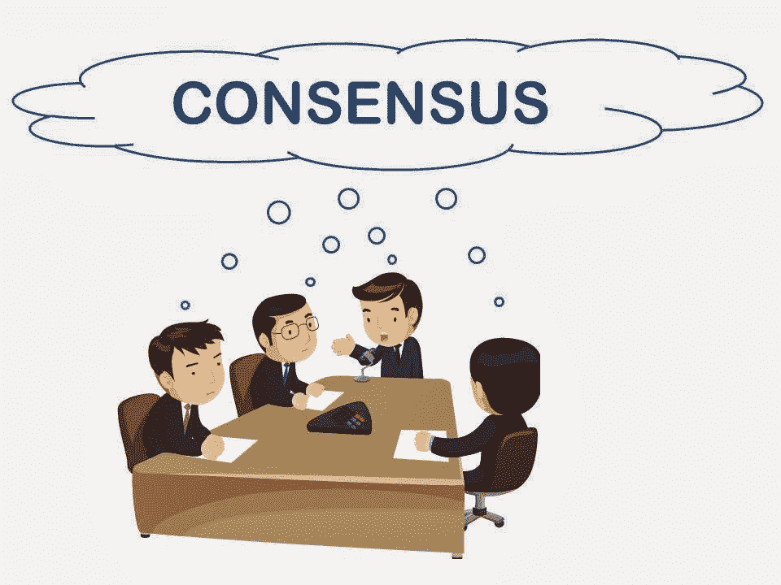

# 关于区块链的共识

> 原文：<https://medium.com/coinmonks/consensus-on-the-blockchain-39f8ae35cfc0?source=collection_archive---------42----------------------->

工作证明，利害关系证明，权威证明。

区块链是一个分散的系统，没有中央权力机构，与通过银行和其他金融机构验证交易的银行系统不同，在区块链，交易必须经过一致同意才能生效。这是怎么发生的？。

共识仅仅意味着同意接受，这就是共识。所有集团都同意允许这一记录，因为根据区块链遵循的一种称为共识机制的特定核查或验证制度，这一记录是可以核查的。

有各种类型的共识机制，但我们今天将讨论三种；工作证明，利害关系证明，权限证明。

**工作证明:**

这种机制通过一个称为挖掘的过程来实现事务验证。挖掘过程涉及使用计算资源来解决复杂的数学问题，允许挖掘者验证交易。第一个解决这个问题的矿工会得到奖励。矿工通常会得到一些本地的奖励，比如 ETH，BTC 等等。如果它与其他块一致，那么该事务被链上的所有块注册。否则，该块被视为无效，并从链中排除。由于加密哈希，块很容易被检测到。下面简单解释一下。然而，整个系统背后有一个复杂的数学过程。

**利害关系证明(“把你的钱放到你该说的地方”):**

利害关系证明机制允许根据帐户提交给网络的利害关系数量随机选择帐户。换句话说，你的赌注越高，你被选中验证交易并将其添加到区块链的机会就越大。如果成功完成，验证者将获得奖励，如果发现任何可疑情况，所有赌注都将损失。这使得欺诈在利益相关证明制度上成为一种冒险行为。区块链像区块链一样使用这种机制。以太坊同样有望很快推出股权证明机制。

**权威证明:**

权威的证明类似于我们现有的。在这里，只有经批准的各方被选择来基于他们的信誉验证交易。换句话说，他们被赋予了权力。以太坊的 Kovan testnet 和 IBM 的 hyper ledger fabric 使用这种机制来达成共识。

大多数区块链使用单一的交易验证机制，然而，一些连锁店使用多个系统来验证交易。共识的各种模式使得欺诈难以通过验证过程发生。

感谢你的阅读，我希望你今天学到了更多关于区块链的知识。干杯！。

> 加入 Coinmonks [电报频道](https://t.me/coincodecap)和 [Youtube 频道](https://www.youtube.com/c/coinmonks/videos)了解加密交易和投资

# 另外，阅读

*   [Bookmap 点评](https://coincodecap.com/bookmap-review-2021-best-trading-software) | [美国 5 大最佳加密交易所](https://coincodecap.com/crypto-exchange-usa)
*   最佳加密[硬件钱包](/coinmonks/hardware-wallets-dfa1211730c6) | [Bitbns 评论](/coinmonks/bitbns-review-38256a07e161)
*   [新加坡十大最佳加密交易所](https://coincodecap.com/crypto-exchange-in-singapore) | [购买 AXS](https://coincodecap.com/buy-axs-token)
*   [红狗赌场评论](https://coincodecap.com/red-dog-casino-review) | [Swyftx 评论](https://coincodecap.com/swyftx-review) | [CoinGate 评论](https://coincodecap.com/coingate-review)
*   [投资印度的最佳密码](https://coincodecap.com/best-crypto-to-invest-in-india-in-2021)|[WazirX P2P](https://coincodecap.com/wazirx-p2p)|[Hi Dollar Review](https://coincodecap.com/hi-dollar-review)