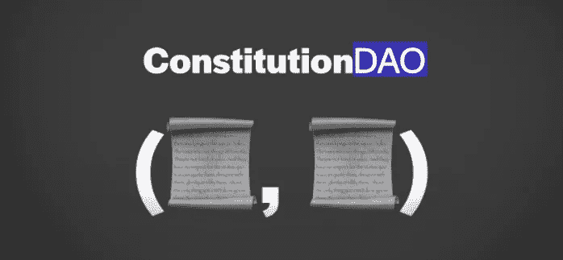
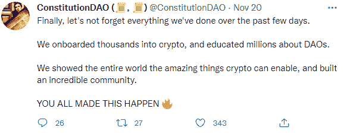
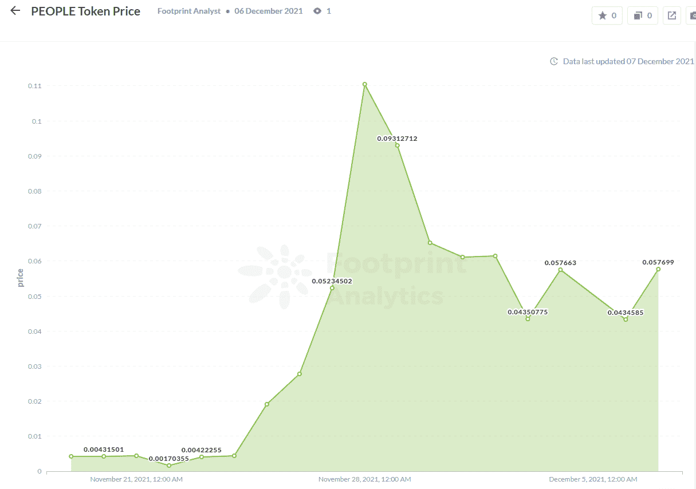

# ConstitutionDAO:震撼密码世界的失败项目

> 原文：<https://medium.com/coinmonks/constitutiondao-the-failed-project-that-shook-the-crypto-world-f3c74b45c8a7?source=collection_archive---------13----------------------->

“道”是一个真实的失败者的故事，它向世界展示了“道”这个以区块链为基地的社区的新形式在未来可以实现的目标。

对于那些不熟悉这个传奇的人来说，下面是发生的事情。

## **什么是宪法道？**

宪法道于 11 月 11 日由一群密码爱好者发起，试图通过宪法道筹集资金，购买美国宪法的第一个印刷版本，由苏富比拍卖。

这个版本是宪法的最后一个私人拥有的版本——总共只有 13 个版本——宪法道希望将它转移到社区所有权，而不是转移到一个孤独的富人手中。

截至 11 月 19 日，ConstitutionDAO 在 JuiceBox 上筹集了近 11，000 ETH，或略高于 4，500 万美元的社区资金，是预计售价 2，000 万美元的两倍多。

不幸的是，宪法道失去了拍卖城堡首席执行官肯·格里芬。

拍卖结束五天后，宪法岛陷入一片混乱。经过几次热烈的讨论，该组织的核心捐助者于 24 日宣布关闭 ConstitutionDAO，并将自动退还捐款。

$PEOPLE 作为 DAO 的治理令牌，实际上没有任何用处。然而，Footprint Analytics 的数据显示，其令牌价格经历了社区用户驱动的起伏。

[*足迹分析*](https://www.footprint.network/guest/chart/people-token-price-fp-9774ad9a-a473-4ee3-bf25-eadfa394af49?channel=u-DBc983) *:人物令牌价格*

这些项目总共吸引了 20，000 名投稿人。

## **什么是刀？**

DAO 是分散自治组织的缩写。一个道一般都有共识的共同目标和明确的核心价值观。其民主化的投票机制决定了该组织的方向和运作方式。

以下是 ConstitutionDAO 的道是如何定义的:

*   **组织形式** : ConstitutionDAO 在互联网上聚集了一群普通人。他们通过 Discord，Twitter 和其他互联网社区进行交流，并通过他们的效率几乎实现了一个令人难以置信的崇高目标。
*   **组织共识**:把宪法还给人民。这群加密货币爱好者选择道作为尊重和保护宪法精神的最佳方式，认为所有人都应该分享它。
*   **组织权利分配:**将权利返还给社区成员。如果宪法道获得成功，道的成员可以投票决定是否将这部珍贵的宪法公开展示，将它“交到人民手中”如果竞标失败，社区成员可以讨论资金的去向。

这些是 Dao 区别于传统组织形式的一些关键点。

DAO 最显著的优点是它的全局、无权限特性。它通过区块链技术解决了人与人之间的信任问题。协议的每一行都严格遵守原代码，不可修改。

## **宪法如何震撼区块链世界**

随着区块链技术的快速发展和去中心化应用的日益丰富，DAOs 将会发展得非常快。他们将变得越来越重要，承担越来越多的责任。

从宪法道的兴衰中，我们欣喜地看到道走到了前台，越来越多的人接触和了解道，这将是一个标志性的事件！

> 加入 Coinmonks [电报频道](https://t.me/coincodecap)和 [Youtube 频道](https://www.youtube.com/c/coinmonks/videos)了解加密交易和投资

## 也阅读

 [## 杠杆代币[多头代币]终极指南

### 杠杆化令牌是具有杠杆化风险敞口的 ERC20 令牌，不考虑保证金、要求、管理…

medium.com](/coinmonks/leveraged-token-3f5257808b22)  [## 最佳加密交易所| 2021 年十大加密货币交易所

### 编辑描述

blog.coincodecap.com](https://blog.coincodecap.com/crypto-exchange)  [## 2021 年最佳加密交换平台| CoinCodeCap

### 编辑描述

blog.coincodecap.com](https://blog.coincodecap.com/best-swap-platforms)  [## 10 大最佳在线赌场|赢得并赢取免费 BTC 2022 | CoinCodeCap

### 编辑描述

blog.coincodecap.com](https://blog.coincodecap.com/best-online-casinos)  [## 2021 年最佳加密借贷平台| 6 大比特币借贷平台

### 获得比特币和其他加密货币的最佳贷款利率

medium.com](/coinmonks/top-5-crypto-lending-platforms-in-2020-that-you-need-to-know-a1b675cec3fa)  [## 2021 年 6 大最佳硬件钱包|顶级加密硬件钱包[更新]

### 最好的加密货币硬件钱包是绝对必要的。我们将在 NGRAVE、Ledger Nano X 和…

medium.com](/coinmonks/the-best-cryptocurrency-hardware-wallets-of-2020-e28b1c124069)  [## 2021 年最佳免费加密交易机器人

### 2021 年币安、比特币基地、库币和其他密码交易所的最佳密码交易机器人。四进制，位间隙…

medium.com](/coinmonks/crypto-trading-bot-c2ffce8acb2a)  [## 最佳 4 个加密交易信号电报通道

### 这是乏味的找到正确的加密交易信号提供商。因此，在本文中，我们将讨论最好的…

medium.com](/coinmonks/best-crypto-signals-telegram-5785cdbc4b2b)