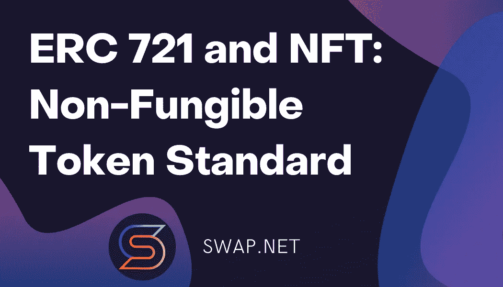

# 构造 ERC721 令牌协定

> 原文：<https://medium.com/coinmonks/constructing-an-erc721-token-contract-b27f9fb02876?source=collection_archive---------20----------------------->

## 关于使用 ERC0 的可替换标记，我们已经讲了很多，但是为什么不标记一些不寻常的东西呢？房地产或收藏品，其中一些项目因其有用性、稀有性等而比其他项目更有价值。ERC721 是代表不可替换令牌所有权的标准，其中每个令牌都是唯一的。

ERC721 是一个比 ERC20 更复杂的标准，具有多个可选扩展，并被划分为多个合同。首先来看看 [**ERC 721、EIP-721 和 NFT:不可替代令牌标准**](/@NFTSwapnet/erc-721-eip-721-and-nft-non-fungible-token-standard-6a083be6f3d4) **。**

# 构造 ERC721 令牌协定

举个例子，用 ERC721 来追踪游戏中的物品，每个物品都有自己独特的属性。当其中的一个给了玩家，它将被铸造并发送给他们。玩家可以保留他们的代币，或者按照他们认为合适的方式与他人交换，就像区块链上的任何其他资产一样。

我们以 OpenZeppelin 为例。以下是令牌化项目的合同可能的样子:

> **务实稳健的^0.5.0；**
> 
> **导入“@ open zeppelin/contracts/token/ERC 721/ERC 721 full . sol”；导入“@ open zeppelin/contracts/drafts/counters . sol”；**
> 
> **契约 GameItem 为 ERC721Full {
> 使用计数器为计数器。柜台；
> 计数器。Counter private _ tokenIds**
> 
> **constructor()ERC 721 full(" game item "，" ITM") public {
> }**
> 
> **函数 awardItem(地址播放器，字符串内存 token uri)public returns(uint 256){
> _ token ids . increment()；**
> 
> **uint 256 new itemid = _ token ids . current()；
> _mint(球员，new itemid)；
> _setTokenURI(newItemId，token uri)；**
> 
> **返回 newItemId
> }
> }**

ERC721Full 合同包括所有标准扩展，可能就是您想要使用的那个。特别是，它包含了 **ERC721 元数据**，它提供了 **_setTokenURI** 方法，我们用它来存储一个项目的元数据。

还要注意的是，与 ERC20 不同，ERC721 缺少一个**小数**字段，因为每个令牌都是不同的，不能被分割。

可以创建新项目:

> > game item . awarditem(player address，"[https://game.example/item-id-8u5h2m.json](https://game.example/item-id-8u5h2m.json)"
> 7)

以及每个被查询项目的所有者和元数据:

> > game item . ownerof(7)
> player address
> >game item . token uri(7)
> "【https://game.example/item-id-8u5h2m.json】T42

这个 **tokenURI** 应该解析成一个 JSON 文档，看起来可能类似于:

> {
> 《姓名》:“雷神之锤”，
> 《描述》:“mjlnir，北欧雷神传说中的锤子。”、
> 【形象】:[https://game.example/item-id-8u5h2m.png](https://game.example/item-id-8u5h2m.png)、
> 【实力】:20
> }

关于 **tokenURI** 元数据 JSON Schema，查看 [**ERC 721、EIP-721 和 NFT:不可替换令牌标准**](/@NFTSwapnet/erc-721-eip-721-and-nft-non-fungible-token-standard-6a083be6f3d4) **。**

# 参考资料:

1.  [ERC-20](https://eips.ethereum.org/EIPS/eip-20) 令牌标准。
2.  [ERC-165](https://eips.ethereum.org/EIPS/eip-165) 标准接口检测。
3.  【https://docs.openzeppelin.com/contracts/2.x/erc721】
4.  [ERC-173](https://eips.ethereum.org/EIPS/eip-173) 拥有标准。
5.  [ERC-223](https://github.com/ethereum/EIPs/issues/223) 令牌标准。
6.  [ERC-677](https://github.com/ethereum/EIPs/issues/677) 令牌标准。
7.  [ERC-827](https://github.com/ethereum/EIPs/issues/827) 令牌标准。
8.  以太坊名称服务(ENS)。 [https://ens.domains](https://ens.domains/)
9.  insta gram——图像分辨率是多少？[https://help.instagram.com/1631821640426723](https://help.instagram.com/1631821640426723)
10.  JSON 模式。[https://json-schema.org/](https://json-schema.org/)
11.  多地址。[https://github.com/multiformats/multiaddr](https://github.com/multiformats/multiaddr)
12.  RFC 2119 在 RFC 中用于表示要求级别的关键词。[https://www.ietf.org/rfc/rfc2119.txt](https://www.ietf.org/rfc/rfc2119.txt)
13.  [威廉·恩特里肯](https://github.com/fulldecent)、[迪特·雪莉](mailto:dete@axiomzen.co)、[雅各布·伊文思](mailto:jacob@dekz.net)、[纳斯塔西亚·萨克斯](mailto:nastassia.sachs@protonmail.com)、【EIP-721:不可替代令牌标准】、*以太坊改进提案*，第 721 期，2018 年 1 月。【网上连载】。可用:[https://eips.ethereum.org/EIPS/eip-721.](https://eips.ethereum.org/EIPS/eip-721.)

# 交换。网队
官网—[https://swap.net/](https://swap.net/)
推特—[https://twitter.com/NFTSwapnet](https://twitter.com/NFTSwapnet)
不和—[https://t.co/uzz0Qt12tf](https://t.co/uzz0Qt12tf)
中—[https://medium.com/@NFTSwapnet](/@NFTSwapnet)
Docs&白皮书—[http://docs.swap.net](https://t.co/5qc7Mxt2p5)

> 加入 Coinmonks [电报频道](https://t.me/coincodecap)和 [Youtube 频道](https://www.youtube.com/c/coinmonks/videos)了解加密交易和投资

# 另外，阅读

*   [加拿大最佳加密交易机器人](https://coincodecap.com/5-best-crypto-trading-bots-in-canada) | [库币评论](https://coincodecap.com/kucoin-review)
*   [用于 Huobi 的加密交易信号](https://coincodecap.com/huobi-crypto-trading-signals) | [HitBTC 审查](/coinmonks/hitbtc-review-c5143c5d53c2)
*   [如何在 FTX 交易所交易期货](https://coincodecap.com/ftx-futures-trading) | [OKEx vs 币安](https://coincodecap.com/okex-vs-binance)
*   [OKEx vs KuCoin](https://coincodecap.com/okex-kucoin) | [摄氏替代品](https://coincodecap.com/celsius-alternatives) | [如何购买 VeChain](https://coincodecap.com/buy-vechain)
*   [ProfitFarmers 回顾](https://coincodecap.com/profitfarmers-review) | [如何使用 Cornix 交易机器人](https://coincodecap.com/cornix-trading-bot)