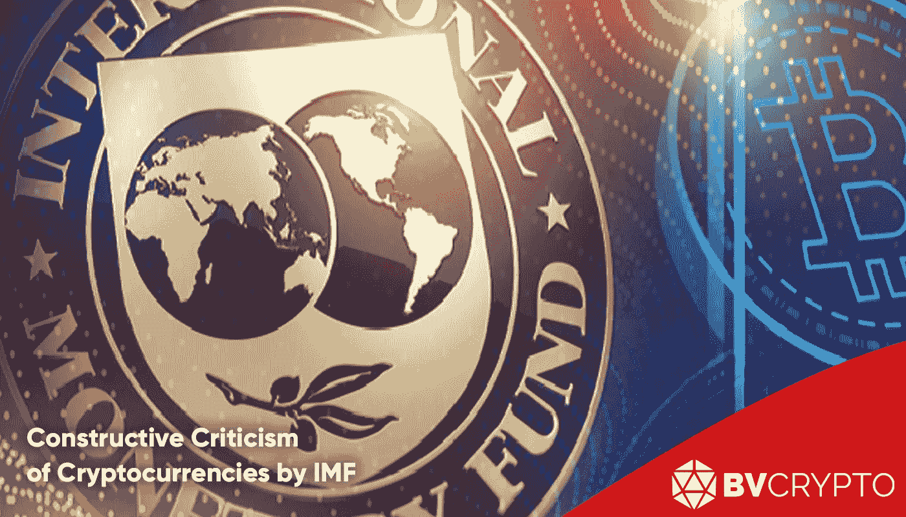
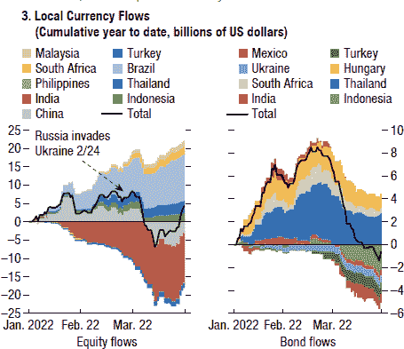
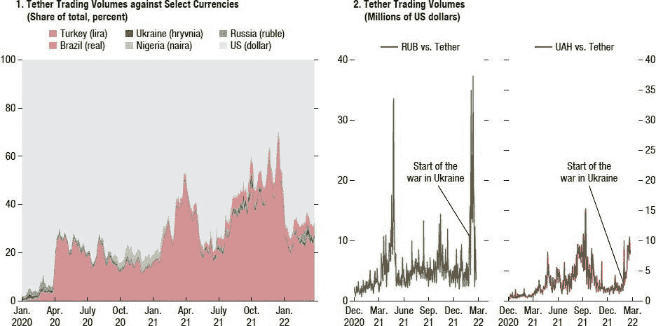
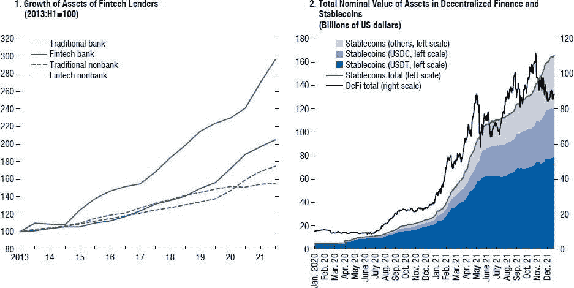
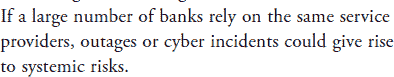
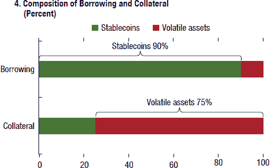
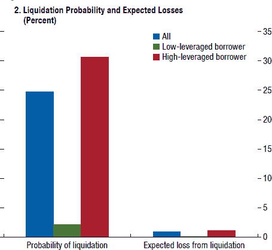
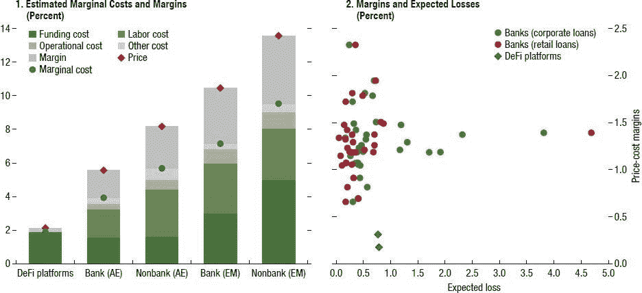

# IMF 对加密货币的建设性批评

> 原文：<https://medium.com/coinmonks/constructive-criticism-of-cryptocurrencies-by-imf-e5ac03294007?source=collection_archive---------17----------------------->

IMF 每年定期发布的 2022 期《全球金融稳定报告(GFSR)》在解读全球经济形势的同时，以单独一节涵盖了加密货币领域。该报告解决了从 IMF 的“加密”(开始倾向于加密货币而不是国家货币)风险到 CBDCs，从监管到 DeFi 平台等一系列问题。可以说，国际货币基金组织总体上对加密货币表达了一种创新和积极的观点，其对市场的最大保留是在监管方面遇到的问题。

在本文中，在简要介绍了国际货币基金组织对全球经济的观点后，我们将重点关注报告中讨论加密货币的章节，并研究国际货币基金组织在字里行间明确陈述和分享的技巧、观点和评论。我们祝你阅读愉快。

# 战争的赢家和输家

在讨论加密货币之前，简要回顾一下国际货币基金组织对全球经济的评论将加强加密货币部分观点的基础。国际货币基金组织指出，在战前由于冠状病毒而使货币扩张政策达到高级阶段后，各国央行即将进入正常化时期，但战争减缓了这一过渡进程。中央银行，不想处理货币扩张造成的通货膨胀怪物，尽管战争，继续他们的正常化政策。据观察，发达经济体的货币在这一时期尤其走强。战争抬高了商品价格，威胁了能源安全，并使发达经济体的货币升值，这直接对新兴经济体产生了负面影响。

上面的图表显示了战后新兴经济体损失了多少资本。左边的图表显示，印度、中国和土耳其在权益方面经历了最大的损失，而右边的图表强调了墨西哥、土耳其和

印度尼西亚经历了债券方面的最大损失。另一方面，巴西在这一时期的赢家中领先。由于对俄罗斯实施制裁，商品价格上涨，导致流入巴西的现金增加，巴西出口这一领域的商品。然而，总体而言，可以说投资者一直在从新兴经济体撤资，转向他们认为安全的发达经济体。这导致新兴经济体更加强烈地感受到了全球普遍存在的通胀趋势。人们购买力的下降大大增加了对加密货币等替代市场的兴趣。

在这两张由国际货币基金组织(IMF)根据 USDT(Tether)数据生成的图表中，左图显示了各国使用 USDT 的增加，右图则显示了俄乌两国的相同变化。虽然土耳其(在左图中显示为粉红色)在 USDT 交易量的增长中遥遥领先，但可以说巴西的增长也很显著。左图暂时没有下降到 20%以下的事实表明，目前对 USDT 的使用可以成为永久性的，这支持了被 IMF 视为加密的情况。考虑右边的图表，不能说是稳定的过程，尽管由于战争的原因，USDT 在乌克兰和俄国的使用在某些时期有显著增加。

# 对决策者的建议

国际货币基金组织提出了战后政策制定者应特别注意的三大主题。

1-能源安全战略对全球气候的负面影响

在这一部分中，可以认为国际货币基金组织估计，由于对俄罗斯的制裁，特别是欧洲国家和那些依赖从俄罗斯进口能源的国家将放弃“零碳排放”和“停止使用化石燃料”等战略。因此，包括化石燃料在内的能源领域的国际合作也可以增加。

在这一时期，可以预计政治家对比特币开采的批评将会增加，以减少因搁置环境政策而可能出现的公众反应。

2-全球市场的脆弱性增加及其对美元的影响

可以说，本节提到的主要问题是全球分裂，这种分裂始于俄罗斯中央银行对美元和欧元储备的封锁。国际货币基金组织指出，大多数国家没有关于加密货币的法规，并且它直接针对加密货币矿商，这一事实也支持这种分裂。由于一些国家甚至不收集“了解你的客户”(KYC)数据，并且很难使用 mixers 等机制来跟踪加密货币，因此据称这些国家既摆脱了制裁，又通过采矿获得了额外的加密货币收入。例如，2021 年，BTC 矿工每月收入 12 亿美元，其中 11%是俄罗斯矿工，3%是伊朗矿工。除了国际货币基金组织的这个例子之外，应该指出，伊朗政府直接购买该国矿工开采的 BTC，并在贸易中使用。总之，IMF 建议政策制定者关注加密货币矿商。

3-支付系统的脆弱性增加

这一过程始于禁止俄罗斯公民在俄罗斯境外使用 Mastercard 和 Visa 卡，应结合上一节提到的冻结俄罗斯中央银行储备的问题进行审查。

国际货币基金组织表示，对美元和支付系统的信心丧失导致了对替代系统的兴趣。有人强调，在目前的系统中，除了 SWIFT 之外，几乎没有其他选择，甚至中国自己的汇款系统 CIPS 也部分依赖 SWIFT。因此，有人指出，各国央行正在全球范围内竞相开发自己的数字货币(CBDC)。国际货币基金组织指出，CBDC 的发展可以降低加密的风险。也就是说，如果央行通过 CBDCs 提供加密货币所提供的效率和廉价，那么人们至少不会使用加密货币进行货币转移。另一方面，国际货币基金组织认为很难建立一个共同的系统，因为每个中央银行将开发一个单独的 CBDC 系统。事实上，我们必须承认 IMF 是正确的，因为每个央行都使用不同的系统和不同的区块链网络。因此，国际货币基金组织警告政策制定者，由于 CBDCs 或 SWIFT 的替代系统，未来支付系统可能会出现碎片化。

从第二期和第三期可以看出，IMF 认为基于加密货币的系统会对全球经济产生严重影响。考虑到文章第一部分的图表，可以说，特别是新兴经济体的人们已经开始适应这种转变。

(你也可以回顾一下我们之前的一篇文章，题为'[乌克兰战争对比特币地位和全球经济的可能影响](/coinmonks/possible-implications-of-the-ukrainian-war-on-the-status-of-bitcoin-and-the-global-economy-3b373443ab9a)'对战后可能出现的新经济模式的影响。)

# 金融科技

该报告的很大一部分致力于创新的金融解决方案，即金融科技行业。IMF 对 fintech 的担忧是，这些提供银行服务的公司可以通过某种方式摆脱严格的监管，并承担高风险，因为它们没有银行身份。在国际货币基金组织看来，金融科技行业承受的可控风险似乎已经变得危险，因为全球经济经历了连续的冲击，这既归因于 Covid 疫情，也归因于战争。因此，国际货币基金组织建议关注金融科技领域的风险偏好，并在不干预创新的同时引入更严格的监管，该组织还在这一部分提到了分散金融(DeFi)平台。当谈到监管问题和创新金融时，人们可能会想到 DeFi 平台。然而，与普遍的看法相反，考虑到图表，观察到国际货币基金组织对 DeFi 有相当积极的分析和预期。

在左侧的图表中，国际货币基金组织将金融科技行业分为有银行地位和无银行地位的公司，并通过与传统经济进行比较来显示行业增长。根据这张图表，自 2013 年以来，具有银行地位的金融科技公司的增长率翻了一番，而传统银行的增长率接近 80%。引人注目的一点是，自 2013 年以来，没有银行身份的金融科技公司增长了三倍，将其他行业甩在身后。该行业的快速增长可以被视为国际货币基金组织在报告中表示担忧的原因，该行业的监管相对宽松。DeFi platforms 也是没有银行身份的金融科技公司之一。考虑到顶部的绿色曲线，可以估计 2021 年后大幅上涨的最大份额属于 DeFi 平台。

右边的图表显示，stablecoins 的总市值已达到约 1600 亿美元，其中 850 亿美元来自 DeFi 平台。国际货币基金组织为 DeFi 平台制定了一个积极的路线图，并表示过去两年观察到的快速增长可以持续，由于 DeFi 平台与传统经济中的参与者合作，该行业的潜力很大。MakerDAO 和 Aave 作为其与加密货币市场以外的公司交易的结果而提供的贷款可以作为国际货币基金组织指出的合作的一个例子。

# 权力下放僵局

该报告包括一个单独的部分，内容是银行在与金融科技公司竞争时面临的风险。本标题下关于银行将如何与金融科技公司保持同步的部分非常重要，因为它含蓄地强调了去中心化。IMF 表示，银行通常会通过收购金融科技公司来遵循将技术发展融入其系统的方法，并注意到这一阶段带来的风险。国际货币基金组织最大的担心是，银行在这个过程的最后使用一个共同的服务提供商，这带来了一种新的技术适应。国际货币基金组织表示，在这种情况下，对共同机制的网络攻击或停电可能会造成巨大损失，并建议采取某种形式的权力下放。

根据国际货币基金组织的上述意见，一旦就如何准确监管分散化平台达成共识，国际货币基金组织似乎有可能首先接受分散化。

# 强调不平衡

虽然国际货币基金组织在报告中指出 DeFi 平台是要考虑的风险因素之一，但它也包括了各种重要的积极评论。下图很重要，因为它显示了国际货币基金组织对 DeFi 平台不平衡的重视。虽然报告中没有明确提到不平衡，但可以估计生成此图表的目的就是为了这个。

上图显示，在 DeFi 平台上接受贷款时，75%的抵押品使用加密货币，90%的贷款需要稳定的加密货币。考虑到创建这些平台的目的，这种不平衡是很正常的。因为平台的最初目的是满足用户的现金需求，而不是出售他们的加密货币投资。比率表明，考虑到这一目的，平台是成功的。然而，这些比率也表明 DeFi 平台具有单向操作。众所周知，当市场上涨时，大多数投资者通过在其余额中抵押加密货币来获得稳定的贷款。他们通过使用收到的贷款再次购买加密货币来增加投资金额。也可以通过再次抵押购买的加密货币来重复这个循环。然而，这只有在市场上涨时才有利可图。因此，上述比率表明，当市场下跌时，DeFi 平台的贷款机制并不十分有效。换句话说，如果投资者抵押他们的稳定货币以获得加密货币贷款，并寻求在下行市场中获利，通过出售他们在市场下跌时购买的加密货币来获得更多稳定货币，上述比率可能会达到更平衡的状态。

国际货币基金组织在其批评的风险中指出的上图，在展示 DeFi 平台的潜力方面也很重要。如果在市场上涨或下跌的情况下继续放贷，平台可以拥有更有利可图和可持续的商业模式。

# 国际货币基金组织促进债务减免倡议

在该部分中，DeFi 平台与金融科技领域的其他细分市场在各个领域进行了比较，这是建立 DeFi 平台或投资于该平台的一个激励因素。这个案例，我们将在下面的三个单独的图表中进行研究，清楚地揭示了新的 DeFi 平台在金融科技领域的优势。

上图考察了如果不能还清 DeFi 平台提供的贷款，将会产生的损失金额。左边三个条柱中的红色条柱指的是高风险贷款，即贷款的抵押品刚好高于所需抵押品金额的贷款。绿条指的是给定担保品很容易支付贷款的贷款。因此，低抵押品(红色)的贷款极有可能被清算。蓝条表示总清算风险，代表高值。

考虑到右边的三个栏，值得注意的是，即使高风险贷款没有还清，将要遇到的损失也是微乎其微的。这是因为银行或类似银行的金融科技公司可以在没有抵押品的情况下放贷。由于 DeFi 平台使用抵押机制，它最大限度地减少了贷款造成的损失，如果贷款没有还清，平台可以轻松地继续其活动。现在，让我们继续下面的图表，记住这些信息。

在左边的图表中，国际货币基金组织比较了有无银行身份的 DeFi 平台和金融公司的成本。在图表中，括号中代码为 AE 的公司代表发达经济体的公司，代码为 EM 的公司代表新兴经济体的公司。

乍一看图表，可以看出 DeFi 平台的总成本最低。劳动力成本、运营成本和其他成本在其他公司中是重要的成本项目，但在 DeFi 平台中却不是，这一事实导致了这种差异。换句话说，没有物理分支机构和成百上千的员工是最大的优势之一。“融资成本”是一个常见的成本项目。在平台上提供流动性后，DeFi 平台似乎会自动运行并超越银行和其他金融科技公司。

右边的图表实际上检查了信用风险，我们已经使用前面的图表通过比较 DeFi 平台与有和没有银行身份的公司检查了信用风险。图表中的蓝点代表 DeFi 平台的信用风险。考虑到蓝点，可以看出，如果贷款没有还清，DeFi 平台的预期损失略高于一般银行。但是，这里要考虑的主要一点是，银行在给予贷款的同时所承担的成本项目要远远高于 DeFi 平台。因此，底部的蓝点显示，DeFi 平台是成本最低的贷款系统，无法偿还的风险比银行高 0.3%-0.5%之间的一个相当小的百分比。

总之，很明显，对于一个希望以最低成本建立金融科技公司的企业家来说，最合理的行动是建立一个 DeFi 平台。

— — — — — — — — — — — — —

尽管国际货币基金组织在与阿根廷的协议中采取了反对加密货币的态度，并不断提醒人们注意加密的风险，但它显示出对 DeFi 的积极预期，这对该部门非常积极。此外，尽管报告中没有直接说明，但人们承认加密货币创造了一个更加有效的金融基础设施，并强调了为什么分散化的系统是有价值的，这在表明 IMF 一直在接近加密货币的原则方面是无价的。

## 编制人:Berkay Aybey

此处表达的观点和意见属于 BV Crypto。BV Crypto 不对基于本条款的任何金融交易负责。由于每一项投资和交易行为都包含风险，我们建议您在做出此类决定时进行自己的研究。

> 加入 Coinmonks [电报频道](https://t.me/coincodecap)和 [Youtube 频道](https://www.youtube.com/c/coinmonks/videos)了解加密交易和投资

# 另外，阅读

*   [OKEx vs KuCoin](https://coincodecap.com/okex-kucoin) | [摄氏替代品](https://coincodecap.com/celsius-alternatives) | [如何购买 VeChain](https://coincodecap.com/buy-vechain)
*   [币安期货交易](https://coincodecap.com/binance-futures-trading)|[3 comas vs Mudrex vs eToro](https://coincodecap.com/mudrex-3commas-etoro)
*   [如何购买 Monero](https://coincodecap.com/buy-monero) | [IDEX 评论](https://coincodecap.com/idex-review) | [BitKan 交易机器人](https://coincodecap.com/bitkan-trading-bot)
*   [CoinDCX 评论](/coinmonks/coindcx-review-8444db3621a2) | [加密保证金交易交易所](https://coincodecap.com/crypto-margin-trading-exchanges)
*   [红狗赌场评论](https://coincodecap.com/red-dog-casino-review) | [Swyftx 评论](https://coincodecap.com/swyftx-review) | [CoinGate 评论](https://coincodecap.com/coingate-review)