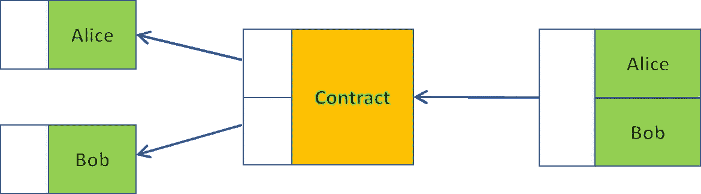
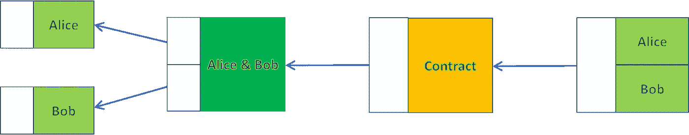
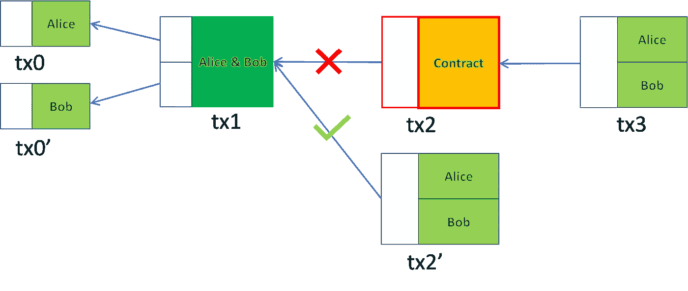
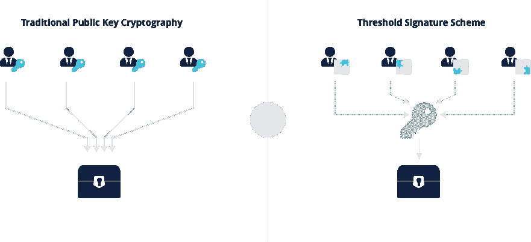

# 无合同合同

> 原文：<https://medium.com/coinmonks/contractless-contract-cb9b60e9bb91?source=collection_archive---------9----------------------->

## 隐藏任何智能合同在一个定期付款机会

我们发明了一种叫做 ***无合同契约*** 的技术，在常规支付( [P2PKH](https://wiki.bitcoinsv.io/index.php/Bitcoin_Transactions#Pay_to_Public_Key_Hash_.28P2PKH.29) )交易中忠实地执行任何智能契约。当各方合作时，它极大地提高了任意多方智能合同的隐私和效率。

# 无合同合同

我们举例说明了无合同契约在双方之间是如何运作的。它可以很容易地扩展到多方。在有两个当事人的典型合同中，工作流程如下:

Figure 1: Contract Workflow: Before

爱丽丝和鲍勃各自在合同中存入了钱。在契约执行之后，它根据契约的逻辑将输出拆分给 Alice 和 Bob。该执行可以由例如散列前像、签名或由先知签名的体育比赛结果的发布来触发。

我们修改工作流程如下:

Figure 2: Contract Workflow: After

我们不是直接存进合同，而是先存进一个联名地址，双方签字才能解锁。之后，共同基金被锁定在合同中。

乍一看，这个额外的步骤似乎是多余的，只会增加复杂性。**关键思想是合同事务( *tx2* )不被 Alice 和 Bob 广播和离线持有。这份合同是秘密执行的。如果 Alice 和 Bob 对结果达成一致，他们都可以签署新的交易 tx2’并花费 tx1。**

Figure 3: Contract Workflow: Cooperative Signing

这和广播 *tx2* 和 *tx3* 的效果是一样的，就爱丽丝和鲍勃收到多少比特币而言，但是有两个好处。

*   *隐私*:所有交易( *tx1* 和*tx2’*)看起来和普通支付(P2PKH)交易一样。外部当事人甚至不知道有一个隐藏的潜在合同。
*   效率:不管合同有多复杂和多大，区块链上只有两笔支付交易，节省了大量矿工费用。

## 不合作案件

当任何一方不配合且拒绝签署*tx2’*时，另一方随时可以广播预签 *tx2* 并在 *tx3* 终止合同。追索权选项激励所有各方进行合作。

# 阈值签名

在 *tx1* 中，我们使用一个 2 选 2 [门限签名方案](https://wiki.bitcoinsv.io/index.php/Digital_signatures_in_Bitcoin) (TSS):

*   生成联合公钥
*   为了解锁，爱丽丝和鲍勃都必须分别签名。组合两个签名的联合签名对于联合公钥是有效的。

从外面看，联合公钥和签名看起来与常规公钥和签名一样。令人惊奇的是，签名时联合公钥对应的私钥不必存在，避免了单点故障。

Figure 4: Threshold Signature Scheme (Source: [nakasendo SDK](https://nakasendoproject.org/))

详细解释 TSS 如何在 ECDSA 上工作超出了本文的范围。感兴趣的读者可以阅读 nChain 的白皮书和 T2 的白皮书。TSS 已经在[这里](https://youtu.be/mOLiwmudaws)进行了演示，并被广泛用于生产钱包，如[手动现金](https://handcash.medium.com/handcash-goes-keyless-b86d27339254)和[伏特](https://volt.id/)。

# 中本聪签署协议

遵循图 2 中的工作流程的一种简单方法是，Alice 和 Bob 依次签署并广播 tx0/tx0’、tx1 和 tx2。然而，有几个问题。在 Bob 获得 Alice 的部分签名的 tx1 后，他可以

*   将资金重定向到另一个合同
*   或者签了播 tx1，后来拒绝签。爱丽丝的基金卡住了。

为了克服这些问题，我们受中本聪的启发，分两步建立了合同[，我们称之为中本聪签署协议。](https://www.bitcoin.com/satoshi-archive/emails/mike-hearn/15/)

1.  爱丽丝和鲍勃交换 *tx0* 和*tx0’*的 **txid** ，这足以创建和签名 *tx1* 和 *tx2* 。但是它们还没有彼此共享原始事务 *tx0* 和*tx0’*，并且使它们保持离线。
2.  Alice 检查 *tx1* 和 *tx2* 是否都已签名，并且它们的输出包含预期的联合地址和合同。如果是，她广播 *tx0* 。如果没有，她会中止。鲍勃做同样的事情。

由于 *tx1* 需要 *tx0* 和*tx0’*都有效，合同只有在双方都不放弃的情况下才能继续。

# 与合作合同相比

无合同合同类似于我们介绍过的[合作合同](https://xiaohuiliu.medium.com/cooperative-smart-contracts-730c7186fc6c)，当各方就最终产出达成一致时，采取一种捷径。它比后者更私密、更高效:

*   在后者中，整个智能合同总是暴露在链上，而在前者中，如果各方合作，则不会暴露。
*   后者在各方合作签名时，解锁交易中需要所有签名，而前者只需要一个签名。

[1]存款和分割金额都可以为零，这意味着只有一方存款和赎回。

[2]与许多人的想法相反，将多个签名聚合成一个签名并不需要 Schnorr 签名。

> 加入 Coinmonks [电报频道](https://t.me/coincodecap)和 [Youtube 频道](https://www.youtube.com/c/coinmonks/videos)了解加密交易和投资

# 另外，阅读

*   [用于 Huobi 的加密交易信号](https://coincodecap.com/huobi-crypto-trading-signals) | [HitBTC 审核](/coinmonks/hitbtc-review-c5143c5d53c2)
*   [如何在 FTX 交易所交易期货](https://coincodecap.com/ftx-futures-trading) | [OKEx vs 币安](https://coincodecap.com/okex-vs-binance)
*   [OKEx vs KuCoin](https://coincodecap.com/okex-kucoin) | [摄氏替代品](https://coincodecap.com/celsius-alternatives) | [如何购买 VeChain](https://coincodecap.com/buy-vechain)
*   [ProfitFarmers 点评](https://coincodecap.com/profitfarmers-review) | [如何使用 Cornix 交易机器人](https://coincodecap.com/cornix-trading-bot)
*   [如何匿名购买比特币](https://coincodecap.com/buy-bitcoin-anonymously) | [比特币现金钱包](https://coincodecap.com/bitcoin-cash-wallets)