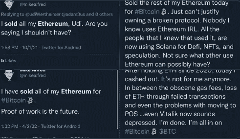
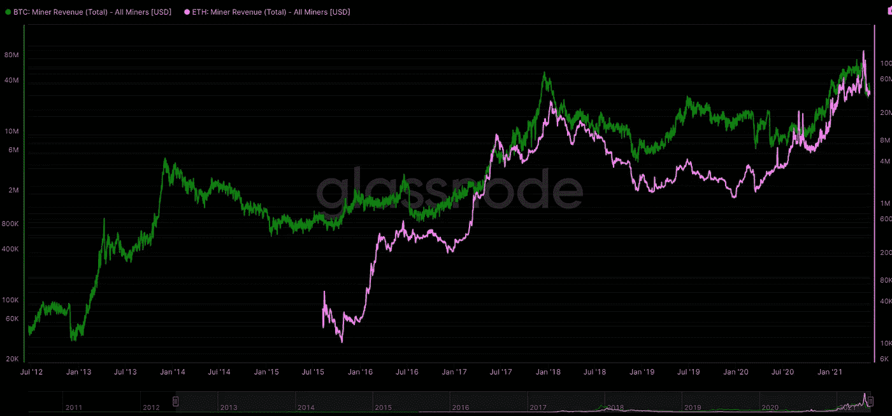

# 方便的故事讲述

> 原文：<https://medium.com/coinmonks/convenient-story-telling-61d5dc923727?source=collection_archive---------20----------------------->

@mikealfred selling all his ETH on multiple occasions

## 托默·施特略莱特的以太坊类比史

去年[的托默·斯特莱特](https://medium.com/u/aa2000c29284?source=post_page-----61d5dc923727--------------------------------)发表了一篇文章，标题是“[以太坊的问题](https://tomerstrolight.medium.com/the-problem-with-ethereum-af9692f4af95)”，受到了比特币爱好者的欢迎通过类比，Tomer 将一个阶级系统比作以太坊社区。他把 2014 年 ETH 的预售购买者贴上“富裕阶层”的标签，把核心开发商(包括 Vitalik)贴上“统治阶层”的标签。通过将以太坊定性为一个阶级体系，托默可以很方便地讲述一个“工人阶级”(矿工)受压迫的故事。

在讲述这个故事时，Tomer 正确地识别了工作证明(PoW)的对齐问题。矿业公司有间接成本，因此它们是任何电力系统的结构性卖家。根据定义，他们的动机主要是利润，而不是别的。从某种意义上说，在 PoW 系统中，社区(用户/持有者/开发者)和矿工是不同的团队。

重要的是，托默不能直接向读者展示他的案例，因为现实与他的叙述不符。当记者或历史学家叙述事件时，他们不需要通过故事或类比来复述事实。只有那些迎合观众的江湖骗子——告诉他们他们想听的——才不得不编造事实来迎合他们的叙述。

但托默的复述实际上是比特币创造者对以太坊的一种常见框架，即“比特币旨在逃离的是同一个旧的金融体系。”虽然这个故事对于那些顽固的、无政府的、密码朋克比特币制造者来说是显而易见的，但它只是一个符合他信仰的小说。

首先，托默认为以太坊向股权证明(PoS)的转变是对矿工的攻击，这显然是荒谬的。以太坊的明确目标列举在[白皮书](https://ethereum.org/en/whitepaper/)中。最值得注意的是，本文定义了以太坊的核心原则“敏捷性”，如下所示:

> ***敏捷*** *:* ***以太坊协议的细节并不是一成不变的*** *。虽然我们会非常明智地对高层结构进行修改，例如使用* [*分片路线图*](https://ethresear.ch/t/sharding-phase-1-spec/1407/) *，抽象执行，只有数据可用性体现在共识中。开发过程中稍后的计算测试可能会让我们发现，某些修改，例如对协议架构或以太坊虚拟机(EVM)的修改，将极大地提高可伸缩性或安全性。如果发现任何这样的机会，我们将加以利用。*

所以从一开始，就知道会有发展和变化。Vitalik 早在 2014 年就公开提出了利害关系证明的可行性。因此，相对于成为以太坊区块链的受害“工人阶级”,矿工们已经从战俘中获利超过 7 年。事实上，正在向 PoS 过渡的矿商可以说是最适合这种变化的。

就像之前的说法一样，Tomer 的大部分逻辑在第一次接触后就失效了。例如，托默的一个主要主张是以太坊统治阶级一贯武断地降低矿工的报酬。虽然 PoS 开发的延迟确实是导致这些减少的原因，但它们既不是无法预见的，也不是不合理的。事实上，同样的发展延误托默归类为“统治阶级”的无能和邪恶，实际上提供了矿工多年的采矿准备合并。

**也许最具讽刺意味的是，按照托默的逻辑，比特币每四年将区块奖励减半，是比特币“统治阶级”对矿工同样“残酷的攻击”**现实情况是，比特币和以太坊的集体奖励减少对矿工非常有利，如下图所示:

# 托梅尔的结论

托默在文章结尾恳求读者找出以下结论:

> *大家现在应该看到的是，* ***以太坊并不是一个去中心化的对等系统。这是一个不负责任的统治阶级剥削工人阶级的体系，做出他们无法兑现的承诺，同时编造一个精彩的故事***

Tomer 将协议的分散化与社会共识层(0 层或 L0 层)的分散化混为一谈，这在该领域的最大主义者中很常见。比特币 L0 缺乏组织被吹捧为比以太坊的 Vitalik Buterin 是以太坊的“国王”更好的去中心化。但是比特币的组织和个人实体比托莫愿意承认的要多得多。每个都对比特币有很大的影响:比特币核心开发者、Blockstream、Adam Back、Saylor 和 Dorsey 等等。

关于承诺，EIP-1559 出货时，许多人说它永远不会，和罗普斯滕测试网合并是一个重大的成功很让托马懊恼。下面这条草率的推文显示了托默对任何以太坊的妥协想法:

测试网合并发生在大约一小时后。从各方面来看，这是一个巨大的成功。

# 真正的“富裕阶层”

让我们打消比特币人认为矿工在比特币中没有权力的想法。人们只需看看[矿商不可或缺的区块规模辩论](https://en.bitcoin.it/wiki/Block_size_limit_controversy)。

比特币价值和矿工价值是根本对立的。与 Satoshi 题为“比特币:一个点对点**电子现金系统**的白皮书相反，像 Tomer 这样的最大主义者会让你相信比特币的真正目的是作为价值储存(SoV)。因此，作为一个主权财富基金，比特币持有者只把自己描述为持有者和购买者。与此同时，比特币矿工必须每天出售比特币，以支付电费和不断贬值的硬件。

个体采矿者所剩无几，因为受益于各级规模经济的采矿企业都把小规模作业挤出了市场。最糟糕的是，这些矿商是结构性卖家。 **他们利用比特币持有者和比特币需求在法币上获利。**

如果托默是这场争论的另一方，他可能会编造一些津巴布韦受害比特币者的故事:“津巴布韦的一个年轻人只想控制自己的命运，从津巴布韦中央银行疯狂的印钞中解脱出来。然而，邪恶的比特币矿工每天都对比特币施加巨大的抛售压力，并套现为美元。“我不会在这里讲这样的小说。

# 比特币股份证明 2023

有一个优雅的解决方案将很快变得不可被比特币制造者忽视:股权证明。PoS 解决了不一致的问题——持有者/用户和网络安全者之间的价值矛盾。

如果有人怀疑比特币创造者是否会考虑 PoS，那么想想如果瑞士联邦理工学院的市值超过 BTC，比特币将面临的生存危机。当零售商开始理解 PoS 中的现金流为正数时，考虑他们的情绪。

我去年写过这样一篇文章:“【2023 年计划的比特币分叉”

总之，重要的是要认识到，像 Tomer 这样的理论家主要是为了迎合他们的追随者，以支持他们的博客/书籍/公司/自我，他们的叙述会增加每个最大化主义者的多巴胺水平。然而，叙事的真正驱动力是价格行为，而不是相反。**你可以将比特币过度投机理论化，沉迷于纯粹不变性的感知高地，但当现金流不支持理论时，大多数市场参与者的善变情绪将永远倾向于利润，而不是意识形态。**

> 加入 Coinmonks [电报频道](https://t.me/coincodecap)和 [Youtube 频道](https://www.youtube.com/c/coinmonks/videos)了解加密交易和投资

# 另外，阅读

*   [南非的加密交易所](https://coincodecap.com/crypto-exchanges-in-south-africa) | [BitMEX 加密信号](https://coincodecap.com/bitmex-crypto-signals)
*   [如何在 WazirX 上购买柴犬(SHIB)币？](https://coincodecap.com/buy-shiba-wazirx)
*   [MoonXBT 副本交易](https://coincodecap.com/moonxbt-copy-trading) | [阿联酋的加密钱包](https://coincodecap.com/crypto-wallets-in-uae)
*   [MoonXBT vs Bybit vs 币安](https://coincodecap.com/bybit-binance-moonxbt) | [硬件钱包](/coinmonks/hardware-wallets-dfa1211730c6)
*   [雷米塔诺审查](https://coincodecap.com/remitano-review)|[1 英寸协议指南](https://coincodecap.com/1inch)
*   [十大最佳加密货币博客](https://coincodecap.com/best-cryptocurrency-blogs) | [YouHodler 评论](https://coincodecap.com/youhodler-review)