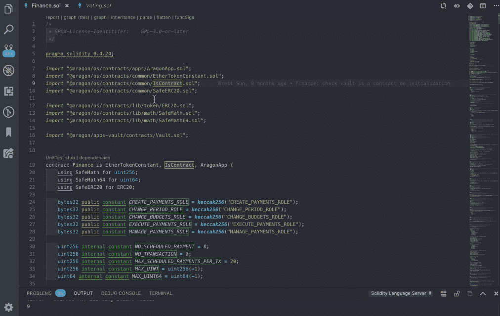
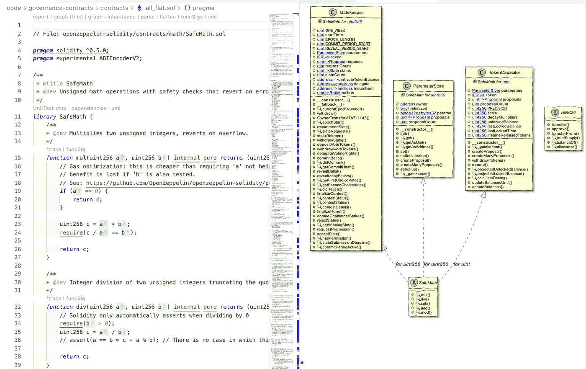
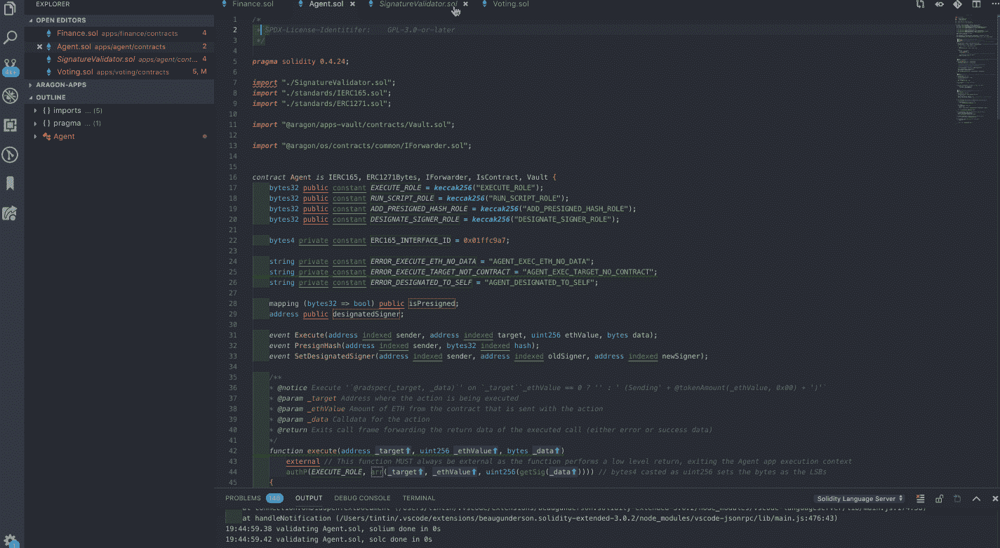
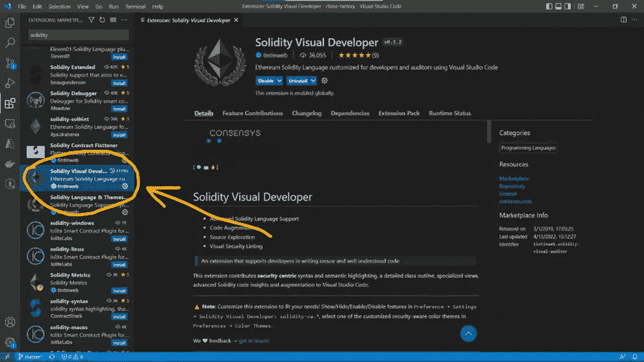
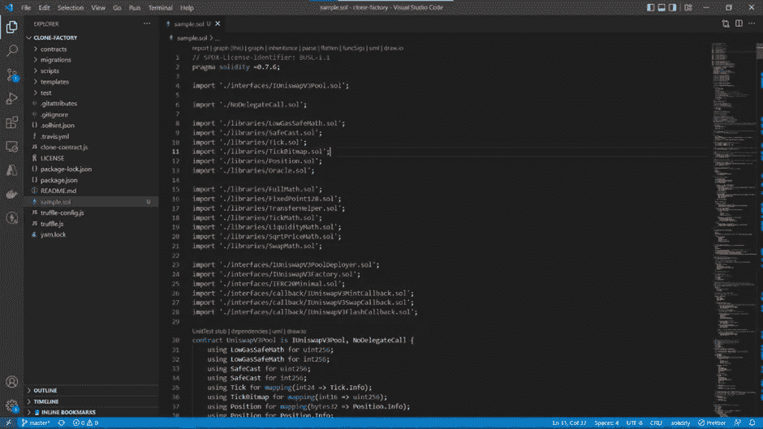
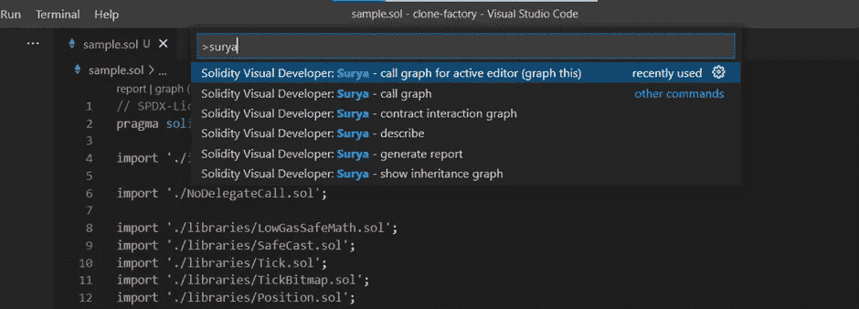
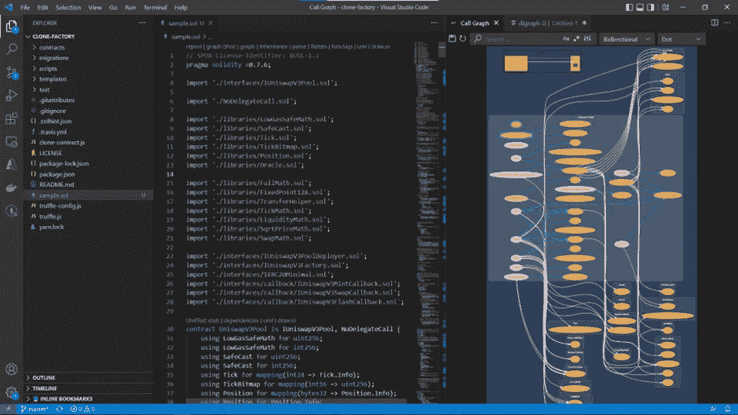
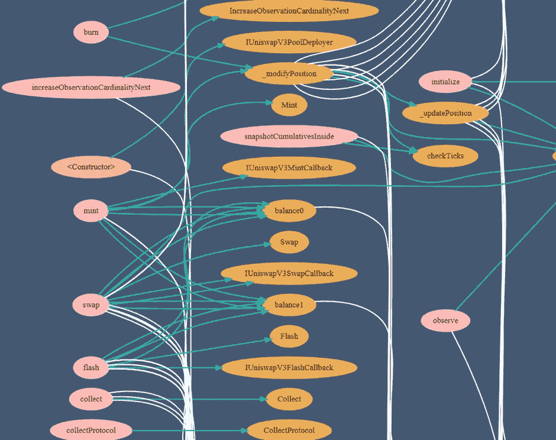
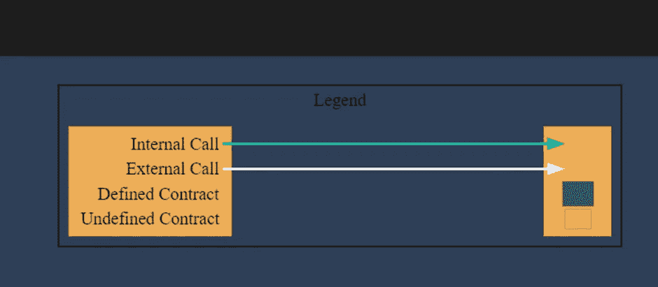

# 将可靠性代码转换为 UML 流程图

> 原文：<https://medium.com/coinmonks/convert-solidity-code-to-uml-flow-diagrams-3a5cd412177?source=collection_archive---------3----------------------->

作为一名开发人员，当我们能够编写安全可靠的代码时，感觉棒极了。为了使代码更清晰并更好地调试代码，源代码的每一部分都可以用可视化图表的形式表示，如流程图、图形和 UML 图，以便为开发团队构建优秀的产品和服务带来清晰性。

为了解决这个问题，我们将使用可用于 UML 流程图生成的 VS 代码扩展。

在这篇博客中，我们将讨论 Solidity 可视化开发插件的安装和应用。

该扩展提供了以安全为中心的语法和语义突出显示、详细的类大纲、专门的视图、高级的可靠性代码洞察以及对 Visual Studio 代码的增强。

该扩展提供了许多功能，如:

1.  UML:这是最有用的可视化技术之一，它有助于记录代码。

2.调用图:它给出了系统中函数以及哪些函数调用了哪些函数的动态视图。

3.继承图:它用于使用继承图给出一个易于阅读的类继承摘要。

让我们从 Solidity Visual developer 的安装开始:

1.  打开 Visual Studio 代码并单击扩展部分。
2.  然后搜索 Solidity Visual Developer，点击安装按钮。

3.现在我们准备使用这个扩展。为此，我使用了以下源代码:

 [## v3 核心/unis WAP 3 pool . sol 位于主 Uniswap/v3 核心

### 此时您不能执行该操作。您已使用另一个标签页或窗口登录。您已在另一个选项卡中注销，或者…

github.com](https://github.com/Uniswap/v3-core/blob/main/contracts/UniswapV3Pool.sol) 

4.在这之后，打开命令面板(Ctrl+shift+P ),输入“Surya”。您将看到以下窗口。选择选项:**Solidity Visual Developer:Surya—调用 graph for active editor (graph this)。**

Surya extension in VS Code

5.在此之后，图表将自动绘制，您将获得以下窗口。

Plotted Graph

Inheritance graph

6.下图显示了特定图形的描述。

*   白色箭头线是外部呼叫
*   绿色箭头线是内部呼叫
*   已定义的合同在蓝框中
*   未定义的合同显示在方框中

**关于区块链开发、编码、博客、技术文档的任何进一步的疑问或任何事情，你可以在**[**Linkedin**](https://in.linkedin.com/in/anubhav-chaturvedi-a7465a72)**或 insta gram id =**[**acanubhav 94**](http://instagram.com/acanubhav94)**上 DM 我。**

**我的团队成员特殊信用:** [**Shreyas**](https://www.linkedin.com/in/shreyas-patel-5a39a3199/) **和** [**安士卡**](https://www.linkedin.com/in/anshika-yadav-0a69381b7/)

> 加入 Coinmonks [电报频道](https://t.me/coincodecap)和 [Youtube 频道](https://www.youtube.com/c/coinmonks/videos)了解加密交易和投资

# 另外，阅读

*   [如何使用 Solidity 在以太坊上创建 DApp？](https://coincodecap.com/create-a-dapp-on-ethereum-using-solidity)
*   [币安 vs FTX](https://coincodecap.com/binance-vs-ftx) | [最佳(索尔)索拉纳钱包](https://coincodecap.com/solana-wallets)
*   [如何在 Uniswap 上交换加密？](https://coincodecap.com/swap-crypto-on-uniswap) | [A-Ads 评论](https://coincodecap.com/a-ads-review)
*   [加密货币储蓄账户](/coinmonks/cryptocurrency-savings-accounts-be3bc0feffbf) | [YoBit 评论](/coinmonks/yobit-review-175464162c62)
*   [Botsfolio vs nap bots vs Mudrex](/coinmonks/botsfolio-vs-napbots-vs-mudrex-c81344970c02)|[gate . io 交流回顾](/coinmonks/gate-io-exchange-review-61bf87b7078f)
*   [CoinFLEX 评论](https://coincodecap.com/coinflex-review) | [AEX 交易所评论](https://coincodecap.com/aex-exchange-review) | [UPbit 评论](https://coincodecap.com/upbit-review)