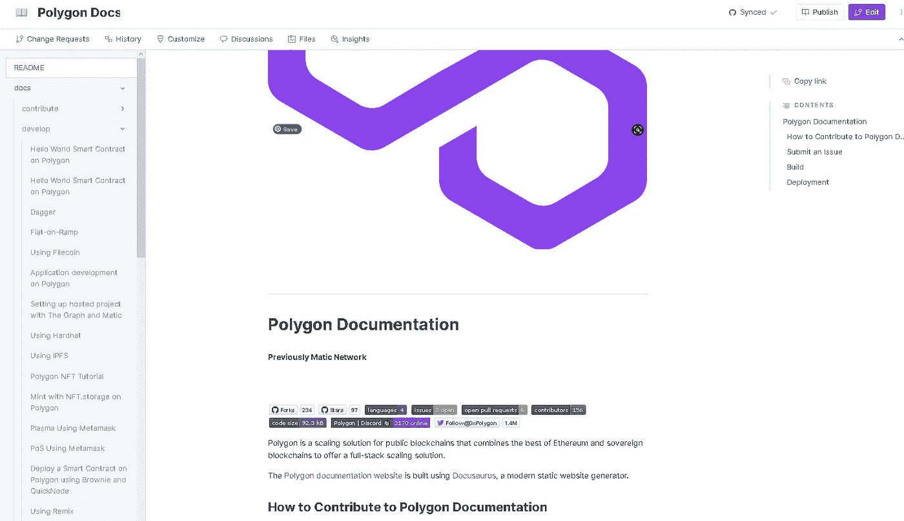
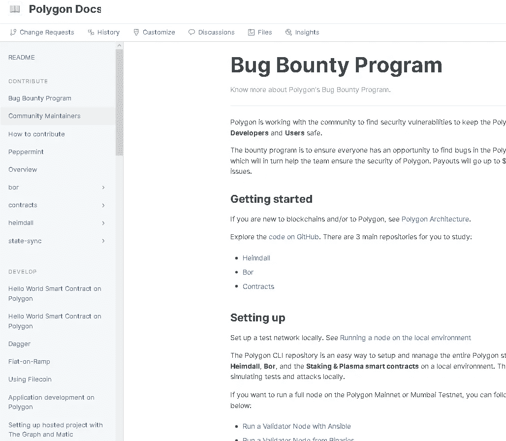

# 将 Gitbook Markdown 转换为 LaTeX——终极指南

> 原文：<https://medium.com/coinmonks/converting-a-gitbook-markdown-to-latex-the-ultimate-guide-34bf7ecf75b2?source=collection_archive---------11----------------------->

由于其简单、优化的设计和一些资源，itbook Markdown 在区块链开发者中变得越来越受欢迎。使用它编写白皮书非常快，结果往往完全用户友好，并且它与 Github 集成，因此您可以直接从存储库中创建和编辑 Markdown 中的内容。另一方面，多年来我也一直使用 [LaTeX](https://www.latex-project.org) 来制作专业报告，尽管普遍担心必须编写一个非所见即所得的文档，但一旦你习惯了它，部署起来就非常简单快捷。结果棒极了。在这篇文章中，我将讨论一种将所有 Gitbook 结构转换成. tex 结构的脚本方法。对于像我这样的后来者，或者初学者，我们将讨论一些很酷的东西，如批处理脚本。md，。特克斯和潘多克。

# 背景

> 罗马诗人尤维纳利斯(10.356-10.64)

在我日常技术活动的同时，没有多少人知道我是一名日本武术教练。除了身体训练，训练的一部分在于提供哲学、文化和技术上的理解，理解每种技术可能代表的艺术和战术方面。我们有很多关于 9 所学校的描述书(denshos ),并不总是以教学的方式进行整合，有时会有其他高级讲师带来的不同方法，值得纳入我们的培训中。

过去几个月我一直在做的一件事是试图为我的学生整合这些材料，所以我为此创建了一个 gitbook，因为格式清晰，访问简单，我非常适应这种格式，并且在编写文档时很容易保持相同的格式风格。有时我们还需要打印材料，所以有必要制作一些打印样式，不仅代表我的道场，还代表我自己对文本的理解，以及区分大组织和学者成员的方法。对我来说，一个好的解决方案是将 gitbook 基础转换成一个风格化的 LaTeX 项目。简单的蛋糕，对吗？

简而言之，问题如下:

1.  我有一本 gitbook
2.  gitbook 与 github 同步，所以我可以访问。md 文件直接；
3.  我需要转换 gitbook/github Markdown。md 文件导入 LaTeX。tex 文件；
4.  还需要保持相同的文件夹结构；
5.  需要单独测试转换后的文件，以确保信息保持应有的状态(有时我们使用日语术语，其他时候我们有特定的葡萄牙语单词依赖于 LaTeX Babel 包)；
6.  还需要为不同水平的学生准备单独的文档块(1 级黑带需要更完整的包，但白带不一定需要达到黑带的考试要求)，因此它必须足够灵活，以便进行受控的结构安排；
7.  需要能够遵循一种风格；
8.  需要乳胶风格；
9.  我不想在那上面花一分钱。考虑到我的时间已经是一个昂贵的成本。

# 使用的工具

简而言之，这是我们所需要的

*   github 账户；
*   一个 gitbook 账户，有一些项目，与一些 github 库同步；
*   一个 LaTeX 安装，你可以从这个链接直接使用 [MikTeX 安装；](https://miktex.org/download)
*   Pandoc，通用标记转换器，可以从 [pandoc 网站](https://pandoc.org/installing.html)安装。或者(这实际上是我这里有的)，如果您安装了 Anaconda，您可以使用

```
conda install -c conda-forge pandoc
```

*   批处理脚本。 *OMG，为什么不是 Python？为什么不是 Perl，Bash，C，Blablabla？*基本上我是用 Windows Batch 开始写脚本的，就这样。

# 示例准备的结构安排

出于举例的目的，我们将使用[多边形网络文档](https://github.com/maticnetwork/matic-docs)，所以我将它从 github 中派生出来，导入到 gitbook 中，并让结构与我的 dojo gitbook 中的结构相似。

*   多边形文档我分叉并更新了库名[https://github.com/RegoDefies/Polygon-Docs](https://github.com/RegoDefies/Polygon-Docs)以允许合并一些改变
*   现在在 Gitbook 中创建一个新空间，我将同步 github repo。这里就不细说了，因为这不是讨论的重点，但是不知道怎么做的可以问我。



Gitbook imported from Gibhub repository

导入结构有一个独立的起始页(左上方的自述文件)，文档分发到第四层，没有节组，只有前两层的标题。在我的 dojo gitbook 中，我有段组，并且嵌套只到第二层。因此，我将第一级和第二级页面改为组(如文档、常见问题、主页等)，并提高后续章节的级别。很好，我们有很多页面可以玩。结果如下。



我们现在在顶部有一个 README 页面，还有几个具有不同嵌套级别的子部分，所以我们现在可以开始编码了。

# 封装函数的两个脚本

我将脚本分成两部分，将 pandoc 调用从一个简单的文件夹中分离出来，另一部分深入到树结构中。

## Pandoc 呼叫

Pandoc 是来自脚本的主调用。它将进行转换过程，一般语法如下

```
pandoc --from=markdown --to=latex inputfilename.md --output=outputfilename.tex --highlight-style=espresso --standalone
```

当然还有更多选项，您可以使用

```
pandoc --help
```

## convert_md2tex.bat

这是潘达克的来电。想法是从每个 gitbook 文件夹运行调用者，处理。md 文件在里面。这个脚本指向三个参数作为主调用者的输入:

*   %BASEFOLDER%，源文件的位置
*   %TARGET%是%BASEFOLDER%中的子文件夹。
*   %LOGFILENAME%是一个日志文件，用于跟踪所用结构和所处理文件的引用。这将有助于生成 LaTeX 项目文件，该文件将读取所有。生成 tex 输出。

如果您弄错了%BASEFOLDER%的位置，脚本将返回 null 响应。这部分代码由

```
@echo off

set BASEFOLDER=%1%
set TARGET=%2%
if not exist %BASEFOLDER%\%2% (
	echo Folder %BASEFOLDER%\%2% does not exist
	exit 0
)
set LOGFILENAME=%3%

set OPTIONS1=--variable=geometry:"margin=2cm"
@rem set OPTIONS2=--standalone
```

同样重要的是隔离一些设置，所以我们设置一个变量来表示 pandoc 执行和一些选项。如果您希望生成由 LaTeX 项目编译的完整文件集(而不是独立编译)，可以将%OPTIONS2%保留为注释。

```
set OPTIONS1=--variable=geometry:"margin=2cm"
@rem set OPTIONS2=--standalone

set RUNCMD=pandoc --from=markdown --to=latex %%f --output=%TARGET%\%%~nf.tex --highlight-style=espresso %OPTIONS1% %OPTIONS2%
```

检查%TARGET%文件夹是否存在后，如果不存在，我们将创建该文件夹。

```
if not exist %TARGET% (mkdir %TARGET%)
```

最后，我们从%BASEFOLDER%\%TARGET% files 运行一个循环来运行转换，回显转换后的文件名，并将此回显附加到日志文件中。最后，我们退出 null 以允许系统解锁脚本。

```
for %%f in (%BASEFOLDER%\%TARGET%\*.*) do (
	%RUNCMD%
	echo %%~nf.tex
	echo %%~nf.tex >> %LOGFILENAME%
)
exit 0
```

完整的脚本如下所示。

## project_main.bat

这是主要的呼叫者。

*   我们首先将%BASEFOLDER%位置定义为 git 克隆路径，将%LOGFILENAME%定义为日志，以存储将用于生成 LaTeX 项目的结构。
*   我们包含了一个 echo 来开始标记日志文件中的结构。

```
@echo off

set BASEFOLDER=C:\Users\user\Documents\project_foldername
set LOGFILENAME=%~n0.info
echo ===== Project Structure for %LOGFILENAME% ===== > %LOGFILENAME%
```

主要任务是通过运行 for 循环来访问%BASEFOLDER%并查找目标。每个目标填充将被发送到`convert_md2tex.bat`，其中的文件将被处理。这是通过以下方式完成的

```
for /d %%f in (%BASEFOLDER%\*.*) do (
	echo ==== Resolving 1st-level folder : %%~nf
	echo ==== 1st-level folder : %%~nf >> %LOGFILENAME%

	cmd /c convert_md2tex.bat %BASEFOLDER% %%~nf %LOGFILENAME%
	[...]
)
```

重要的是要提到`do`条件中的`if not [%%~nf]==[]`子句，跳过读取空文件名，因为在第二个循环中文件夹的来回可能会被破坏。只是使用下面的调用来代替

```
for /d %%f in (%BASEFOLDER%\*.*) do if not [%%~nf]==[] (
```

最后，还有第二个循环进入主要目标并执行次要转换。在这个版本中，我们没有使用任何递归，所以当前的脚本仅限于第二层，但它很容易包含新的级别。或者转换成递归，只是没时间做那个(随便玩玩)。所以上面代码中的`[...]`如下。

```
for /d %%g in (%BASEFOLDER%\%%~nf\*) do (
		echo == Resolving 2nd-level folder : %%~nf\%%~ng
		echo == 2nd-level folder : %%~nf\%%~ng >> %LOGFILENAME%

		if not exist %%~nf (mkdir %%~nf)
		cd %%~nf
		cmd /c ..\convert_md2tex.bat %BASEFOLDER%\%%~nf %%~ng ..\%LOGFILENAME%
		cd ..
	)
```

这与主循环几乎相同，只是包括了 in/out 文件夹调用。要包含另一层，只需在`cd..`之前创建另一个循环，只需记住将循环变量从`%%f`和`%%g`改为不同的变量，并正确完成`..`路径。

完整的项目调用者可以在下面看到。

# 从 Gitbook 文件夹运行脚本

现在我们已经准备好了完整的脚本，我们可以运行一些测试了。当然，我们应该包括更多的循环层，因为我们的 gitbook 有更多的文件夹层次，但我们现在可以离开这里。

*   第一步是记住将 gitbook 与 github 库同步。只要确保同步出现在你的 gitbook 的右上角。


*   其次，我们需要将存储库克隆到本地文件夹。我将把它克隆到文件夹`c:\users\user\documents\convertingtotex\`中，使用

```
git clone [https://github.com/RegoDefies/Polygon-Docs.git](https://github.com/RegoDefies/Polygon-Docs.git)
```

从命令行。


*   在`c:\users\user\document\convertingtotex\TexProject`创建一个项目文件夹并将两个脚本复制到那里之后，记得将`%BASEFILE%`变量设置为之前的路径(克隆的 git repo)。
*   最后，运行`project_main.bat`脚本，它将相应地生成文件。


*   如前所述，如果我们需要运行到第三层，就必须包含一个新的循环。在这种情况下，代码应该更像

取任意一个. tex 输出文件，直接用`pdflatex`编译即可。例如，使用以下命令编译文件`alchemy.tex`

```
pdflatex.exe -synctex=1 -interaction=nonstopmode “alchemy”.tex
```

我们得到如下


# 乳胶模板呢？

我不会在这篇文章中展示如何制作一个完美的 LaTeX 模板，因为这需要一些课程来获得完整的知识。但更重要的是，我会给你看这个陷阱。

当您使用选项`--standalone`转换文件时，pandoc 包括在。tex 你需要单独编译 tex 的所有库。因此，我们的想法是从使用该选项的一个生成文件中获取前导，使用`\input{filename}`命令创建一个包含其他 tex 的. tex 主文件，然后再次运行 convertion 脚本，但现在没有使用`--standalone`选项。

在上述情况下，例如使用`alchemy.tex`，前同步码是`\begin{document}`命令之上的所有内容。您将使用`project_main.info`日志文件来标识用于章节、小节、段落和分段命令的结构。

合并后的 TeX 将类似于下面的代码。

请记住再次运行 convertion 脚本，以便能够编译这个合并的 TeX。

Uff！就是这样。希望你喜欢，请评论如果你有一些建议(或无论如何，请评论如果你有什么酷的话要说)。

干杯！
减压阀。

如果你想像这样直接支持 post，请发送一些 ERC-20 令牌到 0x FB 46 af 21 e 74 af 3 e 44411 c 00 f 7617 b 397204 c 6 aff

> *加入 Coinmonks* [*电报频道*](https://t.me/coincodecap) *和* [*Youtube 频道*](https://www.youtube.com/c/coinmonks/videos) *了解加密交易和投资*

# 另外，阅读

*   [Bookmap 评论](https://coincodecap.com/bookmap-review-2021-best-trading-software) | [美国 5 大最佳加密交易所](https://coincodecap.com/crypto-exchange-usa)
*   最佳加密[硬件钱包](/coinmonks/hardware-wallets-dfa1211730c6) | [Bitbns 评论](/coinmonks/bitbns-review-38256a07e161)
*   [新加坡十大最佳加密交易所](https://coincodecap.com/crypto-exchange-in-singapore) | [购买 AXS](https://coincodecap.com/buy-axs-token)
*   [红狗赌场评论](https://coincodecap.com/red-dog-casino-review) | [Swyftx 评论](https://coincodecap.com/swyftx-review) | [CoinGate 评论](https://coincodecap.com/coingate-review)
*   [投资印度的最佳密码](https://coincodecap.com/best-crypto-to-invest-in-india-in-2021)|[WazirX P2P](https://coincodecap.com/wazirx-p2p)|[Hi Dollar Review](https://coincodecap.com/hi-dollar-review)