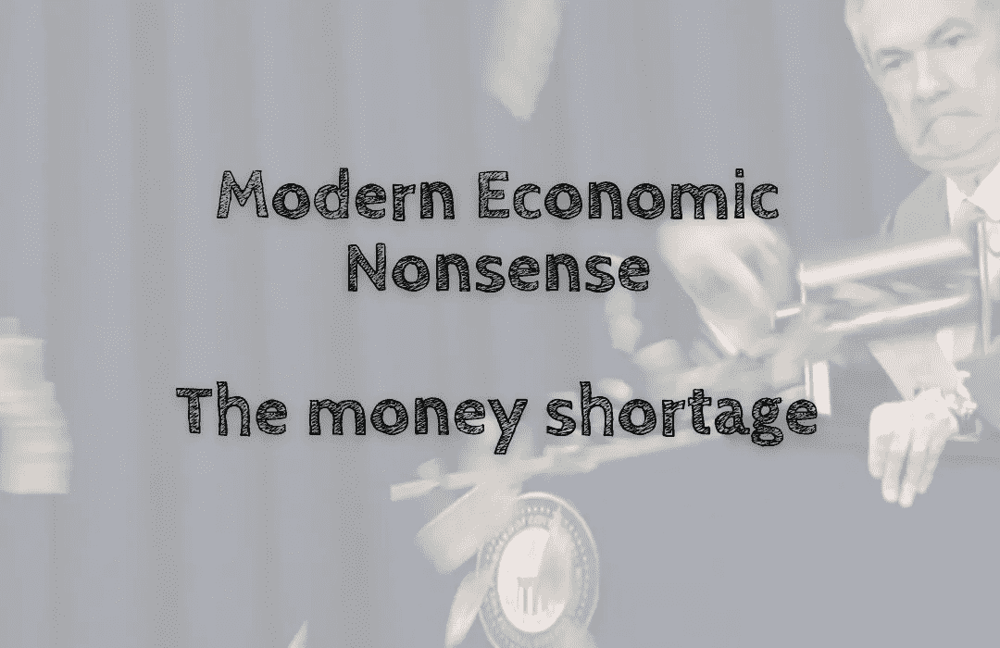

# 现代经济学废话——钱荒

> 原文：<https://medium.com/coinmonks/copy-of-modern-economic-nonsense-the-money-shortage-a3e462ed49bd?source=collection_archive---------44----------------------->

我们听说了量化宽松，这是无限印钱。会发生相反的情况。这被称为量化紧缩✂️，从现有市场收缩资金。

我们从一开始就知道，加密是为了防止政府为了避免通货膨胀而不情愿地印刷无限量的货币。尽管如此，它并没有告诉你政府是否开始…