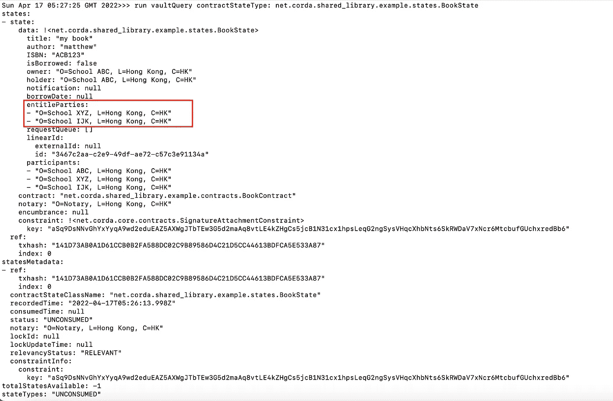
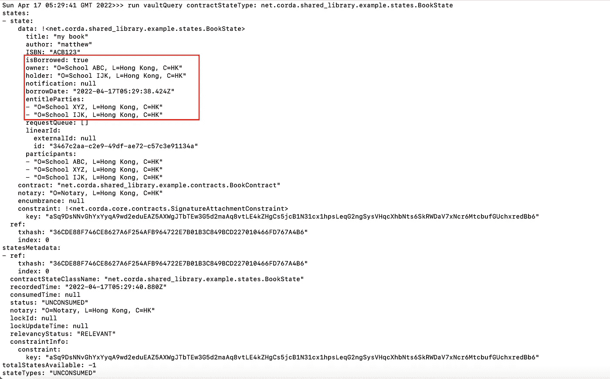
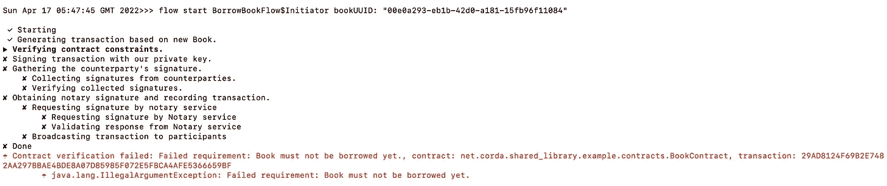
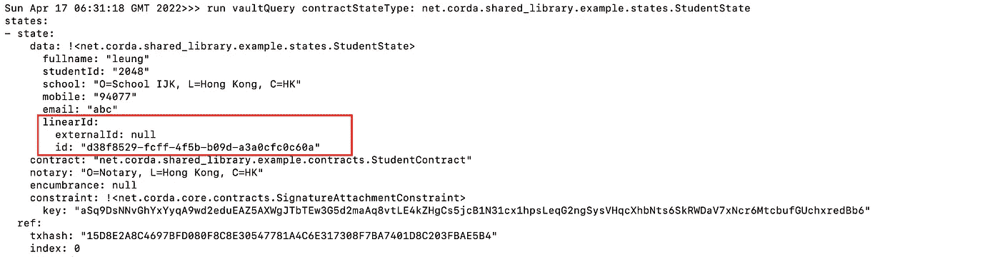
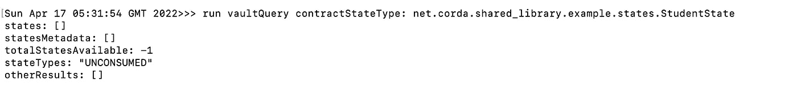
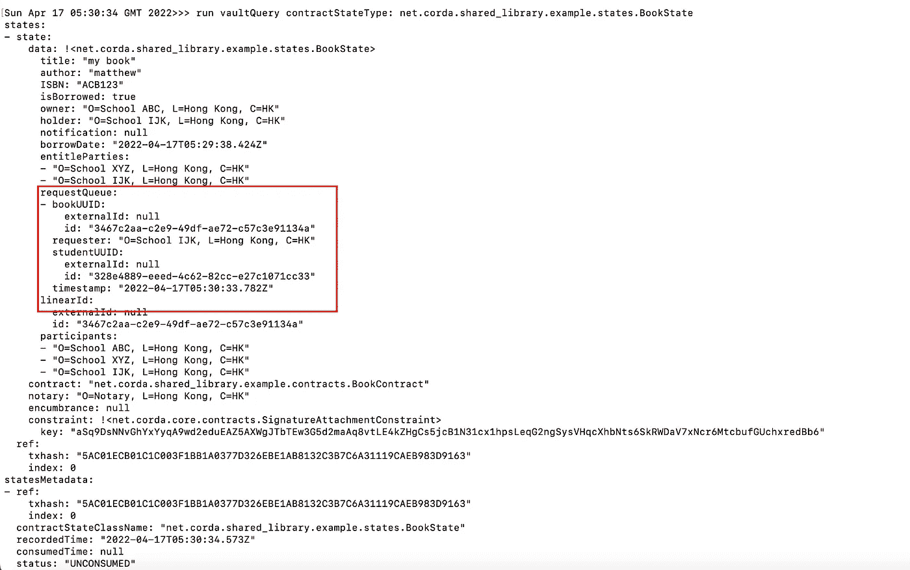
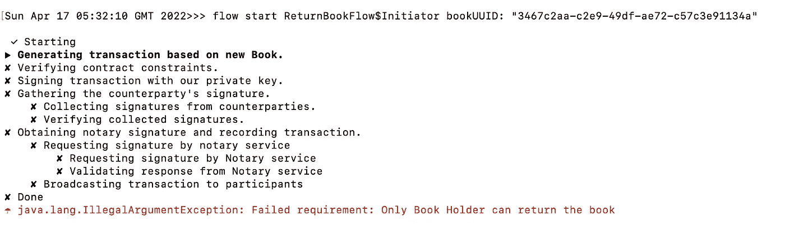
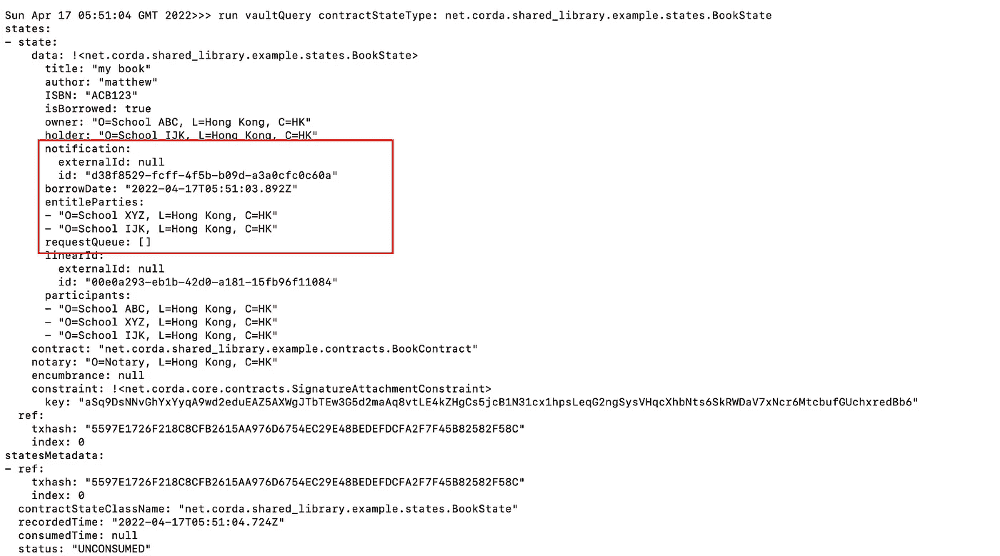
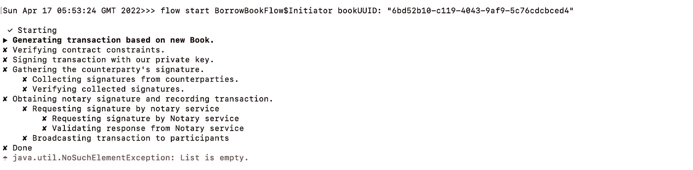

# 说明隐私的 Cordapp 示例

> 原文：<https://medium.com/coinmonks/cordapp-example-to-illustrate-privacy-fbc51ce87f78?source=collection_archive---------41----------------------->

R3 Corda 的一个关键特性是它可以保护数据隐私。在这种意义上，只有授权方可以看到分类帐中的共享数据。在这篇文章中，我将说明如何使用 Cordapp——共享学校图书馆来保护数据隐私。在我的[上一篇](/coinmonks/introduction-to-private-blockchain-application-corda-43dfbb325fed)中，我提出了一个简单的想法(共享学校图书馆)，附近的一些学校组成一个社区，共享他们图书馆里的书。每个 Corda 节点代表一所学校。每个学校可以发行任何被定义为`BookState`的图书条目。

```
@BelongsToContract(BookContract::class)
data class BookState(val title: String,
val author: String,
val ISBN: String,
val isBorrowed: Boolean,
val owner: Party,
val holder: Party,
val notification: UniqueIdentifier?,
val borrowDate: String?,
val entitleParties: List<Party> ,
val requestQueue: List<BookRequest> = listOf<BookRequest>(),
override val linearId: UniqueIdentifier = UniqueIdentifier(),
override val participants: List<AbstractParty> = listOf(owner) + entitleParties ):LinearState, QueryableState 
...
...
@CordaSerializabledata class BookRequest(val bookUUID: UniqueIdentifier, val requester: Party, val studentUUID: UniqueIdentifier, val timestamp: String)
```

`BookState`包含有资格借书的学校的列表`entitleParties`。如果您的学校不在列表中，当您从保管库中查询图书时，您的学生将看不到图书条目。

# 学生个人信息不可共享

如果一本书被其他人借走了，有资格的学校不能借走它，但是它可以添加一个为学生保留这本书的请求。所有请求者将在`BookState`变量— `requestQueue`中排队。每个条目(BookRequest)只包含书 UUID 和学生 UUID，其中没有任何个人信息(如手机/电子邮件)会存储在 BookState 中。学生个人信息存储在自己学校节点服务器内的 StudentState 中，而不是其他学校。学生 UUID 是一个随机的唯一 ID，它是当学生在自己的学校节点服务器中注册自己时生成的。由于`StudentState`创建只需要自己学校签署交易，`StudentState`不共享，其他学校无法查看学生信息。他们只能读到在`BookRequest`队列中的学生 UUID，而不能读到`StudentState`。如果你只有学生 UUID，它很难识别个别学生。只有他自己的学校才能从保险库里查询到学生 UUID 的`StudentState`。这就是为什么学生的隐私可以得到保护。

# 演示

让我们按照下面的步骤进行测试。

1.  在 ABC 学校，我们创建了一个新的图书条目，并命名为其他两所学校:XYZ 学校和 IJK 学校。

```
flow start IssueBookFlow$Initiator title: "my book", \
author: "matthew", ISBN: "ACB123", \
entitleParties:["O=School XYZ,L=Hong Kong,C=HK","O=School IJK,L=Hong Kong,C=HK"]
```



2.学校 IJK 试图借这本书。运行以下命令后，`BookState`将用`holder`=学校 IJK 和`isBorrwed` = `true`进行更新

```
flow start BorrowBookFlow$Initiator bookUUID: "00e0a293-eb1b-42d0-a181-15fb96f11084"
```



3.如果我们想再借那本书，就会失败，因为那本书已经被借走了(`isBorrowed` = true)。该条件在`BookContract`中得到验证。



4.当书被借走的时候，我们只能添加持有书的请求。首先，让我们在 IJK 学校注册学生。您可以通过从金库中查询`StudentState`来查询他的 LinearID。

```
flow start RegisterStudentFlow$Initiator fullname: "leung", \
studentId: "2048", mobile: "94077", email: "abc"
```



如果您在 Book Owner School ABC 中运行相同的查询，它将无法搜索该学生。



5.然后运行下面的命令将`BookRequest`添加到`requestQueue`中。

```
flow start AddRequestFlow$Initiator bookUUID: "00e0a293-eb1b-42d0-a181-15fb96f11084" , \
studentUUID: "d38f8529-fcff-4f5b-b09d-a3a0cfc0c60a"
```



6.接下来，尝试还书。请注意，只有图书持有者才能还书。在`ReturnBookFlow`中检查该条件。



如果在 book holder 节点上成功归还图书，您将看到`requestQueue`被出队(现在为空)，并且`notification`字段将被设置为位于前一队列头的学生 UUID。



7.我们创作了另一本书，但我们不准许 IJK 学校借阅这本书。

```
flow start IssueBookFlow$Initiator title: "my second book", \
author: "matthew", ISBN: "MNOP123", \
entitleParties:["O=School XYZ,L=Hong Kong,C=HK"]
```

当我们试图借关于学校 IJK 的书时，它将失败。因为这本书的条目并没有存放在 IJK 学校的金库里，而且这个条件也是在`BookContract`中查到的。



# 完整代码

共享库应用程序的完整代码可以在我的 [git repo](https://github.com/iwasnothing/cordapp-shared-library) 中找到。

> *加入 Coinmonks* [*电报频道*](https://t.me/coincodecap) *和* [*Youtube 频道*](https://www.youtube.com/c/coinmonks/videos) *了解加密交易和投资*

# 另外，阅读

*   [Bookmap 评论](https://coincodecap.com/bookmap-review-2021-best-trading-software) | [美国 5 大最佳加密交易所](https://coincodecap.com/crypto-exchange-usa)
*   最佳加密[硬件钱包](/coinmonks/hardware-wallets-dfa1211730c6) | [Bitbns 评论](/coinmonks/bitbns-review-38256a07e161)
*   [新加坡十大最佳加密交易所](https://coincodecap.com/crypto-exchange-in-singapore) | [购买 AXS](https://coincodecap.com/buy-axs-token)
*   [红狗赌场评论](https://coincodecap.com/red-dog-casino-review) | [Swyftx 评论](https://coincodecap.com/swyftx-review) | [造币厂评论](https://coincodecap.com/coingate-review)
*   [投资印度的最佳密码](https://coincodecap.com/best-crypto-to-invest-in-india-in-2021)|[WazirX P2P](https://coincodecap.com/wazirx-p2p)|[Hi Dollar Review](https://coincodecap.com/hi-dollar-review)