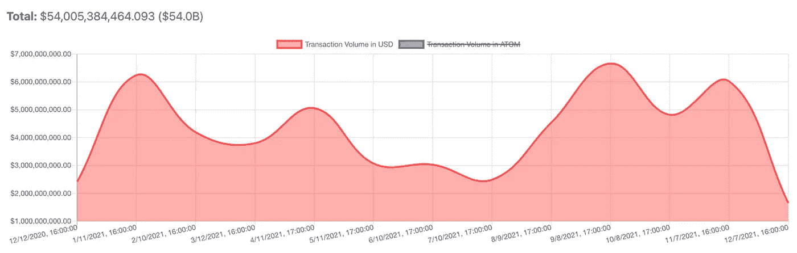

# 宇宙网络/原子液体令牌分析—2021 年 12 月 18 日

> 原文：<https://medium.com/coinmonks/cosmos-network-atom-liquid-token-analysis-december-18-2021-1514e21a9e7a?source=collection_archive---------53----------------------->

*注:此分析最初写于 2021 年 12 月，此后再未更新。*

**重点外卖/TLDR:**

*   宇宙网络及其区块链间通信协议(IBC)使区块链枢纽能够以无摩擦、分散的方式相互通信和交易。自去年春天推出以来，IBC 的使用率稳步上升，目前已有 25 家连锁店。Tendermint 的首席执行官预测，2022 年 IBC 奥运会将连接 200 家连锁店。
*   与 Avalanche 和 Polkadot 等互操作性解决方案相比，Cosmos 有两个主要优势。一个是它对开发者非常友好的 SDK，这使得开发者可以很容易地在网络上创建新的区块链。该网络还具有最低的进入财务壁垒，因为它允许集线器选择使用哪种令牌来保护其区块链，而不是必须在 ATOM 上进行大量的财务投资。
*   虽然 ATOM 在历史上一直表现不佳，但一些更新将很快实现更好的令牌价值累积。其中包括最近批准的一项提案，允许区块链通过宇宙枢纽连接到 IBC，以及链间安全和液体打桩功能。

**概述:**互操作性是实现区块链技术全部潜力的关键之一。一个拥有完全可互操作的区块链的世界将允许无缝的资金和数据传输，而不依赖于任何中央实体。Cosmos 正在构建领先的互操作性解决方案之一。Cosmos 栈包括 Cosmos 网络、用于支持该网络的 Tendermint 共识机制和 Cosmos SDK。宇宙网络由区块链中心组成，包括宇宙中心(由 ATOM 令牌保护)、币安智能链、Terra 和 Cronos (Crypto.com)。

**核心关键绩效指标:**

*   在船上的项目:在宇宙网络上有 47 个应用和服务。其中 25 个已经启用了 IBC，包括 Terra(10 月启用)、Cronos 和 Osmosis。Tendermint(为网络提供动力的共识机制)的首席执行官**预测，2022 年将有大约 200 家连锁店通过 IBC 连接起来。**
*   开发者心智份额:**Cosmos Network 上应用和服务的总市值为 169.93 亿美元**，IBC 支持链的市值为 66.36 亿美元。Avalanche 和 Polkadot 生态系统的市值分别为 132 亿美元和 490 亿美元。
*   TVL: **目前大约 60%的 ATOM 总供应量(价值约 40 亿美元)被囤积起来**。这个数字通常每月在 60-70%之间波动，因为 67%是通货膨胀率和报酬率保持不变的目标数字。
*   交易量:2021 年，Cosmos Network 的月交易量一直保持在$2B 以上，仅在上个月有所下降。**2021 年，该网络的总交易量超过 540 亿美元，比 2020 年的 380 亿美元增长了 42%**。交易量通常与整体加密货币市场的表现相关。

Transaction volume in USD by month for 2021, with the total in the top left. Source: [https://atomscan.com/stats/transactions/volume](https://atomscan.com/stats/transactions/volume)

**令牌经济学:**原子令牌是宇宙中枢的原生令牌。到目前为止，它只在 Cosmos hub 中使用(尽管一旦链间安全实现，这种情况将会改变)。这意味着 ATOM 积累价值的唯一方式是通过 Cosmos hub 中的交易。ATOM 是一个没有供应上限的通胀标志。ATOM 的目标赌注百分比为 67%，通胀率和回报率保持不变。低于 67%时，ATOM 投资者的回报率更高，激励持有人投资到 67%。超过 67%，奖励率开始下降。

**投资主题:**尽管 Cosmos 现在有多个使用其 SDK 构建并与 Cosmos IBC 集成的 top 100 令牌，但 ATOM 令牌今年落后于竞争对手。如果你花时间在 reddit 或 crypto twitter 上，你甚至可能会看到投资者将 ATOM 描述为“被诅咒的硬币”。

看看 ATOM 黯淡的性能，认识到宇宙 IBC 号去年四月才发射是很重要的。作为网络最关键的功能，IBC 占用了开发人员的大部分时间。然而，现在开发人员可以自由地专注于获取 ATOM 的价值。这种方法通常被称为“渐进式分权”这是公司首先找出产品与市场的契合度并创造需求的地方，然后专注于推动更加分散化。这通常包括将代币深入集成到产品中，并获取代币的价值。

总之，Cosmos 正在和 ATOM 玩一场持久战。他们创建了一个对用户和开发人员非常友好的网络，获得了大量的需求，并成为互操作性领域的领导者之一。稳步增长的 IBC 活动将继续增加 ATOM 的价值，正如下面催化剂部分描述的网络中的一些新特性一样。我将 ATOM 视为长期持有。

**催化剂:**

*   最近，一项向宇宙中心添加一个 IBC 路由器的提案(#56)被全票通过。这将使宇宙枢纽成为宇宙网络的链间 IBC 路由器，这意味着新区块链将能够通过宇宙枢纽轻松参与 IBC，而没有维护大量基础设施的负担。这有可能通过 Cosmos Hub 本身带来大量新的交易量，从而增加 ATOM 的价值。
*   Cosmos 团队正在努力实现**链间安全性**，其中不同的链可以为一组分散的验证器节点付费，而不是花费时间开发他们自己的安全性。一旦实现了这一点，ATOM 将最终能够用于保护除了 Cosmos Hub 之外的其他 Hub，就像 DOT 如何用于保护 Polkadot 上的所有 parachains 一样。不同的是，在 Cosmos 上，这将是可选的。这一更新为 ATOM 创造了巨大的价值积累潜力，因为它将使投资者能够同时获得两个令牌的赌注奖励。
*   Cosmos 上一个受欢迎的 DEX，最近提出了一个叫做超流体打桩的**液体打桩**版本。这将允许用户在渗透提供流动性时获得流动性提供商(LP)令牌。这些 LP 代币可以像网络上的常规 ATOM 代币一样下注，允许用户从提供流动性和同时下注中获益。一家名为 pSTAKE 的新创公司也获得了提供类似服务的资金。

**团队背景:**2014 年，Jae Kwon、Ethan Buchman 和扎科·米洛塞维奇创立了 Tendermint，这是一种共识算法，最终为宇宙网络提供了动力。宇宙网络本身于 2019 年推出。尽管有一些早期的冲突和 2020 年的团队解散，创始团队仍然致力于网络的工作。

至关重要的是，创始团队的每个成员都有区块链发展以及创立和管理公司的经验，所有的创始人都是面向公众的。

竞争格局:著名的 Cosmos 竞争对手包括 Polkadot 和 Avalanche。虽然 Polkadot 要求连锁店建立在他们的底层环境之上，购买 dot 并锁定它，但 Cosmos 允许区块链维持主权。虽然这导致 ATOM 捕获的值比 DOT 少，但它也确保了如果 ATOM 出于任何原因关闭，Cosmos 网络上的另一个区块链不会受到影响。此外，Cosmos 理论上可以运行无限多个区块链，而 Polkadot 的副链结构最多只能支持 100 个。

雪崩网络对可以在其上创建的区块链的数量没有限制，并且理论上在不降低性能的情况下，网络上可以有无限的验证器。因此，Avalanche 比 Cosmos 更适合可伸缩性。Avalanche 的 AVAX 令牌用于验证整个主网络，每个验证器需要 2000 AVAX。相比之下，ATOM 只在 Cosmos Hub 中使用，这意味着 AVAX 令牌具有更好的值捕获机制。AVAX 令牌也有通货紧缩和最大供应上限，而 ATOM 是通货膨胀，没有供应上限。

与竞争对手相比，Cosmos 的主要竞争优势是其 SDK 的易用性和构建其网络的低财务壁垒。Avalanche 和 Polkadot 都需要对其令牌进行大量的财务投资才能加入网络，而 Cosmos 理论上允许任何预算不多的开发者使用其 SDK 构建区块链并连接到其网络。SDK 在区块链开发者中的流行意味着许多未来的区块链将很容易在 Cosmos 网络中实现互操作性，尽管并非所有人都会选择启用 IBC。Cosmos Hub 增加了链间安全和 IBC 路由器等新功能，这也消除了区块链开发者的大量辛苦工作。

**风险:** ATOM 是一个相对安全的赌注，因为目前在 Cosmos 网络上构建的用户和开发人员数量庞大。然而，像任何投资一样，它也不是没有风险。从历史上看，Cosmos 团队更关注他们的产品，而不是 ATOM 的市场营销或价值获取。虽然我相信，从长远来看，对开发人员友好并专注于构建一个伟大的产品将导致更多的采用，但只要 ATOM 继续增值，这只会对投资者有利。上述新功能应该会有所帮助，但 Cosmos 团队过去对 ATOM 的价格普遍缺乏关注，这可能会引起投资者的担忧。

**最后的想法:**最终，Cosmos 开始显示出它可能是黄金互操作性解决方案，是 ATOM 持有者认为它可以成为的“区块链互联网”。我相信 ATOM 值得任何长期相信 crypto 的人一看，但是不管你是否相信 token，作为 Cosmos 生态系统的用户，这是一个激动人心的时刻。