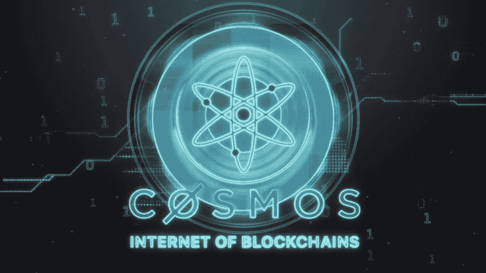

# 宇宙价格预测 2022–2026

> 原文：<https://medium.com/coinmonks/cosmos-price-prediction-2022-2026-107f70eb4537?source=collection_archive---------2----------------------->

Source photo [cosmos crypto — Bing images](https://www.bing.com/images/search?view=detailV2&ccid=ROK6gx3A&id=C5C43878FB3DB721059DD98D520DA6A84C7215EB&thid=OIP.ROK6gx3AAkGgTYbaj2BjJwHaEK&mediaurl=https%3a%2f%2fpersonal-financial.com%2fwp-content%2fuploads%2f2020%2f07%2fInvest-in-COSMOS-ATOM-future-unifying-giant-of-crypto.jpg&cdnurl=https%3a%2f%2fth.bing.com%2fth%2fid%2fR.44e2ba831dc00241a04d86da8f606327%3frik%3d6xVyTKimDVKN2Q%26pid%3dImgRaw%26r%3d0&exph=563&expw=1000&q=cosmos+crypto&simid=608043219051365857&FORM=IRPRST&ck=60418BAB7C7599F3ABEC63C59004A41E&selectedIndex=1&ajaxhist=0&ajaxserp=0)

由于其用户友好的架构，Cosmos 被称为“区块链 3.0”或“Web3”。为了做到这一点，Cosmos 软件开发工具包重视模块化。这使得能够使用预先存在的代码部分快速构建网络。原子是宇宙区块链的本土象征。宇宙区块链中心使投资者能够使用混合的利益证明机制来获得 ATOM 令牌，从而确保…