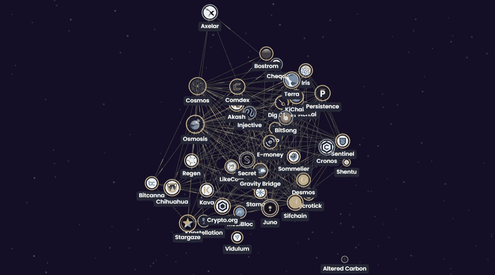

# 宇宙:区块链连接器

> 原文：<https://medium.com/coinmonks/cosmos-the-blockchain-connector-eef4dfd947e0?source=collection_archive---------39----------------------->

## 宇宙网络和生态系统概述

Image Source— [myway.io](https://mway.io/en/code/blockchain/)

# 宇宙网络

区块链的下一个发展是互操作性。目前，区块链已经独立生活。请将区块链想象成一个个独立的网络或生态系统，在其上构建应用和服务。用户可以在单个区块链或孤岛式生态系统中一起使用多个应用和服务，但不能与运行在单独网络上的应用结合使用。

这就是宇宙的由来。

Cosmos 旨在将这些网络连接在一起，打开行业尚未看到的大门。宇宙的理念是成为一个“区块链的互联网”,在这里，主权区块链有能力相互沟通或互操作。随着“IBC”或内部区块链通信协议的出现，这已经成为现实。这有点像区块链经济的 TCP/IP，价值可以在独立的区块链之间以无缝、无信任和分散的方式转移。

*[*听 Cryptocito 细说更多关于这个话题*](https://www.youtube.com/watch?v=ckrdTCwXSfM&t=83s)*

**除了将现有的区块链连接在一起，Cosmos 还寻求解决其他常见的挑战，如能源效率低下、可扩展性和治理。**

## **中心辐射模型**

****

**Image Credit — [Cosmos.Network](https://v1.cosmos.network/intro)**

**借助 Cosmos 软件开发工具包(SDK)、Tendermint 核心引擎和 Inter Blockchain 通信协议(IBC)等工具，开发人员可以构建独立的区块链(称为区域)。这些区域连接到集线器，集线器也是处理区块链内部通信的独立区块链。宇宙中心是更大的宇宙网络中的第一个中心，可能会有多个中心，每个中心都有几个区域。**

**比特币和以太坊等成熟的区块链也可能有能力通过安全桥连接到这些枢纽，与宇宙网络互操作。**

***【*[*想获取更多技术？看这个*](https://v1.cosmos.network/intro)**

## ***$ATOM 的当前实用程序***

******

***Image Credit — [Cosmos.Network](https://cosmos.network/intro)***

***$ATOM 是宇宙中枢的主要标志。它可以用来赚取更多的$ATOM，为链上治理提案投票，并为宇宙中心的安全做出贡献。$ATOM 也用于 Cosmos Hub 中的交易费用，作为一种防止垃圾邮件的形式。***

***持有$ATOM 的另一个好处是可以从网络上建立的新链中获得利益。这为新项目提供了一种分发令牌和获得认知的方式，同时为它们提供了即时的稳定性。***

*****未来的服务计划为$ATOM 令牌增加更多的效用和价值:*****

*   ***Gravity DEX 协议允许在 Cosmos Hub 上的任何两个区块链之间进行无许可交换和数字资产池。这些交易将由$ATOM 令牌推动，并奖励给$ATOM 的验证者和委托者(利益相关者)。***
*   ***$ATOM 分散流动性池允许$ATOM 持有人收取为掉期交易提供流动性的奖励。***
*   ***通往以太坊的重力桥将奖励 100 美元的原子赌注者“汽油”费.***
*   ***链间安全性将允许参与验证者用他们的$ATOM 作为抵押品来验证“子链”。赌注者将获得额外的奖励，作为获得这些“子链”的交换。***

****[*听听稀有液体关于$ATOM 的现在和未来效用*](https://youtu.be/xyeyu5FW2SU?t=396)*】*****

# **宇宙生态系统的现状**

****

**Image Credit — [Map of Zones](https://mapofzones.com/)**

**据 Cosmos 网站[报道，目前有 262 个以上的应用和服务建立在 Cosmos 网络上，有 25 个以上的区块链，包括币安智能链(BNB)、Terra(露娜)和 Crypto.com(CRO)等等。整个网络的总价值约为 138 亿美元以上。](https://cosmos.network/)**

****

**根据宇宙网络探测器的[区域地图，在过去的 30 天里有超过 1100 万次 IBC 传输，在本文撰写之时，超过 100 万次传输发生在宇宙中心和渗透区之间。](https://mapofzones.com/)**

## **宇宙的定义**

*   **[渗透](https://osmosis.zone/)是一个分散式交易所(DEX)和自动化做市商(AMM)，类似于 Uniswap 和 Balancer，使用 Cosmos SDK 构建。2021 年 6 月 19 日推出，用户可以交换 IBC 兼容的代币，并从流动性池中获得奖励。**
*   **Keplr 是一个 IBC 支持的移动和网络钱包，用于 Cosmos 网络，用户可以在这里安全地存储他们的多链资产。有 chrome 扩展，支持 Ledger Nano X。**
*   **[Emeris](https://emeris.com/) 寻求成为第一个支持&整合多个钱包的门户网站。用户将能够访问一个门户网站来满足他们所有的 DeFi 需求。Emeris 目前处于测试阶段。**

**通过 [*探索宇宙生态系统*](https://cosmos.network/ecosystem/apps/) 发现更多 DeFi 应用和其他服务。**

## ****星港****

**开发人员可以获得他们需要的所有工具来轻松构建区块链应用程序，并通过 [Starport](https://starport.com/) 将其连接到宇宙生态系统。**

> **到目前为止，随着 422 个区块链被创建并被推送到 GitHub，Starport 开发者社区正在快速发展。在短短两个月内， [Starport Discord](https://discord.com/invite/starport) 团队已经发展成为一个拥有近 600 名开发者的活跃社区。新推出的 [Starport Twitter](https://twitter.com/StarportHQ) 已经拥有 5000 名粉丝，每天大约有 200 名开发人员访问 [Starport 文档](https://docs.starport.com/)获取指导和教程——这些数字在 2022 年将呈指数级增长。— [Christina Cosmos，2022 年的 Cosmos 会有什么？](https://blog.cosmos.network/whats-coming-to-cosmos-in-2022-ce8e48d383ab)**

## **2022 年来到宇宙**

**这是今年我们可以期待看到的宇宙生态系统的简要列表:**

*   **Tendermint 首席执行官表示，他认为我们将在今年年底看到一个“通过 IBC 连接的 200 家连锁店”的生态系统。**
*   **通往非新兴区块链的安全桥梁，如比特币和波尔卡多特。**
*   **Evmos，一家 IBC 兼容的 EVM 连锁店([最近倒闭](https://coincodecap.com/evmos-network-upgrade-fails-what-will-the-team-do-next))**
*   **链间账户**
*   **液体打桩**
*   **NFTs**
*   **空投**

***要了解更多即将推出的内容，请访问*[*Cosmos 官方博客*](https://blog.cosmos.network/whats-coming-to-cosmos-in-2022-ce8e48d383ab) *。***

## **当前 CoinMarketCap 统计数据**

**根据 T21 的数据，ATOM 在 2021 年 9 月 20 日达到了 44.70 美元的历史新高。这是 2020 年 3 月 13 日创下的 1.13 美元的历史新低。今天，在我写这篇文章的时候，$ATOM 的价格是$27.72，在过去的两年里上涨了超过 2360%，因为它是有史以来最低的。它的总市值约为 79 亿美元，流通中的代币约为 2.86 亿枚。**

****

**Image Credit — [CoinMarketCap.com](https://coinmarketcap.com/currencies/cosmos/)**