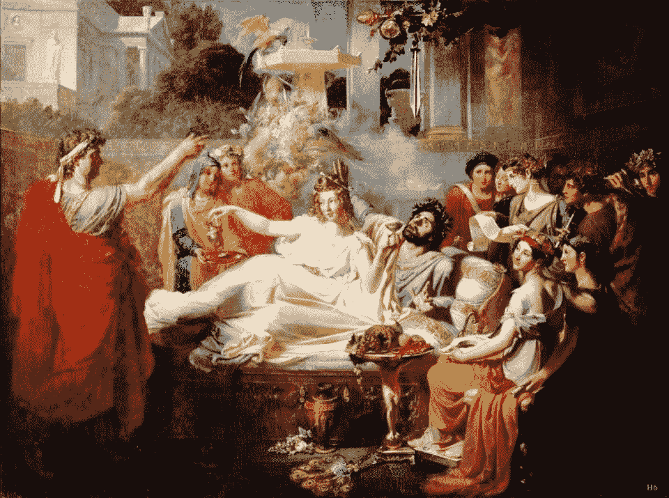

# 学费，学校免费，教育费用

> 原文：<https://medium.com/coinmonks/cost-of-defi-tuition-school-is-free-education-costs-b5189e6c1501?source=collection_archive---------49----------------------->

~dwulf

Sword of Damocles

当杠杆贷款这根线断裂时，我首先想到的是达摩克利斯之剑。伤害了(但没有杀死)我在市场上的崇高地位。

**清算**

我讨厌这个词，我在 Acala 上有一笔超额抵押贷款，低于 160%的门槛。我花了 2/3 的投资组合，37000 到 7000 美元，所有的都解决了，随着市场的自由落体，我只是没有及时得到它来抵消债务。一个 3 万美元的错误，或者说是一所艰苦学校的学费。

随着贷款价值比从警告变为危险，我拼命试图支撑我的 DOT 抵押品，最终无济于事，当 DOT 从 11 美元跌至 8 美元时，一切都结束了。我的金库消失了，里面有我所有的附属点，澳元+15%的罚款+点的价格点，让我崩溃。

大约 30 分钟后，我拿回了我的点数，杠杆的教训花了我 30000 美元的资本，我拿着剩下的点数，押在 LDOT 身上，开始赚取 14%的赌注回报，并开始恢复我失去的东西。

西西弗斯和巨石的教训，在我耳边回响。从头开始，当我开车的时候，我所有的年度收益瞬间化为乌有，这完全是我的错，不是某个骗子，也不是我的地址输入错误。

**那么该怎么办呢？**

被击倒后，要重新站起来。回到火车上，疲惫但并不穷困。这个秋天影响着我们所有人。

吸取的教训

是的，杠杆贷款就是，你所欠的杠杆贷款，你需要你的抵押品的价值，超过借给你的价值。随着市场的波动，现在不是玩杠杆的最佳时机。

幸运的是，阿卡拉有 LDOT 赌注，这将获得稳定的收益，所以用我的点改变，我将赌注，舔我的伤口，而我在我的汤里哭泣。

**结论**

在扑克游戏中，当你认为你有一手好牌，但一手更好的牌击败了你的牌时，这被认为是糟糕的一击。在我的情况下，更好的手是流血的市场。

我从来不会把所有的鸡蛋都放在一个篮子里，我仍然持有我的 Cosmos holdings 和其他 Polkadot holdings (Astar 和 Nodle)，我仍然在与它们合作并参与其中。阿卡拉仍然是我的第一选择，因为它将会有太多的 DeFi 选项。

如果说有什么不同的话，那就是这会让我对剩下的投资组合保持高度警觉和非常小心。是的，我对损失很失望，它抹去了我投资组合全年收益的 2/3。但因为我多元化了，这给我留下了一些前进的选择。