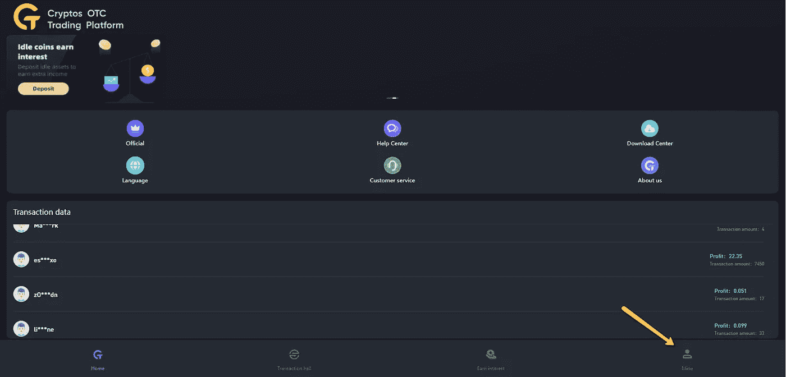
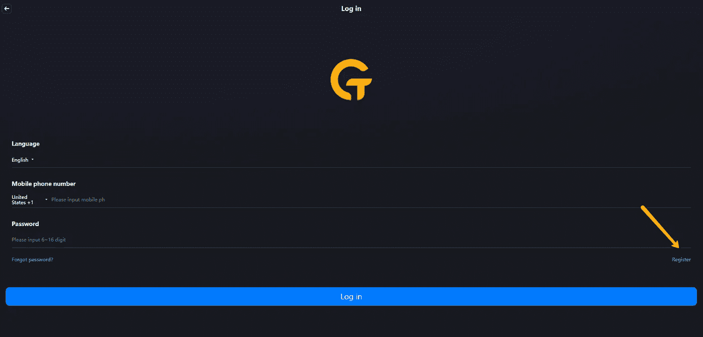
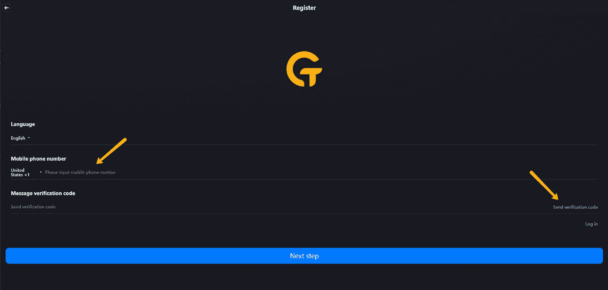
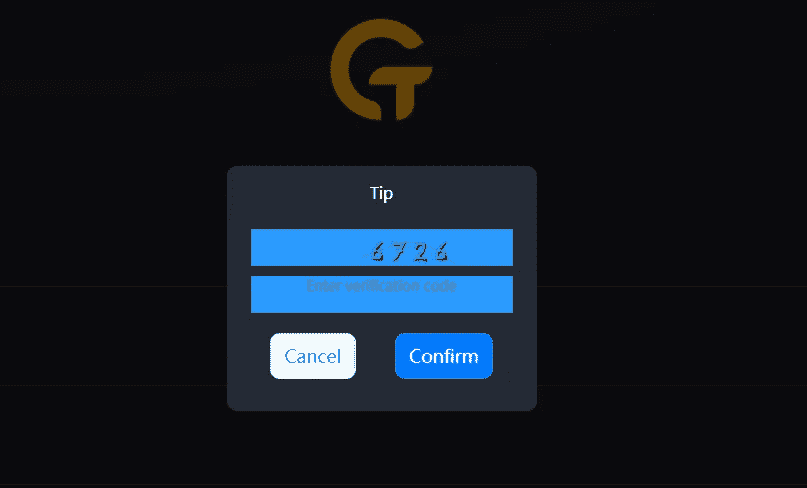
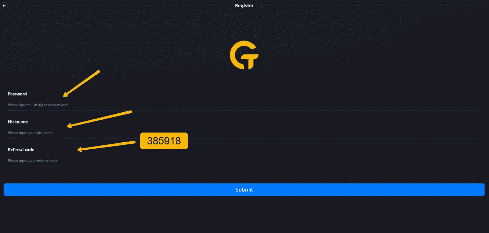
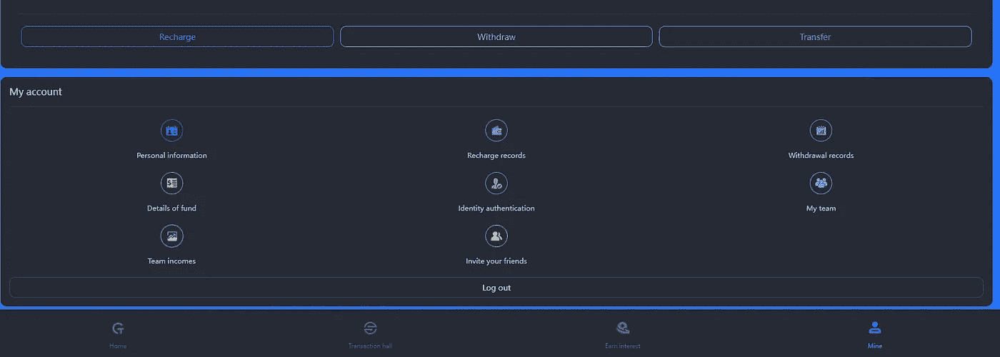

# COTPS:高风险时代的高风险、高回报加密项目

> 原文：<https://medium.com/coinmonks/cotps-a-degen-high-risk-high-reward-crypto-project-for-high-risk-times-6394bbdea225?source=collection_archive---------1----------------------->

*更新:2022 年 5 月 23 日。我认为现在很明显 COTPS 是一个骗局。今天早些时候，该网站发布了一条消息，称“我们被黑客攻击了”，需要“3-5 周时间来修复”没有人相信这一点，而且截至今天下午，该网站本身现在已经离线。我很抱歉地说，人们在这方面投入的钱都没了。幸运的是，我没有在这方面投入太多资金，因为这显然是高风险的。同样幸运的是，这是我在 COTPS 上写的唯一一篇文章，没有人在我下面签名，所以至少我没有让其他人失去他们的钱，尽管世界上有很多其他人这样做了。无论如何，是时候继续前进了。*

*我把这篇文章放在网上主要是出于历史目的——记录这段旅程，包括缺点和所有的，是很重要的。*

*更新:2022 年 5 月 19 日。COTPS 声称现在正在转换短信提供商，并且试图提取资金是无效的，因为验证短信，如果它到达的话，将会延迟到达并且无效。我们仍然不知道这是真的，还是只是一个退出骗局的借口。我们已经知道，另一个“套利”网站 swapnex.io 正在关闭，这显然是一个退出骗局。我强烈反对任何人将资金投入 COTPS，直到提款再次起作用。*

即使在艰难的市场中，这种加密套利策略也在持续创收。

今天是 2022 年 5 月 10 日，密码市场现在一片混乱。我们密码爱好者曾希望密码市场与更广泛的传统金融市场无关，但现在看来并非如此。传统的金融市场也是一片混乱——欧洲的战争，持续的疫情，大规模的国内通货膨胀和不断膨胀的债务都为广泛的金融崩溃创造了一场完美的风暴。

作为加密投资者，我们都知道在这样的下跌市场中，高风险的替代硬币会表现不佳，事实也的确如此。许多与 DeFi 项目相关的流行但有风险的代币，如 Titano forks、Tomb forks、Ohm forks 和所有(伪)节点项目，都比比特币和以太坊等蓝筹币受到了更大的打击。但没有预料到的是，即使是“安全”的选择，如月神和它的稳定硬币 UST，也出现了大规模的暴跌。可悲的是——区块链号上的 UST 是授权所谓安全协议的象征，比如承诺向投资者提供近 20% APR 的锚协议。Anchor 甚至提供了针对智能合同黑客的保险，这使得风险厌恶的投资者更愿意投资于该协议。可悲的是，对 UST 实施了大规模的协同销售攻击，而这并没有得到露娜的充分支持。[细节很复杂](https://mhonkasalo.substack.com/p/navigating-the-ust-crash?s=r)，但净效应是 UST 失去了与美元的挂钩，目前的汇率约为 81 美分。更糟糕的是，LUNA 的价格跌至略高于 14 美元的低点，与一个月前达到的约 116 美元的历史高点相去甚远。像 LUNA 这样的所谓蓝筹股加密机的崩溃严重损害了许多加密投资者对所谓安全投资的信心。

那么，现在密码市场正在遭受打击，我们如何保持我们的财务头露出水面？许多人将出售现金，并希望有更好的日子，而其他许多人将只是继续以廉价出售的价格将美元平均成本(DCA)转换为密码，并希望复苏早日到来。这两种策略都是完全合理的，取决于你的风险承受水平。

但另一种投资理念表明，将你的资金分成不同的部分也是合理的:大部分投资于非常安全/低风险的投资(现金或可能是久负盛名的稳定债券，显然不是 UST)，一些投资于中等风险(蓝筹股 cryptos、DCA 或安然渡过难关)，一小部分投资于高风险到极端风险的项目，这些项目具有可能抵消风险的非常高的潜在回报。

事实上，有一种这样的投资策略，适合那些拥有少量风险资本的人，这种策略持续产生每日被动收入:加密套利。

**推出 COTPS:被动收入加密套利**

对于那些愿意冒险花一点钱(即使只有 100 美元)来尝试高风险/高回报项目的人，让我向你们介绍一下 [COTPS](https://cotps.com/#/) 。这是一个声称在 TRON 网络上从事 USDT 套利交易的项目。该项目似乎是基于亚洲的某个地方(中国？新加坡？不清楚)。该项目允许你 24 小时每 2-2.5 小时“执行套利交易”，如果你做每笔交易，每天产生大约 3-3.5%的利润。当然，没有一个正常人会一天 24 小时不睡觉来做这个，所以交易者在自己的电脑或租来的 VPS 上运行一些简单的自动机器人软件来自动做这个。这个机器人软件是免费的，安装过程非常简单，一旦安装好，整个过程是不干涉的和被动的。只需每天查看一次(或两三次)你的电脑或(更好的主意)租来的 VPS，确保一切都还在运行，你准备好了。COTPS 不断向您的帐户添加更多 USDT，您可以随时提取。

现在让我明确一点:这绝对是一部高风险的“德根”剧。是的，这个项目到目前为止收益不错——我认识很多参与这个项目的人，到目前为止，我和我认识的人都没有遇到任何收回利润的问题。但是项目创始人是未知的，没有社交媒体渠道(没有不和，没有电报)，也没有任何东西阻止神秘的项目所有者随时关闭这个项目，并拿走每个人的资金。这还没有发生，这个项目已经有几个月了，但是在不太遥远的将来很容易发生。目前还不清楚真正的套利交易是否真的在发生，或者这不是部分或全部巧妙伪装的庞氏骗局。我从一些我经常接触的人那里看到一些轶事证据，他们说 [COTPS](https://cotps.com/#/) 确实在币安 P2P 交易所做一些套利交易。这可能是真的，也可能不是。简而言之，这不是你把租金投入的那种项目。这是一个针对少量风险资本的项目，可能会也可能不会在几个月后带来巨大回报，可能会也可能不会消失。这些都是风险，但回报也是巨大的:USDT 每天 3%以上的回报率，这可以很快复利。

我评估了风险和潜在的回报，决定只投入少量到中等数量的我愿意完全失去的钱，以观察会发生什么。为了最小化我的风险，我打算在 33 天左右的时间里以每天 3%的利率撤回我的投资，直到我全部收回。注意:我现在是这个过程的第二天，已经成功取款两次，没有任何问题。如果该项目继续超过 33 天，之后我收回的一切都是无风险利润。即使这个项目消失了，我也能收回我的投资，并获得无风险的每日回报。

那么潜在的回报是什么呢？假设有人投资了价值 1000 美元的 USDT (1000 USDT)，在 33 天后收回投资。再假设这个人只是把资金放在复利上几天。在您花费 33 天收回投资后，结果如下:

*   30 天后，1000 个 USDT 增长到 2428 个 USDT
*   60 天后，1000 个 USDT 增长到 5891 个 USDT
*   90 天后，1000 USDT 增长到 14300 USDT
*   120 天后，1000 个 USDT 增长到 34711 个 USDT

是的，你可以继续复合更长的时间，并获得更大的平衡，并希望该项目仍在你身边收集。或者你可以开始一次撤回一点，以确保获得一些利润。虽然**我不能也不会给出财务建议**，但我个人计划尽快将我的风险降至最低，并执行“快乐中等”策略，让其他人做一些复利并获得一些利润。正如他们所说，“一鸟在手…”

**如何报名**

如果我还没有吓跑你，你想试试看，你可以这样做:

首先，您必须在 COTPS 网站上注册。前往 https://cotps.com[的](https://cotps.com/#/)站点[点击右下角的矿山标签](https://cotps.com)

当您进入下一页时，单击右下角的注册链接:

在下一页中，您将在左侧输入您的手机号码，然后单击右侧的链接发送注册码

一旦你这样做了，你可能会也可能不会得到一个验证码弹出窗口，你必须正确填写以证明你是人类(这很容易，不要担心)。

一旦你这样做了，你会收到一条短信中的代码。输入左边显示“消息验证码”的代码。按下一步进入下一个屏幕。一旦你这样做，你会看到注册屏幕，在那里你输入一个密码，昵称，和推荐代码。**如果你想要我的免费 bot 软件，一定要输入推荐码 385918。**点击提交，您将注册并登录。

接下来，确保您仍在“Mine”选项卡上，以便看到以下信息:

下一步是获得加密地址，您将需要发送一些加密。点击这个部分左上角的充值按钮，你会看到一个 TRC20 加密地址(看起来有点像 THQWg5eASB3…并且大约 34 个字符长)和 QR 码。不需要二维码，只需点击复制按钮，即可复制加密地址。让我们称这个地址为您的“COTPS 资助地址”。

现在你需要发送一些密码到你的 COTPS 账户，也就是你的 COTPS 资金地址。具体来说，这个项目使用 TRON (TRC20)网络上的 USDT 令牌，这对于美国和欧洲的投资者来说可能有点不寻常，但实际上很容易购买和发送。如果您在 binance.com(非美国人)或 kucoin.com(任何人，包括美国人)有现有的加密帐户，最简单的方法是到您的帐户，购买一些 USDT，然后将其发送到您上面复制的 COTPS 资助地址。重要提示:当您发送 USDT 时，请确保您选择了 TRC20 网络！否则您的密码可能会丢失。开始时最好发送少量(如 10 美元),以确保有效。通过 TRC20 网络发送密码的费用很低，所以不会花很多钱。

一旦你的 USDT 到达[的 COTPS](https://cotps.com/#/) ，你应该会在矿井标签页的左上角看到可用的数量。

下一步是设置您的取款地址和交易密码。请注意，交易密码是您用于将资金撤回到您的经纪人/交易所账户的密码，出于安全考虑，它应该不同于登录密码—您希望将您的交易密码保持非常安全，以便只有您可以将 crypto 撤回到您的交易所账户(例如，币安或 kucoin)。取款地址是您的外汇账户中的 USDT TRC20 地址—要登录您的外汇账户(币安或库币)，选择存款，然后选择通过 TRC 20 网络的 USDT。这个过程的具体细节取决于你的经纪人，但应该很容易弄清楚。**再次确认你的存款地址是 TRC20 地址。**

如果你没有币安或库币帐户，或者更喜欢使用另一个携带创币的交易所(TRX，USDT 超过 TRC20)，这取决于你。通过 TRC20 发送 USDT 的细节应该与发送币安或库科恩的细节非常相似。

要设置您的交易密码和取款地址，请在“我的”标签页的左上角找到个人信息图标，然后单击该图标。在那里你会看到你的个人信息。您可以(也应该)使用页面右侧的修改链接设置您的交易密码和取款地址。

接下来，为了最终的提款目的，你必须通过一个简单的 KYC 程序。在“我的”标签页的中间，有一个名为“身份授权”的可点击图标，点击该图标，您将被带到一个页面，在该页面上您可以拍摄一张自己持有驾照或其他 ID 的照片。验证过程非常快，最多几个小时就能通过验证。这是为了你的安全，让随机的人无法盗取你的交易密码，把资金提取到自己的钱包里。您只需要这样做一次。但是到了取款的时候，你可能需要再次提交一张你自己的照片以供核实(取款不需要身份证，只需要身份证原件)。在带有摄像头的笔记本电脑上完成整个过程是最简单的，尽管你也可以在 iPad 或其他平板电脑上完成，甚至是手机。我总是用笔记本电脑。

下一步是可选的，但强烈推荐——获得一个虚拟专用服务器(VPS ),在其上运行我给你的小机器人程序(我稍后会谈到这一点)。是的，你可以在你的家用电脑上运行这个，但是有了 windows 更新和自动重启，你的家用电脑可能会在一夜之间重启，你可能会错过 8 个小时的交易。这根本不值得。你可以很容易地找到一个便宜的 Windows VPS 服务，大约每月 20 美元。我在康塔博花了这么多钱买了这个:[https://contabo.com/en/vps/vps-s-ssd/?addons=1319&image = windows-server . 308&qty = 1&contract = 1&storage-type = VPS-s-200-g b-SSD](https://contabo.com/en/vps/vps-s-ssd/?addons=1319&image=windows-server.308&qty=1&contract=1&storage-type=vps-s-200-gb-ssd)。我买了 3 个月的，但是如果你想的话，你可以按月或者按年买。当然，你也可以使用任何你想要的 Windows VPS 服务。

当您注册 Contabo(或任何 VPS 服务)之类的服务时，通常您需要指定一个自己选择的密码，用于连接到您的服务器。在 Windows 上，您使用 Remote Desktop 客户端进行连接，您可以通过在屏幕左下角的 Windows 搜索区域键入 Remote Desktop 来找到并运行该客户端。设置您的服务器需要几个小时，但一旦设置好，Contabo(或其他 VPS 服务)将向您发送一封包含您的服务器 IP 地址的电子邮件。要连接到您的服务器，请运行远程桌面客户端，输入 IP 地址和密码，它应该会连接到您的服务器。

请注意，当您第一次连接到运行 Windows Server 2022 的 VPS 时，您的 VPS 桌面会向您显示一个复杂的 Windows Server 配置屏幕。放心吧，什么都不用配置！关上那扇窗，你就再也看不到它了。我在我的服务器上做了零配置，它工作得很好。

下一步是通过电子邮件联系我((milgencrypto@gmail.com)，或者通过电报找到我(我的名字是“马克·伊尔根”)，告诉我你是以我的名义注册的。请附上您自己的邀请码，您可以通过转到“我的”标签页并单击“邀请您的朋友”找到该邀请码。你会在二维码下看到自己的推荐码。当我收到你的邮件时，我会给你发一个链接来下载一个包含几个文件的 ZIP 文件。我还会发给你如何下载、安装和运行这个程序的说明。这是一个简单的命令行程序，非常容易配置和运行——您只需要知道一些细节就可以正确地完成它。

终于，你准备好了。只需运行程序并退出远程桌面客户端。你在 VPS 上的程序应该会一直运行下去。你可以(也应该)使用远程桌面客户端每天检查一次你的服务器，以确保一切都还在运行。

希望我们都能在利润持续的时候享受利润，避免加密市场的其他人给我们带来的痛苦。

免责声明:我不是专业的财务顾问、律师或会计师，也不自称是。虽然我尽一切努力提供正确的事实信息，但我的分析和观点总是有可能被证明是错误的。我文章中的所有信息、分析和观点仅用于一般信息和教育目的，不构成法律、税务、会计或投资建议。对一项投资的过去或潜在表现的任何参考都不是，也不应被解释为对未来任何特定结果或利润的建议或保证。我明确否认任何根据我文章中讨论的信息、想法或策略行事的人所承担的任何责任或损失。

> 加入 Coinmonks [电报频道](https://t.me/coincodecap)和 [Youtube 频道](https://www.youtube.com/c/coinmonks/videos)了解加密交易和投资

# 另外，阅读

*   [新加坡十大最佳加密交易所](https://coincodecap.com/crypto-exchange-in-singapore) | [购买 AXS](https://coincodecap.com/buy-axs-token)
*   [投资印度的最佳加密软件](https://coincodecap.com/best-crypto-to-invest-in-india-in-2021) | [WazirX P2P](https://coincodecap.com/wazirx-p2p)
*   [7 个最佳零费用加密交易平台](https://coincodecap.com/zero-fee-crypto-exchanges)
*   [最佳网上赌场](https://coincodecap.com/best-online-casinos) | [期货交易机器人](/coinmonks/futures-trading-bots-5a282ccee3f5)
*   [分散交易所](https://coincodecap.com/what-are-decentralized-exchanges) | [比特恩斯 FIP](https://coincodecap.com/bitbns-fip) | [宾邦评论](https://coincodecap.com/bingbon-review)
*   [用信用卡购买密码的 10 个最佳地点](https://coincodecap.com/buy-crypto-with-credit-card)