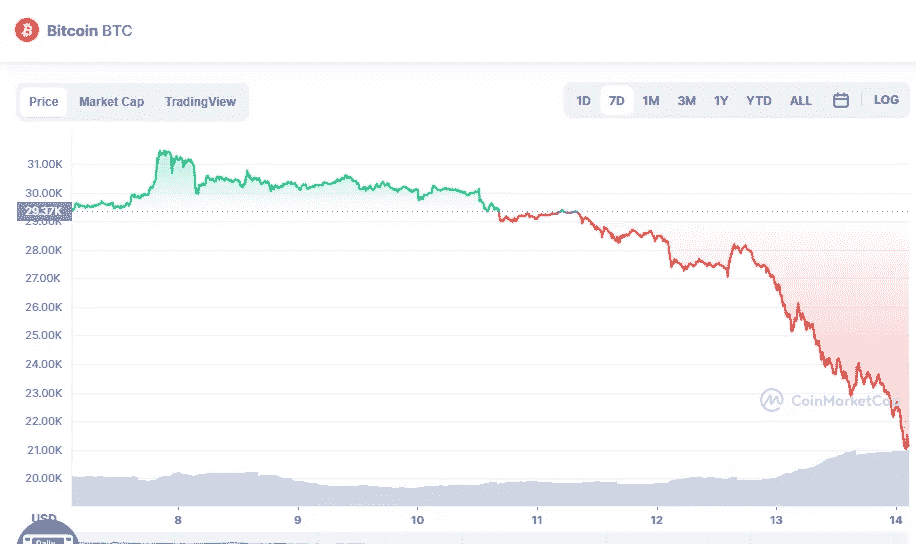

# 比特币(BTC)会跌到 20.000 美元吗？

> 原文：<https://medium.com/coinmonks/could-bitcoin-btc-fall-to-20-000-e1e7b2439360?source=collection_archive---------29----------------------->

Source photo [Bitcoin price today, BTC to USD live, marketcap and chart | CoinMarketCap](https://coinmarketcap.com/currencies/bitcoin/)

比特币市场的悲观趋势始于今年年初。然而，随着市场临近 6 月中旬，空头似乎加大了压力。

由于系统中缺乏流动性，Celsius 网络被指责为当前低于 25，000 美元的下跌原因。当 Terra 崩盘的消息公布后，还没有从恐惧中恢复过来的投资者们惊慌失措。