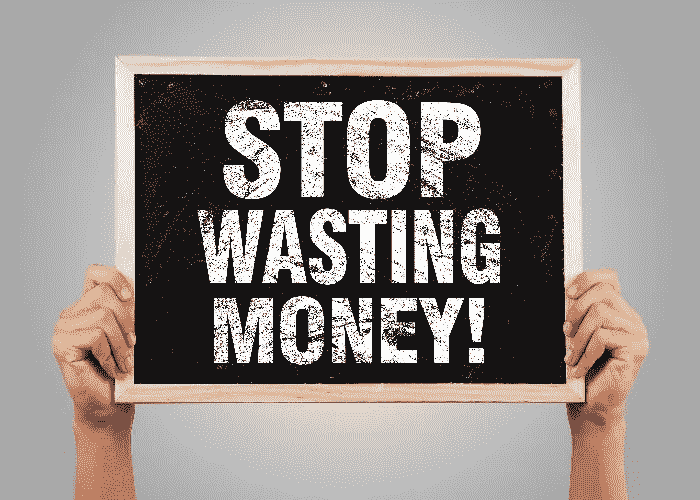

# 加密关联借记卡能带来更广泛的适应性吗？如何实现？

> 原文：<https://medium.com/coinmonks/could-crypto-linked-debit-cards-bring-in-more-wide-spread-adaption-and-how-b84002e05564?source=collection_archive---------56----------------------->

首先，加密本身可能是一个非常复杂和不稳定的资产类别，对于普通人来说，甚至从来没有想过开设一个加密专用投资账户，更不用说把他们辛苦赚来的钱放在里面了。但多年来发生了很多变化，加密在我们的日常生活中发挥着巨大的作用，变得越来越不可避免。到 2021 年底，全球加密应用达到 2.95 亿用户，预计到 2022 年还会有更大的增长，甚至一些专家认为，到今年年底，加密领域的活跃用户将超过 10 亿。我们确实处于 1999 年*互联网采用阶段*。

有很多成长的因素促成了改编叙事的广泛传播。例如，萨尔瓦多将在 2021 年接受比特币作为其法定货币，这为加州引入一项允许其居民使用密码支付州服务的法案铺平了道路，同时也提出了一项单独的法案，使比特币成为该州的*法定货币*。瑞士卢加诺市希望将比特币和其他一些加密货币变成“事实上的”法定货币，从而寻求成为“欧洲的比特币之都”。墨西哥考虑效仿萨尔瓦多，接受比特币作为该国的法定货币。在这一点上，可以有把握地推测，更多的国家将会跟进。

这让我们不禁要问，到底是什么让普通消费者进入了加密领域，又是什么让银行注入了菲亚特爱好者将他们辛苦赚来的钱转向了加密领域？我认为有一个简单的答案，那就是——将我们的日常生活和消费与密码联系起来，我们如何做到这一点，就是让我们如何花钱变得更有吸引力，而不仅仅是在银行和口袋里拿着那张肮脏的钞票。

有哪些可能性？

这让我们想到了与 cyrpto 相关的*借记卡*。Visa 在最近的收益电话会议上表示，在 2022 年的第一个财政季度，客户用他们的加密卡支付了 25 亿美元，占该公司 2021 财年加密量的 70%。Visa 首席执行官 Al Kelly 在*收益电话会议*上表示，“我们将继续向加密领域倾斜，我们的战略是成为一个重要的合作伙伴，提供加密产品继续增长所需的连接性、规模、消费者价值主张、可靠性和安全性。”同样在美国消费者新闻与商业频道[的文章](https://www.cnbc.com/2022/01/28/visa-says-crypto-linked-card-usage-hit-2point5-billion-in-its-first-quarter.html)上，该公司还宣布其加密钱包合作伙伴网络从 54 个增加到 65 个，包括 Crypto.com、比特币基地、Circle 和 BlockFi。接受加密支付的商家数量也增长了近 1 亿。

现在回到普通用户和我自己作为一个生动的加密关联 Visa 卡用户，我确实发现它对于日常使用来说是一个非常有吸引力的选择。我也做了一些关于非加密相关借记卡的研究，以及它们对我来说可能的好处，但是我不得不说，它们相当令人失望。他们确实提供 1-2%的现金返还，但这伴随着额外的*铃声和哨声*，当你开始根据你的使用情况四舍五入一些数字时，这似乎不够有吸引力。例如，作为个人信用卡的主要发行商之一，美国运通提供他们的预付费借记卡，该卡有 1%的无限返现，年费为 95.40 美元。就像我说的，与加密签证卡世界相比，这不是一个有吸引力的选择。

**Crypto.com 预付 Visa 借记卡及其层级**

到目前为止，我的选择是 Crypto.com 的 Royal Indigo 预付费借记卡，没有年费或月费，每次购买都有 3%的现金返还，Spotify 和网飞 100%报销，这意味着它们在我的卡层中是“免费的”。他们是如何做到这一点的，你必须将你的 Crypto.com 借记卡与你的 Spotify 和网飞账户相连接，在他们向你收费后，你将获得 100%的报销，使用他们的本地工具令牌 Cronos。在那之后，你可以自由地把它换成稳定的硬币或任何硬币，这与你的投资策略有关。我喜欢把我的放在克罗诺斯硬币或稳定硬币里。此外，除此之外，我还可以免费无限制地进入 1000 多个不同机场的贵宾休息室，并在我持有的 4000 美元的基础上获得 10%的 APY 股份奖励。这是相当令人惊讶的，当我将这与相同的[相关银行发行的借记卡](https://www.forbes.com/advisor/banking/7-debit-cards-that-pay-cash-back-rewards/#:~:text=The%20American%20Express%20Serve%20Cash,offers%20unlimited%201%25%20cash%20back.&text=How%20It%20Works%3A%20You%20can,up%20to%20the%20nearest%20dollar.)进行比较时，他们似乎不知道什么是有吸引力的优惠，或者普通消费者真正想要的是什么。说了这么多，你可能会问这里有什么问题？这一切听起来好得令人难以置信。

简而言之，没有陷阱，但你需要明白什么是*赌注*。Crypto.com 的 Visa 卡有 5 个不同的等级，第一个是*午夜蓝*，可以免费申请。它提供 1%的现金返还，没有年费或承诺。其余等级需要一定的*赌注*。 *Ruby Card* ，作为下一层，需要 400 美元的股份，这代表您购买价值 400 美元的 Crypto.com 的本地实用程序令牌 Cronos，并将其锁定 6 个月，相同的*锁定期适用于其余层。这意味着，在接下来的 6 个月里，你不能取出这 400 美元，但在锁定期结束后，你可以自由取出这笔钱，永远不要回头看，但你将失去与你的卡层相关的大部分额外津贴，如果这是你想要的。在这 6 个月期间，如果价格波动(这是必然的),您的 400 美元可以升值或贬值，但您不需要将钱添加到*赌注*中来继续使用您的*红宝石* *卡*。*

我认识的一些人首先获得了*红宝石卡*，然后在克罗诺斯币的价值足够升值后，他们能够升级到*皇家靛蓝/翡翠绿*等级卡，而无需支付额外费用。

与此同时，你的 *Ruby 卡*将获得 100%的 Spotify 报销，并且你的每一笔购买都会获得 2%的现金返还，这可以帮助你将*美元平均成本*长期兑换成 Cronos 硬币，或者兑换成你想要的任何硬币。举个例子，Spotify 的月费是 9.99 美元，一年下来可以节省 119.88 美元，对我来说是 131.88 欧元，你可以进行再投资和复利。这就是为什么*红宝石卡*与以下其他等级相比是完美的入门产品。对于皇家靛蓝卡，你必须下注 4000 美元，但它附带了前面提到的所有额外津贴，这符合我个人的长期观点和投资计划。此外，当我根据我的使用情况、赌注奖励和 100%的服务报销合计所有潜在的现金返还时，这是一笔巨大的金额，对我来说绝对是不需要动脑筋的。此外，我必须提到，在我做出决定之前，我做了大量的个人研究，并观看了大量的 Youtube 视频，我建议你在采取任何进一步行动之前也这样做。另外，在考虑其他事情之前，请阅读更多关于 Crypto.com 公司的信息，以及他们的[白皮书](https://crypto.com/images/crypto_com_whitepaper.pdf)中的内容。对我来说，我喜欢我的*皇家靛蓝* *卡*，我的眼睛在他们的下一层，也就是*冰冷的白色卡*，需要额外的 40 000 美元赌注，它还会带来更多的额外津贴。

如果你有兴趣使用 Crypto.com Visa 借记卡，那么我会给你留下我的推荐代码(代码: **acyg88tp4t** )，在这里你将获得 25 美元[签约](https://auth.crypto.com/users/sign_up?ref=acyg88tp4t)奖金。在完全透明的情况下，如果你决定用*赌注*最小换*红宝石牌*，那么我也会得到 25 美元。我与该公司没有其他关联关系。正如我之前所说的，在做任何决定之前做好自己的研究，不要相信任何人的话。

在市场上保持安全。

> 加入 Coinmonks [电报频道](https://t.me/coincodecap)和 [Youtube 频道](https://www.youtube.com/c/coinmonks/videos)了解加密交易和投资

# 另外，阅读

*   [硬币评论](https://coincodecap.com/coinloan-review)|[Crypto.com 评论](/coinmonks/crypto-com-review-f143dca1f74c)
*   [如何在加拿大购买加密货币？](https://coincodecap.com/how-to-buy-cryptocurrency-in-canada)
*   [无聊猿游艇俱乐部(BAYC)评论](https://coincodecap.com/bored-ape-yacht-club-bayc-review)
*   [5 款最佳加密交易终端](https://coincodecap.com/crypto-trading-terminals) | [最佳 DeFi 应用](https://coincodecap.com/best-defi-apps)
*   [最佳网上赌场](https://coincodecap.com/best-online-casinos) | [币安评论](/coinmonks/binance-review-ee10d3bf3b6e) | [BitMEX 评论](https://coincodecap.com/bitmex-review)
*   [麻雀交换评论](https://coincodecap.com/sparrow-exchange-review) | [纳什交换评论](https://coincodecap.com/nash-exchange-review)
*   [美国最佳加密交易机器人](https://coincodecap.com/crypto-trading-bots-in-the-us) | [变化回顾](https://coincodecap.com/changelly-review)