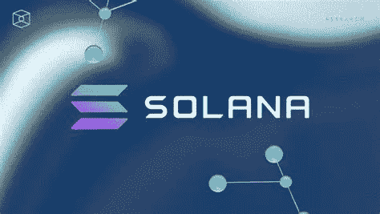

# 索拉纳(SOL)能否达到 2600 美元？

> 原文：<https://medium.com/coinmonks/could-solana-sol-reach-at-2600-c1f17ab50006?source=collection_archive---------40----------------------->

Source photo [solana — Bing images](https://www.bing.com/images/search?view=detailV2&ccid=LYqIEUdI&id=BCF8BD2521CD412DC2F49A3D902CD916D0653BD3&thid=OIP.LYqIEUdIyD9jMYjonDkjDAHaEL&mediaurl=https%3a%2f%2fwww.tbstat.com%2fcdn-cgi%2fimage%2fq%3d80%2fwp%2fuploads%2f2021%2f03%2f20210301_Solana_Map-Research-1196x675.jpg&cdnurl=https%3a%2f%2fth.bing.com%2fth%2fid%2fR.2d8a88114748c83f633188e89c39230c%3frik%3d0ztl0BbZLJA9mg%26pid%3dImgRaw%26r%3d0&exph=675&expw=1196&q=solana&simid=607992375315689865&FORM=IRPRST&ck=8F5DE43B139C118806BDD6924F31A201&selectedIndex=0&ajaxhist=0&ajaxserp=0)

尽管目前的加密市场价格巩固，大多数投资者和专家仍然对索拉纳的未来价格走势持乐观态度，这是值得注意的。

他们认为索拉纳将能够经受住熊市和无数次网络中断所带来的坏名声。SOL 代币投资者只是过度看好代币的潜力…