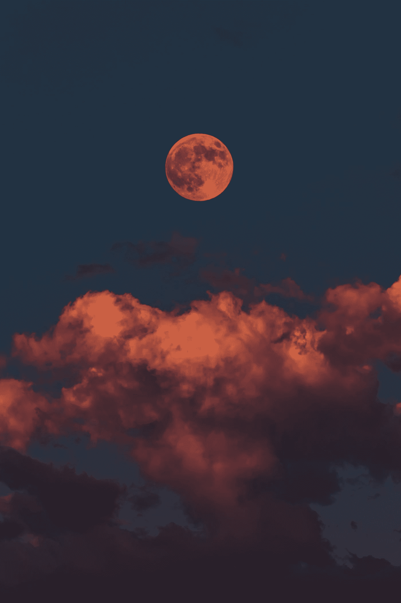

# Terra 会成为隐密体中最大的稳定币吗？

> 原文：<https://medium.com/coinmonks/could-terra-become-the-largest-stablecoin-in-the-cryptoverse-1b9048b23d65?source=collection_archive---------0----------------------->

## 新范式

# 背景

Photo by [Altınay Dinç](https://unsplash.com/@adinc?utm_source=medium&utm_medium=referral) on [Unsplash](https://unsplash.com?utm_source=medium&utm_medium=referral)

这场稳定的争论正在升温——这场对话中有许多令人感动的部分。自 2021 年初以来，我一直是 Terra 的用户和投资者，并见证了这个项目的发展。2022 年 2 月 2 日，我写了一篇[的文章](/coinmonks/happy-luna-terra-new-year-2022-cea6a5472169)，标题是“*八大理由，让我们远离‘咆哮’的土地*……