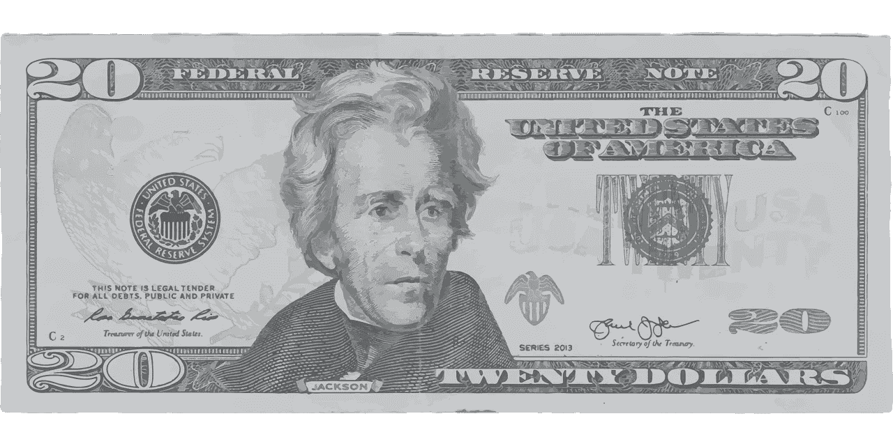
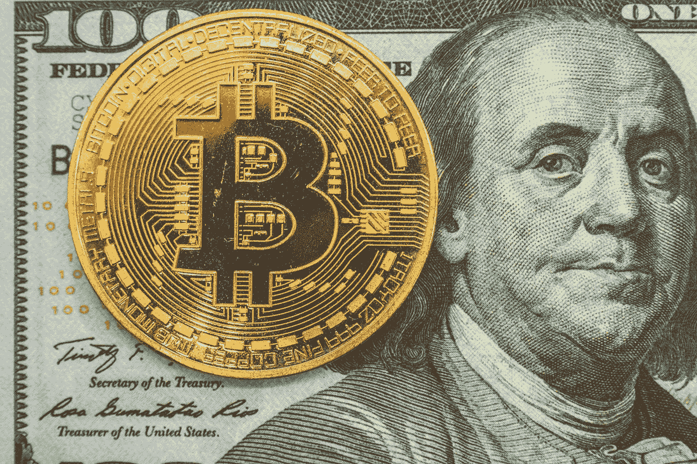
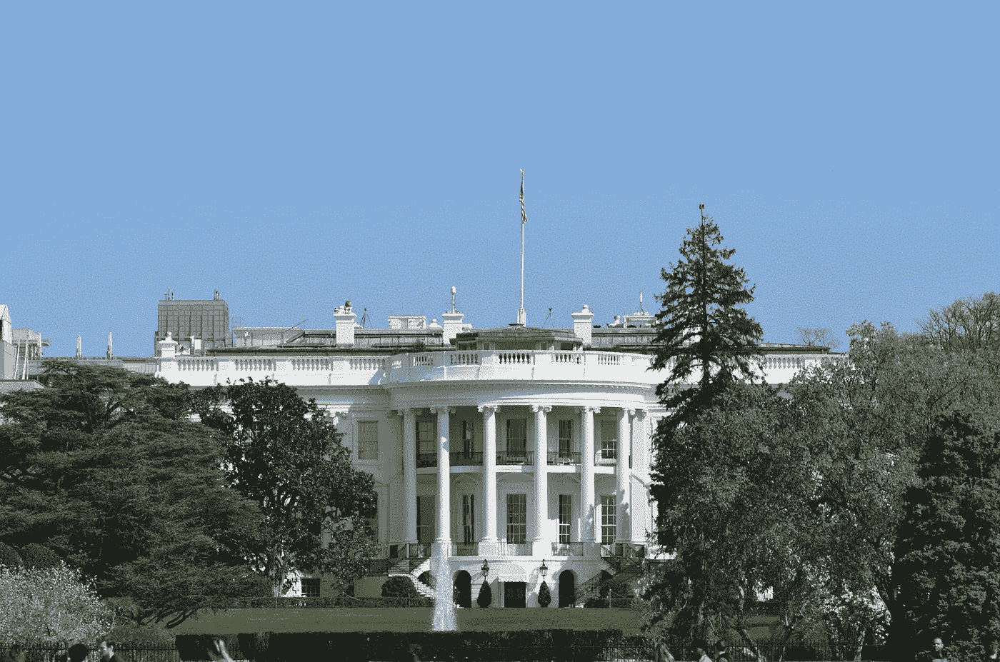
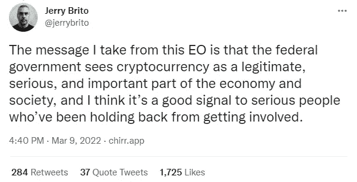

# 第七任美国总统死后能被认为是加密货币之父吗？

> 原文：<https://medium.com/coinmonks/could-the-7th-us-president-posthumously-be-considered-the-father-of-cryptocurrency-be13645e58a4?source=collection_archive---------14----------------------->

Image by [Gordon Johnson](https://pixabay.com/users/gdj-1086657/?utm_source=link-attribution&utm_medium=referral&utm_campaign=image&utm_content=4911162) from [Pixabay](https://pixabay.com/?utm_source=link-attribution&utm_medium=referral&utm_campaign=image&utm_content=4911162)

## ***钞票的复仇和密码的兴起——一切旧的都是新的***

如果你认为加密货币的基础始于 2008 年比特币创始人中本聪(这是他使用的化名，没有人真正知道他是谁)，那你就错了。推动加密货币发展的相同原则实际上开始得更早——比如近 200 年前的安德鲁·杰克逊总统，他经常被称为“老山核桃”他被认为是普通人的捍卫者，反对权力集中在一小撮特权人士手中。他反对国家银行的政治和经济权力以及缺乏监督。

作为总统，他在 1833 年宣布关闭被称为美国第二银行的国家银行的[，并将资金重新分配给各州银行。这样做，杰克逊分散了银行业，这给了公众更多的选择，也在一段时间内为各州提供了灵活性。事实上，在 1835 年，他成为唯一一位还清国债的总统。今天超过了 30 万亿美元，相当于美国人均 9 万美元。](https://www.history.com/this-day-in-history/andrew-jackson-shuts-down-second-bank-of-the-u-s)

杰克逊于 1845 年去世，他的一些政策引起了争议。然而，这篇文章只关注杰克逊在货币去中心化背后的价值观之间的联系，以及它与今天不断发展的加密货币之间的关系。归结起来就是:加密货币和其他数字资产流行背后的关键力量是不受政府入侵的灵活性和隐私性。

虽然我们不知道 crypto 会带来什么变化，但我们可以从历史中学到一些东西。

## **纸币之死和货币统治之战**

让我们退后一步，了解一下 crypto 的发展方向，以及它将如何继续改变人们购买商品和服务以及进行投资的方式。在 19 世纪，随着黄金和白银演变成更便于携带的地方纸币，各国拥有了自己的私人货币，这使它们能够在开展业务时支持交易。

有了纸币，人们不再需要携带那么多沉重的金币和银币。当时，银行券被认为是一种创新的支付形式，创造了一种灵活性，因为人们不依赖于单一的货币发行者。听起来熟悉吗？

随着 1863 年《国家货币法案》的颁布，美国政府在国家混乱时期——内战——开始集中银行业，并发行纸币，支付士兵和战争供应商的费用。新法试图将国有银行转变为国家银行，并对其进行标准化和更多的限制。如果没有这场如此重要和消耗巨大的战争的迷雾，集中这样的权力几乎是不可能的。

Image by [Mary Pahlke](https://pixabay.com/users/905513-905513/?utm_source=link-attribution&utm_medium=referral&utm_campaign=image&utm_content=1342115) from [Pixabay](https://pixabay.com/?utm_source=link-attribution&utm_medium=referral&utm_campaign=image&utm_content=1342115)

当许多地方银行不愿意转行时，1865 年，国会对州立银行的纸币征收 10%的税，这导致大多数州立银行一度衰落。然而，国有银行实际上重新崛起，并最终在 1900 年通过提供客户想要的更多服务选项而超过了国有银行。美国联邦储备系统于 1913 年诞生，最后一张纸币于 1929 年发行。

## **回到现在——货币的灵活性和创新精神**

虽然美国钞票可能很久以前就已经“死亡”，但现在它以一种更加现代、灵活和创新的形式回归——加密货币。没错。加密货币是新的纸币，但这一次它更有效、更透明，并且有潜力实现一个更加光明、可持续的未来。随着加密货币等数字资产的兴起变得更加主流，银行和其他企业将需要继续适应，否则就有可能错过这一收入机会。

随着加密货币的扩散和日益增长的接受度和增长，我们今天的情况是，区块链和加密货币由于其可扩展性、便利性、效率、每笔交易的低成本、跨境支付的速度和增长机会，正在颠覆金融服务。

在这个混乱的时代，受疫情、经济现实、气候变化、战争、社会动荡和其他因素的影响，许多人和企业会越来越多地寻找更好地控制自己生活的方式，这是有道理的。我们期望在如何进行交易、购物、储蓄、投资和获得报酬方面更加个性化。控制也可以是拥有更多选择和选择我们更喜欢使用或投资的货币的自由，并在我们需要时以闪电般的速度在世界任何地方安全、可靠地交付。

数字资产可以满足这些需求。德勤最近对全球金融领袖进行的一项区块链调查描述了在未来 5 到 10 年内，数字资产将如何取代法定货币。他们的调查受访者希望看到各种数字资产类型的积极影响，包括稳定硬币或中央银行数字货币、算法驱动的稳定硬币和企业控制的硬币。

Photo by [Bermix Studio](https://unsplash.com/@bermixstudio?utm_source=unsplash&utm_medium=referral&utm_content=creditCopyText) on [Unsplash](https://unsplash.com/s/photos/digital-currency?utm_source=unsplash&utm_medium=referral&utm_content=creditCopyText)

加密货币通过依赖代码来管理发行和交易，反映了货币和选择去中心化的自由和趋势，因为它不依赖于中央发行机构。它使用区块链技术，利用计算机跟踪交易的增长。如果没有中央计算机或服务器来监控加密，资金的转移就没有中间人。加密货币以及加密令牌确保了资产的真实性并消除了伪造。

比特币是迄今为止最受欢迎的数字资产，它的一个优势是它是有限的——只有 2100 万个比特币，除了大约 200 万个之外，其余都有待挖掘。因为它是有限的，所以在金融危机期间无法扩大规模，政府也无法操纵比特币。

我们已经看到公司、银行、艺术品经销商、房地产公司和其他实体对加密货币的许多使用。例如，PayPal 正在探索推出自己的[稳定币](https://www.bloomberg.com/news/articles/2022-01-07/paypal-is-exploring-launch-of-own-stablecoin-in-crypto-push)。联合银行提供拥有密码的基金。这个清单还在继续。

许多国家已经走在了接受加密货币力量的前列。根据[全国州议会会议(NCSL)，](https://www.ncsl.org/research/financial-services-and-commerce/cryptocurrency-2022-legislation.aspx)37 个州和波多黎各在 2022 年立法会议期间有关于加密货币、数字或虚拟货币和其他数字资产的待决立法。此外，其他一些州已经颁布了立法。

## **法规、数字资产和未来**

OCC 最近宣布，允许国家银行为加密货币提供保管服务，因此银行可以为客户存储数字钱包代码。这是一个巨大的转变，将刺激加密货币的采用。

直到最近，联邦政府才出台了很多关于加密的指导方针。2022 年 3 月 9 日，白宫发布了针对数字资产的[行政命令](https://www.whitehouse.gov/briefing-room/presidential-actions/2022/03/09/executive-order-on-ensuring-responsible-development-of-digital-assets/)。该命令启动了为数字货币制定法规的进程。这表明加密不再仅仅是一项小众技术。事实上，根据该命令，2021 年 11 月，非国家发行的数字资产的总市值达到[3 万亿美元](https://www.whitehouse.gov/briefing-room/presidential-actions/2022/03/09/executive-order-on-ensuring-responsible-development-of-digital-assets/)，高于 2016 年 11 月初的约 140 亿美元。

Photo by [Michael Schofield](https://unsplash.com/@coachpotatoes?utm_source=unsplash&utm_medium=referral&utm_content=creditCopyText) on [Unsplash](https://unsplash.com/s/photos/the-white-house?utm_source=unsplash&utm_medium=referral&utm_content=creditCopyText)

“我从这个(行政命令)中得到的信息是，联邦政府认为加密货币是经济和社会中合法、严肃和重要的一部分，我认为这对那些一直不愿参与其中的严肃人士来说是一个好信号，”DC 加密智库硬币中心的执行董事杰里·布里托[在一条推特](https://twitter.com/jerrybrito/status/1501583677112799232)中说。

Screenshot Twitter

权力下放通过降低重大系统性失败的风险，如需要重大救助的华尔街银行的倒闭，提供了对货币体系的信心和信任。在 *Inc 杂志*上的一篇关于[去中心化的三个重要优势](https://www.inc.com/kenny-kline/3-important-advantages-of-decentralization.html)的文章描述了加密货币价值的上升“也反映了人们对中央银行和政府规划者的动机、道德或能力的怀疑。他们的基本协议，去中心化，是大到不能倒的解药。"

根据德勤[区块链](https://www2.deloitte.com/us/en/insights/topics/understanding-blockchain-potential/global-blockchain-survey.html)的调查，对于银行来说，金融服务业的数字资产前景光明。资金流动速度快，成本低，融资渠道将扩大，经济活动的总体速度将呈指数级增长。银行和其他行业必须接受这一变化。

杰克逊临终前对他的孩子们说的最后几句话是，“……努力做好准备，迎接变化的到来。”当冲突或危机的情况看起来最可怕的时候，世界正在穿越最浓的战争迷雾，为改变做好准备。因此，在加密货币和去中心化力量的战场上，老山胡桃的精神依然鲜活。是时候承认他在这场战斗中的决心了。

> *加入 Coinmonks* [*电报频道*](https://t.me/coincodecap) *和* [*Youtube 频道*](https://www.youtube.com/c/coinmonks/videos) *了解加密交易和投资*

# 另外，阅读

*   [有哪些交易信号？](https://coincodecap.com/trading-signal) | [Bitstamp vs 比特币基地](https://coincodecap.com/bitstamp-coinbase) | [买索拉纳](https://coincodecap.com/buy-solana)
*   [ProfitFarmers 回顾](https://coincodecap.com/profitfarmers-review) | [如何使用 Cornix Trading Bot](https://coincodecap.com/cornix-trading-bot)
*   [十大最佳加密货币博客](https://coincodecap.com/best-cryptocurrency-blogs) | [YouHodler 评论](https://coincodecap.com/youhodler-review)
*   [my constant Review](https://coincodecap.com/myconstant-review)|[8 款最佳摇摆交易机器人](https://coincodecap.com/best-swing-trading-bots)
*   [MXC 交易所评论](/coinmonks/mxc-exchange-review-3af0ec1cba8c) | [Pionex vs 币安](https://coincodecap.com/pionex-vs-binance) | [Pionex 套利机器人](https://coincodecap.com/pionex-arbitrage-bot)