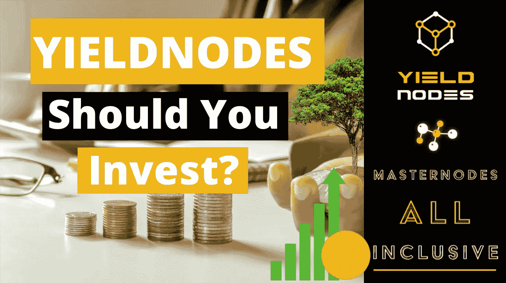

# YieldNodes 能成为适合你的投资平台吗？

> 原文：<https://medium.com/coinmonks/could-yieldnodes-be-the-right-investment-platform-for-you-c649e5ccc5aa?source=collection_archive---------19----------------------->

Could YieldNodes be the perfect fit for you?

大家好！

在本文中，我想帮助你决定 YieldNodes 是否是适合你的投资平台。我们将着眼于不同的论点，作为一个已经投资 YieldNodes 近 3 个月的人，我试图给出我的观点。

我已经写了一些关于 YieldNodes 许多方面的博客，欢迎点击这里查看。

# 介绍

那么到底什么是屈服节点呢？简而言之:他们租用服务器，购买加密货币来运行所谓的主节点。这些都是运行区块链并从用户的交易费用中获得回报所需要的。请注意，YieldNodes 不是在交易加密货币，而是在投资基础设施。尽管如此，他们仍然依赖于密码市场来做好整体。

*来自常见问题解答(见下面的链接):*

> *它已经从最初的一个纯粹的策划项目发展成为一个策划/赌注的混合体，通过收购硬币/合作伙伴关系而成长，并在这个过程中变得更类似于一家初创公司——从我们说话的时候正在开发的许多子项目和用例中产生额外的收入。*
> 
> *产生的一切都被扔进了锅里，每个月按照参与者 85%、收益者 15%的比例发放*

到目前为止，在两年多的时间里，他们设法为你的投资带来了 5-15%的回报。

# 我的案子

什么时候 YieldNodes 是适合你的投资？也许从我的案子开始吧。大约一年以来，我积极投资加密货币。我的投资组合中有一小部分投资于 YieldNodes，因为我觉得通过大量的研究和学习，我可能能够抓住趋势，并超越 YieldNodes 的回报。但我仍然渴望动荡时期的稳定。我喜欢我的投资以欧元计价，并且每个月都有回报。

用 YieldNodes 投资是不需要手动的，它们甚至会自动计算你的收益，而不是把它们支付出去。我会在我关于 T7 的博客中做更详细的介绍。

我在我的加密投资中看到了很多起伏，你的投资组合可能会大幅波动，尤其是当你投资较小的硬币时。在我的投资组合中，有一个更安全的稳定投资组合，它在 Terra 上的 Anchor Protocol 中获得 19.5%的收益，但看到 crypto 中疯狂的增长可能性，如果我不尝试 YieldNodes，我会感觉错过了机会。

# 何时考虑让步节点

《如果你》

*   想要一个解放双手的投资
*   几乎没有技术知识
*   不想自己研究加密市场和协议
*   想要压倒性地战胜通货膨胀(尤其是复利)
*   正在寻找比股票更有收益的高风险投资

你应该考虑仔细观察屈服节点。随着收益节点的惊人增长，即使是更小的复合金额也能迅速产生影响。我仍然认为这是一项长期投资，但我对这个团队充满信心。

# 何时远离屈服节点

如果另一方面你

*   不想把你的钱锁起来 6 个月
*   想自己交易/研究密码吗
*   不要相信 YieldNodes 团队，因为你没有保管你的钱

你应该只投资最少的金额或者完全远离这个项目。我知道有些事情听起来好得不像真的，但很有可能是真的。YieldNodes 的创始人表示，他有大约 25%的自有流动资金用于投资。

我喜欢上面风险评估/常见问题中的这一部分:

> ***我很疑惑——我该怎么办？***
> 
> 如果你不确定是否应该加入，那就不要加入。最终，你需要能够在晚上睡觉，而不是一直担心你的参与。或者，你可以种下一颗种子——如果 500 欧元不会让你倾家荡产，那就尝试一段时间，看看它如何成长。这样，你参与进来，不会错过，但如果事情出了差错，痛苦也不会那么糟糕。

请在评论中告诉我哪个简介更好地描述了你，或者我可能错过了哪些论点！

今天到此为止，祝您度过愉快的一周！
n1ce

如果你想了解更多，可以看看我在 YieldNodes 上的[其他博客。](https://www.publish0x.com/defi-adventures)

如果你觉得这篇文章有帮助，请考虑给它一个大拇指，并在注册 YieldNodes 时使用我的链接。

订阅每封邮件获取我的帖子:[https://n1ce.substack.com/](https://n1ce.substack.com/)

在推特上关注我:[https://twitter.com/0xn1ce](https://twitter.com/0xn1ce)

我的一天:

# 想从 YieldNodes 开始吗？

*   做你自己的研究，最后我只是一个在互联网上随机的家伙！
*   前往 [YieldNodes 并注册](https://yieldnodes.com/?a=MyKawjWO4Aj6qAW&trk=medium) r。这是一个附属链接。我赚你押金的 5%,不收你额外费用。提前感谢！
*   只投资你能承受的损失
*   通过比特币(或信用卡)存款—查看我的[完整存款指南(点击此处)](https://www.publish0x.com/defi-adventures/yieldnodes-step-by-step-deposit-guide-use-bitcoin-wallet-kra-xlzrqxp)
*   如果你想知道更多，请告诉我，你可以在推特上联系我

*最初发表于*[*【https://www.publish0x.com】*](https://www.publish0x.com/defi-adventures/could-yieldnodes-be-the-right-investment-platform-for-you-xdgvdjz?a=3YaOyGxQdx)*。*

> 加入 Coinmonks [电报频道](https://t.me/coincodecap)和 [Youtube 频道](https://www.youtube.com/c/coinmonks/videos)了解加密交易和投资

# 另外，阅读

*   [加拿大最佳加密交易机器人](https://coincodecap.com/5-best-crypto-trading-bots-in-canada) | [库币评论](https://coincodecap.com/kucoin-review)
*   [火币加密交易信号](https://coincodecap.com/huobi-crypto-trading-signals) | [HitBTC 审核](/coinmonks/hitbtc-review-c5143c5d53c2)
*   [如何在 FTX 交易所交易期货](https://coincodecap.com/ftx-futures-trading) | [OKEx vs 币安](https://coincodecap.com/okex-vs-binance)
*   [OKEx vs KuCoin](https://coincodecap.com/okex-kucoin) | [摄氏替代品](https://coincodecap.com/celsius-alternatives) | [如何购买 VeChain](https://coincodecap.com/buy-vechain)
*   [ProfitFarmers 回顾](https://coincodecap.com/profitfarmers-review) | [如何使用 Cornix Trading Bot](https://coincodecap.com/cornix-trading-bot)