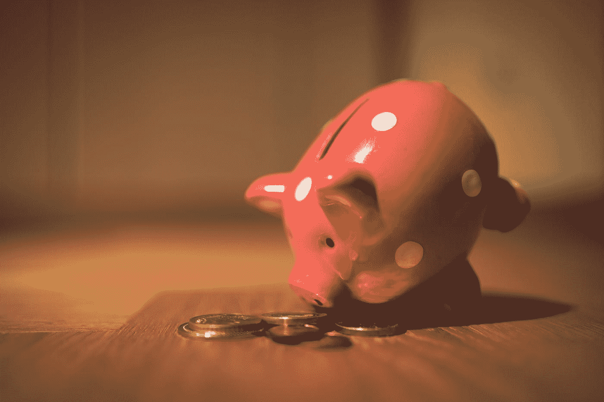
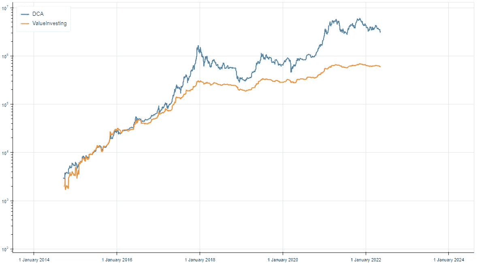
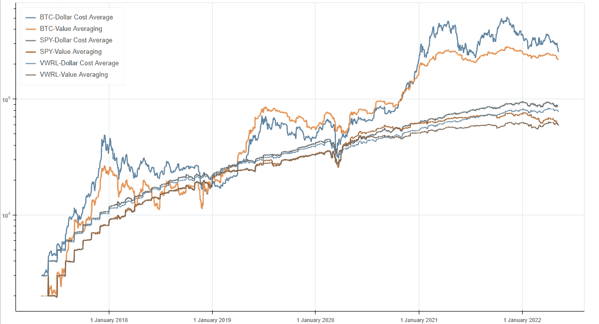

# 收益比 DCA 好？！

> 原文：<https://medium.com/coinmonks/could-you-be-making-better-gains-than-dollar-cost-averaging-5948bb6c7448?source=collection_archive---------8----------------------->

你能把握市场时机吗？



Photo by [Andre Taissin](https://unsplash.com/@andretaissin?utm_source=medium&utm_medium=referral) on [Unsplash](https://unsplash.com?utm_source=medium&utm_medium=referral)

# 什么是美元成本平均法和价值平均法投资策略？

如果你没有遇到过 DCA(美元成本平均法)或 VA(价值投资法)，在 [Investopedia](https://www.investopedia.com/articles/stocks/07/dcavsva.asp) 上有一个很好的资源，对于 DCA，[我在](https://alexford9296.medium.com/dollar-cost-averaging-bot-for-binance-and-coinbase-pro-6b9be7ca074b)之前已经写了一篇文章。

我将在下面简要介绍这两个问题

## 美元成本平均法

这种投资策略包括将总额为 400 美元的现金进行分割，并在一段时间内(即 4 个月)将其投资于一项资产。在这个例子中，我每个月投资 100 美元到 BTC，导致价格看起来像这样。

```
+------------+-----------+-----------+--------------+
        |    Date    | BTC Price | Purchased | Asset Amount |
        +------------+-----------+-----------+--------------+
        | 01/08/2021 |    39,865 | $100      |     0.002510 |
        | 01/09/2021 |    48,839 | $100      |     0.002050 |
        | 01/10/2021 |    48,159 | $100      |     0.002080 |
        | 01/11/2021 |    89,420 | $100      |     0.001120 |
        +------------+-----------+-----------+--------------+
```

不管价格如何，我们总是投资 100 美元，得到相应数额的 BTC。

## 价值平均法

价值平均就是在资产价格低的时候多买，在资产价格高的时候少/卖。例如，假设在 4 个月内，我想要价值 400 美元的 BTC。我购买 BTC 的数量会随着价格波动——见下文

```
+---------+----------+----------+----------+---------+----------+
|  Date   | BTC Prce | Req Amnt | BTC Amnt |  Value  |  Action  |
+---------+----------+----------+----------+---------+----------+
| 1/8/21  |   39,865 | $100     |        0 | 0       | +$100    |
| 1/9/21  |   48,839 | $200     |  .002510 | $122.58 | +$77.41  |
| 1/10/21 |   48,159 | $300     |   .00409 | $196.97 | +$103.03 |
| 1/11/21 |   89,420 | $400     |   .00524 | $468.56 | -$68.56  |
+---------+----------+----------+----------+---------+----------+
```

前三个月，我加上 X 金额，达到我每月 100 美元的“所需金额”，直到 400 美元。当 BTC 股价上涨到 89，420 美元时，我的 0.00524 美元的 BTC 价值超过 400 美元，所以我卖了 68.56 美元，使它降到预计值。

## 好吧，那哪个更好？

嗯，这是值得讨论的，两者都有利弊，DCA 非常被动，VA 帮助利用下跌(如果它停止下跌！).我们生活在一个可以凭经验测试这些东西的世界，所以让我们开始吧！

# 使用 BackTrader 进行回溯测试

## 什么是回溯测试？

回溯测试是一种了解策略在过去数据上表现如何的方法。例如，2015 年至 2020 年，一美元成本平均战略的效果如何？

## 反向交易者

Backtrader 是一个用于回溯测试的 python 库。你定义你的策略，backtrader 会根据你提供的数据量运行它，包括佣金、成本等。

我发现这个库还可以使用，它不像 Backtesting.py 那么简单——我摆弄了一下才发现它不适合上面的策略，但是 backtrader 确实有很多特性。Backtrader 的 Github 在这里:【https://github.com/mementum/backtrader】T4 如果你想看的话。

还有一个专门讨论反向交易者问题的论坛，我发现非常有用，即使维护者有时有点混蛋…

> 给你一个警告——back trader 不直观，当你第一次开始时代码看起来很晦涩——亚历克斯·福特 2022

## 简单的策略

backtrader 页面上有很多文档，这里有一个简单的 DCA 策略的例子。

Code snippet of a Backtrader Strategy

要运行这个策略，您可以使用下面的

这里有几点，出于几个原因，我在默认的反向交易运行中添加了一些内容。

## ComissionInfo

加密回溯测试的一个问题是 Backtrader 本身不支持分数股，因此我们只能购买≥1 的股份，如果你不富裕，这是行不通的，尤其是当 BTC 超过 60K 时

## 现金市场分析器

正如我提到的，有时从 Backtrader 获得数据是没有帮助的，当策略运行时，我无法获得不同点的账户价值。相反，你必须使用一个分析器，这个分析器在不同的日期报告账户的价值。

# 结果时间

## BTC DCA — 10 年回溯测试

```
Results For Dollar Cost Average on BTC
--------------------------------------------------
Dollar Cost Averaging
Months Passed:		62
Buy Orders:		61
Sell Orders:		0
Total Shares:		7.69
Total Value:		$252,397.48
Total Shares Value:	$251,397.48
Total Cash Value:	$0
Cost:		        $61,000.01
Gross Return:		$191,397.47
ROI:		        313.77%
--------------------------------------------------
```

这些都是相当不错的回报，在 5 年的时间里，你可以为自己净赚 19.1 万英镑！这与当前的 BTC 下跌(2022 年 9 月 5 日交易价格为 32622 美元)一致。让我们看看 VA

## 弗吉尼亚州 BTC—10 年回溯测试

```
Results For Value Averaging on BTC
--------------------------------------------------
Value Investing
Months Passed:		62
Buy Orders:		32
Sell Orders:		28
Total Shares:		1.59
Total Value:		$134,273.99
Total Shares Value:	$51,861.88
Total Cash Value:	$82,412.11
Cost:		        $147,138.44
Gross Return:		$-12,864.44
ROI:		        -8.74%
--------------------------------------------------
```

现在，这不是 VA 帮想要的，这将花费我们 14.7 万，失去 1.2 万！想象一下！

## 可视化结果

如果我们用对数标度绘制两者随时间变化的权益图，我们可以看到 VA 保持了一个相当稳定的值，而 DCA 的波动性要大得多，但总的来说 DCA 在大约 10 年的时间里胜出。



10 Year DCA vs VA for BTC

# 加密与其他资产——股票市场更好了吗？

由于我已经有了代码，我想我会比较它与间谍和 VWRL 看看回报看起来像什么，BTC 弗吉尼亚州确实击败了 BTC DCA 在这里，因为这只是超过 5 年



5 Years DCA and VA over various assets

看看这个，BTC 在过去 5 年的回报击败了 SPY 或 VWRL，不管是什么，即使是在 2020 年 3 月的 COVID 崩溃期间。加密仍然是一个成熟的资产类别，假设回报将慢慢变平——看看回报递减规律。

# TL；速度三角形定位法(dead reckoning)

DCA 到月球。此处提供代码:[https://github.com/alxfordy/Investing_Backtest_Strategies](https://github.com/alxfordy/Investing_Backtest_Strategies)

> 加入 Coinmonks [电报频道](https://t.me/coincodecap)和 [Youtube 频道](https://www.youtube.com/c/coinmonks/videos)了解加密交易和投资

# 另外，阅读

*   [3 商业评论](/coinmonks/3commas-review-an-excellent-crypto-trading-bot-2020-1313a58bec92) | [Pionex 评论](https://coincodecap.com/pionex-review-exchange-with-crypto-trading-bot) | [Coinrule 评论](/coinmonks/coinrule-review-2021-a-beginner-friendly-crypto-trading-bot-daf0504848ba)
*   [莱杰 vs Ngrave](/coinmonks/ledger-vs-ngrave-zero-7e40f0c1d694) | [莱杰 nano s vs x](/coinmonks/ledger-nano-s-vs-x-battery-hardware-price-storage-59a6663fe3b0) | [币安评论](/coinmonks/binance-review-ee10d3bf3b6e)
*   [Bybit Exchange 评论](/coinmonks/bybit-exchange-review-dbd570019b71) | [Bityard 评论](https://coincodecap.com/bityard-reivew) | [Jet-Bot 评论](https://coincodecap.com/jet-bot-review)
*   [3 commas vs crypto hopper](/coinmonks/3commas-vs-pionex-vs-cryptohopper-best-crypto-bot-6a98d2baa203)|[赚取加密利息](/coinmonks/earn-crypto-interest-b10b810fdda3)
*   最好的比特币[硬件钱包](/coinmonks/hardware-wallets-dfa1211730c6) | [BitBox02 回顾](/coinmonks/bitbox02-review-your-swiss-bitcoin-hardware-wallet-c36c88fff29)
*   [BlockFi vs 摄氏](/coinmonks/blockfi-vs-celsius-vs-hodlnaut-8a1cc8c26630) | [Hodlnaut 点评](/coinmonks/hodlnaut-review-best-way-to-hodl-is-to-earn-interest-on-your-bitcoin-6658a8c19edf) | [KuCoin 点评](https://coincodecap.com/kucoin-review)