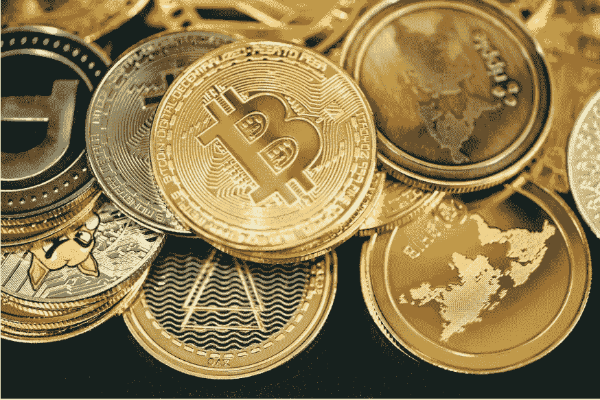

# 被评为世界上对加密货币最友好的国家

> 原文：<https://medium.com/coinmonks/country-named-worlds-friendliest-nation-to-cryptocurrency-5860929adc51?source=collection_archive---------15----------------------->

Image via [Unsplash.com- Quantitatives](https://images.unsplash.com/photo-1640161704729-cbe966a08476?ixlib=rb-1.2.1&ixid=MnwxMjA3fDB8MHxwaG90by1wYWdlfHx8fGVufDB8fHx8&auto=format&fit=crop&w=1172&q=80)

## 一个国家在采用和欢迎加密方面做得比其他任何国家都多

加密货币仍然是一个非常成长的实体。不仅每天都有新的密码进入这个领域，世界还在寻找哪些密码是投资、增长和使用的最佳机会。然而，大多数人…