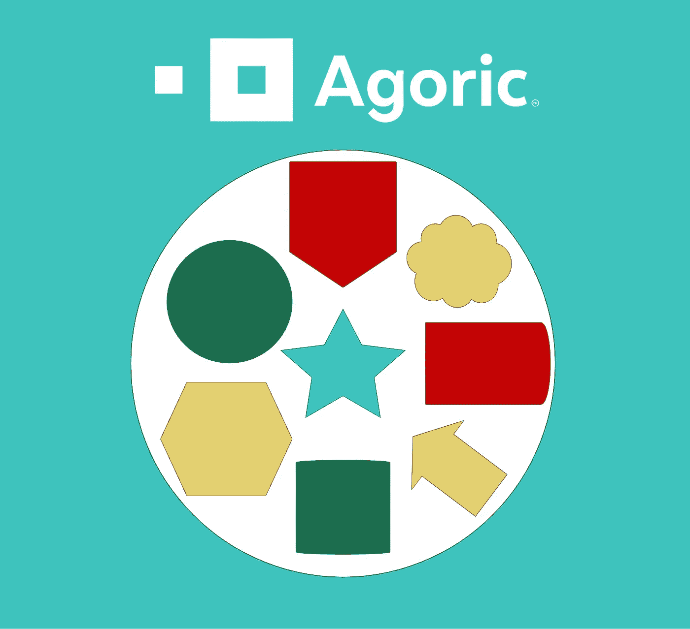
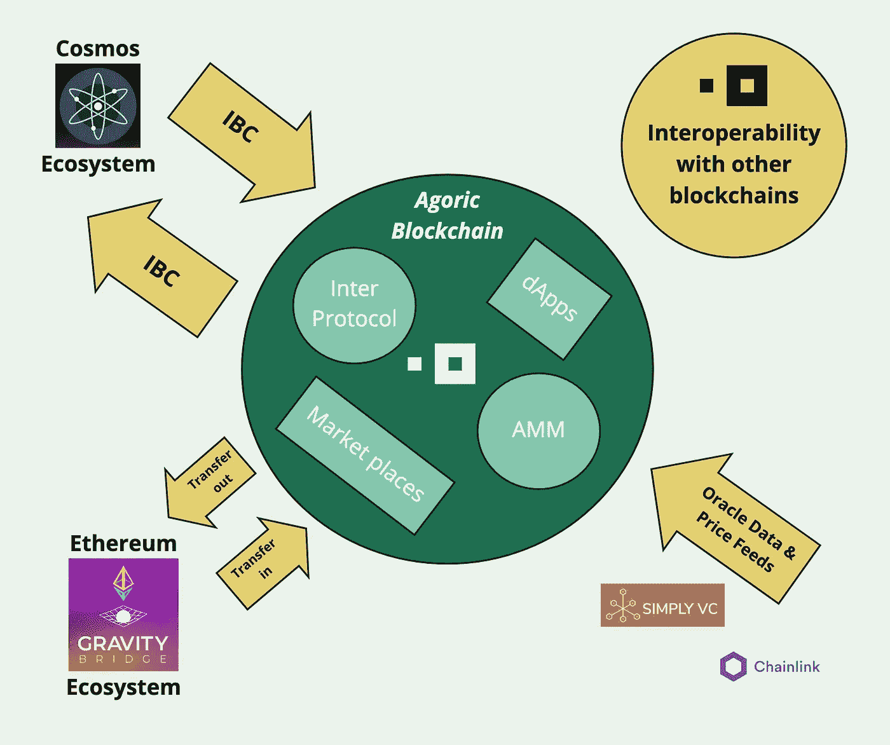
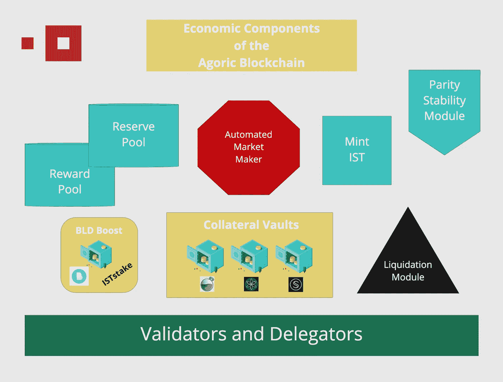
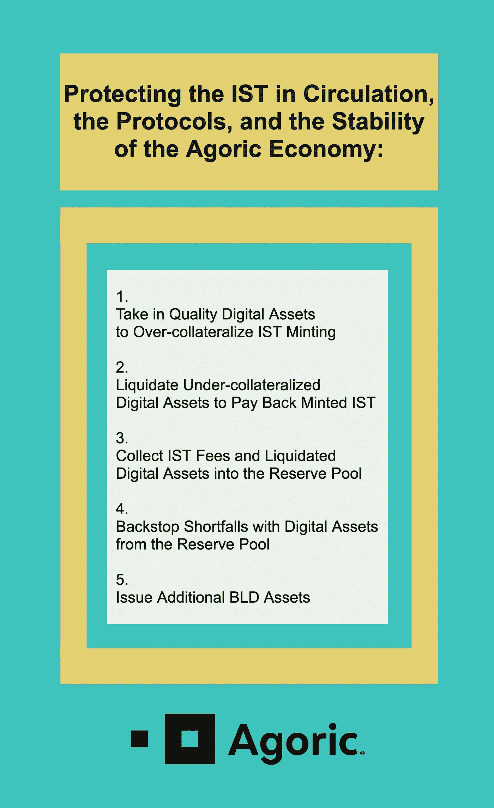
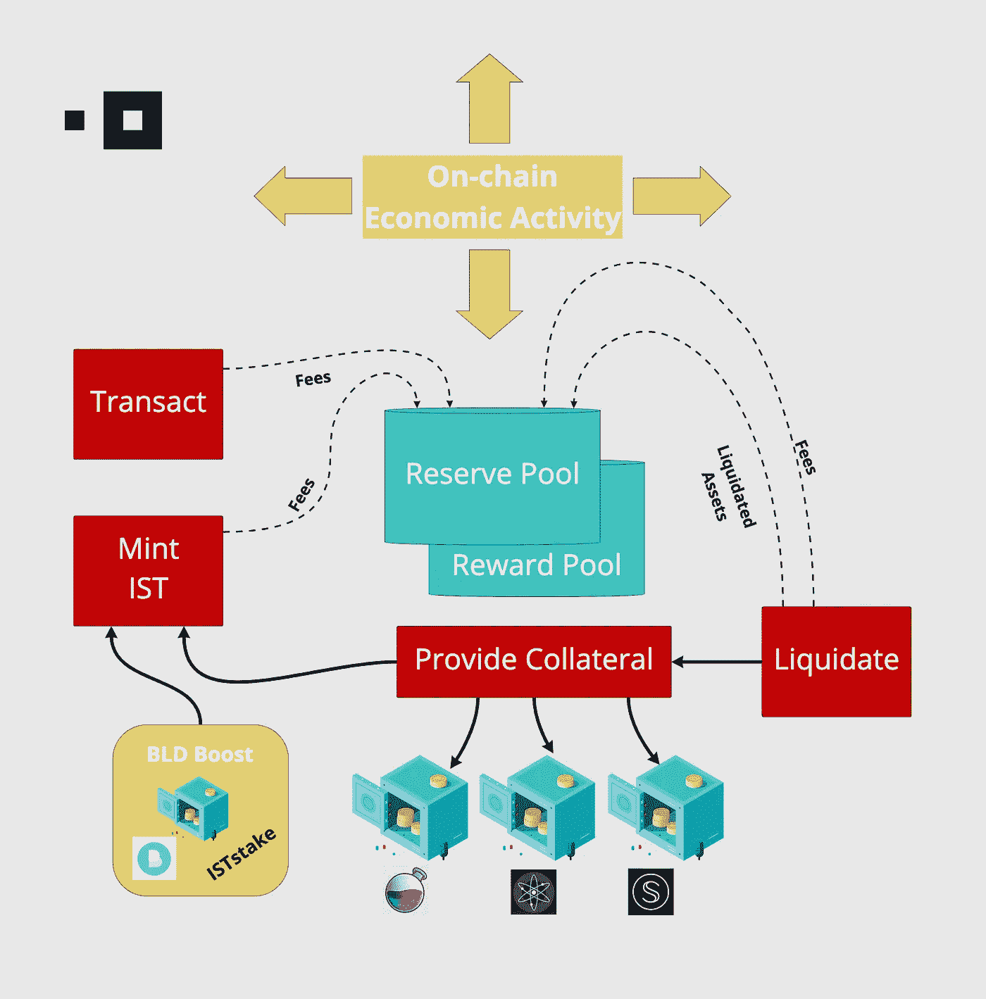
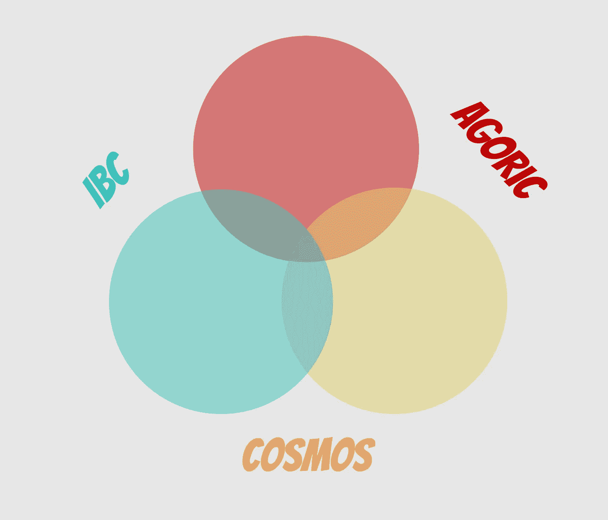
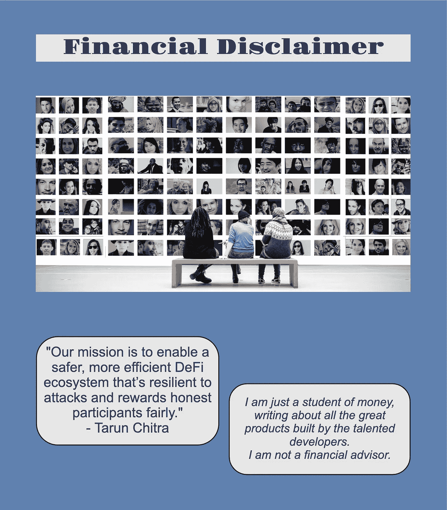

# 用 Agoric 打造连锁经济

> 原文：<https://medium.com/coinmonks/crafting-an-inter-chain-economy-with-agoric-74b74b3052c?source=collection_archive---------13----------------------->

**未来就是现在**

在本系列的第一部分中，我介绍了 Agoric Systems，提供了该技术的高层次概述，展示了它捕获 JavaScript 开发人员社区的解决方案，并回顾了它的进展。在本系列的第二部分中，我将重点介绍这个链条中的两个关键构件:Inter 协议和动能自动做市商(AMM)。当 Agoric 推出这些关键协议时，它将为 dApps 和市场提供所需的乐高积木，以便在 Agoric 生态系统中运营，并与其他(外部)区块链互动。

**专为链间互操作性打造**

Agoric 精心打造了一个微观经济，最初将支持区块链以及将在其中推出的 dApps 和市场。然而，这种经济被设计为具有一定程度的健壮性、安全性和可扩展性，可以扩展到其自身生态系统的边界之外。区块链为链间互操作性而构建，拥有与外部协议和生态系统交互的所有必要工具(见下图)。

Agoric 将在今年夏天晚些时候安装的组件旨在创建一个基础设施，为每种类型的 DeFi 和 NFT 市场(dApp)构建一个经济框架，以融入其功能。见下图，了解 Agoric 将要介绍的经济成分的概况。

**内部协议**

当 Inter Protocol 上线时，它将推出一个稳定的令牌，该令牌从一开始就被设计为超额抵押。看看下面的图片，看看国际米兰将如何做到这一点。

铸造 IST 最初只有三种方式:

*   向金库提供担保，并在资产担保比率允许的范围内借入 IST
*   直接将 USDC 换成 IST(奇偶校验稳定性模块)
*   根据未来赌注回报借款(BLD Boost)。

为支持当地经济而进行的增加抵押品、进行掉期交易和铸造 IST 的交易会产生费用。

然而，IST 不仅仅是区块链的一种当地货币。由于 Agoric 完全支持区块链间通信(IBC ), IST 的链间互操作性扩展到所有其他 IBC 支持的区块链、dApps 和市场，跨越更大的宇宙生态系统。Inter Stable Token (IST)可以与宇宙中的其他数字资产一起工作，在市场和 dApps 中进行交易，以推动更广泛的采用。

**竞争者**

目前，e-Money 有一套完全抵押的稳定货币，这些货币是在其区块链上铸造的，包括:eEUR、eSEK、eNOK、eCHF 和 eDKK。卡瓦还有一个完全可操作的铸造过程，其完全抵押的稳定硬币 USDX 已经在流通。预计未来几个月将有更多公司进入这一细分市场；具体来说，Shade Protocol 的 SILK，以及 Comdex 的 USCX 和 Composite 的 CMST 将通过抵押稳定令牌为整个宇宙的区块链提供额外的交易效率选择。

最终，通过 Agoric 团队之前宣布的重力桥合作伙伴关系的连接，数字资产也将能够在以太坊和 Agoric 生态系统之间来回流动。这将为 Inter Stable Token 打开现有市场，与以太坊的巨大和最高质量的 stablecoins 一起工作。

**奇偶稳定性模块**

Inter 协议将包括一个平价稳定模块，以方便 IST 收购，为 IST 创造套利机会以保持与美元的平价，并吸引来自以太坊的高质量稳定货币。

具体来说，用户可以把 USDC(举例来说)和他们的 USDC 直接交换 IST，而不必把他们的 USDC 放在一个抵押库和铸造 IST 对他们的金库持有。治理提案流程和后续投票将决定 Inter 接受的奇偶校验稳定性模块的稳定点数。

**抵押品保管和清算**

新金库最初接受的抵押资产预计是宇宙中心的 ATOM，其他资产将通过治理提案和投票决定。在我上面的图表中，我把奥斯莫和 SCRT 作为例子放入抵押品库；然而，其他高质量的 IBC 资产也是首选。

除了选择哪些资产将被接受为担保品之外，治理还在选择利用担保品的功能参数方面发挥作用。担保比率决定了可以创造的 IST 的数量，不同的资产可能有不同的比率。此外，在资产价值下降和随后负债的情况下收取的清算罚款金额也在此过程中设定。保管库中接受的每项资产都设定了持续稳定费。最后，总债务限额也是由治理决定的。

通过使用复杂的清算模块，在不利的市场条件下，如果抵押品比率的阈值被突破，清算资产将在 AMM 出售，以偿还针对抵押品生成的 IST 金额。在收取清算资产、罚款和交易费用后，任何剩余的担保品都将返还。

进入金库的存款人不仅会收到新铸造的利息代币，还会收到一个金库对象。该对象控制带入保险库的担保品的关系，指定资产的条款。

**备用池**

Inter Protocol 收取的费用在奖励池(用于支付 BLD 赌注奖励)和储备池之间共享。最初，这些将包括来自以下方面的收藏:

*   预付 IST 铸造费
*   每日 IST 造币稳定费
*   清算罚款获得的资产
*   清算费用
*   来自链上活动的其他执行费用。

储备池不仅持有 IST，还将包含通过清算罚款收集的资产(最初是 ATOM，但可能会扩展到包括其他 IBC 资产)和 BLD。该池提供清算模块在动能 AMM 上出售清算资产所需的流动性。最重要的是，保留池代表协议间控制的值。

**动能 AMM**

Agoric 将推出自己的自动做市商(AMM)，旨在容纳区块链流动性所需的池，有效地进行区块链微观经济中的交易活动，并作为 Agoric 生态系统中所有参与者的分散交易所。

Inter Protocol 将在动态 AMM 上维护担保资产池。

**BLD 升压**

Agoric 将为已经将资产委托给验证机构的 BLD 所有者提供一个机会，以他们的资产为抵押借入非常少量的资金。目的是不使用 BLD 作为金库中的抵押资产，以便将其明确区分为保护区块链的资产，并且不会过度暴露于杠杆活动。

然而，在很小的比例内(可能设定为 5%或 10%)，BLD 投资者可以锁定他们的资产，并利用 BLD Boost 合约中的 ISTstake 流程来制造 IST。未来的赌注回报支付的债务所产生的铸造和接收 IST。那些参与 BLD Boost 的人在 IST 的债务得到偿还(包括费用)之前，不能取消持股，也不能撤回他们的奖励。

ISTstake 流程的强大功能是基础 BLD 资产不能被清算。同样，ISTstake 过程的参数将由治理决定。

**精心照本宣科的总体规划**

Agoric 的 smart contract 和区块链资深人士团队精心设计并执行了一项多年计划，该计划即将推出。他们发展了一个专业组织，获得了多轮融资，并与整个宇宙生态系统的主要创始人、开发人员和社区领袖建立了深厚的关系。

在测试网上开发了几个月之后，Agoric 区块链公司发布了主网 0 期。有了它，赌注网络已经上线，早期投资者现在可以委托他们的 BLD 资产。该团队已确保在主网第一阶段推出区块链之前，网络是安全的。

通过由跨越多年的实施阶段组成的精心编写的总体规划，Agoric 设计了开发人员在其区块链上推出智能合同所需的基础设施组件。凭借安全、分布式和精心制作的经济模型，加上自己的自动做市商和稳定的令牌协议，Agoric 完全有能力蓬勃发展。

Tot ziens — Opa。

## **来源、参考资料和进一步阅读**

https://agoric.com/的 T2

Twitter 协议— @agoric

Agoric 博客—【https://agoric.com/blog/ 

协议间白皮书草案—[https://agoric . com/WP-content/uploads/2022/05/Draft-Inter-Protocol-white paper-v 0.9-1 . pdf](https://agoric.com/wp-content/uploads/2022/05/Draft-Inter-Protocol-Whitepaper-v0.9-1.pdf)

我第一篇介绍 Agoric 的文章:[https://medium . com/coin monks/the-future-is-build-on-JavaScript-with-Agoric-systems-c 7 FDE CB 876 b 2](/coinmonks/the-future-is-built-on-javascript-with-agoric-systems-c7fdecb876b2)

> 加入 Coinmonks [电报频道](https://t.me/coincodecap)和 [Youtube 频道](https://www.youtube.com/c/coinmonks/videos)了解加密交易和投资

# 另外，阅读

*   [币安 vs FTX](https://coincodecap.com/binance-vs-ftx) | [最佳(SOL)索拉纳钱包](https://coincodecap.com/solana-wallets)
*   [比诺莫评论](https://coincodecap.com/binomo-review) | [斯多葛派 vs 3Commas vs TradeSanta](https://coincodecap.com/stoic-vs-3commas-vs-tradesanta)
*   [Capital.com 评论](https://coincodecap.com/capital-com-review) | [香港的加密借贷平台](https://coincodecap.com/crypto-lending-hong-kong)
*   如何在 Uniswap 上交换加密？ | [A-Ads 审查](https://coincodecap.com/a-ads-review)
*   [WazirX vs coin dcx vs bit bns](/coinmonks/wazirx-vs-coindcx-vs-bitbns-149f4f19a2f1)|[block fi vs coin loan vs Nexo](/coinmonks/blockfi-vs-coinloan-vs-nexo-cb624635230d)
*   [本地比特币评论](/coinmonks/localbitcoins-review-6cc001c6ed56) | [加密货币储蓄账户](https://coincodecap.com/cryptocurrency-savings-accounts)