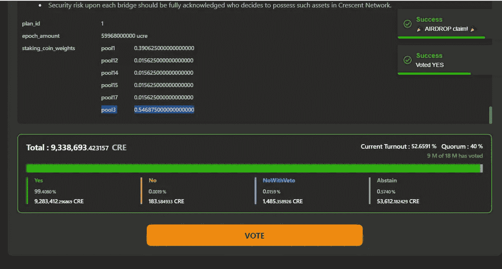

# 申请 Crescent 的 CRE 空投的过程如何激励持有者尝试 DEFI 平台

> 原文：<https://medium.com/coinmonks/cre-token-airdrops-incentivised-me-to-try-out-defi-in-crescent-dex-my-story-b5cb7f2be3b6?source=collection_archive---------52----------------------->

# 失去了在宇宙中发射项目的许多空投，但利用 CRE 令牌空投

空投通常对加密持有者来说是甜蜜的，至少在加密的早期是这样。我很晚才成为一个更喜欢加密的人，因为我主要是一个被动的加密持有者，在 Atomic Desktop wallet 中持有加密，所以我错过了空投。

这就是为什么即使我的 Atom 钱包里有 Atom，宇宙的原生代币，我也从来没有收到过空投的热代币，比如渗透工程的 Osmo 代币，或者阿卡什工程的代币。

当然，后来我下载了 Keplr 钱包，并在[mintscan block chain Explorer](https://www.mintscan.io/cosmos/validators)上检查了验证器的性能数据后，将我的 Atom 绑定到验证器上，因为如果验证器不执行，就会发生削减，其中一个人绑定到验证器的 Atom 可能会被削减。

*Keplr 钱包上的 Cosmos 网络验证器的 staked Atoms*

在那个时候，这个过程是势不可挡的，需要研究和监控验证器，以便您的 staked Atom 不会被削减。

无论如何，由于我所做的这些努力，我最终收到了今年 4 月在 Cosmos 上发布的 Crescent tokens 项目的空投。

# CRE 空投激励我探索 Crescent DEX 的 DEFI 功能

尽管这种空投趋势可能有点老，失去了它的宣传，这些 CRE 令牌的新月形空投对我来说是甜蜜的，因为它让我检查新月形 DEX，并参与基本的 DEFI 活动，这是一个人需要参与的，以解锁所有的 CRE 空投。

起初，我因为将我的 Atom 委托给验证器而获得了 20%的 CRE 令牌。这里，我再次假设对于 airdrop，不会考虑对加密交换验证器的委托，因此对于 airdrop，只会考虑对更分散的验证器组的委托。

为了进一步解锁我的其他 80%的 CRE 令牌空投，我必须在新月应用程序中完成某些 Defi 任务。

*接收锁定在新月账户中的所有 CRE 空投需要完成的任务。*

因此，我有动力参与新月 DEFI。我完成指定任务来解锁剩余的新月空投的期限是 6 个月，从 4 月新月投放日算起。

*正如开始时可以看到的，我的 CRE 空投的 20%可以被认领，因为默认情况下第一个任务已经完成，因为 CRE 空投是基于通过 Cosmos Blockchain 中的 staking 委托给验证者的 Atom 数量。*

# 任务 2 解锁 20% CRE 空投——液态股份 CRE

*默认情况下，任务 1 已完成，因为所有将股份委托给 Cosmos Blockchain 的 Atom 持有者都收到了 20%的 CRE token 空投。*

释放另外 20%的 CRE 空投物资的第二个任务是流动股权 CRE。

所以，我去了 Crescent dapp 中的 staked 模块，将 CRE 转换成 bCRE 令牌。

[新月的液体打桩模块](https://app.crescent.network/staking)

这是 [CRE 液体打桩](https://ecency.com/hive-150329/@mintymile/traditional-staking-vs-the-evolved)。bCRE 只不过是[绑定的 bCRE](https://ecency.com/hive-150329/@mintymile/traditional-staking-vs-the-evolved) ，它们被平等地委托给新月网络的白名单验证者。

这是一种方便的委托和赌注方式，因为所有接受委托的白名单验证者都是根据他们的表现选择的，如果他们表现不佳，可以更换。Crescent Networks 的验证器集由社区管理流程管理。

我解锁了 20%的 CRE 空投来完成液体任务。

我记得这感觉很酷，因为我有更多的 CRE 来参与 Crescent DEFI，这对于我必须完成的下一个任务来说很方便，以解锁我的 CRE 空投的另外 20%。

# 任务 4 解锁 20%的 CRE 令牌—增加 bCRE 池的流动性

下一个要完成的任务是增加 bCRE 池的流动性。
因此，我将 10 个 CRE 和 10 个 bCRE 令牌存入 CRE-bCRE 池。

我认为这个池是流动性提供者提供流动性的一个好池，因为两种代币的价格相似，所以我觉得没有太多机会出现非永久性损失，尽管我可能错了。

此外，这是一个重要的池，提供流动性，以在需要时将 bCRE 转换为 CRE 令牌，否则必须解除 bCRE 绑定，并等待 14 天才能取回自己的 CRE 令牌以及累积的赌注奖励。

一个即时的方法来转换 bCRE 与我们的累积赌注奖励将它交换为 CRE。

我完成了任务 4 并解锁了另外 20%的 CRE 空投。万岁！！

# 完成了对治理提案投票的任务 5，以解锁我的 CRE 空投的另外 20%

我还有两个任务要完成，以解锁我剩余的 40%的 CRE 空投。

其中，我最近完成了一项对治理提案进行投票的任务，并释放了我的另一项 20% CRE 空投任务。

**错过了一些有趣的治理提案的投票**

*从卢纳-UST 基金中移除和重新分配 LP 奖励的治理提案*

我错过了许多治理提案的投票，其中一个是关于从 UST 和露娜池重新分配 LP 奖励，因为我们知道露娜和 UST 崩溃了，对这些令牌的需求也崩溃了。

由于向这些池提供 LP 奖励不具有资本效率，一项通过的治理提案改变了这一点，因此 UST 和露娜池不会获得 LP 奖励，尽管一些池仍然可以获得 CRE 奖励。

这些池的所有未奖励的 LP 奖励将被收集起来，重新分配给新池，这些新池将在团队研究后引入 Crescent。

你可以在这里阅读治理提案-
[https://app . crescent . network/gov/4](https://app.crescent.network/gov/4)

*在相关治理提案获得通过后，与 UST 和 LUNC 配对的池对的 LP 奖励现在为 0！！*

新月需要登上一枚马币，而 UST 现在已经是一枚无用的马币了

这对我来说是一个有趣的消息，因为似乎新月团队一度认为 UST 是一个很好的稳定币可以利用，而 UST 不再是一个可行的稳定币，他们将寻求在他们的平台上使用另一个稳定币。

这最终发生了，你能猜到他们在应用中加入了什么稳定币吗？是 USDC！！在他们的平台上，新月号搭载了 USDC 作为稳定币。

## USDC 和瑞士联邦理工学院的资产被批准通过治理提案引入新月公司

下一个治理提案是将 USDC 和瑞士联邦理工学院的资产列入白名单，这些资产将通过桥梁 Gravity 和 Axelar 引入 Crescent。

因此，随着这一通过，新的池对被引入新月与稳定硬币 USDC 和 ETH 配对。

你可以在这里阅读有关治理提案的内容-
[https://app . crescent . network/gov/5](https://app.crescent.network/gov/5)

我最终投票支持了 Crescent 的最后一个[治理提案 6](https://app.crescent.network/gov/6) ，该提案涉及激励 USDC 和 ETH 通过 Gravity Bridge 和 Axelar 引入的桥梁资产池。

在新月团队验证桥梁的安全性之前，最初的奖励是 1%。一旦桥梁资产的安全性得到验证，该团队计划增加对这些资产池的激励。

不过，新月团队似乎已经验证了来自 Gravity DEX 和 Axelar 的桥梁资产的安全性，并对此感到满意，因为现在来自这些桥梁的 ETH 和 USDC 对都有很好的 APYs。

[新月的养殖模块](https://app.crescent.network/farm)

总之，所以我完成了任务 5，并解锁了我锁定的 CRE 令牌空投的另外 20%。

*耶万岁！！*

# 不过，我必须完成任务 3 来解锁我剩余的 20%的 CRE 令牌空投

*现在，通过完成我解释的各种 DEFI 任务，我已经申请了 80%的 CRE 空投。*

我仍然必须完成任务 3，我要在新月应用程序中进行交换，并解锁我剩余的 20%锁定的 CRE 空投。显然，我打算在我完成这项任务的时间到期之前的某个时候做这件事，到目前为止，我有超过 123 天的时间来完成这项交换任务。

我希望你们读者喜欢我讲述的 Crescent DEFI 如何通过其 CRE 空投激励我尝试 Crescent 应用程序的一些 DEFI 功能。

赢得代币的感觉肯定很好，因为俗话说，生活中没有免费的东西。

# 关于新月德克斯

新月指数，是一个 AMM 指数，将有一个公平的订单匹配订单簿。Crescent 旨在为 LP 供应商和做市商提供资本高效的流动性激励。新月还旨在防止流行的前置运行和验证可提取的价值(VEV)。

**查看新月 App**
[https://App . Crescent . network/](https://app.crescent.network/)

**新月传媒博客**
[https://medium.com/@crescentnetwork](/@crescentnetwork)

**新月呢喃-**
[https://twitter.com/CrescentHub](https://twitter.com/CrescentHub)

***感谢阅读！！***