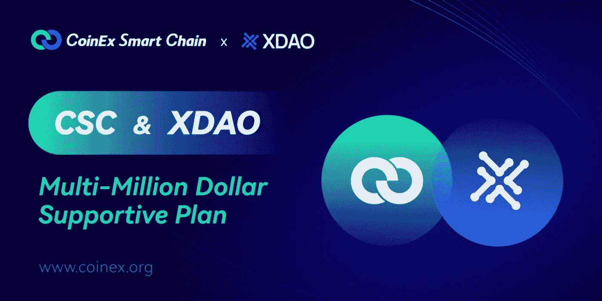

# 在 CSC 上轻松创建一个 DAO 并获得被动收入

> 原文：<https://medium.com/coinmonks/create-a-doa-with-ease-on-csc-and-earn-passive-income-f8ca18b26acf?source=collection_archive---------57----------------------->

数字货币的一大特点是去中心化。这意味着它们不受政府或中央银行等单一机构的控制，而是分散在各种计算机、网络和节点中。在许多情况下，虚拟货币利用这种去中心化的地位来达到标准货币及其交易通常无法达到的隐私和安全水平。

***一个去中心化的自治组织*** *允许你的创业公司直接与全球投资者合作，同时保持透明度和协议。*

想象一下，你和你的伙伴想出了一个极好的商业点子。在起草了一份周密的计划后，你所需要的就是执行计划的资金。为此，您可以建立一个分散的自治组织，或 DAO。为了加入这个组织，人们购买代币，在投资的同时获得你公司的部分所有权。没有一个领导者或个人决定谁将成为道的一部分；这是大多数人的决定。人人负责；每个人都获利，每个人都促进组织。这就是刀的意义。

***什么是刀***

基本上，DAO 是一个共享银行账户的互联网社区。"“分散化”指出了这样一个事实，即没有控制机构，如银行或政府——没有领导者。"“自治”指的是管理自己的自由，“组织”指的是有特定目的的一群人。

刀是立在区块链上的，像一个 CSC。它只存在于互联网上，没有物理实体。DAO 实现了区块链决策的自动化，允许投资者从任何地方汇款。此外，由于它使用区块链技术，它保证了完全透明。每个成员都知道钱的确切去向，从而避免与首席财务官(CFO)或类似职位的人发生任何摩擦。

***刀是如何工作的***

Dao 通过智能合约运作，智能合约是集团成员之间以自动执行代码的形式达成的协议。人们购买令牌成为道的一员。代币赋予他们投票权和其他决策能力。

***如何用刀赚钱***

典型地，一个 DAO 通过从组织的投资中分红来赚钱。创业的人也可以通过说服别人根据他们的商业理念单独投资来赚钱。

***创造刀***

传统上，用户必须先有一些关于区块链开发和智能合约的知识才能创建一个 DAO，基本上你需要学习某些代码和智能合约才能创建一个 DAO

***XDAO 上 CSC***

XDAO 已在 [CoinEx Smart Chain — CSC](https://www.coinex.org/?lang=en_US) 上推出，以帮助用户轻松创建 DAO，有了 XDAO，用户不再需要理解代码或能够编写智能合同。相反，他们可以在不到一分钟的时间内通过 CSC 上的 XDAO 创建自己的 DAO，并探索更多的 DAO 函数。CSC 为 XDAO 提供了一个高效的 DAO 构建底层。在构建 Dao 时，用户经常遭受网络拥塞的困扰。因此，XDAO 决定部署在 CSC 上。XDAO 现在已经成为 CSC 上的一个新兴应用，为 CSC 生态系统带来了新的活力

***什么是***[***CSC***](https://www.coinex.org/?lang=en_US)

[CoinEx Smart Chain——CSC](https://www.coinex.org/?lang=en_US)致力于为区块链构建基础设施，并遵循去中心化和无许可块生成的原则，是一个高效的去中心化和高效率的公共链，它为开发人员提供了一个高效、低成本的链上环境来运行去中心化智能合约应用(DApps)和存储数字资产。CSC Iis 是一个公共链，交易在几秒钟内得到确认，具有卓越的 TPS 和高系统吞吐量。CSC 与 Etherium 完全兼容，克服了其“成本高、效率低”的缺点。

***什么是 XDAO***

XDAO 是为去中心化的未来构建的多链 DAO 生态系统，它是一个多链 DAO 构建器，允许任何人轻松地创建 DAO 来联合管理加密资产。它创新性地赋予了 DAO 创建者和管理者治理权，投资者可以分享 DAO。

在 CoinEx Smart Chain 上创建一个 DAO，并开始与 CSC 生态系统进行交互您可以在[coinex.org/Dapp](http://coinex.org/Dapp)查看 CSC 中现有的 dApp。使用 [XDAO Connect](https://docs.xdao.app/architecture/xdao-connect) 连接 dApp。

***结论***

CSC 的交互式生态系统规划为 XDAO 注入了活力和价值。CSC 现在支持 ETH、BSC 和 Tron 上的跨链交换。这意味着这些链上的资产可以通过 CSC Bridge 快速交换为基于 CSC 的资产，从而让更多用户受益于 XDAO

快速发展的跨链系统给了越来越多的设施来投资、交易和发展你的区块链项目。这就是 CSC 和 XDAO 存在并合作的原因——为了去中心化世界和 Web3 的繁荣。

要获得更多资源，

*   加入 CSC 的[电报组](https://t.me/CoinExChain)。
*   关注 CSC 的[推特](https://twitter.com/CoinEx_CSC)账号。
*   加入 CSC 的[不和](https://discord.gg/5uBGRW9qSp)小组。

关注我的[推特](https://twitter.com/kryptmystro)获取更多更新。

> 加入 Coinmonks [电报频道](https://t.me/coincodecap)和 [Youtube 频道](https://www.youtube.com/c/coinmonks/videos)了解加密交易和投资

# 另外，阅读

*   [Capital.com 评论](https://coincodecap.com/capital-com-review) | [香港的加密借贷平台](https://coincodecap.com/crypto-lending-hong-kong)
*   [如何在 Uniswap 上交换加密？](https://coincodecap.com/swap-crypto-on-uniswap) | [A-Ads 审查](https://coincodecap.com/a-ads-review)
*   [WazirX vs coin dcx vs bit bns](/coinmonks/wazirx-vs-coindcx-vs-bitbns-149f4f19a2f1)|[block fi vs coin loan vs Nexo](/coinmonks/blockfi-vs-coinloan-vs-nexo-cb624635230d)
*   [本地比特币评论](/coinmonks/localbitcoins-review-6cc001c6ed56) | [加密货币储蓄账户](https://coincodecap.com/cryptocurrency-savings-accounts)
*   什么是融资融券交易
*   [维护卡审核](https://coincodecap.com/uphold-card-review) | [信任钱包 vs 元掩码](https://coincodecap.com/trust-wallet-vs-metamask)
*   [Exness 评测](https://coincodecap.com/exness-review)|[moon xbt Vs bit get Vs Bingbon](https://coincodecap.com/bingbon-vs-bitget-vs-moonxbt)