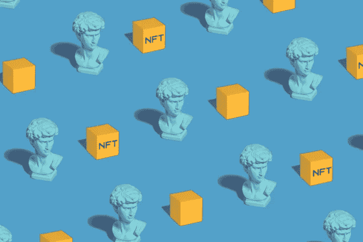

# 使用 Rust-KryptoMind 在 NEAR 协议上创建 NFT

> 原文：<https://medium.com/coinmonks/create-nfts-on-near-protocol-using-rust-kryptomind-c30e42ced86d?source=collection_archive---------43----------------------->



NEAR Protocol

# 介绍

在区块链上，不可替代的代币充当独特的所有权记录。NFT 通常与一件有价值且不常见的物品相关联，例如一件艺术品、一张演出门票、一只可收藏的猫、一个主机名或一个真实的实体。根据合同的不同，可以铸造、购买、出售或销毁 NFT。基于以太坊的 NFT 是非常罕见的。NFTs 可以在 NEAR 上实现。

> 交易新手？试试[加密交易机器人](/coinmonks/crypto-trading-bot-c2ffce8acb2a)或者[复制交易](/coinmonks/top-10-crypto-copy-trading-platforms-for-beginners-d0c37c7d698c)

关于 NFTs 有很多规则！但是到目前为止，最流行的是 ERC721 标准，它描述了诸如如何开发和传输 NFT 之类的东西。这持续了很长时间，但是像所有的 ERC 标准一样，它只是为以太坊平台定义的。一旦近 EVM 仿真准备就绪，ERC721 就可以移植到 NEAR。尽管如此，目前 NEAR 团队已经实现了一个 NFT 参考实现，它需要一个不同的 NFT 标准:NEP-4，它以一种独立于语言的方式进行描述

# 近似协议

NEAR 协议是新一代第一层区块链，它解决了吞吐量有限、事务速率慢和兼容性差等问题。它是基于分片的，这意味着当网络使用率高时，节点被分成更小的称为“分片”的部分，计算在这些部分之间并行进行。该网络可以扩展以满足更多用户的需求。

# 什么是 NEP -4？

NEP-4 是一个非常简单的标准，它只支持 NFT 的所有权和转让。但是，它确实包括向其他用户或其他智能合同授权的能力。这是一个强大的功能，因为它意味着未来可以通过使用智能合约进行跨合约调用来进行改进，而不是升级我们今天编写的合约。NEAR 上的其他 NFT 项目已经开始帮助 NEP-4，所以短期内这是一个不错的选择。

本教程将向您展示如何为 Near 协议构建一个智能契约，以创建 NFTs。

# 先决条件

来建立我们需要的近乎智能的契约。

## 生锈:

我们将使用 Rust 的高性能通用编程语言开发一个智能合约。

## 接近 CLI:

使用 Near CLI 命令行界面连接到 Near 区块链并与之交互。

## 附近的钱包:

在开始我们的项目之前，我们需要一个近钱包。

## 设置

首先，创建一个货物项目。

```
cargo new nft --lib
```

转到项目文件夹 nft 你会看到。

src/lib.rs —这是我们将要编写智能契约的地方

Cargo.toml —这是我们的项目配置文件

转到 cargo.toml 并添加

```
[lib]
crate-type = ["cdylib", "rlib"]
[dependencies]
near-sdk = "*"
near-contract-standards = "*"
```

# 入门指南

```
use near_sdk::{
    near_bindgen,
    borsh::{self, BorshDeserialize, BorshSerialize}
};
near_sdk::setup_alloc!();
#[near_bindgen]
#[derive(BorshDeserialize, BorshDeserialize)]
pub struct Contract {}
#[near_bindgen]
impl Contract {}
```

让我们简化这个看起来很奇怪的代码，而不采取任何行动。因为 NEAR 采用了有状态方法，所以我们的契约状态将保存在 struct Contract 中，并且我们将在实现契约中编写状态改变方法。

应该注意的是，在这种情况下，我们使用特定的宏和派生特征。使用#[near bindgen]宏改变状态，以便它可以在近链上活动。Borsh crate 中用于反序列化和序列化状态的特性是 BorshDeserialize 和 BorshDeserialize。

让我们现在指定我们的国家为 NFT。你知道 NFT 有一些附加的元数据。根据这个描述，我们的状态出现如下。

```
use near_contract_standards::non_fungible_token::{
    metadata::NFTContractMetadata, NonFungibleToken,
};
pub struct Contract {
    token: NonFungibleToken,
    metadata: LazyOption<NFTContractMetadata>,
}
```

必须始终设置此状态的默认值；因此需要一个初始化函数。

```
#[derive(BorshSerialize, BorshStorageKey)]
pub enum StorageKey {
    NonFungibleToken,
    Metadata,
    TokenMetadata,
    Enumeration,
    Approval
}
#[near_bindgen]
impl Contract {
    #[init]
    pub fn new(owner_id: ValidAccountId) -> Self {
        Self {
            token: NonFungibleToken::new(
                StorageKey::NonFungibleToken,
                owner_id,
                Some(StorageKey::TokenMetadata),
                Some(StorageKey::Enumeration),
                Some(StorageKey::Approval)
             ),
             metadata: LazyOption::new(
                StorageKey::Metadata,
                Some(&NFTContractMetadata {
                    spec: NFT_METADATA_SPEC.to_string(),
                    name: "Example Name".to_string(),
                    symbol: "Example".to_string(),
                    icon: Some("ANY_SVG".to_string()),
                    base_uri: None,
                    reference: None,
                    reference_hash: None,
                 })
             ),
        }
    }
}
```

#[init]启用宏的函数将总是首先运行。它通常用于建立默认状态。

我们的初始化器和状态的一切都已经建立了。让我们实现功能 NFT 铸造。

```
impl Contract {

    ......

    #[payable]    
    pub fn nft_mint(
        &mut self,
        token_id: TokenId,
        receiver_id: ValidAccountId,
        token_metadata: TokenMetadata,
    ) -> Token {
        self.token.mint(token_id, receiver_id, Some(token_metadata))
    }
}
```

这应该部署到链中。要进行构建，请输入以下命令:

```
cargo build --target wasm32-unknown-unknown --release
```

运行以下命令进行部署

```
near deploy --wasmFile target/wasm32-unknown-unknown/release/nft.wasm --accountId "your near account username"
```

这将为您提供一个程序 id，您可以使用它来访问智能合同的 RPC。您可以使用附近的 CLI 或 javascript 客户端与合同进行通信。

Kryptomind 是一家总部位于美国的 NFT 铸造公司，已经为其客户完成了几个盈利的 NFT 项目。为了获得最出色的成果，我们的工作方法采用了最新的技术和方法。我们希望尽可能简化铸造 NFT 的复杂过程。在 Kryptomind，我们忠诚的专家团队努力满足您的目标和要求。

*原载于 2022 年 6 月 28 日*[*【https://kryptomind.com】*](https://kryptomind.com/create-nfts-on-near-protocol-using-rust/)*。*