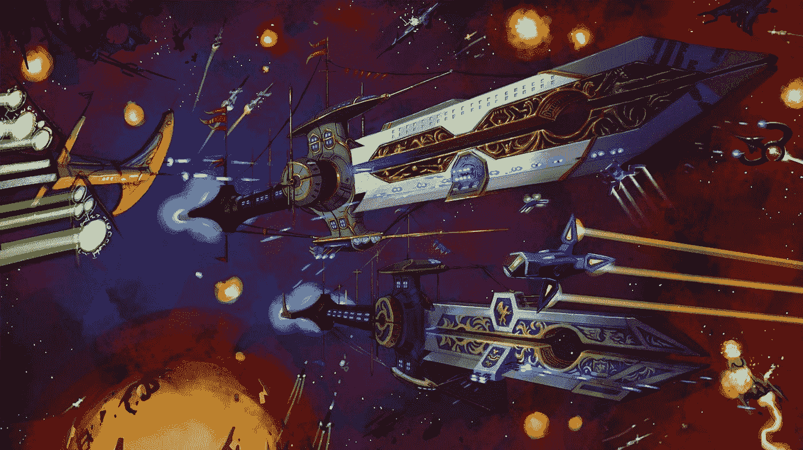

# 用攻击车创造独特的世界

> 原文：<https://medium.com/coinmonks/create-unique-worlds-with-attack-wagon-2b7b1bafb1b5?source=collection_archive---------22----------------------->

创造一个充满故事的冒险世界

每个人都喜欢好故事。故事是在人类之间建立联系的东西；他们让我们感到被理解，引诱我们晚上睡觉，也向我们推销好的产品。自从人类存在以来，故事就是建立关系的一个组成部分，也有助于公司更好地与他们的理想客户联系。

当故事与区块链相遇，魔法就形成了。“攻击马车”是区块链的一个项目，旨在利用故事的力量为“游戏赚钱”爱好者创造冒险经历

# **什么是攻击马车？**

[www.attackwagon.com](http://www.attackwagon.com)

[Attack Wagon](https://attackwagon.com/) games 是一家区块链游戏工作室，它相信使用故事和美丽的艺术作品为用户创造游戏冒险。随着攻击旅行车，用户将了解更多关于埃瑟维尔，诺拉诺瓦，和马克默多克。

它的原生代币，$ATK，是一种玩赚代币，也是一种 ERC-20 多边形链代币，使用户可以在废铁公会和其他游戏中进行购买。$ATK 代币也用于购买和升级 NFTs 和 PVP 入场费。它还能使用户在赢得奖励时得到回报。用户还可以选择一个或多个他们喜欢的赌注池，并通过下注他们的$ATK 来赢得奖励，从而参与下注活动。

攻击车团队由拥有复杂技能的个人组成，他们是各自领域的专家。这个团队有责任把最好的东西带到游戏赚钱的世界。此外，一些顾问利用他们的分析能力提供解决方案，并分享如何最好地在游戏赚钱领域导航的想法。

在过去的 12 个月里，团队取得了很大的成就。这包括攻击车的开始，最初的游戏开发和合作伙伴会谈，种子和私人回合，开发$ATK，发布白皮书和$ATK 的代币生成事件。在[路线图中还列出了其他功能。](https://attackwagon.com/games)

在 crypto 利基市场，两个人的智慧胜过一个人，这就是为什么 Attack Wagon 与几个品牌合作，帮助实现其愿景并推广 play-to-earn 社区。他们合作的一些受欢迎的品牌包括 Polygon、Gate.io labs、Ferrium network、Lithium、Kangaroo capital 和其他品牌。

值得注意的是，攻击车不仅仅是一个游戏，而是一个游戏工作室，它促进了几个游戏的创作。它有四个不同的土地 NFT，代表每一个游戏攻击车创造。

# **攻击马车的地块**

攻击车土地包括三种主要类型的地块:普通地块，大地块和标志性地块，每个地块都是一个 ERC-721 创收。宏伟和标志性的情节会获得更大一部分费用，还会获得其他奖金。此外，图标图允许在车站地图上放置设计好的横幅。

共有 6975 块普通地块、1000 块大地块和 30 块标志性地块。

用户可以获得他们选择的任何土地，并且拥有这些土地的一部分有独特的好处。对于公共剧情，从市场收取的总费用的 40%将被分割，游戏中赚取$ATK 的每日上限也提高了 15%。

对于盛大的剧情，从市场收取的总费用的 40%将被分割，用户获得未来攻击旅行车游戏的投票权，游戏内赚取$ATK 的每日上限也提高了 25%。

对于标志性地块，从市场收取的总费用的 20%将被分割，用户获得未来攻击 Wakgom 游戏的投票权，这是一个定制的游戏内 NFT，只为每个游戏中的标志性土地所有者制作，每个标志性地块所有者可以提交一个他们地块横幅的标志，以使他们在车站表面永生。此外，在游戏中赚取$ATK 的每日上限也提高了 100%。

攻击旅行车的土地出售正式开始，私人土地出售成本已降低了 68%，有利于长期持有$ATK。这是四次土地出售中的第一次，因为第一次出售的一半土地将向白名单上的投资者开放，另一半将在首次白名单出售后向公众开放。这个[主题](https://twitter.com/theattackwagon/status/1514634454295322629?s=20&t=FnxeA2wia_CRtw4nNhP_MQ)提供了更多关于如何参与土地购买的信息。

> 加入 Coinmonks [电报频道](https://t.me/coincodecap)和 [Youtube 频道](https://www.youtube.com/c/coinmonks/videos)了解加密交易和投资

# 另外，阅读

*   [有哪些交易信号？](https://coincodecap.com/trading-signal) | [Bitstamp vs 比特币基地](https://coincodecap.com/bitstamp-coinbase)
*   [ProfitFarmers 回顾](https://coincodecap.com/profitfarmers-review) | [如何使用 Cornix Trading Bot](https://coincodecap.com/cornix-trading-bot)
*   [如何在势不可挡的域名上购买域名？](https://coincodecap.com/buy-domain-on-unstoppable-domains)
*   [印度的秘密税](https://coincodecap.com/crypto-tax-india) | [altFINS 审查](https://coincodecap.com/altfins-review) | [Prokey 审查](/coinmonks/prokey-review-26611173c13c)
*   [赢取注册奖金——10 大最佳加密平台](https://coincodecap.com/earn-sign-up-bonus)
*   [Blockfi vs 比特币基地](https://coincodecap.com/blockfi-vs-coinbase) | [BitKan 点评](https://coincodecap.com/bitkan-review) | [Bexplus 点评](https://coincodecap.com/bexplus-review)