# 创建您自己的加密货币令牌

> 原文：<https://medium.com/coinmonks/create-your-own-cryptocurrency-token-d64f69c5c758?source=collection_archive---------23----------------------->

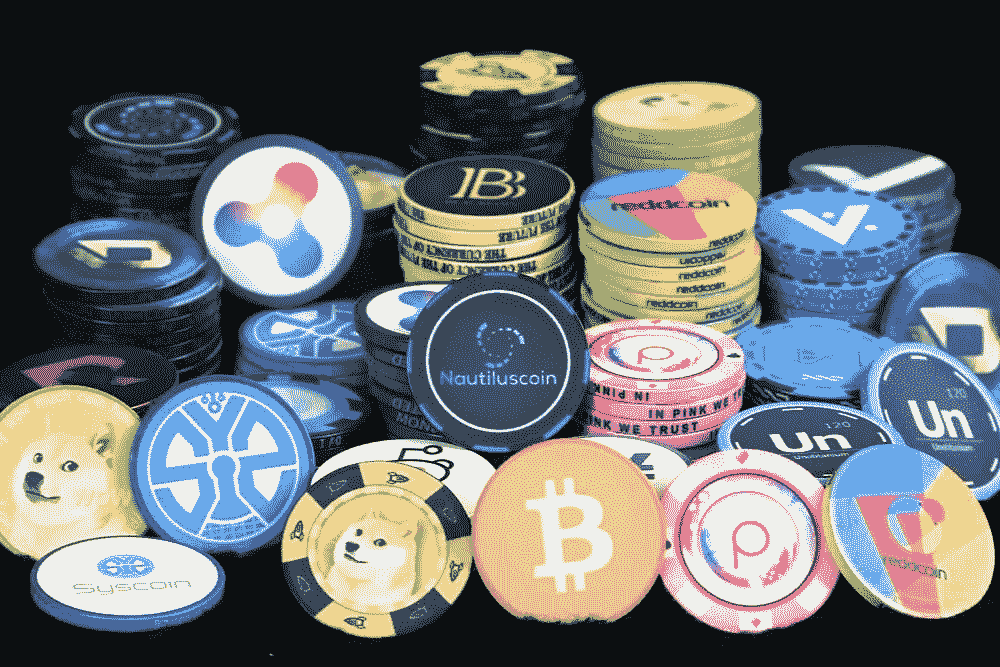

2021 年，加密货币受到了巨大的炒作，市场进入了牛市阶段，许多人成为了百万富翁，一些人在底部买了一枚硬币，它增长了几十万倍，一些人在期货上赚了钱，一些人在采矿上赚了钱，一些人通过创造自己的加密货币或代币赚了钱。

也许这种炒作已经过去，靠它赚钱要困难得多，但今天我将告诉您创建最简单的加密令牌是多么容易。

# 创建加密令牌项目需要什么？

*   一些钱(大约 20 美元创造一个代币，10 美元——10K 上市或互换)
*   最低编程知识
*   关于加密货币的最小概念

> 我们开始吧

# 创建元掩码钱包

我们去 https://metamask.io/download/[的 MetaMask 网站](https://metamask.io/download/)下载扩展吧。

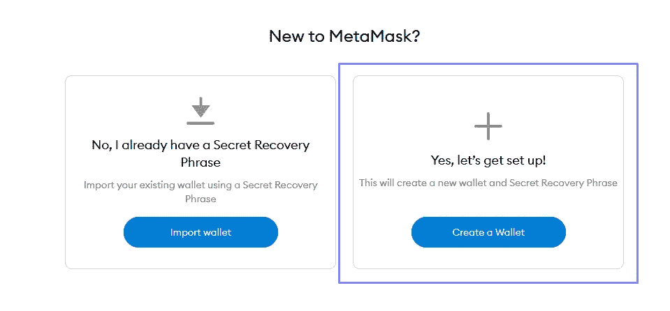

点击“创建钱包”

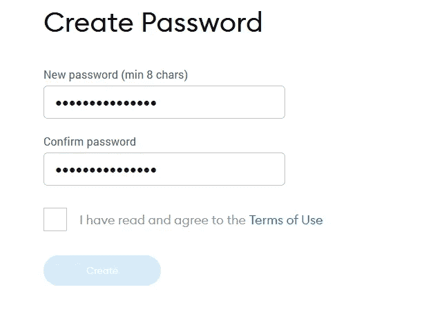

创建您的密码

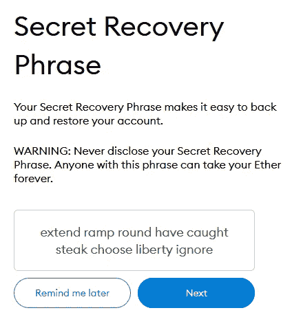

保存您的恢复短语

**完成，你已经创建了你的 Metamask 钱包**

如果你在 BSC 网络上创建了你的令牌，现在发送一些 BNB(大约 20 美元)给它。

**也可以给我发一些:**
BSC 地址(BSC 上任何加密货币):0x 54 AC 250 caad 10 B1 bb 3 e 93 f 90 e 82 ce 4 e 7987 c 51 CB

# 让我们为令牌选择一个网络

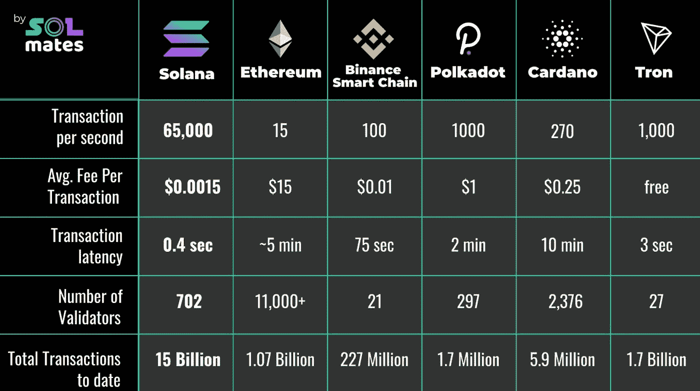

你可以选择任何网络来创建你的代币，但我们会选择币安智能链，这是一个最好的网络，因为它的费用低廉。

我们需要将 BSC(币安智能链)添加到 metamask 钱包中。

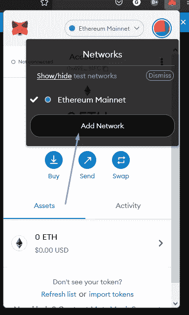

Click “Add network”

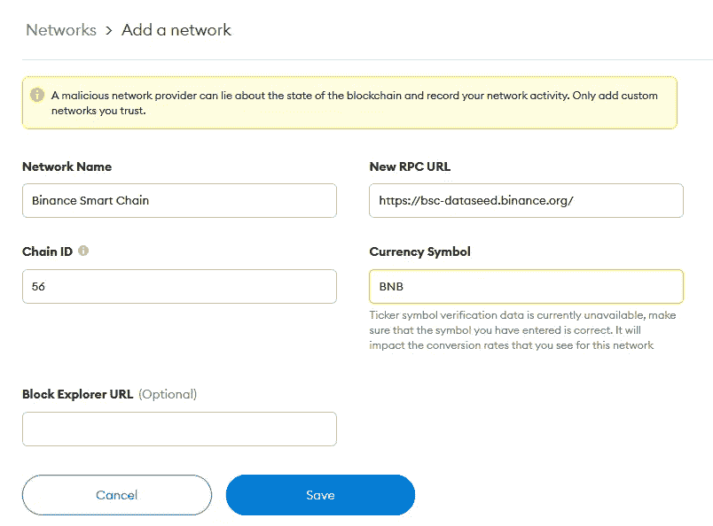

填写屏幕截图中的所有字段，然后单击“保存”

**网络名称:**币安智能连锁

**新的 RPC URL:**[https://bsc-dataseed.binance.org/](https://bsc-dataseed.binance.org/)

**链号:** 56

**符号:** BNB

**屏蔽浏览器网址(可选):**【https://bscscan.com 

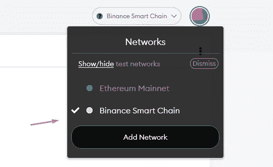

Switch to BSC

# 创建我们的令牌

现在让我们继续创建令牌的过程，请访问 [Remix IDE 网站](https://remix.ethereum.org/)。

它是用 Solidity 编程语言开发的最好和最容易的 IDE 之一。在它的帮助下，大多数智能合同，NFT 项目，加密令牌被创建。

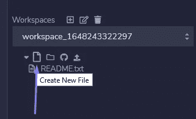

Create new file with name mytoken.sol

粘贴这段代码

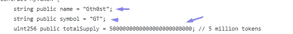

为了使令牌具有唯一性，您需要替换一些值:
name —您的令牌的任何名称，例如比特币
symbol —您的令牌的简称，例如 BTC
totalSupply —将发行的令牌数量

用您自己的值替换这些变量的值。

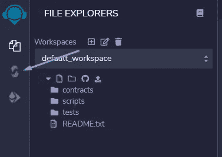

Open Solidity compiler tab

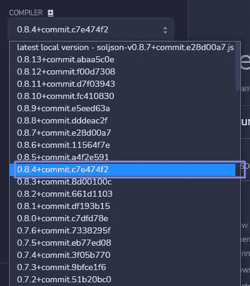

Select version 0.8.4

打开你的代码，按 CTRL + S，如果编译器没有给出错误，一切正常，如果出现错误，谷歌它们或写在评论中，我会帮你修复它们。

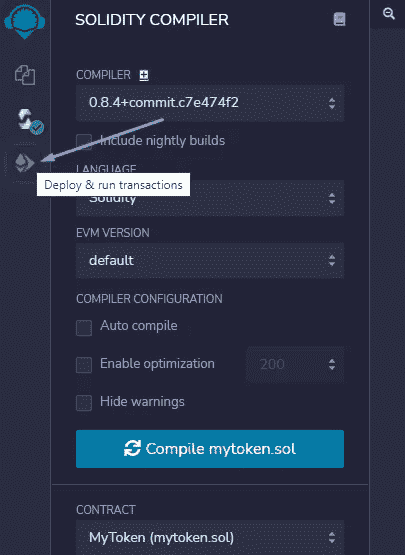

Open Deploy & Run tab

将环境更改为注入的 web3

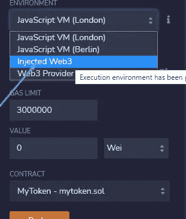

在出现的元掩码窗口中，输入您的密码并确认交易

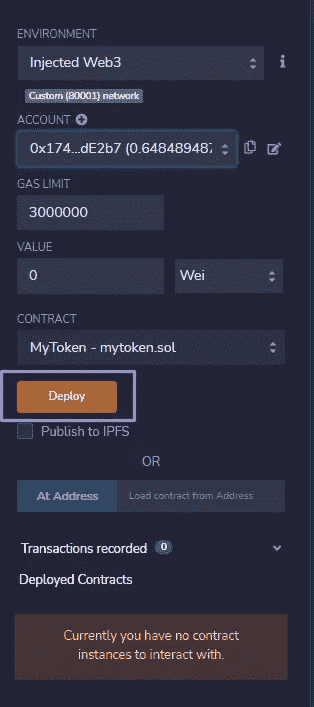

Click DEPLOY

确认合同的部署，你将在 BNB 被收取 3 美元到 15 美元不等的费用。

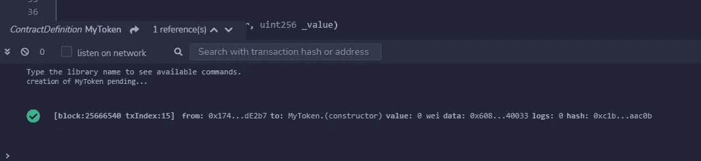

After that, you will see a message about successful deployment

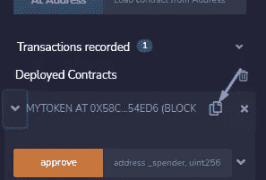

在左侧，您将看到您部署的契约，复制其地址以在元掩码中添加您的令牌。

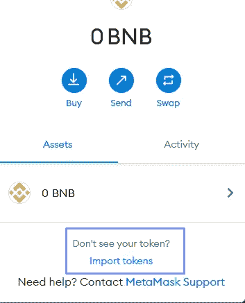

Click import tokens

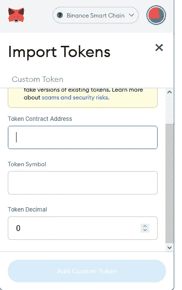

粘贴合同地址并点击“添加自定义令牌”。一切都已完成，您的令牌已创建，您将在元掩码钱包中看到它。

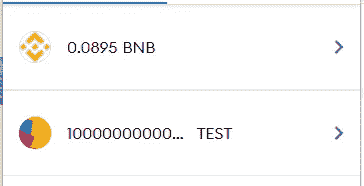

恭喜你，你有了自己的代币，你可以发送给朋友，或者在 pancake swap 或 exchange 上列出你的代币，如果你感兴趣，请在评论中写下，我会写一篇文章介绍如何做。

> 加入 Coinmonks [电报频道](https://t.me/coincodecap)和 [Youtube 频道](https://www.youtube.com/c/coinmonks/videos)了解加密交易和投资

# 另外，阅读

*   [Bookmap 评论](https://coincodecap.com/bookmap-review-2021-best-trading-software) | [美国 5 大最佳加密交易所](https://coincodecap.com/crypto-exchange-usa)
*   最佳加密[硬件钱包](/coinmonks/hardware-wallets-dfa1211730c6) | [Bitbns 评论](/coinmonks/bitbns-review-38256a07e161)
*   [新加坡十大最佳加密交易所](https://coincodecap.com/crypto-exchange-in-singapore) | [购买 AXS](https://coincodecap.com/buy-axs-token)
*   [红狗赌场评论](https://coincodecap.com/red-dog-casino-review) | [Swyftx 评论](https://coincodecap.com/swyftx-review) | [CoinGate 评论](https://coincodecap.com/coingate-review)
*   [投资印度的最佳密码](https://coincodecap.com/best-crypto-to-invest-in-india-in-2021)|[WazirX P2P](https://coincodecap.com/wazirx-p2p)|[Hi Dollar Review](https://coincodecap.com/hi-dollar-review)