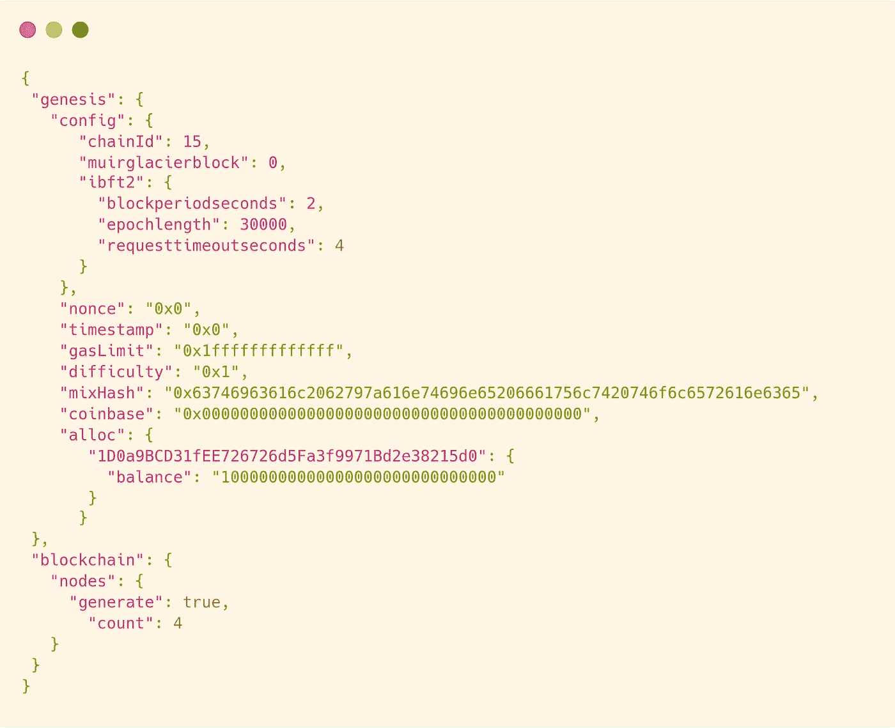

# 使用 Hyperledger Besu 创建私人区块链

> 原文：<https://medium.com/coinmonks/creating-a-private-blockchain-using-hyperledger-besu-96c7f281bab4?source=collection_archive---------3----------------------->

## IBFT 2.0 权威证明共识机制

T 区块链技术的快速进步没有放缓的迹象。它一个接一个地解决了现有数字生态系统的许多问题。区块链技术的主要特征是去中心化。组织可以利用这一特性，使其整个运营或服务系统成为一个更加可靠、分布式和自动化的环境。因此，将目前的集中机制转变为更加分散的机制，从而利用区块链技术的许多功能，同时保持对系统的适当控制，这就是我们今天正在建设的。


我们正在使用 Hyperledger Besu 创建区块链。

> [*Hyperledger Besu*](https://www.hyperledger.org/use/besu)*是一款以太坊客户端，旨在为公共和私有许可的网络用例提供企业友好型服务。它也可以在 Rinkeby、Ropsten 和 gorli 等测试网络上运行。Hyperledger Besu 包括多个共识算法，包括 PoW 和 PoA (IBFT、IBFT 2.0、以太哈希和 Clique)。它的综合许可方案是专门为在财团环境中使用而设计的。*

*我们正在创建一个具有 4 个节点的专用区块链(因为 IBFT 要求至少 4 个节点才能运行)。在这 4 个节点中，一个是启动节点，其他的是验证节点。为了简单起见，我们将从 docker image 运行 besu。我们也可以使用源代码。在这种情况下，从[*repo*](https://github.com/hyperledger/besu)*中克隆源代码，并将`/bin/besu`添加到路径中。**

**首先，我们设置目录，如下所示:**

****

**区块链的第一个街区叫做创世街区。因此，我们需要创建一个起源文件，并从那里我们将启动我们的网络。我们可以使用 besu 从配置文件中生成一个 genesis 文件。在`IBFT-Network/`中创建一个名为`ibftConfigFile.json`的文件，并添加以下代码:**

****

**`chainId`可以根据你的喜好。请创建一个您尚未在任何钱包中使用的 chainId。因为如果你已经将你的钱包连接到一个有相同链 id 的网络，并且在其中进行了一些交易，那么你将在这个网络中得到不正确的 nonce。这将导致问题和交易将不会得到确认。`gasLimit`设置为较高的值，因为这将是一个自由气体网络。在`alloc`中，你可以指定一些账户或智能合约(预先部署)，初始数量的原生硬币将被分配到这些账户或智能合约(基本上是 ETH，因为我们是从以太坊分出来的，但你可以把它视为你自己的硬币，可以用不同的名字来称呼)。**

**现在，如果您从源代码运行中使用 besu:**

```
**besu operator generate-blockchain-config --config-file=ibftConfigFile.json --to=networkFiles --private-key-file-name=key**
```

**如果你使用的是 Besu 的 docker 镜像，创建一个包含以下内容的`docker-compose.yaml`文件，然后运行`docker-compose up`。**

****

**这将生成一个名为`networkFiles`的文件夹。里面会有一个 genesis 文件和另一个名为`keys`的目录，里面有 4 个目录。在所有这些目录中，将有两个文件`key`和`key.pub`。这些是我们 4 个节点的密钥对。**

**从`networkFiles`将源文件复制到所有节点目录(节点 1、节点 2 等)。然后复制一套`key`和`key.pub`到`Node-1/data`。类似地，另一组`key`和`key.pub`用于所有其他节点。**

**现在我们需要一个`config.toml`来配置每个节点。将其放在每个`Node-`目录中。**

****

**您可以添加更多选项。我只是想保持简单。请记住，如果您在同一台主机上设置网络，请为每个节点更改不同的端口。目前，每个节点都保持相同的配置，只有端口不同。现在我们有了启动网络的一切。因此，在每个节点内创建一个`docker-compose.yaml`，这样我们也可以单独启动节点。**

****

**因为我要在一台机器上运行所有 4 个节点，所以我需要在一个命令中启动所有节点。因此，我将通过另一个 docker-compose 来组合所有节点。**

****

**我正在使用网络模式作为主机，这样每个节点都可以建立 p2p 连接而不会复杂化。如果你愿意，你可以创建自定义的网络，并将所有的节点都连接到这个网络上。**

**我们还没完呢！我们正处于最后阶段。目前，节点对其他节点一无所知。所以我们要做的是启动 bootnode，复制它的 enode url，并在其他节点的配置文件中提供它。您还可以单独启动 bootnode 来复制 enode url。但是我将它们一起启动，稍后再重新启动。**

**我们已经将组合的`docker-compose.yaml`包含在`IBFT-Network/`中。在这个目录中，我运行`docker-compose up -d`。现在，所有 4 个节点都将启动并运行。现在，每个节点将控制其公钥、地址、enode url、不同服务的打开的 url 等等。我们单独复制 bootnode 的 enodeUrl，并像这样在其他节点`config.toml`中指定。**

****

**如果您没有使用 network_mode 作为主机，请将 enode url 的最后一部分(127.0.0.1:30303)更改为 bootnode 的分配 IP。**

**最终的文件夹结构将是这样的(复制后删除了`networkFiles`):**

****

**现在我们都准备好了。只需重新启动所有容器，您将从日志中看到，节点将与 bootnode 通信。在几个时间内，网络将准备好并开始开采区块。欲了解更多信息，请查阅 [Besu](https://besu.hyperledger.org/en/stable/) 的官方文档**

**感谢您的阅读…！！**

**参考:[https://www.hyperledger.org/use/besu](https://www.hyperledger.org/use/besu)Github 回购:[https://github.com/prasanth0105/besu-ibft2-network](https://github.com/prasanth0105/besu-ibft2-private-blockchain)**

> **加入 Coinmonks [电报频道](https://t.me/coincodecap)和 [Youtube 频道](https://www.youtube.com/c/coinmonks/videos)了解加密交易和投资**

# **另外，阅读**

*   **[OKEx vs KuCoin](https://coincodecap.com/okex-kucoin) | [摄氏替代品](https://coincodecap.com/celsius-alternatives) | [如何购买 VeChain](https://coincodecap.com/buy-vechain)**
*   **[币安期货交易](https://coincodecap.com/binance-futures-trading)|[3 commas vs Mudrex vs eToro](https://coincodecap.com/mudrex-3commas-etoro)**
*   **[如何购买 Monero](https://coincodecap.com/buy-monero) | [IDEX 评论](https://coincodecap.com/idex-review) | [BitKan 交易机器人](https://coincodecap.com/bitkan-trading-bot)**
*   **[CoinDCX 评论](/coinmonks/coindcx-review-8444db3621a2) | [加密保证金交易交易所](https://coincodecap.com/crypto-margin-trading-exchanges)**
*   **[红狗赌场评论](https://coincodecap.com/red-dog-casino-review) | [Swyftx 评论](https://coincodecap.com/swyftx-review) | [CoinGate 评论](https://coincodecap.com/coingate-review)**
*   **[Bookmap 评论](https://coincodecap.com/bookmap-review-2021-best-trading-software) | [美国 5 大最佳加密交易所](https://coincodecap.com/crypto-exchange-usa)**
*   **[如何在 FTX 交易所交易期货](https://coincodecap.com/ftx-futures-trading) | [OKEx vs 币安](https://coincodecap.com/okex-vs-binance)**
*   **[CoinLoan 评论](https://coincodecap.com/coinloan-review) | [YouHodler 评论](/coinmonks/youhodler-4-easy-ways-to-make-money-98969b9689f2) | [BlockFi 评论](https://coincodecap.com/blockfi-review)**
*   **[XT.COM 评论](https://coincodecap.com/profittradingapp-for-binance) | [币安评论](https://coincodecap.com/xt-com-review)**