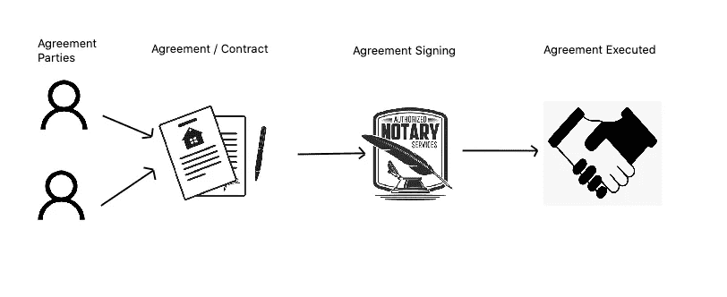
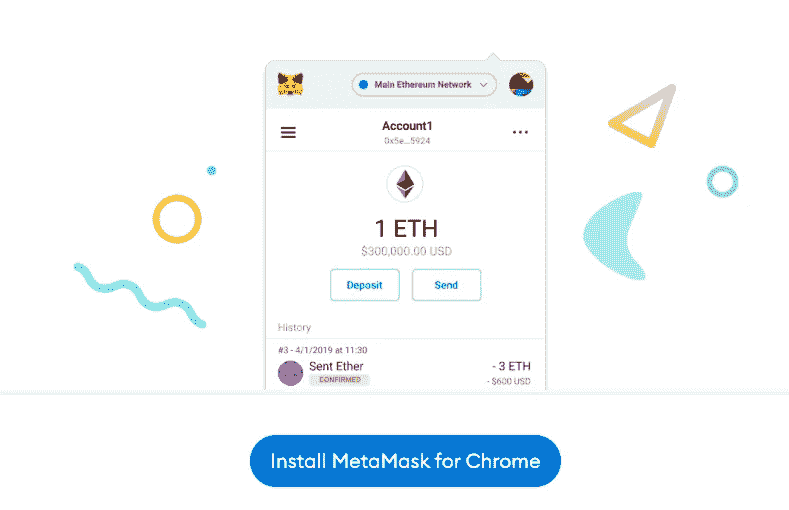
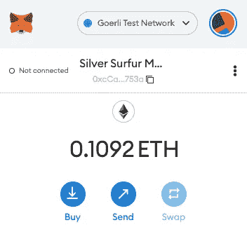
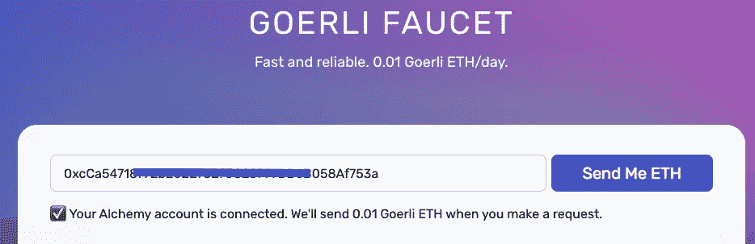
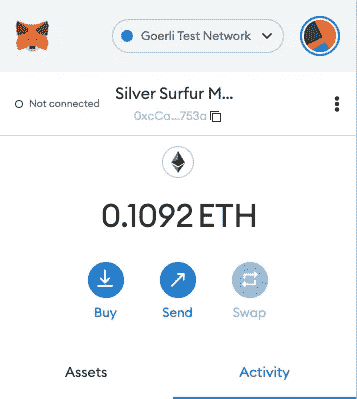
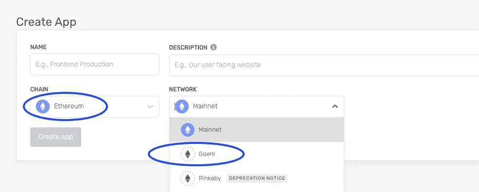
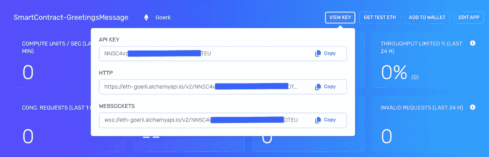
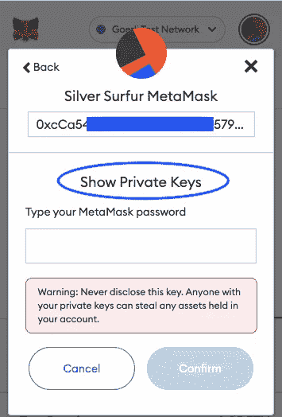
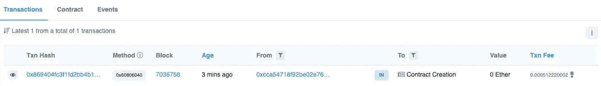

# 在区块链上创建和部署 Solidity 智能合约

> 原文：<https://medium.com/coinmonks/creating-and-deploying-a-smart-contract-on-a-blockchain-c97e9edcc065?source=collection_archive---------10----------------------->

如果你在区块链和加密货币领域，那么你应该听说过智能合约，如果你没有，那也没关系，因为我会以一种简单的方式介绍什么是智能合约，以及如何创建智能合约并将其部署在区块链上。

但是作为第一步，你必须像这样与我同步；-)


Building Smart Contract: First Step

> 对于新手来说，
> 
> 区块链是一种(形式的)分布式分类帐，具有不断增长的以加密方式链接在一起的块(或记录)列表。
> 
> 简而言之，我们可以将智能合约描述为包含一组规则并在区块链上执行的计算机代码。


Smart Contract: A typical Tenancy Agreement

让我们用一个例子来更好地理解它。在我们的现实世界中，我们有一份打印的租赁协议或租赁合同，包含所有的协议条款，签约双方必须遵守。在区块链世界中，我们可以通过智能合同以纯数字形式拥有相同的租赁合同。而陈述纯数字形式意味着以计算机程序或代码的形式，其中该计算机代码固有地保存了所涉及的各方同意的所有租赁合同条款的程序性表示，并且最有趣的部分是没有人能够改变该合同，甚至所涉及的签署方也不能。

它可以被解释为



Smart Contract: A typical Tenant Agreement / Contract flow


Smart Contract: A typical Smart Contract flow on Blockchain

现在，我们对智能合约有了很好的了解，让我们转到一些实际的东西，即如何创建智能合约并部署它。正如我提到的，这是一个自动执行的计算机程序，因此我们将使用一些编码和工具来构建和部署我们的智能合同。

我们将使用稳固，安全帽，炼金术和超能面具。不要担心，随着我们的发展，我们会了解这些情况的。

> 对于新手来说
> 
> Solidity: Solidity 是一种面向对象的编程语言，用于在区块链平台上实现智能合约。受 C++、JavaScript、Python 的影响。
> 
> Hardhat: Hardhat 是一个开发环境，用于编译、部署、测试和调试基于以太坊的软件。
> 
> Alchemy: Alchemy 为区块链公司开发和销售工具和基础设施服务。Alchemy 拥有广泛的产品，提供了一个强大的区块链开发平台，提供了一套开发工具。
> 
> 元掩码:元掩码是一个加密钱包，允许用户存储和交换以太和其他以太相关的令牌。

让我们在我们的机器/系统上快速设置这些，以开发和部署我们的智能合同。让我们开始吧

# 安装元掩码

转到 [MetaMask](https://metamask.io/download/) 并为您的浏览器安装 MetaMask(通过可用的浏览器扩展),然后按照上面提到的简单步骤创建您的 MetaMask 钱包帐户。

> 对于新手来说，MetaMask 是一个加密钱包，允许用户存储和交换以太和其他以太相关的令牌。



Smart Contract: Install MetaMask for your browser: Go to [MetaMask Download](https://metamask.io/download/) page

**设置 MetaMask**
在创建我们的钱包后，我们将通过从水龙头添加乙醚来设置它。为了将我们的智能合约部署到测试网络，我们需要一些假的乙醚。为什么？因为在区块链上部署和执行代码需要一笔汽油费，这笔费用通常是使用加密货币和令牌支付的。在我们的情况下，我们将使用 ETH 支付燃气费。

按照以下步骤进入您的 MetaMask 钱包

1.  将网络更改为 Goerli 测试网络



Smart Contract: Step1 MetaMask Wallet set-up

2.去[戈雷利水龙头](https://goerlifaucet.com/)并输入你的 MetaMask 钱包地址和发送一些测试 Eth



Smart Contract: Step2 send test eth to you MetaMask Wallet

发送 test Eth 后，您的 MetaMask 钱包应该开始反映更新后的金额。



Smart Contract: MetaMask wallet with test Eth

# 使用炼金术

为了运行我们的智能合同，我们将使用 Alchemy，通过它我们将能够与以太坊链进行通信，并拥有用于分析和监控的开发工具。使用[注册](https://auth.alchemyapi.io/signup)创建免费账户



Smart Contract: Create app on [Alchemy](https://dashboard.alchemyapi.io/apps)

一旦你完成了注册过程，然后创建一个应用程序，选择给应用程序命名为“SmartContract-GreetingsMessage”和 **Chain** 作为 **Ethereum** 和 **Network** 作为 **Goreli**

创建应用程序后，您可以从视图部分查看 API 密钥。请将它放在手边，因为我们将在进行智能合约配置时使用它。



Smart Contract: View API key on [Alchemy](https://dashboard.alchemyapi.io/apps)

# 智能合同项目设置

将 [Github](https://github.com/hemantjuyal/smart-contract-greetings) 中的[问候智能合约项目](https://github.com/hemantjuyal/smart-contract-greetings)代码签出到您的本地目录中。您将看到以下项目结构。别担心，我会解释这些重要的文件。

> 注意:如果你已经在本地机器上安装了 Github，那么按照[官方安装页面](https://github.com/git-guides/install-git)安装到你的系统上


Smart Contract: [Github](https://github.com/hemantjuyal/smart-contract) project set-up

我们将使用节点和 CLI 终端来执行我们的命令。如果你还没有在你的机器上安装 LTS 版本的[节点](https://nodejs.org/en/)。

> 对于新手来说，Node.js 是建立在 Chrome 的 V8 JavaScript 引擎上的 JavaScript 运行时，而 *LTS* 的发布状态是“长期支持”，通常保证关键错误将在总共 30 个月内得到修复。

从项目的根文件夹运行以下命令，它将安装所有项目依赖项

```
npm install
```

`contract`文件夹中有一个 GreetingMessages.sol 文件，这是一个 Solidity 文件，有一组逻辑。这是一个简单的智能合同，将初始化一个默认的问候消息，并有一个更新功能来更新消息。

Smart Contract: GreetingMessages .sol smart contract

**。env Configuration** 在 Github [克隆项目](https://github.com/hemantjuyal/smart-contract-greetings)根文件夹下，新建一个文件，命名为。“env ”,它将具有我们所需的 env 配置参数。输入相关详细信息

```
#.env file configuration for deploying our Smart ContractAPI_URL = Copy HTTP value from your Alchemy app key details section
API_KEY = Copy API_KEY value from your Alchemy app key details section
PRIVATE_KEY = Your MetaMask wallet private key
```


Smart Contract: View API key and HTTP configuration on [Alchemy](https://dashboard.alchemyapi.io/apps)

请参考[如何导出元掩码帐户的私钥](https://metamask.zendesk.com/hc/en-us/articles/360015289632-How-to-export-an-account-s-private-key)以遵循步骤并获取“私钥”配置的值



Smart Contract: [Export you MetaMask wallet private keys](https://metamask.zendesk.com/hc/en-us/articles/360015289632-How-to-export-an-account-s-private-key)

配置齐全。env 文件看起来会像这样

Smart Contract: .env file configuration

# 部署您的智能合同

从项目根文件夹运行以下命令来编译我们的 solidity 代码

```
npx hardhat compile
```

如果按照[前面的步骤](#d3e8)正确安装了所有的节点包，那么您将会收到类似“成功编译 1 个 Solidity 文件”的成功消息

要部署编译代码，导航到`scripts/deploy.js`,您会发现代码如下

ethers.js 中的`ContractFactory`是用于部署新智能契约的抽象，所以这里的`GreetingMessages`是我们的`GreetingMessages`契约实例的工厂。在`ContractFactory`上调用`deploy`将启动部署。

运行命令以执行部署过程

```
npx hardhat run scripts/deploy.js
```

成功部署后，您将收到消息“*合同部署到地址:0xeD0B03aD1C49……* ”

> *注意:我已经提到了在 CLI 终端上执行命令时收到的部分地址。您的本地代码执行将根据您的配置为您提供不同的地址。所以请记下这个*

**部署智能合约验证
上面的**命令输出显示，在区块链上部署成功。复制该地址并将其保存到一个文件中，因为我们将在下一阶段涉及的其他场景中引用它。要验证已部署的智能合同，请转到 [Goreli Testnet Explorer](https://goerli.etherscan.io/) 并输入您的合同地址。您会发现`GreetingMessages`合同创建条目是合同细节的一部分，因此我们部署的合同是有效的。



Smart Contract: Deployed contract details

恭喜你！！！我们已经成功部署了智能合同。庆祝的时间到了；-)


Smart Contract: Deployment successful and now it’s time for celebration

> 图片来源:派拉蒙电影公司和莱昂纳多·迪卡普里奥

> **词汇:**
> 
> 天然气:天然气是 EVM 内用于计算交易费的记账单位，交易费是指交易发送方必须向在区块链中包含交易的矿商支付的 ETH 金额。来自[维基百科](https://en.wikipedia.org/wiki/Ethereum#:~:text=Gas%20is%20a%20unit%20of,the%20transaction%20in%20the%20blockchain.)
> 
> NFT:NFT 或不可替代的令牌通常包含对数字文件的引用，如照片、视频和音频。来自[维基百科](https://en.wikipedia.org/wiki/Non-fungible_token#:~:text=The%20ownership%20of%20an,sold%20and%20traded)

# 其他推荐文章

[](/@hemantjuyal/how-to-create-and-sell-your-nft-on-opensea-in-real-without-gas-fee-in-10-mins-801d7e40ab17) [## 如何在 10 分钟内在 OpenSea 上创建和销售你的 NFT 而不用付汽油费

### 相信我…我会让它变得简单明了…创建您的 NFT 并在现实中销售它非常容易…

medium.com/@hemantjuyal](/@hemantjuyal/how-to-create-and-sell-your-nft-on-opensea-in-real-without-gas-fee-in-10-mins-801d7e40ab17) [](/@hemantjuyal/how-i-did-my-first-crypto-mining-successfully-d3d041dc6117) [## 我是如何成功完成第一次加密挖掘的

### 要成功挖掘加密货币，请遵循以下步骤。第一步是安装 Monero 钱包。第二步是安装 XMRig…

medium.com/@hemantjuyal](/@hemantjuyal/how-i-did-my-first-crypto-mining-successfully-d3d041dc6117) [](/@hemantjuyal/interacting-with-your-deployed-smart-contract-on-blockchain-using-hardhat-bf14767bc0a5) [## 使用 Hardhat 与您在区块链上部署的智能合同进行交互

### 我们将学习如何使用安全帽、元面具和炼金术与我们部署的 Solidity 智能合同进行交互

medium.com/@hemantjuyal](/@hemantjuyal/interacting-with-your-deployed-smart-contract-on-blockchain-using-hardhat-bf14767bc0a5) [](/@hemantjuyal/publish-and-verify-your-smart-contract-for-its-authenticity-on-etherscan-758cf8304793) [## 在 Etherscan 上发布并验证您的智能合同的真实性

### 我们将学习如何在 Etherscan 上验证我们部署的 solidity 智能合同的真实性。

medium.com/@hemantjuyal](/@hemantjuyal/publish-and-verify-your-smart-contract-for-its-authenticity-on-etherscan-758cf8304793) 

> 加入 Coinmonks [电报频道](https://t.me/coincodecap)和 [Youtube 频道](https://www.youtube.com/c/coinmonks/videos)了解加密交易和投资

# 另外，阅读

*   [霍比审核](https://coincodecap.com/huobi-review) | [OKEx 保证金交易](https://coincodecap.com/okex-margin-trading) | [期货交易](https://coincodecap.com/futures-trading)
*   [网格交易机器人](https://coincodecap.com/grid-trading) | [Cryptohopper 审查](/coinmonks/cryptohopper-review-a388ff5bae88) | [Bexplus 审查](https://coincodecap.com/bexplus-review)
*   [7 个最佳零费用加密交易平台](https://coincodecap.com/zero-fee-crypto-exchanges)
*   [氹欞侊贸易评论](https://coincodecap.com/anny-trade-review) | [火币保证金交易](/coinmonks/huobi-margin-trading-b3b06cdc1519)
*   [分散交易所](https://coincodecap.com/what-are-decentralized-exchanges) | [比特 FIP](https://coincodecap.com/bitbns-fip) | [Pionex 评论](https://coincodecap.com/pionex-review-exchange-with-crypto-trading-bot)