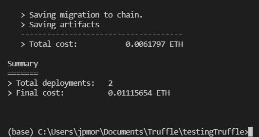

# 使用 Truffle 和 Ganache 创建和部署智能合约

> 原文：<https://medium.com/coinmonks/creating-and-deploying-smart-contracts-using-truffle-and-ganache-ffe927fa70ae?source=collection_archive---------3----------------------->


Truffle 是一个**IDE**(**I**integrated**D**development**E**environment)广泛用于编译、测试和部署与 EVM 兼容的区块链的智能合约。Truffle 由与以太坊平台相关的最大公司之一 Conensys 创建和维护；例如，Conensys 负责 MetaMask 和其他几个区块链解决方案。

**Ganache** 是 Truffle 套件的一部分，这是一套帮助分散应用开发的工具。它就像一个私人区块链、一个节点和一个钱包。它拥有开发人员测试应用程序所需的一切，就好像它正在与一个真实的区块链交互一样(不管这个术语是什么意思)。

在本文中，我们将了解如何开始使用 Truffle 和 Ganache 来编写、编译和部署智能合约，这是在区块链上运行的程序。

要开始使用，你需要在电脑上安装 Truffle。最简单的方法是使用 Node.js 的包管理器 NPM，如果你的电脑上没有安装 NPM，我建议你安装最新版本的 Node。Js，这将自动安装 NPM。

要安装 Node.js，请访问[nodejs.org](http://nodejs.org)，并按照您的操作系统的说明进行操作。

# 安装松露和加纳切

安装 NPM 后，打开首选的命令终端并键入

```
> npm install truffle -g
```

这个命令将在你的机器上全局安装 Truffle，也就是说，你可以在任何目录下运行这个命令。要验证 Truffle 是否安装正确，可以输入

```
> truffle version
```

您应该会得到与下图类似的回报。


Current version of truffle, solidity, node and web3.js

该消息将表明 Truffle 安装正确。它会自动安装一个客户端版本的 Ganache，但是我们希望安装一个带有图形界面的 GUI 版本。您可以在以下地址[trufflesuite.com/ganache/](http://trufflesuite.com/ganache/)按照您的操作系统的说明进行操作。

一旦完成，Ganache 应该作为一个应用程序出现并运行。我用的是 Windows，所以有下图。


Ganache as a desktop application

现在我们已经安装了松露和 Ganache，我们可以开始一个新的松露项目。

# 开始一个新的松露项目

为了开始一个新的 Truffle 项目，我们创建了一个新的目录和类型

```
> truffle init
```

结果可以在下图中看到。


一个新的 Truffle 项目由一个配置文件和三个文件夹组成，其中包含一些文件。下面我使用 Visual Studio 代码来检查这些文件夹和文件。


Three folders were created: one for contracts, another for migrations and a third for tests.

它创建了一个包含合同的文件夹，一个包含部署文件的文件夹(Truffle 称之为迁移)，以及一个包含测试的文件夹，我们可以在合同投入生产之前编写这些测试来测试合同的逻辑。

目前，我们要做的只是取消配置文件(truffle-config.js)中定义要使用的网络的部分的注释。


注意主机和端口必须与 Ganache 中配置的相同。要找出 Ganache 使用哪个端口，让我们运行它。通过这样做，您将看到一个类似于下图所示的屏幕，不同之处在于您不会生成任何工作空间。


You can choose quickstart to launch Ganache without creating a new workspace.

您不需要创建新的工作空间。单击快速启动。在顶部中间，您会发现 Ganache 正在运行的端口。它应该与您的 Truffle 配置文件相同。


The port must be the same as the Truffle configuration file. If not, change the configuration file.

现在一切都准备好了，我们可以用 Truffle 编写我们的第一个智能合同了。

# 用松露汇编一份智能合同

要编写智能合同，我们可以使用自己选择的文本编辑器。我正在使用 Visual Studio 代码在 solidity 中编写一个简单的契约，它在区块链上存储一个字符串。我们首先在 contracts 文件夹中创建一个新文件，名为 *storage.sol* 。

```
//SPDX-License-Identifier: MIT pragma solidity ^0.8.11; contract Storage {      
   string public name;      
   function setName(string memory _name) public {         
      name = _name;     
   }  
}
```

契约由一个字符串作为状态变量， *name* ，以及一个用于改变这个状态变量的公共函数， *setName()* 。由于状态变量是公共的，编译器将生成一个函数，允许我们检索状态变量*的名称。*

现在我们可以运行编译器了。当我们这样做时，Truffle 将编译 contracts 文件夹中包含的 2 个合同: *Migrations.sol* 和 *Storage.sol* 。第一个是由 Truffle 创建的契约，目标是管理已经执行的迁移，以便已经迁移(部署)的契约不会再次迁移。

为了编译合同，我们使用下面的命令:

```
> truffle compile
```

结果可以在下图中看到:


Two contracts were successfully compiled.

注意，Truffle 创建了一个新文件夹(和子文件夹)， *build/contracts* ，在这里我们可以找到两个 JSON 文件: *Migrations.json* 和 *Storage.json* 。这些是契约工件，在这里我们可以找到部署和与契约交互的所有必要信息，比如字节码和 ABI。在本文中，我们不会深入讨论这些细节。

现在我们需要为存储合同编写迁移文件。在 migrations 文件夹中新建一个文件，命名为 *2_deploy_storage.js* ，如下图所示。


名字没那么重要，但必须加个*‘2 _’*，这样松露才知道迁徙顺序。内容将类似于 *1_initial_migration.js* ，但是将*迁移*替换为*存储*。参见下面的代码:

```
const Storage = artifacts.require("Storage"); module.exports = function (deployer) {   
   deployer.deploy(Storage); 
};
```

我们使用*存储*，因为这是契约的名称，也是应该使用的契约的名称。现在，我们准备部署合同。

# 将合同部署到加纳切

为了将契约部署到 Ganache，我们使用以下命令

```
> truffle migrate
```

确保 Ganache 已打开并正在运行。由于这是我们的第一次迁移，Truffle 将部署两个合同:*迁移*和*存储*。这可以从下图中看出:



Two contracts were migrated to the blockchain.

如果一切顺利，我们可以在加纳切确保合同已经送到区块链。让我们看看下图中的“交易”选项卡。


As we can see, two transactions resulted in contracts being deployed, as expected.

最后，让我们使用松露控制台与合同进行交互。

# 使用 Truffle 控制台

Truffle 控制台是一个 REPL 环境，用于与我们所连接的测试区块链节点(例如，Ganache)进行交互。要打开控制台，我们运行

```
> truffle console
```

第一步是创建一个我们通过 Truffle 部署的契约的实例。这是通过契约相关对象的 deployed()方法完成的。正如我们在迁移文件中定义的那样，对象是存储。因此，为了创建一个实例，我们编写

```
> let instance = await Storage.deployed()
```

结果如下图所示:


The variable instance is now an instance of the object Storage.

现在我们可以检索状态变量*名称*，或者通过 *setName()* 函数对其进行更改。使用我们创建的实例，运行适当的方法即可。

要更改 name 变量的值，我们运行以下方法

```
> await instance.setName('John')
```

退货必须是交易，如下图所示:


The transaction was successful, as one can see.

为了检索变量名，我们执行以下方法:

```
> await instance.name()
```

这一次，由于没有改变状态变量，所以没有执行事务，只有一个调用。这将返回变量*name*‘John’的值，如下所示:


**感谢阅读！**

> 加入 Coinmonks [电报频道](https://t.me/coincodecap)和 [Youtube 频道](https://www.youtube.com/c/coinmonks/videos)了解加密交易和投资

# 另外，阅读

*   [Bookmap 评论](https://coincodecap.com/bookmap-review-2021-best-trading-software) | [美国 5 大最佳加密交易所](https://coincodecap.com/crypto-exchange-usa)
*   最佳加密[硬件钱包](/coinmonks/hardware-wallets-dfa1211730c6) | [Bitbns 评论](/coinmonks/bitbns-review-38256a07e161)
*   [新加坡十大最佳加密交易所](https://coincodecap.com/crypto-exchange-in-singapore) | [购买 AXS](https://coincodecap.com/buy-axs-token)
*   [红狗赌场评论](https://coincodecap.com/red-dog-casino-review) | [Swyftx 评论](https://coincodecap.com/swyftx-review) | [造币厂评论](https://coincodecap.com/coingate-review)
*   [投资印度的最佳密码](https://coincodecap.com/best-crypto-to-invest-in-india-in-2021)|[WazirX P2P](https://coincodecap.com/wazirx-p2p)|[Hi Dollar Review](https://coincodecap.com/hi-dollar-review)