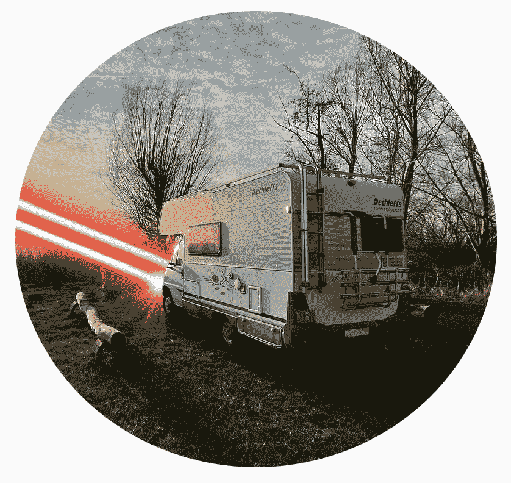

# 比特币旅馆是一家秉承“比特币精神”创立的企业

> 原文：<https://medium.com/coinmonks/creating-enterprises-in-the-spirit-of-bitcoin-the-bitcoin-hostel-e782361bb6df?source=collection_archive---------43----------------------->

**Visit our website:-** [**https://bitcoinsupports.com/**](https://bitcoinsupports.com/)

葡萄牙正在建设的一家比特币旅馆突显出一种日益增长的趋势，即人们在创建企业时，不仅仅考虑一种数字货币。

一家比特币(BTC)旅舍正在前往葡萄牙的路上。我们会见了欧洲第一家比特币专用旅舍的业主，了解比特币如何影响商业战略，从规划到设计再到社区。比特币旅舍是一个旅舍和聚集地，比特币(照明或链上)是唯一被接受的支付方式——一个“比特币精神”影响决策的场所。阿尔伯特·沃尔夫拉姆和他的女朋友瓦莱里娅·帕迪米里利奥在柏林建造了这家旅馆。“她负责商业，我负责建筑，”他说，“但我也更喜欢比特币。”Wolframm 的能力和兴趣结合在比特币宿舍里:“旅行、比特币和建筑。”在发展的每个阶段，比特币宿舍都与比特币社区进行沟通，以“开源风格”的治理方式考虑比特币创造者的请求和建议。

例如，在募集资金时，这家旅社采纳了蒂亚戈·赛洛斯的建议，使用了塔利科因。赛洛斯是人工智能交易机器人 hodl 背后的葡萄牙比特币创造者，也是葡萄牙 A 晴太比特币的联合创始人，这是一个葡萄牙语双关语，翻译成“比特币狂热”，已被接受。

[https://Twitter . com/Bitcoin _ hostel/status/1511065396115292165](https://twitter.com/bitcoin_hostel/status/1511065396115292165)

按照赛洛斯的说法，根据比特币原理建立一项业务是“极具颠覆性的”他解释说，像比特币招待所这样的公司展示了:

**“真正的比特币精神是去中心化、社区驱动和开源的！”我相信这是一种新的经营方式的开始，这种方式将会在未来流行起来！的确，从没有监管的杰克·多西信托，到比特币播客彼得·麦科马克的足球俱乐部，比特币的商业模式正变得越来越流行，他希望以比特币为标准来运营这个俱乐部。Paco De La India 正在环游世界，口袋里只有一个比特币种子短语，而西非的“Nourou”则努力将基于比特币的决策置于塞内加尔修复社区的核心。**

**Visit our website:-** [**https://bitcoinsupports.com/**](https://bitcoinsupports.com/)

在参与 Twitter 空间并实时更新比特币制造者和感兴趣的各方的同时，该旅舍正在举办一场比赛，以挑选旅舍的设计。虽然 Wolframm 的专业建筑才能在设计比赛中很有用，但该网站开玩笑说，该设计“具有最大的哈希…呃抱歉，设计力量将获胜！”Wolframm 支持自治和“将权力还给人民”，这与比特币的理念是一致的。从他的硕士学位中，他发现当人们拥有更多自主权和对未来的愿景时，他们会更幸福，更繁荣，他认为比特币是允许更大自由的工具。迄今为止，比特币旅馆已经产生了“来自比特币社区的令人难以置信的反应”，来自世界各地的比特币爱好者都渴望提供帮助。

**“我们收到了 1000 多名粉丝和大量的私人信息，他们想知道我们在哪里，我们的状况如何，以及他们是否能以任何方式帮助我们。”比特币旅馆夫妇获得了一笔法定贷款——“我们不想出售任何比特币”——并开始在葡萄牙调查该项目的选项。Wolframm 表示，他已经从该领域的比特币创造者那里获得了大量价值，这促使他继续以比特币为中心的方式发展公司。Sats Ledger——一种面向儿童的比特币储蓄书——的发明者“MTC”告诉我们，当他第一次开始他的比特币 side hustle 时，他也对比特币社区的热烈反应感到兴奋。MTC 还表示，比特币社区的反应是“惊人的”，并分享了以下建议:

**“如果个人有在这个领域贡献任何东西或做一个兼职项目的冲动，我会说，‘把你的心投入进去’，因为你会得到反馈、联系、见解和你从未梦想过的体验。”****

**Visit our website:-** [**https://bitcoinsupports.com/**](https://bitcoinsupports.com/)

比特币旅舍建筑比赛正在进行中，露营车已经获得安全保障，计划于 2023 年初开始建设。

**访问我们的网站:-**[**https://bitcoinsupports.com/**](https://bitcoinsupports.com/)

**免责声明:以上为作者观点，不应视为投资建议。读者应该自己做研究。**

> 加入 Coinmonks [电报频道](https://t.me/coincodecap)和 [Youtube 频道](https://www.youtube.com/c/coinmonks/videos)了解加密交易和投资

# 另外，阅读

*   [如何匿名购买比特币](https://coincodecap.com/buy-bitcoin-anonymously) | [比特币现金钱包](https://coincodecap.com/bitcoin-cash-wallets)
*   [币安 vs FTX](https://coincodecap.com/binance-vs-ftx) | [最佳(SOL)索拉纳钱包](https://coincodecap.com/solana-wallets)
*   [比诺莫评论](https://coincodecap.com/binomo-review) | [斯多葛派 vs 3Commas vs TradeSanta](https://coincodecap.com/stoic-vs-3commas-vs-tradesanta)
*   [Capital.com 评论](https://coincodecap.com/capital-com-review) | [香港的加密借贷平台](https://coincodecap.com/crypto-lending-hong-kong)
*   [如何在 Uniswap 上交换加密？](https://coincodecap.com/swap-crypto-on-uniswap) | [A-Ads 审查](https://coincodecap.com/a-ads-review)