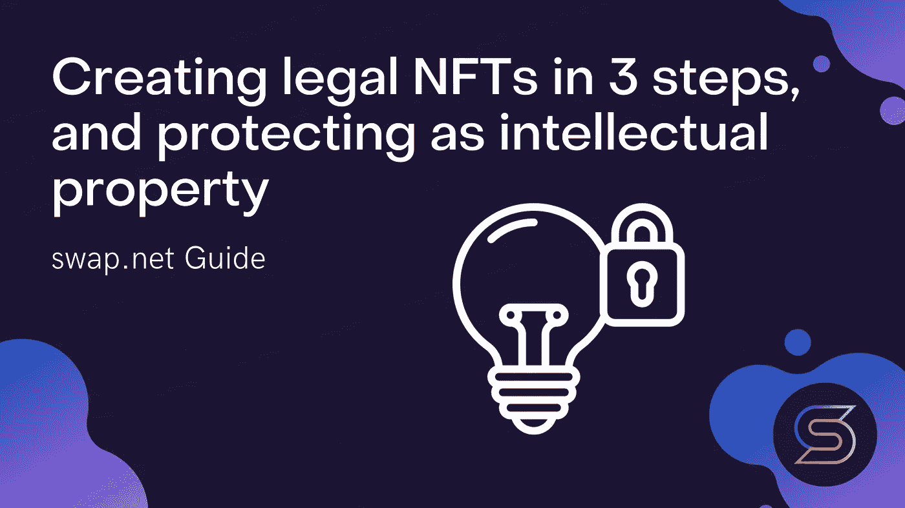

# 分三步创建合法的 NFT，并作为知识产权进行保护

> 原文：<https://medium.com/coinmonks/creating-legal-nfts-in-3-steps-and-protecting-as-intellectual-property-796120adaa9c?source=collection_archive---------18----------------------->

## 让我们立即下令混乱和停止骗局，看看目前的局势和国际法。

对 NFT 代币市场的兴趣和增长的爆炸式增长已经使关键的行业问题浮出水面。让我们看看基于《保护工业产权巴黎公约》和联合国新的世界知识产权组织(WIPO)工具创建非关税壁垒的法律模式。

这种方法具有超国家的法律地位，在 177 个国家不需要额外的合法化。它也只需要 15 分钟，成本很低。通过结合国际法和 NFT 教，我们将创造一个巨大的新市场。

## 使用这种方法，哪些知识产权可以转化为 NFT？

*   商业秘密和未披露的专有技术；
*   创造性的工作。音频、视频或文学；
*   创意设计。例如，品牌标志、装饰、纺织品或建筑设计；
*   工业设计。各种技术方案、计划和流程。
    软件代码。游戏、应用等。；
*   研究。包括实验笔记、报告和其他结果；
*   数据。比如人工智能算法的训练结果，基因测序的结果。

这些信息可以转换成 NFT 令牌，并在知识产权客体的创造、开发和使用中作为整体或部分实现。

大约一半的杰出发明仍然部分或全部以专有技术的形式存在，以防止非法使用。这种方法为这种知识产权的合法贸易创造了一个市场。

此外，并非智力活动的每一项成果都受到法律保护，根据定义和法定豁免，都被视为发明。

这些对象可以是问题、设计、方案、想法等的非技术性解决方案。这种方法阻止了盗窃，也可能给专有技术交易带来一些秩序。

## 第一步。为您的知识产权创建一个 PDF 文档。用你的电子签名签名

签名链接到作为作者的您，以及文档本身。以电子签名签署的文件与手写的纸质文件具有同等的法律效力。

## 第二步:在联合国世界知识产权组织(WIPO)的 [WIPO PROOF](https://www.wipo.int/wipoproof/ru/index.html) 服务上，下载文档并获得 WIPO 令牌

这是一种在线服务，可以快速创建在特定时间点存在数字文件的防篡改证据。这项由一家主要的国际知识产权组织提供的新服务提供了一种保护宝贵数字资产的方法，无论它们是创造性工作、产品设计、发明还是创新工作的研究数据和发现。

## 第三步:变成 NFT 代币

1.  在公开描述(元数据)中，指定由作者转让给所发行的 NFT 令牌的所有者的知识产权的所有权条款。我们还包括一个 IPFS 链接，链接到作者签署的出售专有技术的公开报价协议。
2.  在那里，我们还描述了未公开发明的本质、应用领域和实验结果。描述私有部分包含的材料。
3.  我们附上世界知识产权组织的证书。
4.  可选地，可以添加国际专利律师关于新颖性、专有技术的发明步骤和工业适用性的报告。这允许购买者在购买前“感受”发明。
5.  在私有描述(可解锁内容)中，只有令牌的所有者可以访问，我们提供了一个 IPFS 链接，链接到包含所有材料和图纸的加密档案。以及与 WIPO 令牌的 IPFS 链接，它与公共部分的证书有着不可分割的联系。

## 协议的超国家性和 [WIPO 仲裁和调解中心](https://www.wipo.int/amc/en/index.html)

为使 NFT 代币国际交易的整体程序在绝大多数司法管辖区有效，尽可能利用超国家监管组织的资源。从申请 WIPO 证明证书到指定其仲裁中心作为解决任何争议的场所。WIPO 非常了解专有技术转让协议的性质。它拥有专业知识和能力，能够驾驭任何涉及知识产权交易的复杂、非标准的技术流程。

一个新的知识产权市场出现的环境已经具备。一方面，WIPO 创立了一种独特的优先权证书，其作者认证与其超国家仲裁完全匹配。另一方面，新 NFT 技术已经成为一个价值数十亿美元的市场，并证实了其主要的生存能力。

# 交换。网队
官网—[https://swap.net/](https://swap.net/)
推特—[https://twitter.com/NFTSwapnet](https://twitter.com/NFTSwapnet)
不和—[https://t.co/uzz0Qt12tf](https://t.co/uzz0Qt12tf)
中—[https://medium.com/@NFTSwapnet](/@NFTSwapnet)
文档&白皮书—[http://docs.swap.net](https://t.co/5qc7Mxt2p5)

> 加入 Coinmonks [电报频道](https://t.me/coincodecap)和 [Youtube 频道](https://www.youtube.com/c/coinmonks/videos)了解加密交易和投资

# 另外，阅读

*   [Bookmap 点评](https://coincodecap.com/bookmap-review-2021-best-trading-software) | [美国 5 大最佳加密交易所](https://coincodecap.com/crypto-exchange-usa)
*   最佳加密[硬件钱包](/coinmonks/hardware-wallets-dfa1211730c6) | [Bitbns 评论](/coinmonks/bitbns-review-38256a07e161)
*   [新加坡十大最佳加密交易所](https://coincodecap.com/crypto-exchange-in-singapore) | [购买 AXS](https://coincodecap.com/buy-axs-token)
*   [红狗赌场评论](https://coincodecap.com/red-dog-casino-review) | [Swyftx 评论](https://coincodecap.com/swyftx-review) | [CoinGate 评论](https://coincodecap.com/coingate-review)
*   [投资印度的最佳密码](https://coincodecap.com/best-crypto-to-invest-in-india-in-2021)|[WazirX P2P](https://coincodecap.com/wazirx-p2p)|[Hi Dollar Review](https://coincodecap.com/hi-dollar-review)