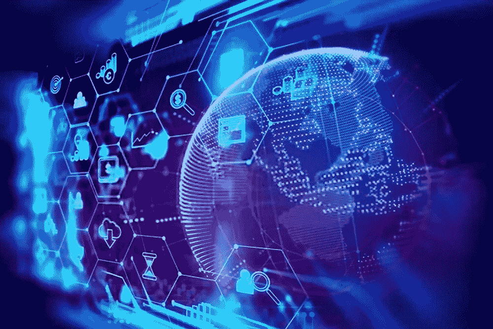
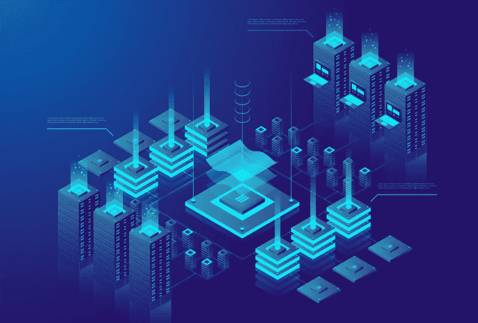
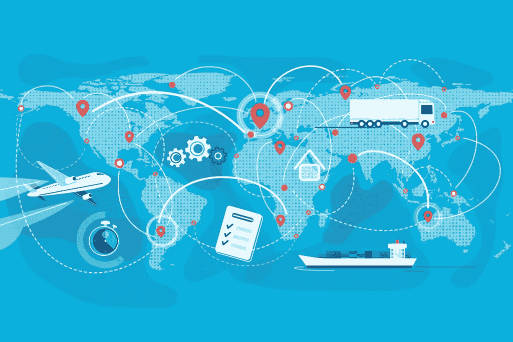

# 用区块链创造供应链的未来

> 原文：<https://medium.com/coinmonks/creating-the-future-of-supply-chain-with-blockchain-7a272cfd3eeb?source=collection_archive---------60----------------------->

# 供应链的未来

故事最初发表于[https://koop360.com/blog/supply-chain-with-blockchain/](https://koop360.com/blog/supply-chain-with-blockchain/)

> *如今，人们普遍倾向于了解区块链。这是因为任何国家的每个领先企业现在都在寻求以几种方式整合区块链。区块链最好的地方在于，它不局限于数字令牌形式的用法创新。*

***本文献给那些想通过学习区块链开始了解一切，然后用*** [***区块链转移到供应链的人。***](https://koop360.com/blog/what-is-blockchain/)

# 区块链概述:

简单来说，[区块链技术](https://en.wikipedia.org/wiki/Blockchain)是存储信息的加密分布式数据库。这也是区块链成为加密货币中核心集成的原因。区块链的集成可以通过在最短的时间内提供高效的可扩展性来帮助企业。因此，区块链提供了一个安全网络的全球基础设施，以多种方式帮助用户和企业，就像互联网在其初始阶段一样。而且，如果你把这个最新技术看得更广，它会在其他行业加速发展。

# 区块链技术有什么好处？

在你深入到正在考虑区块链用于**供应链**的主要话题之前，我们先来看看**区块链技术的好处:**

区块链有效增加了时间有效性。为此，你必须感谢它的实时交易。

*   区块链足以降低互联网上网络犯罪和其他欺诈的风险。
*   它被认为是一种高度安全的技术，因为它具有分散和加密协议的特点。
*   区块链提供了一个透明的过程，有适当的记录启动和直接跟踪。
*   区块链现在是发展中国家广泛使用的技术，用于更广泛地保护人们的数据，使更安全和更快速的交易变得容易。
*   因此，一些行业，尤其是金融、商业，正在寻求使用这种技术，因为它具有加密、分布式数据库和每笔交易的数字分类账等特性
*   现在，企业正在创建一个名为**‘智能身份’**的解决方案，以简化 KYC 使用区块链的过程。

# 供应链为什么要考虑区块链？

所以，现在你知道使用区块链技术的好处了。那就好！这是一个合适的时机，让你知道它如何与供应链合作，这是一个过程，涉及两个不可分割的一方，如供应商和原始公司。整个供应链流程是这样的，当你向供应商的订购系统下订单时，它会确认交易并将所需的详细信息发送到仓库。然后，包装通过物流公司进行运输，为最终使用和运输建立一个模块，最后通过物流公司运输，等待 home pant 的接收部门接收。因此，供应链中涉及的步骤太多，导致供应链中断和整个计划脱轨。区块链技术的作用来了，它可以确保每个人都在同一条轨道上。

# 区块链技术与供应链整合的好处:

*   **信息的唯一来源**:区块链作为单一来源，可以为参与供应链不同访问级别的各方提供透明度，并确保每个人都是同步的。
*   **验证过的交易**:通过整合区块链，甚至不需要依赖第三方就可以得到验证过的交易。此外，它还将确保整个供应链的安全交易和数据安全。
*   **轻松实现产品的可追溯性**:区块链将让你对产品的整个装运过程实现卓越的可追溯性。它可以帮助流程中的每个人了解他们是否拥有产品。这是因为货物在销售前几个月就到达了。
*   **快速更新**:供应链管理就是管理时间。随着区块链的集成，您可以通过获得所有相关方的即时更新来高效运行整个供应链流程。因此，它将有助于从头到尾创建一个更可扩展、更安全、更准确的运输流程。
*   **改善整体供应链管理**:区块链是一种你和你的供应链伙伴通过协作和合作做的技术。因此，它可以改善与供应商的关系。
*   **满足股东**:股东更关心公司做得对不对。当你使用区块链技术来提供可追溯性时，它为股东提供了安慰。

**结论**

因此，毫无疑问，可以说区块链就是供应链的未来。它足以改变供应链生态系统，从**金融服务和数字加密货币，到食品和产品装运。**预计该技术将成为近年来供应链上的一个焦点。越多的人开始看到 Blockchain 的优势，越多的公司将通过克服它的一些挑战来采用这种基于云的数据库。但是，不可否认的事实是，Blockchain 正在使供应链更具活力，因为它能够更有效地利用所有相关方的资源，包括**供应商、生产商、分销商、发货人、零售商，甚至客户**。此外，你不能忽视它给全数字化供应链带来的好处。

> 交易新手？试试[加密交易机器人](/coinmonks/crypto-trading-bot-c2ffce8acb2a)或[拷贝交易](/coinmonks/top-10-crypto-copy-trading-platforms-for-beginners-d0c37c7d698c)