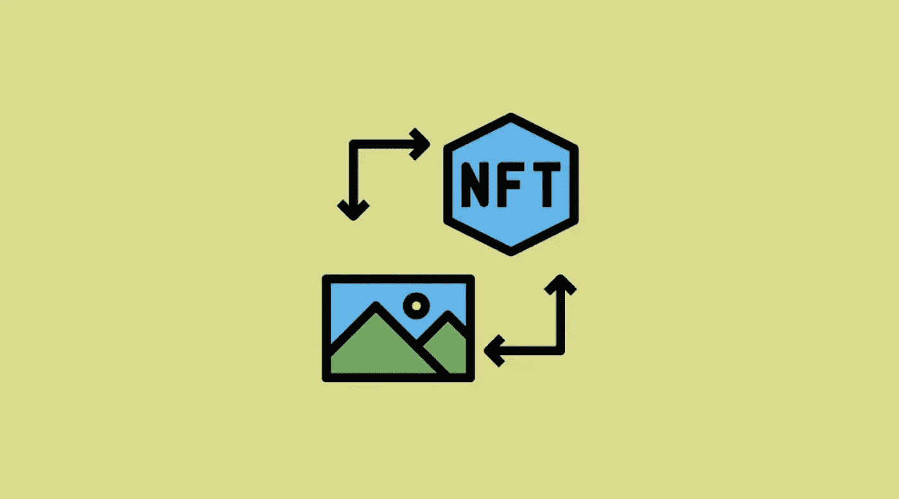

# 创建您的 NFTs:铸造和资产存储

> 原文：<https://medium.com/coinmonks/creating-your-nfts-minting-and-asset-storage-7ce2adceb138?source=collection_archive---------42----------------------->

假设你是一名出色的数字艺术家，想要将你的作品转换成 NFT。你是怎么做到的？让我们把它分成两部分:

1.  铸造 NFT
2.  托管您的资产。

# 铸造

铸造过程是创建智能合同并将其存储在区块链网络上的过程。最常见的区块链是以太坊，但最近索拉纳，币安区块链和其他人因其低交易成本也就是汽油费而越来越受欢迎。智能合约有一个指针，指向您的资产托管的位置(集中式和分散式服务器)以及有关 NFT 的其他详细信息。

1.  要铸造，你必须选择一个市场，如 OpenSea 或 Rarible，这有利于铸造过程。
2.  然后，如果是图像，你可以上传 jpg、jpeg 或 png 格式的资产；如果是视频，你可以上传 mp4 格式的资产；如果是音频，你可以上传 mp3 格式的资产。
3.  提供存储资产的 URL。(将在下一节讨论)
4.  选择你的价格

# 托管您的资产

需要注意的是，您的资产并不存储在区块链网络上。主要原因是什么？以太坊区块链上的交易是非常耗能的，由于图像或视频文件很大，在区块链上存储它们的燃气费将是疯狂的。因此，有两种方法可以做到这一点:

1.  将你的资产托管在一个集中的服务上，比如 Dropbox、Google Drive 或亚马逊 S3。
2.  有些出于安全原因采取了额外的步骤，将资产托管在一个分散的服务器上，主要是星际文件系统或 IPFS。像 piata . cloud 这样的网站只需支付很少的订阅费就可以实现。

一旦完成，抓取网址并粘贴回你在铸造过程中选择的 NFT 市场。

铸造快乐！

> 加入 Coinmonks [电报频道](https://t.me/coincodecap)和 [Youtube 频道](https://www.youtube.com/c/coinmonks/videos)了解加密交易和投资

# 另外，阅读

*   [麻雀交换评论](https://coincodecap.com/sparrow-exchange-review) | [纳什交换评论](https://coincodecap.com/nash-exchange-review)
*   [美国最佳加密交易机器人](https://coincodecap.com/crypto-trading-bots-in-the-us) | [不断回顾](https://coincodecap.com/changelly-review)
*   [在印度利用加密套利赚取被动收入](https://coincodecap.com/crypto-arbitrage-in-india)
*   [Godex.io 审核](/coinmonks/godex-io-review-7366086519fb) | [邀请审核](/coinmonks/invity-review-70f3030c0502) | [BitForex 审核](https://coincodecap.com/bitforex-review)
*   [5 款最佳免费加密货币制图工具](https://coincodecap.com/crypto-charting-tools)
*   [最佳比特币保证金交易](/coinmonks/bitcoin-margin-trading-exchange-bcbfcbf7b8e3) | [萝莉点评](/coinmonks/lolli-review-e6ddc7895ad8) | [比特币保证金交易](https://coincodecap.com/bityard-margin-trading)