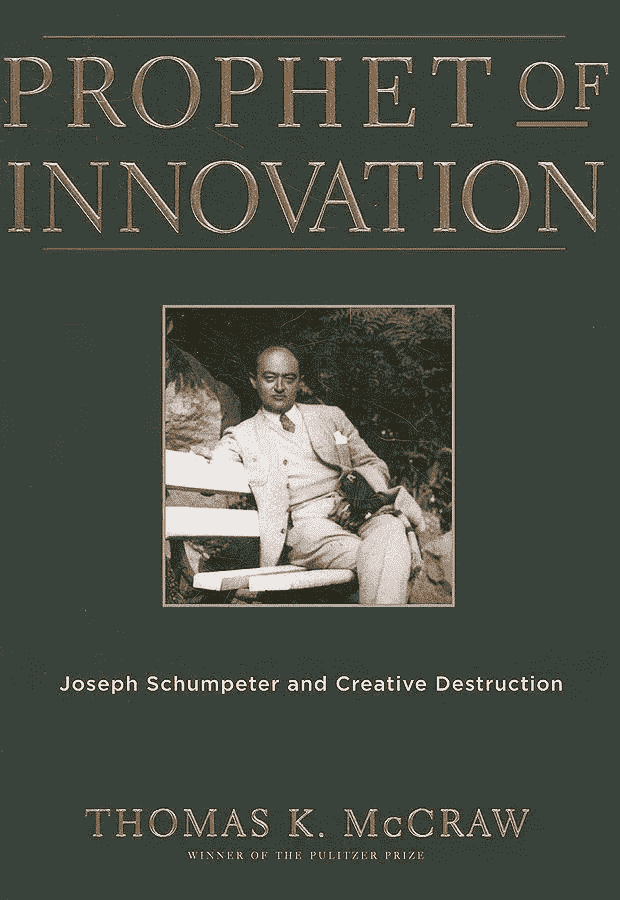
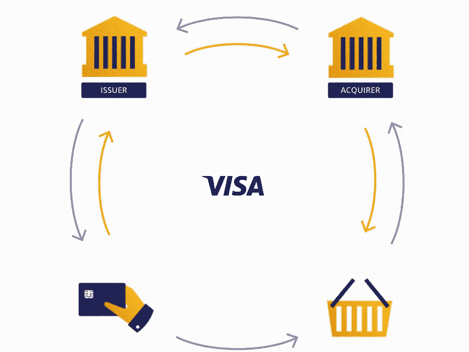
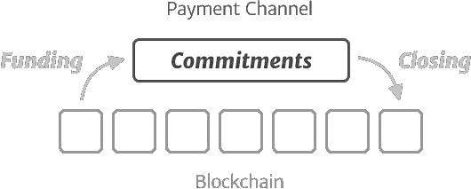
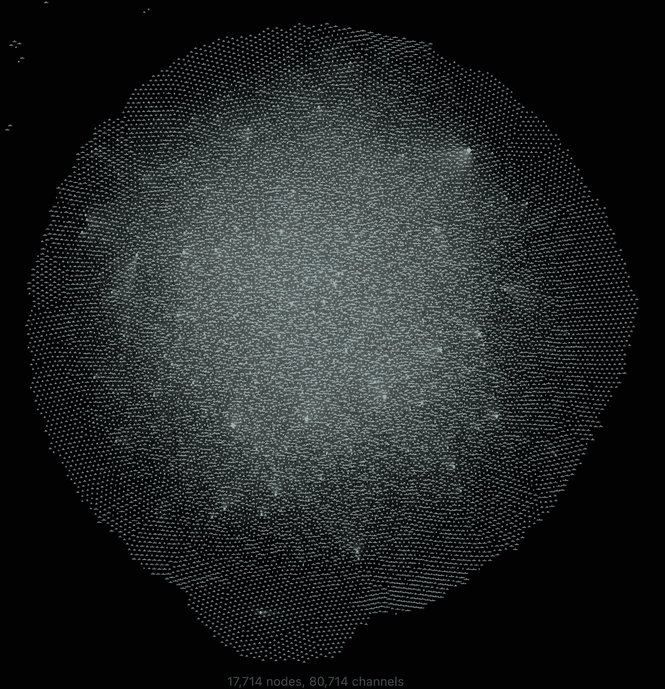

# 通过支付渠道网络进行创造性破坏

> 原文：<https://medium.com/coinmonks/creative-destruction-through-payment-channel-networks-6a835ee5f45b?source=collection_archive---------26----------------------->

每一次经济发展都是基于[创造性破坏](https://en.wikipedia.org/wiki/Creative_destruction)的过程。这个术语是由 20 世纪早期最有影响力的经济学家之一[约瑟夫·熊彼特](https://en.wikipedia.org/wiki/Joseph_Schumpeter)引入并推广的。

“Prophet of Innovation” by Thomas K. McCraw

在他的著作中，他将创新描述为经济变革的决定性维度*。*

他认为，技术创新通常会导致暂时的垄断，这种垄断会带来额外的利益，但很快就会被竞争者和模仿者侵蚀。根据他的观点，这些暂时垄断对于激励企业开发新产品和新技术是必要的。

# 在线支付领域的垄断

目前，网上支付的最大垄断是围绕着大型信用卡处理公司建立的。最大的信用卡网络是 VISA 和 MasterCard。在欧洲，信用卡支付市场基本上分为两部分，Visa Europe Services Inc. 的份额约为 60 %, master card Inc .*的份额约为 60%。40%.*

The omnipresent model of a four-party payment structure, image source: saniyayadav.com

## 四方支付结构

不考虑作为独立实体的信用卡网络，通过信用卡进行的支付是在所谓的[四方系统](https://en.wikipedia.org/wiki/Card_scheme#Four-party_scheme)中进行的。这涉及 1)付款人(持卡人)，2)收款人(商户)，3)发卡行和 4)收单方。发卡行和收单机构是在信用卡网络上运营的支付服务提供商。

## 三方支付结构

与四党制类似，还有[三党制](https://en.wikipedia.org/wiki/Card_scheme#Three-party_scheme)。这意味着付款人和收款人使用同一个支付服务提供商。这种供应商的一个著名例子是美国公司 PayPal Inc。

## 小额支付和 p2p 支付

虽然互联网及其固有的信息自由流动使知识的获取民主化，但它还没有使支付流程民主化。现有的结构不仅将交易伙伴限制在被认为是“有银行存款”的人，还阻止了小额支付的廉价实施。

对于低价值货物，付款的成本效益是一个关键问题:常规方法不适合，因为处理付款的成本往往超过货物的价值。

因此，实现小额支付的经济有效的方式通常需要额外的参与方参与支付处理过程(*看门人*)，预先提供资金(*预付*，或者将几笔支付捆绑成一笔。

# 新型支付轨道

所有这些变通办法的共同点是，它们的不灵活性使它们无法顺利地集成到现有的互联网基础设施中。因此，解决方案只能源自互联网本地类型的支付流程。所有支付流程以及底层基础设施都必须在纯虚拟的协议基础上运行。

区块链的扩展解决方案[闪电网络](https://lightning.network/)为这种演进铺平了道路。

## 支付渠道网络

按照设计，这种新型的支付网络是基于一种分散的、民主化的支付流程模型。这种即时和微交易兼容的价值转移是通过*双向支付渠道*的概念实现的。使用区块链的支付渠道，经常性支付方可以在没有第三方参与的情况下，以零成本无限次地相互支付。这种交易水平大大超过了现有支付网络的能力。

The lifecycle of a payment channel, source: [d11n.net](https://d11n.net/lightning-network-payment-channel-lifecycle.html)

即使两个交易伙伴彼此之间没有建立直接的渠道，他们也能够通过一个或多个中介相互支付，这些中介将付款从付款人转发给收款人(收取微交易费)。

Visualization of the Lightning Network as of January 24, 2022

事实上，这项技术正在发展壮大。截至 1 月 24 日，超过 80，000 个公共支付渠道已经建立，约 18，000 个节点已经启动。仅在 2021 年，公共支付渠道就增长了 138%，节点增长了 112%。

但这只是故事的一半:小型化和采用该技术的低门槛允许任何智能手机用户与其他人一起操作私人支付网络，从而创造了人们如何在数字领域相互支付的新结构。它不要求公司处理支付，并反映了自主参与者的相互联系。

此外，现有的 p2p 基础设施为新应用的出现打开了新的机会这些应用利用底层能力以抵制审查的方式交换数据。

# 创造性破坏？

如果约瑟夫·熊彼特现在能目睹这些动态，他会说什么？他会把替代支付网络视为创造性破坏过程的结果吗？他甚至会把它赋予技术基础的地位吗，他钟爱的 [Kondratiev 波](https://en.wikipedia.org/wiki/Kondratiev_wave)？

历史表明，创新的破坏性力量往往被低估，即使是思想领袖也是如此。同样，他们也很难预测什么样的前所未有的创新会出现。创造性破坏支付渠道网络的过程将会把我们带到什么程度，这仍然是一个令人着迷的问题。

## 对这项技术感到好奇？试试看！

获得实践经验永远是掌握新技术的最佳途径。这里有三件事可以尝试。理想情况下，你已经下载并安装了一个兼容 lightning 的钱包，比如 [Muun](https://muun.com/) 。

*   在 LightningButton.com[购买链接](http://LightningButton.com):这是展示如何将闪电支付整合到现有技术堆栈中的好方法。
*   在[小额贷款上完成任务 io](http://Microlancer.io) :你有没有做过*小额贷款*？这是一个很好的介绍，如果自由职业与现有的支付过程没有联系，自由职业是如何实现的。
*   构建自己的[节点](https://getumbrel.com/)(高级):如果你习惯于设置操作系统，这是适合你的。通过在全球范围内进行支付，让自己成为支付处理者。

> 加入 Coinmonks [电报频道](https://t.me/coincodecap)和 [Youtube 频道](https://www.youtube.com/c/coinmonks/videos)了解加密交易和投资

# 另外，阅读

*   [如何匿名购买比特币](https://coincodecap.com/buy-bitcoin-anonymously) | [比特币现金钱包](https://coincodecap.com/bitcoin-cash-wallets)
*   [币安 vs FTX](https://coincodecap.com/binance-vs-ftx) | [最佳(索尔)索拉纳钱包](https://coincodecap.com/solana-wallets)
*   [比诺莫评论](https://coincodecap.com/binomo-review) | [斯多葛派 vs 3Commas vs TradeSanta](https://coincodecap.com/stoic-vs-3commas-vs-tradesanta)
*   【Capital.com】|[港加密借贷平台](https://coincodecap.com/crypto-lending-hong-kong)
*   [如何在 Uniswap 上交换加密？](https://coincodecap.com/swap-crypto-on-uniswap) | [A-Ads 评论](https://coincodecap.com/a-ads-review)
*   [WazirX vs CoinDCX vs bit bns](/coinmonks/wazirx-vs-coindcx-vs-bitbns-149f4f19a2f1)|[block fi vs coin loan vs Nexo](/coinmonks/blockfi-vs-coinloan-vs-nexo-cb624635230d)
*   [本地比特币审核](/coinmonks/localbitcoins-review-6cc001c6ed56) | [加密货币储蓄账户](https://coincodecap.com/cryptocurrency-savings-accounts)
*   [什么是保证金交易](https://coincodecap.com/margin-trading) | [美元成本平均法](https://coincodecap.com/dca)
*   [支持卡审核](https://coincodecap.com/uphold-card-review) | [信任钱包 vs 元掩码](https://coincodecap.com/trust-wallet-vs-metamask)