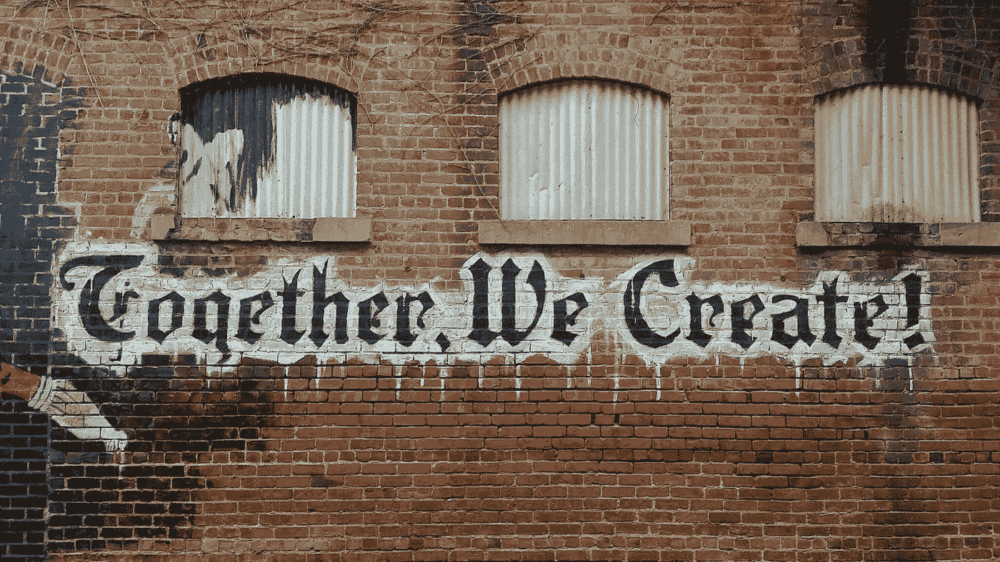

# 创作者社区

> 原文：<https://medium.com/coinmonks/creator-communities-1dc9bb43bd3e?source=collection_archive---------10----------------------->

Photo by [“My Life Through A Lens”](https://unsplash.com/@bamagal?utm_source=unsplash&utm_medium=referral&utm_content=creditCopyText) on [Unsplash](https://unsplash.com/s/photos/community?utm_source=unsplash&utm_medium=referral&utm_content=creditCopyText)

web3 运动更吸引人的一个方面是,“产权”成为了互联网的一个组成部分。

创作者经济的趋势原则设想商业模式，允许内容创作者将他们的工作货币化，直接与他们的粉丝联系，建立真正的可持续品牌，并利用真正的网络社区。

我强烈推荐一篇关于创作者经济的非常好的文章，是李进的“[web 3 复兴，内容的黄金时代](https://li.substack.com/p/the-web3-renaissance-a-golden-age)”，在那篇文章中，李概述了一代技术将促进这种向创作者和所有者的转变的模型。

李提到的一个转变是她所说的 ***【赞助+】***，这使得粉丝不仅可以作为消费者支持内容创作者，还可以作为投资伙伴，这种现象是通过象征性所有权引入的。

这种模式在很多层面上起作用，因为与乐队、艺术家、舞蹈家、电影明星、音乐家等的创造性工作有情感联系的粉丝，往往会觉得需要更深层次的联系，而不仅仅是消费者交易。

想想为乐队“感恩而死”创造了整个亚文化的“死对头”——成为死对头社区的一部分不仅仅是购买唱片。死对头和乐队本身一样都是感恩而死现象的一部分。

> “由于成为与创作者的成功相关的资产的所有者，粉丝有动力帮助放大创作者的作品。”—李进

值得注意的是，这种所有权模式确实允许用户将*创造者的成功*视为一个投资机会，并且仅仅是为了盈利。不幸的是，我们今天在 NFT 看到了这种情况，因为“致富”往往是一种激励。

解决“仅盈利”困境的一个方法是创建一个多层次的社区模式，投资者仍然可以成为增长的一部分，但只有参与程度更高的真正粉丝才会成为核心社区的一部分。基于参与度的不同社区层级。

像 Dao 这样的创作者社区是一个很好的例子，它是一个包含一定治理水平的志同道合的社区的一部分。

# 共同创造者的崛起

这种模式不仅允许粉丝成为创作者作品的部分所有者，还可能参与创作过程，这引发了一个我们以前没有见过的有趣的新创作过程。

以音乐家为例，创作者社区可以参与提供歌曲创意反馈、歌曲选择投票、专辑封面创意和品牌投票、提供建议、开展社交媒体营销活动。

不是所有的音乐人都想要这种与社区的合作关系，这没什么，但是有很多人认为这是一个很大的好处。

无论如何，越来越多的流行音乐人倾向于失去对唱片公司的创造性控制，因此在也是消费者的社区中工作将提供一个更清晰的关系视角。预算不多的不太受欢迎的小音乐家现在可以拥有一个对音乐充满热情的营销人员社区。

当一个创作者的作品在一个社区中被重新想象时会发生什么？这种程度的社区参与如何影响结果？艺术会进化成更伟大的东西吗？

我们正在接近一个新的创造者运动，它以一个参与网络为中心，一种共同努力形成一种新艺术的集体思维。

> 交易新手？试试[加密交易机器人](/coinmonks/crypto-trading-bot-c2ffce8acb2a)或者[复制交易](/coinmonks/top-10-crypto-copy-trading-platforms-for-beginners-d0c37c7d698c)