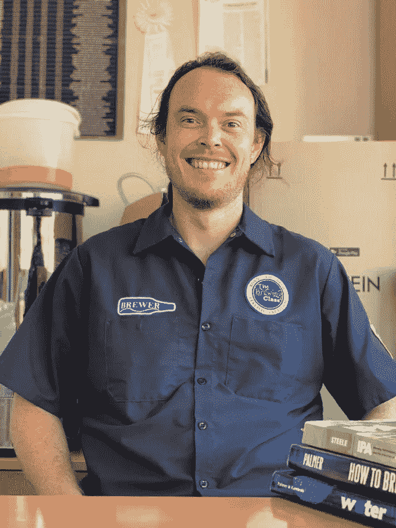
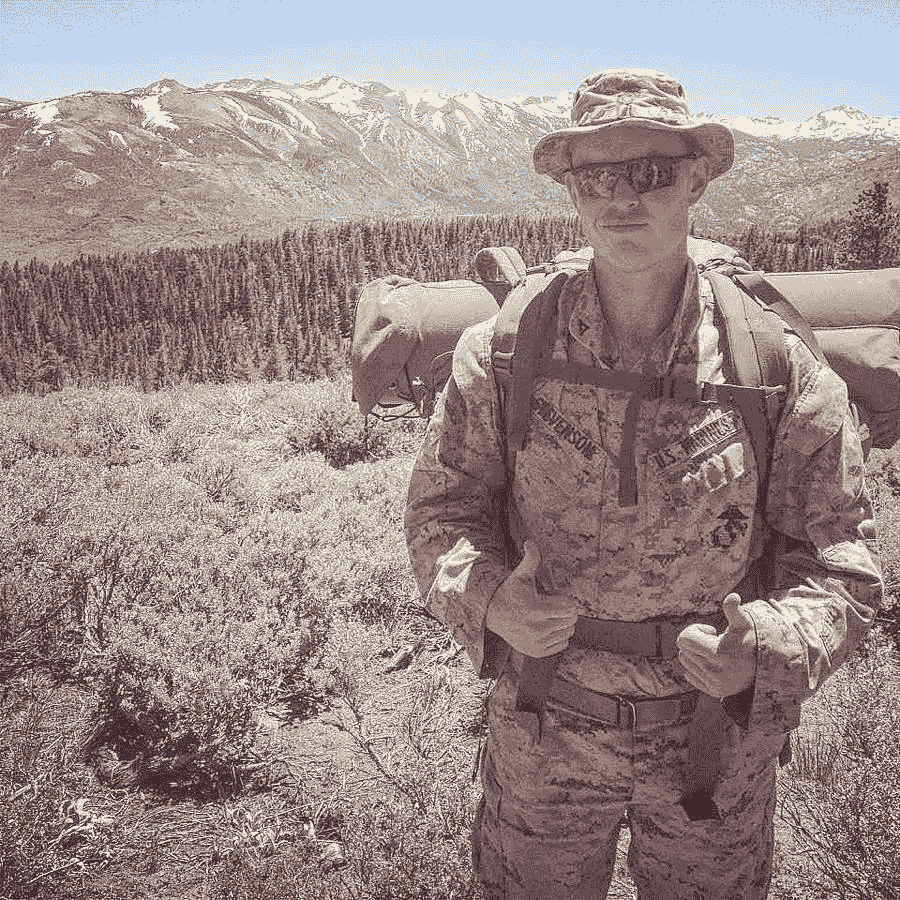
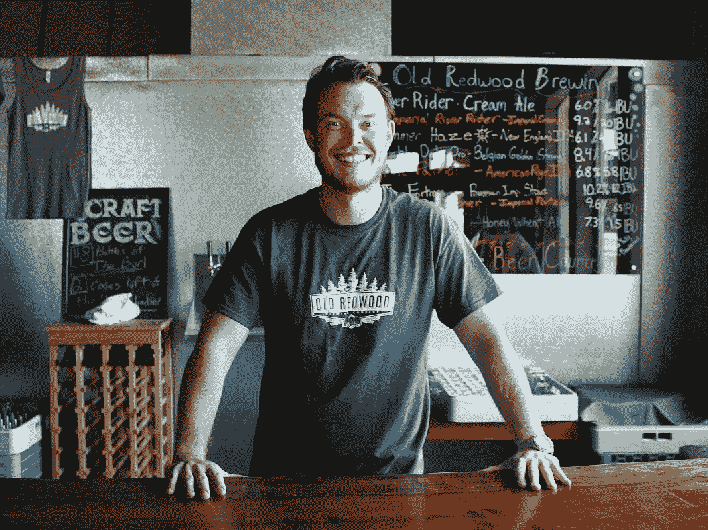
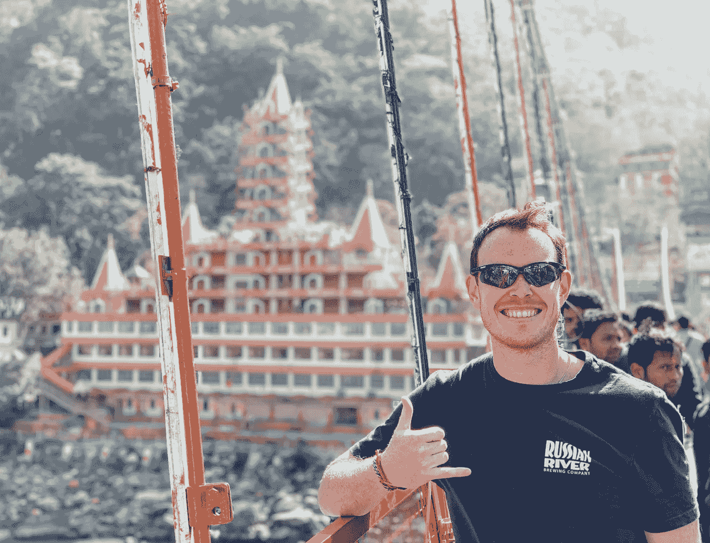
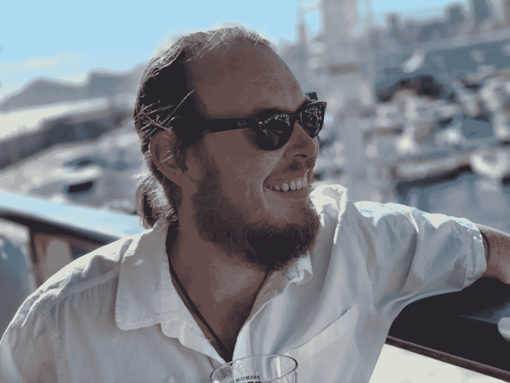
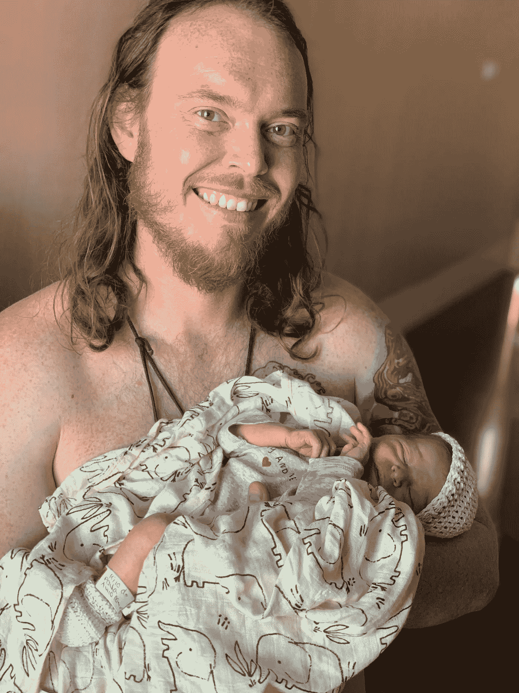

# 创造者的故事:多层次营销-泰史蒂文森🙋🏻‍♂️

> 原文：<https://medium.com/coinmonks/creator-story-metadads-nft-ty-stevenson-%EF%B8%8F-ff32fe202b8d?source=collection_archive---------16----------------------->

> **跟随我们的加密/NFT/区块链/元宇宙之旅，努力建立地球上第一个 NFT/以加密为中心的酿酒厂和离网社区🌱**
> 
> [*推特*](https://www.twitter.com/metadadsxyz)[*不和*](https://discord.gg/Cv8v2Ert8m)[*YouTube*](https://www.youtube.com/channel/UC7pbtSBs9nRJHK6coMhCR8g)[*抖音*](https://www.tiktok.com/@thedudescrypto)[*insta gram*](https://www.instagram.com/metadadsxyz)[*Spotify 播客*](https://open.spotify.com/episode/5U8vXE9HDAsGbSbebw9p62?si=2rZIigw-Tw2pCxjxmkbYzQ)

# 故事:

我，Ty Stevenson，早产 10 个月，1991 年出生在加利福尼亚州的特雷西，母亲吸毒，父亲酗酒。我们在相当贫困的环境中长大。爸爸高中没毕业，妈妈也没工作。我 7 岁时父母离异。从 7 点到 13 点，我妈妈、妹妹和我住在汽车旅馆、复式公寓、公寓和朋友的房子/房间里。

在我 13 岁生日那天，我的祖父母带着我和我的妹妹一起住在我 13-17 岁时住的地方。

从 5 岁到 17 岁，我整个童年都在打棒球，并且是一名优秀的球员。这是我的爱好，还有游戏。

在我 17 岁生日的两天后，在海军陆战队的生日那天，我正式报名成为一名美国海军陆战队队员(在高中毕业前，我在 poolee's 训练了几个月)。我 17 岁就从训练营毕业，是我们班最年轻的海军陆战队员，那时我还买不起一包烟…

Mountain Radio Operator Special Course — Mountains of CA

训练营结束后，我开始去索诺玛州立大学(我家第一个上大学和参军的人)

在大学期间，我作为兄弟会饮酒队的队长参加聚会，之后我获得了商业管理学位。

我同时完成了大学学业和海军服役……一张白纸去做我想做的任何事情。

我开始酿造啤酒，很快就爱上了。我开始了我的第一个酿酒生意，帮助家酿啤酒的人用他们的水化学来酿造啤酒，叫做 Waters Brewer。

在那段时间里，我在学习如何创业(主要是在 IG 和 PR outreach 上发帖)，我得到了一只半狼小狗，这只小狗是我在她作为单亲爸爸的头一年半里养的，我在一家[酒厂](https://www.mazzocco.com/)做全职工作，即将在酒厂对面的一家酒厂开始助理酿酒师的工作，我还参加了 [Siebel](https://www.siebelinstitute.com/) 的在线专业酿酒证书课程。

我离开了酿酒厂，开始在那家酿酒厂工作，在那里我学到了专业酿酒的基础知识，还获得了最近的认证。然后，我开始了一份新的酿酒工作，在加利福尼亚州温莎的一家小酿酒厂担任首席酿酒师和酒吧间经理，每天开门关门，酿造所有的啤酒，并出售所有的啤酒。

Old Redwood Brewery in Windsor, CA

在经营那家小酿酒厂一年后，我离开去旅行，这是我第一次离开美国。我去了巴塞罗那和西班牙各地，在那里我决定要开一家啤酒厂。

我为这些啤酒爱好者开始了我的旅行啤酒博客，名为[一个啤酒商的故事](https://www.abrewersstory.com)，他们在那里为我的创业写文章。文章见[此处](https://byo.com/article/a-brewers-story-discovering-the-world-through-beer/)。

自从 350 万人在欧洲各地旅行购买啤酒以来，我已经在 5 个不同的国家咨询过精酿啤酒，并在超过 7 个不同的国家酿造过。

从欧洲回国后，我还在斯通酿酒公司做了 7mo 的调酒师。(在这段时间里，我花了 3 周时间再次去西班牙做有偿精酿啤酒咨询。

In Rishikesh, India

我发现获得在西班牙生活/工作的签证很难，所以我搬到了荷兰(这是美国人获得在欧洲生活/工作签证(DAFT)的最简单方式)，并在那里成立了一家有限责任公司，一家合同酿造企业，我在西班牙北部酿造啤酒，并以“One Life Craft Beer”的名义在西欧销售……我们推出了大约 12 种啤酒。

后来 COVID 红了，我当时的女朋友把我和她一起搬到了西班牙的贝尼多姆，就在疫情真正开始之前。我被困在这里了。

> 回家找工作？和我的女孩留在西班牙？回荷兰？我选择留在西班牙，那里没有精酿啤酒(在贝尼多姆整个周边)。

In Benidorm at the Pier

我启动了我的第一个 NFT 项目，去年万圣节，我在最低谷的时候赚了大约 1 万美元……据我所知，当我把启动日期定在 2 个月之前时，我不知道它会下跌……我把我们的不和增长到 7.6k，Twitter 增长到 3.5k，TT 在 3 个月内增长到 1.2k。

这帮助我在一家 DeFi NFT 公司找到了一份社区经理的工作，我在那里工作了一个月，然后让我在元宇宙一家 p2e 公司找到了另一份社区经理的工作，在过去的三个多月里，我一直在那里兼职，以帮助扩展我的简历并继续支付账单。

我把我们在 NFT 的新项目命名为 [MetaDads](https://www.metadads.xyz) ,因为我 5 天前才第一次成为父亲，我想打入更成熟的 NFT 市场。父亲、精酿啤酒爱好者、投资者、旅行者、嬉皮士、户外爱好者…

我现在将在一个月内(7 月初)启动我的第二个 NFT 项目，希望将我对精酿啤酒和酿造的热爱、商业(在旅游海滩城镇贝尼多姆的精酿啤酒完全开放的市场)以及通过我们的非网格社区的自由/社区结合起来。

过去 4-5 年来，我一直梦想去西班牙开一家啤酒厂。我现在有这个机会，并希望带着我所有的支持者，在我们[多层次营销社区的帮助下，这个新的旅程正在展开。](https://www.multilayeredmarketing.xyz)

感谢你们阅读我的人生故事，聆听我的 TED 演讲；]

___________________________________________________________________

**永远小心！！！⚠️**

我怎么强调都不为过！保持高度警惕，注意你点击的每一个链接，你做的每一笔交易，和你交往的每一个人，因为骗子在这个领域是大量的，最好的项目也会被取消。

点击所有链接之前，要再三检查，确保它们是你要找的官方链接。在给自己或他人发送任何有价值的东西之前，也要仔细检查所有的钱包地址。

> **跟随我们的加密/NFT/区块链/元宇宙之旅，努力打造地球上首个 NFT/以加密为中心的酿酒厂和离网社区🌱**
> 
> [*推特*](https://www.twitter.com/metadadsxyz)[*不和*](https://discord.gg/Cv8v2Ert8m)[*YouTube*](https://www.youtube.com/channel/UC7pbtSBs9nRJHK6coMhCR8g)[*抖音*](https://www.tiktok.com/@thedudescrypto)[*insta gram*](https://www.instagram.com/metadadsxyz)[*Spotify 播客*](https://open.spotify.com/episode/5U8vXE9HDAsGbSbebw9p62?si=2rZIigw-Tw2pCxjxmkbYzQ)
> 
> *请将 Polygon Matic 发送到这个 Eth 地址，或 Eth 令牌:
> 0xb 53b 3978333 e 11 c 382 ab 619 f 02 f 469 A8 c 70750 af*

___________________________________________________________________

感谢阅读:]

干杯，
***Ty 又名【哥们儿】***

**我们其他的一些博文:**
[5 个失败的 Web3](/coinmonks/5-downfalls-of-web3-cd5dc8ade4fd)
[5 + 5 个不和谐的战术](/coinmonks/5-tips-for-a-better-discord-nft-crypto-edition-ff9b039d0359)
[Crypto 101:一个初学者指南](/coinmonks/crypto-101-a-beginners-guide-345d440bd163)
[NFT 最佳实践(营销&社区成长)](/coinmonks/top-5-nft-best-practices-marketing-and-community-growth-7025e26eb50c)
[Web3 基础知识](/coinmonks/web3-basics-252121357f33)

> 加入 coin monks[Telegram group](https://t.me/joinchat/Trz8jaxd6xEsBI4p)并了解加密交易和投资