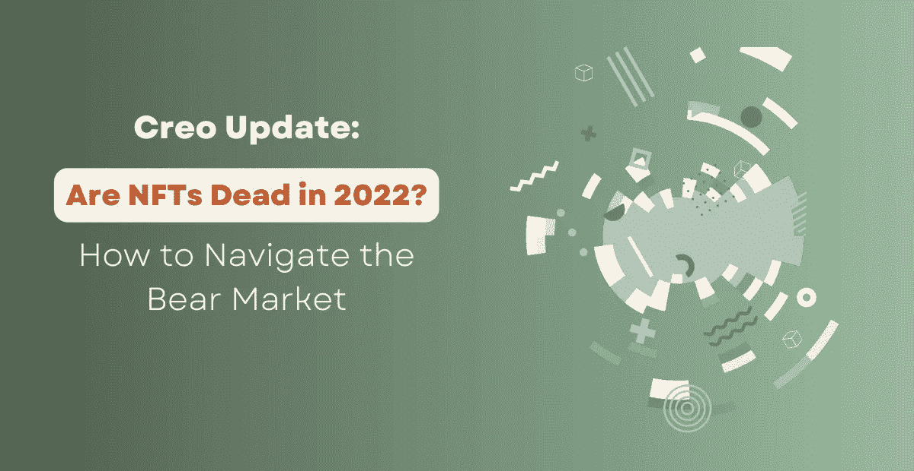
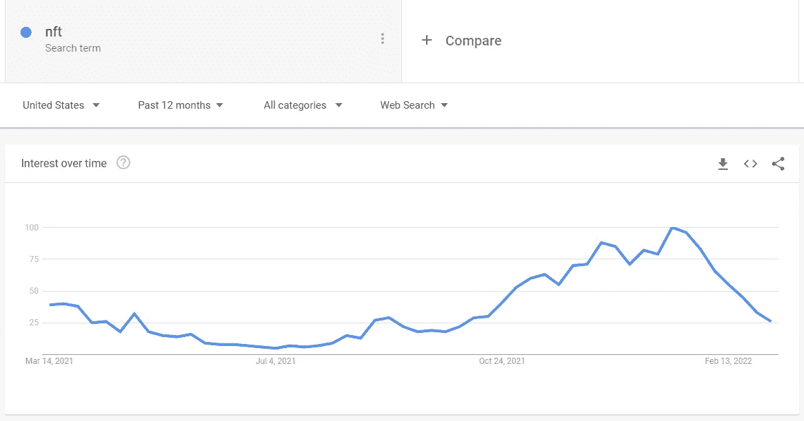
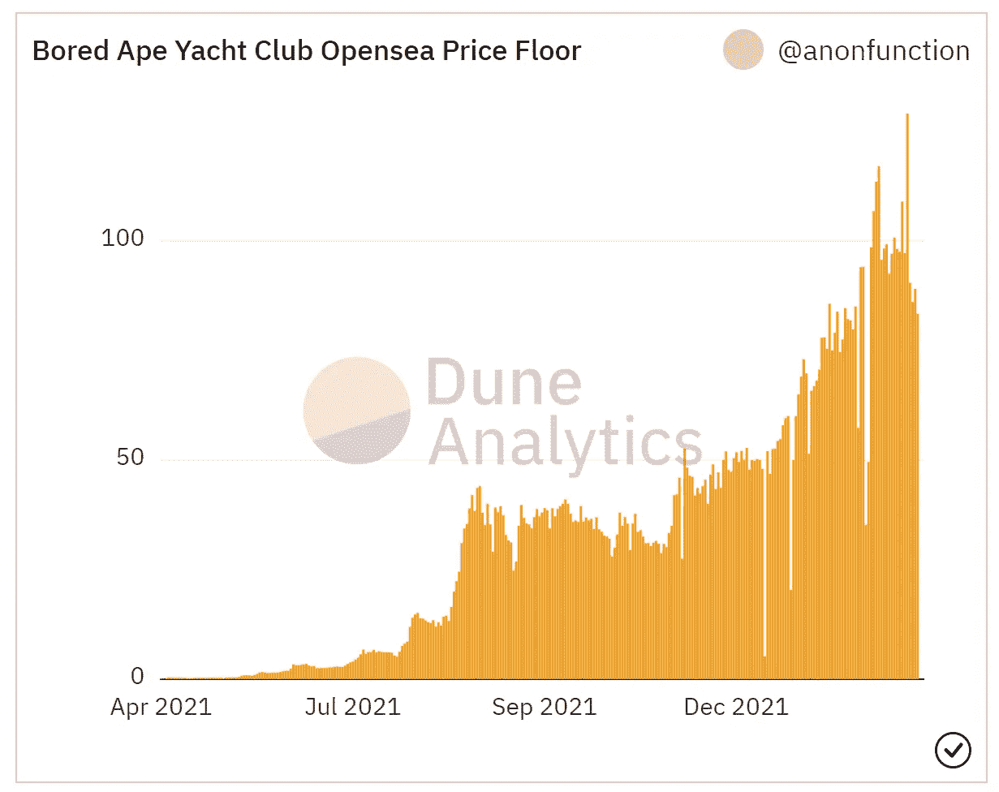
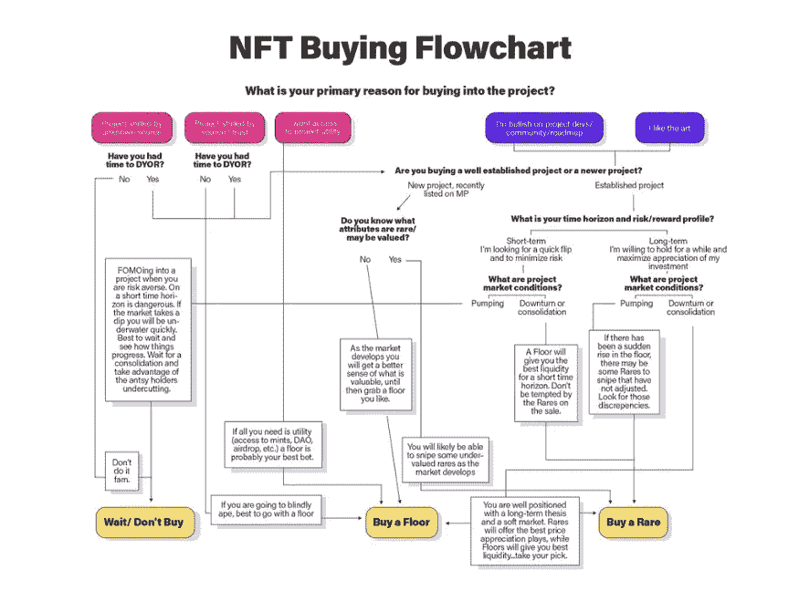

# Creo 更新:2022 年 NFT 死了吗？如何在熊市中导航

> 原文：<https://medium.com/coinmonks/creo-update-are-nfts-dead-in-2022-f633a1c6d8e?source=collection_archive---------6----------------------->

# 如果你在读这封信，你已经迟到了。

上面这句话是大多数 NFT 项目用来“启动”他们的营销的标准问候语之一的衍生，“如果你正在读这篇文章，你来早了。”

新项目使用这个短语来灌输一种(大部分是错误的)稀缺感，并开始大肆宣传。

不幸的是，他们在撒谎。这句话已经被使用*和过度使用*到了**不**的地步，你不再早了。事实上，在 2022 年，你迟到了。

**也就是说，你迟到了 NFTs 的“pfp”(个人资料图片)热潮。**

Examples of profile picture nft projects — [Bored Ape Yacht Club](https://boredapeyachtclub.com/#/), [VeeFriends](https://veefriends.com/), [Invisible Friends](https://invisiblefriends.io/), [SpaceBudz](https://spacebudz.io/)

仅仅因为这是一个 NFT，项目价格就飙升至疯狂水平的日子已经过去了。

这并不意味着 NFT 不再有价值。总的来说，这并不意味着你在 NFT 空间迟到了。这只意味着你可能还没有赶上“个人资料图片”热潮的*来通过买卖这些特定的 NFT 项目赚一大笔钱。从这个意义上说，非功能性测试当然可以被归类为一种“时尚”。*

*想想吧。当每个杰克和吉尔都可以轻松创建自己的 pfp 项目时，会发生什么？这就是我们今天的处境。*

*市场被 ***淹没***PFP 项目都试图制造越来越多的噪音。你可以去 Fiverr 雇一个艺术家花 100 美元创作 10，000 件 pfp 艺术品。那还有什么价值呢？*

***不是的。**而且，根据市场的说法，这很无聊。*

*仅在过去的一个半月里，正如谷歌趋势对“NFT”所显示的，对非功能性测试的整体兴趣已经急剧下降。*

**

*首先，NFT 项目出售亲民党艺术…*

*然后他们出卖了社区的力量…*

*然后他们卖掉了 merch 和私人活动…*

*然后他们卖了记号化和 DAOs…*

*然后他们卖掉了元宇宙…*

*在大多数情况下，这些流行语只是制造更多炒作和抬高价格的噪音。烟雾和镜子。*

*营销当然有一席之地，也能给项目带来价值。但是没有核心创意，营销只能做到这么多。*

*项目变得越来越懒惰，只是简单地复制其他成功的项目，而不是试图推动 NFT 的极限。是时候发挥创造力了。*

# *如果你在读这篇文章，你来早了。*

*现在，对于那些刚刚跌跌撞撞进入 NFT 空间的人，或者那些在阅读了上述内容后超级悲观的人，我有一些好消息。*

*你真的来早了。只是不像你想的那样。*

*你看，NFTs 背后的技术已经存在快 7 年了。然而，直到 2020/2021 年，像 [Bored Ape 游艇俱乐部](https://boredapeyachtclub.com/#/) (BAYC)或 [SpaceBudz](https://spacebudz.io/) 这样的项目才推出，并由于天价而引起了人们对该领域的极大关注。*

*BAYC 于 2021 年 4 月推出，到夏末飙升至近 45 ETH。今年二月，拜克创下了 129 ETH 的历史新高。价格会更高吗？谁知道呢。只有时间能证明一切。*

**

*但是，如果你想“早”一点，你需要把注意力放在其他地方——技术本身，而不是专注于 pfp 艺术。*

*我们的理论是，带来下一轮 NFTs 牛市的技术可能确实存在，或者至少正在建设中。但是，如果我们想在这一次占得先机，我们必须保持耐心，保持警惕，并对该领域的任何微小更新保持高度警觉。*

*现在有很多很酷的项目正在建设中，值得进行大量的研究。有些项目实际上是在建设一个元宇宙。一些人专注于带来更多现实世界的效用。所有这些选项都可能成为下一个时尚，为了早一点，你必须做工作，深入研究这些项目，以确定它们的可行性。*

*几周前由 Aditya Matharu 发布的一篇很棒的文章是关于 T2 如何在 NFT DYOR(做你自己的研究)。Aditya 做了一项出色的工作，列出了在进入 NFT 项目之前进行研究时应该注意的因素。尽管我觉得他的结论令人不快，但它是准确的——炒作推动价格。公用事业处于次要地位。*

*下面是 Aditya 在文章中使用的流程图。这个工具可以方便地避免 FOMO，并帮助组织一个有条不紊的战略，当接近新的 NFT 项目。*

**

*也就是说，标准的 DYOR 方法不会再帮你早到了。在微观层面上，也许吧。*

*但是为了真正“早”到下一个以 NFT 为基地的淘金热…*

# ***后退一步。***

*如果你真的想早点呢？你必须明白，NFTs 背后的技术不是为 pfp 项目创造的。NFT 技术本身有着难以置信的未开发的潜力。它只是还没有被发现。*

*“ *3D 隐形元宇宙无聊朋友刀”*不再是取胜之道。项目不能简单地添加到他们的路线图中，并希望人们会在已经有 100 个其他项目一样好，如果不是更好的话，从基本面的角度来看。*

*我们必须完全超越亲民党艺术。我们必须缩小到烟雾和镜子之外。如果我们想知道未来的走向，我们必须看到整个画面。*

***NFT 存在的真正独特而切实的原因是什么？***

*我打赌答案就在那里。*

*所以我说，“你来早了。”仅仅在过去的一年里，我们已经看到了 NFT 领域的巨大进步。*

*如果你集中注意力，保持警惕，了解这个领域是如何运作的，你一定能看到 NFT 时尚的下一个阶段，并能抓住这股热潮。你会早到的！*

# *包扎*

*如果您觉得这些内容有帮助或有趣，请考虑分享或给我们留下评论。我们希望听到您的反馈，并随时准备了解更多关于这一领域及其背后的技术。*

*我们正在田纳西州的纳什维尔建立一个发射台，让顶级艺术家能够轻松加入 NFT 社区。我们的目标是在帮助艺术家开发他们的 NFT 项目时，不断改进和突破极限。*

*我们还在为那些不熟悉 NFT 的人建立一个学院。我们为会员提供深度培训、专家访谈、一对一咨询等服务。*

*如果你想了解更多关于我们的项目，请随时给我们留言。我们的不和目前是私人的，我们一次只对少数成员开放。*

*Creo NFTs 是位于田纳西州纳什维尔的 NFT 发射台和学院。我们相信教育和装备我们的成员和艺术家最好的工具和资源，让他们在 NFT 取得成功。在 [Instagram](https://www.instagram.com/creo_nfts/) 、 [Twitter](https://twitter.com/creo_nfts) 、 [Youtube](https://www.youtube.com/channel/UCny8naLhaEQree39ooDTrig) 、[抖音](https://www.tiktok.com/@creonfts)、[脸书](https://www.facebook.com/creonfts)，或 [LinkedIn](https://www.linkedin.com/company/creo-nfts/) 上与我们连线。*

***免责声明:以上为作者观点，不应视为投资建议。读者应该自己做研究。***

> **加入 Coinmonks* [*电报频道*](https://t.me/coincodecap) *和* [*Youtube 频道*](https://www.youtube.com/c/coinmonks/videos) *了解加密交易和投资**

# *另外，阅读*

*   *[3 商业评论](/coinmonks/3commas-review-an-excellent-crypto-trading-bot-2020-1313a58bec92) | [Pionex 评论](https://coincodecap.com/pionex-review-exchange-with-crypto-trading-bot) | [Coinrule 评论](/coinmonks/coinrule-review-2021-a-beginner-friendly-crypto-trading-bot-daf0504848ba)*
*   *[莱杰 vs Ngrave](/coinmonks/ledger-vs-ngrave-zero-7e40f0c1d694) | [莱杰 nano s vs x](/coinmonks/ledger-nano-s-vs-x-battery-hardware-price-storage-59a6663fe3b0) | [币安评论](/coinmonks/binance-review-ee10d3bf3b6e)*
*   *[Bybit Exchange 评论](/coinmonks/bybit-exchange-review-dbd570019b71) | [Bityard 评论](https://coincodecap.com/bityard-reivew) | [Jet-Bot 评论](https://coincodecap.com/jet-bot-review)*
*   *[3 commas vs crypto hopper](/coinmonks/3commas-vs-pionex-vs-cryptohopper-best-crypto-bot-6a98d2baa203)|[赚取加密利息](/coinmonks/earn-crypto-interest-b10b810fdda3)*
*   *最好的比特币[硬件钱包](/coinmonks/hardware-wallets-dfa1211730c6) | [BitBox02 回顾](/coinmonks/bitbox02-review-your-swiss-bitcoin-hardware-wallet-c36c88fff29)*