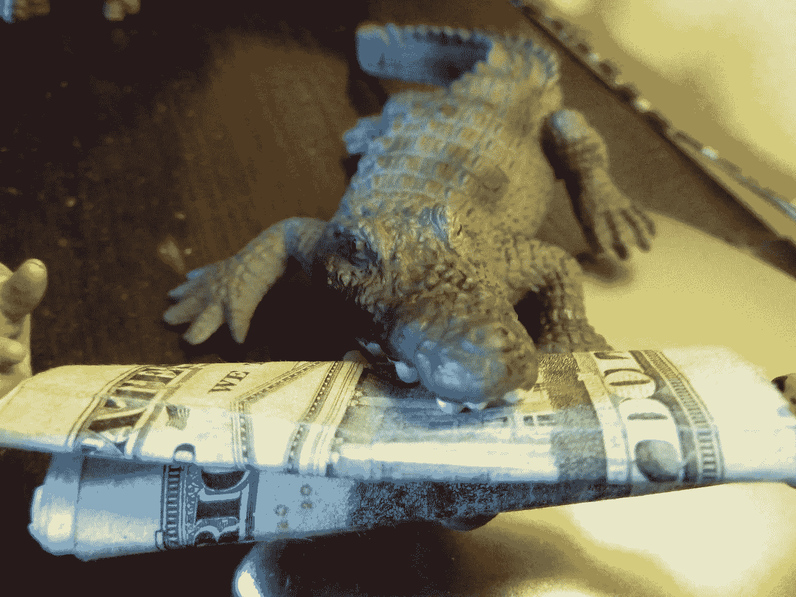
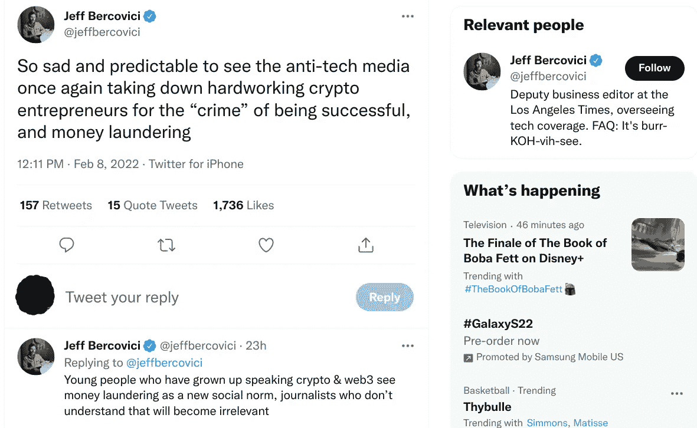

# 华尔街的鳄鱼，丈夫被发现用比特币洗钱 45 亿美元

> 原文：<https://medium.com/coinmonks/crocodile-of-wall-st-hubby-busted-laundering-4-5-billion-in-bitcoin-e39d943092c4?source=collection_archive---------7----------------------->

Image Credit: [Pheral Lamb](https://www.flickr.com/photos/8573043@N03/6477114985)

你可能已经听说过，考虑到这几乎是所有地方的头条新闻，被告已经成为无数新的社交媒体迷因的焦点，但伊利亚·利希滕斯坦和他的妻子希瑟·摩根上周在纽约市被联邦特工逮捕，并被指控阴谋洗钱和阴谋诈骗美国。

这个案例有什么特别之处？据美国司法部称，这位自称“华尔街的鳄鱼”和她的黑客丈夫合谋清洗了 2016 年 Bitfinex 加密交易所被盗的 119，754 比特币(相当于今天的 45 亿美元)。没错，我说的是 45 亿美元*10 亿美元*！我不确定这是否是一个新的数字盗窃记录，但它必须接近。

在 2016 年 Bitfinex 入侵期间，一名或多名黑客显然通过 Bitfinex 的系统发起了 2000 多起未经授权的交易。这些交易随后将 119，754 个被盗比特币发送到 Lichtenstein 控制的数字钱包中。从那以后，他和摩根在被抓之前一直忙于熟练地清洗收益。哦，保持低调，正如你从这个糟糕的说唱中看到的(？)摩根(又名 Razzlekhan)发布的视频，由 NBC 新闻的[凯文·科利尔在推特上分享。](https://twitter.com/kevincollier/status/1491107221857796097)

这不仅听起来和看起来很痛苦，而且是对法律实施的直接蔑视，加上自俄狄浦斯事件以来从未见过的傲慢。摩根声称这首歌是一首颂歌，“献给所有的怪人、企业家、黑客、不合群的人，以及所有追求自己想要的独特的人。这首歌代表了我是谁:一个坏屁股的首席执行官和女说唱歌手，准备好迎接华尔街、硅谷和任何其他压迫个人独特性和自我表达的地方。”

她可能会被视为一个有资格的笨蛋和不幸的海报儿童，因为加密和去中心化的一切都是错误的，但这将是一个相当愚蠢的假设。摩根显然非常聪明。除了她的黑客和加密专业知识，她还担任(在她被捕之前)福布斯和公司杂志的特约撰稿人，发表营销建议文章如下:

[*成为专家的 3 个步骤*](https://www.inc.com/heather-r-morgan/3-steps-to-become-an-expert-in-anything.html)

[*招聘创意人员？寻找这些特质*](https://www.inc.com/heather-r-morgan/hiring-creatives-look-for-these-traits.html)

[*为什么女人经常在谈判中击败男人*](https://www.forbes.com/sites/heathermorgan/2021/02/25/why-women-often-beat-men-at-negotiation/?sh=251d9d64e210)

摩根也知道如何操作数字洗钱机。根据 DOJ 的报告，这两人复杂的洗钱计划包括以下清洗策略:

*   这对夫妇使用虚假身份建立在线账户；利用计算机程序实现交易自动化，这是一种允许在短时间内进行多次交易的洗钱技术
*   他们将被盗资金存入各种虚拟货币交易所和暗网市场的账户，然后提取资金，这通过中断资金流来模糊交易历史的踪迹
*   这两人将比特币转换成其他形式的虚拟货币，包括匿名增强型虚拟货币(AEC)，这种做法被称为“连锁跳跃”
*   他们还利用设在美国的商业账户使其银行活动合法化

从根本上说，这种犯罪揭示了一种令人不安的趋势，即像摩根这样的罪犯在因犯罪而被捕之前，会带着巨大的面向消费者的数字足迹四处走动。对于金融犯罪，逮捕通常需要几个月或几年的时间，这给了骗子足够的时间幸灾乐祸，并向社会展示他们不应得的财富和傲慢。这种公开嘲讽怎么会没事呢？

如果心跳停止的速度加快，这种趋势可能会消失。与此同时，我认为科技媒体可以避免助长围绕此类案件的喜剧气氛，而只关注新闻。我意识到这有多难，因为我看过视频，也读过她的一些内容。它不止于 YouTube 视频和专业写作内容，摩根还在 Tik Tok、Instagram 和其他网站上发布了自己的作品。

然而，司法部(department of justice)没有笑，Bitfinex 也没有笑，任何因这一罪行而失去比特币的人也没有笑。Lichtenstein 和 Morgan 可能也不会笑。最重要的是，拜登政府、国税局和司法部现在有了更令人信服的证据，证明分散化加密货币市场存在风险和漏洞。45 亿美元吸引了很多关注。今天媒体都在报道这件事，但是他们是真的关注我刚刚提到的大问题，还是被牵涉其中的玩家分散了注意力？

更大的故事是，加密货币催生了一个洗钱的黄金时代，这个时代可能会在即将到来的全球政府集权浪潮下崩溃。

我把这个留给你——他是认真的，还是讽刺的？我真的不知道。

表示“受到某种对待的人”:dividend | reverend